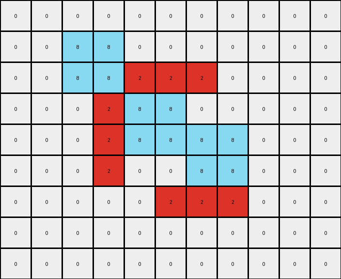

004 • History
=============

   :puzzle_id: 5-150deff5
   :timestamp: 24.306.132614
   :call_count: 4

====

Begin puzzle: 5-150deff5

**example_1**

**input**

.. code-block::

    [[0 0 0 0 0 0 0 0 0 0 0]
     [0 0 5 5 0 0 0 0 0 0 0]
     [0 0 5 5 5 5 5 0 0 0 0]
     [0 0 0 5 5 5 0 0 0 0 0]
     [0 0 0 5 5 5 5 5 0 0 0]
     [0 0 0 5 0 0 5 5 0 0 0]
     [0 0 0 0 0 5 5 5 0 0 0]
     [0 0 0 0 0 0 0 0 0 0 0]
     [0 0 0 0 0 0 0 0 0 0 0]]

.. image:: _images/004-1.png
   :alt: Grid visualization
**output**

.. code-block::

    [[0 0 0 0 0 0 0 0 0 0 0]
     [0 0 8 8 0 0 0 0 0 0 0]
     [0 0 8 8 2 2 2 0 0 0 0]
     [0 0 0 2 8 8 0 0 0 0 0]
     [0 0 0 2 8 8 8 8 0 0 0]
     [0 0 0 2 0 0 8 8 0 0 0]
     [0 0 0 0 0 2 2 2 0 0 0]
     [0 0 0 0 0 0 0 0 0 0 0]
     [0 0 0 0 0 0 0 0 0 0 0]]

**observations**

**example_1**

**input:**
  width: 11
  height: 9
  colors:
    - 0: (72)
    - 5: (16)
  objects:
    - A single connected gray (5) object, roughly resembling an irregular blob.

**output:**
  width: 11
  height: 9
  colors:
    - 0: (72)
    - 2: (7)
    - 8: (16)
  objects:
    - A single connected azure (8) object. The shape and position are the same as the gray object in the input.
    - A single connected red (2) object. The shape is similar to the gray (5) object, but smaller and positioned to the lower-right of the azure (8) object.

**differences:**
  cells_changed: 23
  colors_changed: Gray (5) pixels are replaced by a combination of azure (8) and red (2) pixels. The azure pixels trace the original gray shape. The red pixels form a smaller, offset shape within the azure object.

**transformation:**
  - The gray (5) object is transformed into two objects: a larger azure (8) object maintaining the shape and location of the input gray (5) object; and a smaller red (2) object occupying a portion of the space occupied by the original gray (5) object.  The position and size relationships between the new objects are not strictly defined.
  - It appears that the transformation involves a color change and a minor shape alteration. The original shape is preserved mostly in the azure (8) component.  The position and size relationships of the new shapes suggest that the output might be a stylized depiction of the input object.

**example_2**

**input**

.. code-block::

    [[0 0 0 0 0 0 0 0 0 0]
     [0 5 5 5 5 5 5 0 0 0]
     [0 5 5 5 5 5 5 0 0 0]
     [0 0 0 5 0 0 5 0 0 0]
     [0 0 0 0 5 5 5 0 0 0]
     [0 0 0 0 5 5 5 0 0 0]
     [0 0 0 0 5 0 0 0 0 0]
     [0 0 0 0 0 0 0 0 0 0]]

.. image:: _images/004-3.png
   :alt: Grid visualization
**output**

.. code-block::

    [[0 0 0 0 0 0 0 0 0 0]
     [0 8 8 2 8 8 2 0 0 0]
     [0 8 8 2 8 8 2 0 0 0]
     [0 0 0 2 0 0 2 0 0 0]
     [0 0 0 0 2 8 8 0 0 0]
     [0 0 0 0 2 8 8 0 0 0]
     [0 0 0 0 2 0 0 0 0 0]
     [0 0 0 0 0 0 0 0 0 0]]

.. image:: _images/004-4.png
   :alt: Grid visualization
**observations**

**example_2**

**input:**
  width: 10
  height: 8
  colors:
    - 0: (64)
    - 5: (16)
  objects:
    - A single connected gray (5) object, roughly resembling an irregular blob.

**output:**
  width: 10
  height: 8
  colors:
    - 0: (64)
    - 2: (7)
    - 8: (16)
  objects:
    - A single connected azure (8) object. The shape and position are mostly the same as the gray object in the input.
    - A single connected red (2) object. The shape is similar to the gray (5) object, but smaller and positioned to the lower-right of the azure (8) object.

**differences:**
  cells_changed: 23
  colors_changed: Gray (5) pixels are replaced by a combination of azure (8) and red (2) pixels.  The azure pixels largely overlap the original gray shape. The red pixels form a shape embedded within the azure object, resembling an inverted version of a part of the original gray shape.

**transformation:**
  - Similar to example 1, the gray (5) object is transformed into two objects: azure (8) and red (2). The azure (8) object largely retains the shape and position of the original gray (5) object.  The red (2) object appears to be a slightly smaller, inverted, and embedded shape.

**Summary of Transformations:**

Both examples show a transformation where a single connected gray (5) object is transformed into two connected objects: a larger azure (8) object that largely preserves the original shape and position, and a smaller red (2) object, whose shape is related to the original gray (5) object but is somewhat altered, typically smaller and positioned within or near the azure (8) object.  The exact relationship in shape and position between the red (2) and azure (8) objects is not strictly consistent, suggesting a slightly flexible rule.  The key consistent element is the preservation of the original object's general shape and position by the azure (8) pixels, with the addition of the red (2) pixels forming a related but smaller, somewhat inverse or embedded shape.

**example_3**

**input**

.. code-block::

    [[0 0 0 0 0 0 0 0 0]
     [0 5 5 5 5 5 0 0 0]
     [0 0 0 0 5 5 0 0 0]
     [0 0 0 5 0 0 0 0 0]
     [0 0 0 5 5 5 0 0 0]
     [0 0 0 5 5 5 0 0 0]
     [0 0 0 0 0 0 0 0 0]
     [0 0 0 0 0 0 0 0 0]]

.. image:: _images/004-5.png
   :alt: Grid visualization
**output**

.. code-block::

    [[0 0 0 0 0 0 0 0 0]
     [0 2 2 2 8 8 0 0 0]
     [0 0 0 0 8 8 0 0 0]
     [0 0 0 2 0 0 0 0 0]
     [0 0 0 2 8 8 0 0 0]
     [0 0 0 2 8 8 0 0 0]
     [0 0 0 0 0 0 0 0 0]
     [0 0 0 0 0 0 0 0 0]]

.. image:: _images/004-6.png
   :alt: Grid visualization
**observations**

**example_3**

**input:**
  width: 9
  height: 8
  colors:
    - 0: (64)
    - 5: (12)
  objects:
    - A single connected gray (5) object.

**output:**
  width: 9
  height: 8
  colors:
    - 0: (64)
    - 2: (6)
    - 8: (12)
  objects:
    - A single connected azure (8) object.  The shape and position are similar to the gray (5) object in the input.
    - A single connected red (2) object. The shape is smaller than the azure (8) object, and positioned to the upper left of the azure (8) object.  It seems to represent a portion of the original gray object.

**differences:**
  cells_changed: 18
  colors_changed: Gray (5) pixels are replaced by azure (8) and red (2) pixels.  The azure (8) pixels largely follow the shape of the original gray (5) object. The red (2) pixels form a smaller shape adjacent to the azure (8) object.

**transformation:**
  - The gray (5) object is transformed into two objects: azure (8) and red (2). The azure (8) object largely retains the shape and position of the input gray (5) object. The red (2) object forms a smaller, adjacent shape seemingly related to the original gray object's shape.

**Overall Summary of Transformations (across all examples):**

The core transformation involves replacing a gray (5) object with two objects: a larger azure (8) object and a smaller red (2) object. The azure (8) object closely follows the shape and location of the original gray (5) object. The red (2) object's shape is related to but smaller than the original gray (5) object, and its position relative to the azure (8) object varies slightly across examples (sometimes embedded within the azure object, sometimes adjacent to it). There's no consistent strict rule governing the exact shape or position of the red (2) object, suggesting flexibility or a somewhat subjective interpretation within the overall transformation. The key consistent element remains the preservation of the original gray (5) object's overall shape and location by the azure (8) object.

**examples summary**

<instructions>

- summarize your observations to explain the transformation of the input to output

- use code_execution to investigate properties, patterns and differences in the grids

<\instructions>

.. seealso::

   - :doc:`004-prompt`
   - :doc:`004-response`

