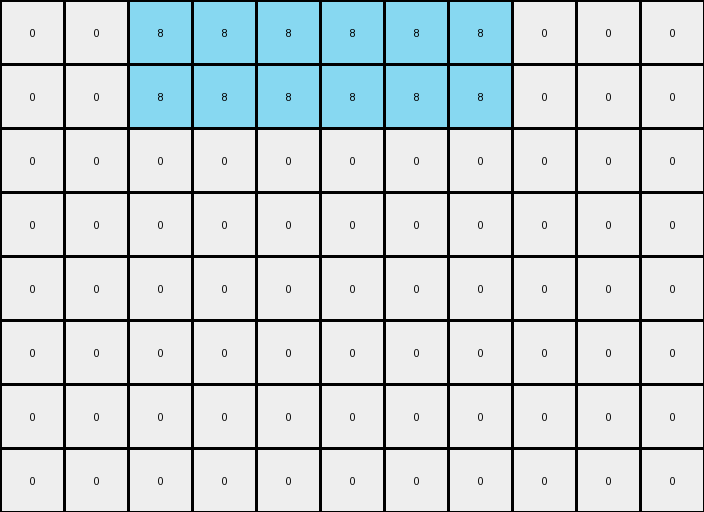

009 • Prompt
============

   :puzzle_id: 5-150deff5
   :timestamp: 24.306.132614
   :call_count: 9

====

**working output grid**

updated with your changes

.. code-block::

    [[0 0 8 8 8 8 8 8 0 0 0]
     [0 0 8 8 8 8 8 8 0 0 0]
     [0 0 0 0 0 0 0 0 0 0 0]
     [0 0 0 0 0 0 0 0 0 0 0]
     [0 0 0 0 0 0 0 0 0 0 0]
     [0 0 0 0 0 0 0 0 0 0 0]
     [0 0 0 0 0 0 0 0 0 0 0]
     [0 0 0 0 0 0 0 0 0 0 0]]

<instructions>

- take a moment to review that the changes in the working output grid are in keeping with the rule

- use code_execution to investigate properties

<\instructions>

.. seealso::

   - :doc:`009-history`
   - :doc:`009-response`

