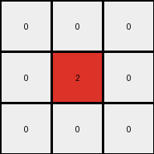

002 • History
=============

   :puzzle_id: 6-0520fde7
   :timestamp: 24.306.132614
   :call_count: 2

====

Begin puzzle: 6-0520fde7

**example_1**

**input**

.. code-block::

    [[1 0 0 5 0 1 0]
     [0 1 0 5 1 1 1]
     [1 0 0 5 0 0 0]]

.. image:: _images/002-3.png
   :alt: Grid visualization
**output**

.. code-block::

    [[0 0 0]
     [0 2 0]
     [0 0 0]]

**observations**

Here's an analysis of the provided example:

**Example 1**

**Input:**

*   width: 7
*   height: 3
*   colors:
    *   0 (white): 13
    *   1 (blue): 4
    *   5 (gray): 3
*   objects: A vertical column of gray pixels in the center. Blue pixels are clustered near the edges.

**Output:**

*   width: 3
*   height: 3
*   colors:
    *   0 (white): 8
    *   2 (red): 1
*   objects: A single red pixel in the center.

**Differences:**

*   cells_changed:  The output grid is significantly smaller than the input grid.  All values except one are changed.
*   colors_changed: The primary color change is from blue and gray to red and white.

**Transformation:**

The transformation is not immediately obvious. The size reduction is drastic, and the relationship between the input's colors and the output's single red pixel is unclear.  There's no apparent geometric transformation or simple color mapping. It's possible that the presence and location of specific colors in the input influence the output, possibly involving a counting or aggregation process. Further examples are needed to clarify the transformation rules.  More specifically, the relationship between the size and shape of the input and the size and shape of the output needs to be explored.  Also, the function determining color change needs to be determined.

To help me understand the transformation better, could you please provide additional examples?

**example_2**

**input**

.. code-block::

    [[1 1 0 5 0 1 0]
     [0 0 1 5 1 1 1]
     [1 1 0 5 0 1 0]]

.. image:: _images/002-5.png
   :alt: Grid visualization
**output**

.. code-block::

    [[0 2 0]
     [0 0 2]
     [0 2 0]]

.. image:: _images/002-6.png
   :alt: Grid visualization
**observations**

<instructions>

- review the example grids

- check for differences and patterns

<\instructions>

.. seealso::

   - :doc:`002-prompt`
   - :doc:`002-response`

