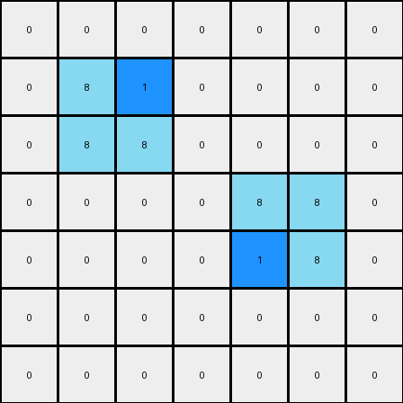

002 • History
=============

   :puzzle_id: 1-3aa6fb7a
   :timestamp: 24.306.162434
   :call_count: 2

====

Begin puzzle: 1-3aa6fb7a

**example_1**

**input**

.. code-block::

    [[0 0 0 0 0 0 0]
     [0 8 0 0 0 0 0]
     [0 8 8 0 0 0 0]
     [0 0 0 0 8 8 0]
     [0 0 0 0 0 8 0]
     [0 0 0 0 0 0 0]
     [0 0 0 0 0 0 0]]

.. image:: _images/000-example_1_input.png
   :alt: _images/000-example_1_input.png

**output**

.. code-block::

    [[0 0 0 0 0 0 0]
     [0 8 1 0 0 0 0]
     [0 8 8 0 0 0 0]
     [0 0 0 0 8 8 0]
     [0 0 0 0 1 8 0]
     [0 0 0 0 0 0 0]
     [0 0 0 0 0 0 0]]

**observations**

Here's an analysis of the provided example:

**Example 1**

**Input:**

*   width: 7
*   height: 7
*   colors:
    *   0: (41)
    *   8: (6)
*   objects: A single cluster of azure (8) pixels forms an irregular shape.

**Output:**

*   width: 7
*   height: 7
*   colors:
    *   0: (39)
    *   8: (6)
    *   1: (2)
*   objects: The azure cluster remains; two blue (1) pixels appear, one adjacent to azure (8) pixels in the top middle and bottom middle.

**Differences:**

*   cells_changed: 2
*   colors_changed: Two azure (8) pixels have been changed to blue (1) pixels.

**Transformation:**

The transformation appears to involve changing some azure (8) pixels to blue (1) pixels. Specifically,  some, but not all, of the azure pixels that are diagonally adjacent to other azure pixels are changed.  The pattern isn't fully clear from this one example, we need more to establish a clear rule.  Is this a function of cluster size or shape, or a random selection? The location of the transformation is in the center vertical axis.

To better understand the transformation rule, more examples are needed.  Specifically, examples that vary the size and shape of the azure (8) cluster, or examples without azure (8) clusters, or examples with multiple clusters would help establish the rules.

**example_2**

**input**

.. code-block::

    [[0 0 0 0 8 8 0]
     [0 0 0 0 0 8 0]
     [0 0 8 0 0 0 0]
     [0 0 8 8 0 0 0]
     [0 0 0 0 0 0 0]
     [0 0 0 0 8 0 0]
     [0 0 0 8 8 0 0]]

.. image:: _images/001-example_2_input.png
   :alt: _images/001-example_2_input.png

**output**

.. code-block::

    [[0 0 0 0 8 8 0]
     [0 0 0 0 1 8 0]
     [0 0 8 1 0 0 0]
     [0 0 8 8 0 0 0]
     [0 0 0 0 0 0 0]
     [0 0 0 1 8 0 0]
     [0 0 0 8 8 0 0]]

.. image:: _images/001-example_2_output.png
   :alt: _images/001-example_2_output.png

**observations**

<instructions>

- review the example grids

- check for differences and patterns

<\instructions>

.. seealso::

   - :doc:`002-prompt`
   - :doc:`002-response`

