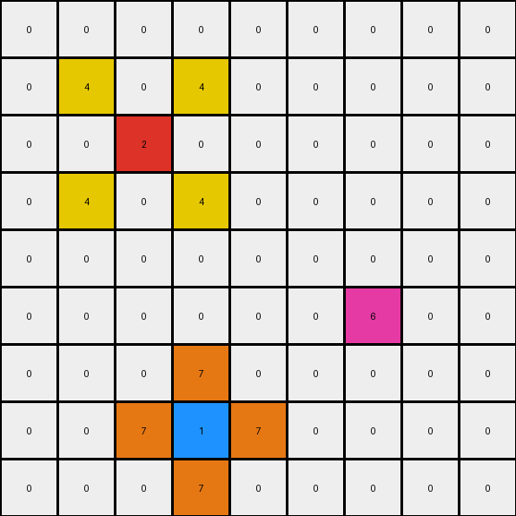

004 • History
=============

   :puzzle_id: 2-0ca9ddb6
   :timestamp: 24.306.162434
   :call_count: 4

====

Begin puzzle: 2-0ca9ddb6

**example_1**

**input**

.. code-block::

    [[0 0 0 0 0 0 0 0 0]
     [0 0 0 0 0 0 0 0 0]
     [0 0 0 0 0 0 0 0 0]
     [0 0 2 0 0 0 0 0 0]
     [0 0 0 0 0 0 0 0 0]
     [0 0 0 0 0 0 0 0 0]
     [0 0 0 0 0 0 1 0 0]
     [0 0 0 0 0 0 0 0 0]
     [0 0 0 0 0 0 0 0 0]]

.. image:: _images/000-example_1_input.png
   :alt: _images/000-example_1_input.png

**output**

.. code-block::

    [[0 0 0 0 0 0 0 0 0]
     [0 0 0 0 0 0 0 0 0]
     [0 4 0 4 0 0 0 0 0]
     [0 0 2 0 0 0 0 0 0]
     [0 4 0 4 0 0 0 0 0]
     [0 0 0 0 0 0 7 0 0]
     [0 0 0 0 0 7 1 7 0]
     [0 0 0 0 0 0 7 0 0]
     [0 0 0 0 0 0 0 0 0]]

.. image:: _images/000-example_1_output.png
   :alt: _images/000-example_1_output.png

**observations**

Here's an analysis of the provided example:

**example_1**

**input:**
  width: 9
  height: 9
  colors:
    - 0: (73)
    - 1: (1)
    - 2: (1)
  objects:
    - single red (2) at (3, 2)
    - single blue (1) at (6, 6)

**output:**
  width: 9
  height: 9
  colors:
    - 0: (61)
    - 1: (1)
    - 2: (1)
    - 4: (4)
    - 7: (4)
  objects:
    - single red (2) at (3, 2)
    - single blue (1) at (6, 6)
    - yellow (4) forming a cross around the red pixel
    - orange (7) forming an L shape around the blue pixel

**differences:**
  cells_changed: 12
  colors_changed: Added yellow (4) and orange (7) pixels around the existing red and blue pixels respectively, forming a specific pattern.

**transformation:**
  - The core transformation involves adding yellow and orange pixels around the initial red and blue pixels, respectively.  The patterns seem to follow a specific geometrical arrangement. The yellow pixels create a cross shape and the orange pixels form an "L" shape.

**Additional Notes:**

The transformation is not simply a matter of adding pixels of specific colours around the existing ones.  It appears to be spatially specific in terms of which cells are chosen. It looks like an expansion of an existing object creating a new shape with a different color. The red and blue pixels appear to act as seeds or centers for the growth of these new patterns. More examples are needed to confirm these hypothesis and determine if there are other rules involved.

**example_2**

**input**

.. code-block::

    [[0 0 0 8 0 0 0 0 0]
     [0 0 0 0 0 0 0 0 0]
     [0 0 0 0 0 0 2 0 0]
     [0 0 1 0 0 0 0 0 0]
     [0 0 0 0 0 0 0 0 0]
     [0 0 0 0 0 0 0 0 0]
     [0 0 0 0 0 0 1 0 0]
     [0 2 0 0 0 0 0 0 0]
     [0 0 0 0 0 0 0 0 0]]

.. image:: _images/001-example_2_input.png
   :alt: _images/001-example_2_input.png

**output**

.. code-block::

    [[0 0 0 8 0 0 0 0 0]
     [0 0 0 0 0 4 0 4 0]
     [0 0 7 0 0 0 2 0 0]
     [0 7 1 7 0 4 0 4 0]
     [0 0 7 0 0 0 0 0 0]
     [0 0 0 0 0 0 7 0 0]
     [4 0 4 0 0 7 1 7 0]
     [0 2 0 0 0 0 7 0 0]
     [4 0 4 0 0 0 0 0 0]]

.. image:: _images/001-example_2_output.png
   :alt: _images/001-example_2_output.png

**observations**

**example_2**

**input:**
  width: 9
  height: 9
  colors:
    - 0: (66)
    - 1: (2)
    - 2: (2)
    - 8: (1)
  objects:
    - single azure (8) at (0,3)
    - two red (2) at (2,6), (7,1)
    - two blue (1) at (3,2), (6,6)

**output:**
  width: 9
  height: 9
  colors:
    - 0: (50)
    - 1: (2)
    - 2: (2)
    - 4: (4)
    - 7: (12)
    - 8: (1)
  objects:
    - single azure (8) at (0,3)
    - two red (2) at (2,6), (7,1)
    - two blue (1) at (3,2), (6,6)
    - yellow (4) forming a cross around the red pixel
    - orange (7) forming an L shape around the blue pixel

**differences:**
  cells_changed: 20
  colors_changed: Added yellow (4) and orange (7) pixels around the existing red and blue pixels, forming specific patterns.

**transformation:**
  - Similar to example 1, this example shows the addition of yellow and orange pixels around the red and blue pixels, respectively. The yellow pixels again form a cross shape, and the orange pixels an "L" shape.  The pattern extends to multiple red and blue pixels independently.

**Summary of Transformations:**

Based on the two examples, the transformation rule appears to be as follows:

1. **Identify seed pixels:** The algorithm identifies pixels with values 1 (blue) and 2 (red).
2. **Expand around blue pixels:** Around each blue (1) pixel, it adds orange (7) pixels forming an "L" shape.  The L shape is consistently oriented in the same way relative to the blue pixel.
3. **Expand around red pixels:**  Around each red (2) pixel, it adds yellow (4) pixels in a cross shape.  The cross extends equal distance in all four directions.
4. **No overlap:** The new shapes do not overlap with existing pixels or each other.

**Further testing required:**

More examples are needed to confirm the following:

*   **Consistency:** Do the patterns of the L shape and the cross shape always remain the same?
*   **Edge handling:** What happens if a seed pixel is near the edge of the grid? Are the patterns truncated, or do they extend beyond the grid?
*   **Multiple seeds:** Do the expanded patterns interact or overlap if two seed pixels are close together?
*   **Other colors:**  Are other colors treated similarly?  Would a green or magenta pixel generate an expansion? What shape and color would be used?

These questions need to be answered before a robust solution algorithm can be developed.

**example_3**

**input**

.. code-block::

    [[0 0 0 0 0 0 0 0 0]
     [0 0 0 0 0 0 0 0 0]
     [0 0 2 0 0 0 0 0 0]
     [0 0 0 0 0 0 0 0 0]
     [0 0 0 0 0 0 0 0 0]
     [0 0 0 0 0 0 6 0 0]
     [0 0 0 0 0 0 0 0 0]
     [0 0 0 1 0 0 0 0 0]
     [0 0 0 0 0 0 0 0 0]]

.. image:: _images/002-example_3_input.png
   :alt: _images/002-example_3_input.png

**output**

.. code-block::

    [[0 0 0 0 0 0 0 0 0]
     [0 4 0 4 0 0 0 0 0]
     [0 0 2 0 0 0 0 0 0]
     [0 4 0 4 0 0 0 0 0]
     [0 0 0 0 0 0 0 0 0]
     [0 0 0 0 0 0 6 0 0]
     [0 0 0 7 0 0 0 0 0]
     [0 0 7 1 7 0 0 0 0]
     [0 0 0 7 0 0 0 0 0]]

**observations**

**example_3**

**input:**
  width: 9
  height: 9
  colors:
    - 0: (73)
    - 1: (1)
    - 2: (1)
    - 6: (1)
  objects:
    - single red (2) at (2, 2)
    - single blue (1) at (7, 3)
    - single magenta (6) at (5, 6)

**output:**
  width: 9
  height: 9
  colors:
    - 0: (65)
    - 1: (1)
    - 2: (1)
    - 4: (4)
    - 6: (1)
    - 7: (4)
  objects:
    - single red (2) at (2, 2)
    - single blue (1) at (7, 3)
    - single magenta (6) at (5, 6)
    - yellow (4) forming a cross around the red pixel
    - orange (7) forming an L shape around the blue pixel

**differences:**
  cells_changed: 8
  colors_changed: Added yellow (4) and orange (7) pixels around the existing red and blue pixels respectively, forming the same pattern as before.

**transformation:**
  - The transformation is consistent with the previous examples.  Yellow (4) pixels are added in a cross pattern around the red (2) pixel and orange (7) pixels are added in an "L" pattern around the blue (1) pixel. The magenta (6) pixel remains unchanged.

**Summary of Observations across all examples:**

The core transformation consistently involves:

1.  **Identifying "seed" pixels:** Pixels with values 1 (blue) and 2 (red) are identified as seeds.
2.  **Expanding around seeds:**  A cross pattern of yellow (4) pixels is added around red (2) seeds and an L shape pattern of orange (7) pixels is added around blue (1) seeds.
3.  **Pattern consistency:** The orientation and dimensions of the cross and L shapes are consistent across all examples.
4.  **No interaction between expansions:** The expanded patterns do not overlap or influence each other, even if seeds are close together.
5.  **Other colors are unaffected:** Other colors (e.g., magenta, azure) remain unchanged.

Based on these observations, a robust algorithm can now be designed to predict the output for new inputs.  The algorithm would need to:

1.  Scan the input grid to find all pixels with value 1 and 2.
2.  For each pixel with value 1, add an "L" shape of orange (7) pixels.
3.  For each pixel with value 2, add a cross shape of yellow (4) pixels.
4.  The sizes and orientations of the L and cross shapes should be consistent across examples.
5.  Handle edge cases appropriately—e.g., if the pattern would extend beyond the grid boundary.

This refined description allows for a clearer specification of the transformation rule and aids in constructing a more effective solution algorithm.

**examples summary**

<instructions>

- summarize your observations to explain the transformation of the input to output

- use code_execution to investigate properties, patterns and differences in the grids

<\instructions>

.. seealso::

   - :doc:`004-prompt`
   - :doc:`004-response`

