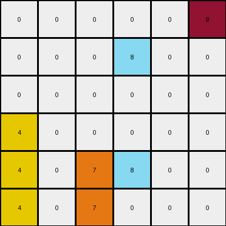

004 • History
=============

   :puzzle_id: 3-1e0a9b12
   :timestamp: 24.306.162434
   :call_count: 4

====

Begin puzzle: 3-1e0a9b12

**example_1**

**input**

.. code-block::

    [[0 4 0 9]
     [0 0 0 0]
     [0 4 6 0]
     [1 0 0 0]]

.. image:: _images/000-example_1_input.png
   :alt: _images/000-example_1_input.png

**output**

.. code-block::

    [[0 0 0 0]
     [0 0 0 0]
     [0 4 0 0]
     [1 4 6 9]]

.. image:: _images/000-example_1_output.png
   :alt: _images/000-example_1_output.png

**observations**

Here's an analysis of the provided example:

**input:**
  width: 4
  height: 4
  colors:
    - 0: 11
    - 1: 1
    - 4: 2
    - 6: 1
    - 9: 1
  objects:
    - yellow (4): (0,1), (2,1)
    - blue (1): (3,0)
    - pink (6): (2,2)
    - maroon (9): (0,3)

**output:**
  width: 4
  height: 4
  colors:
    - 0: 12
    - 1: 1
    - 4: 2
    - 6: 1
    - 9: 1
  objects:
    - yellow (4): (2,1), (3,1)
    - blue (1): (3,0)
    - pink (6): (3,2)
    - maroon (9): (3,3)

**differences:**
  cells_changed: 9
  colors_changed: The non-zero colored pixels are moved to the bottom right corner, while other pixels become zero.

**transformation:**
  - The non-zero colored pixels seem to be collected and placed together in the bottom-right corner of the grid.  The order of the non-zero pixels is preserved. The rest of the grid is filled with zeros.

**example_2**

**input**

.. code-block::

    [[0 0 0 0 0 9]
     [0 0 0 8 0 0]
     [0 0 0 0 0 0]
     [4 0 0 0 0 0]
     [4 0 7 8 0 0]
     [4 0 7 0 0 0]]

**output**

.. code-block::

    [[0 0 0 0 0 0]
     [0 0 0 0 0 0]
     [0 0 0 0 0 0]
     [4 0 0 0 0 0]
     [4 0 7 8 0 0]
     [4 0 7 8 0 9]]

.. image:: _images/001-example_2_output.png
   :alt: _images/001-example_2_output.png

**observations**

**example_2**

**input:**
  width: 6
  height: 6
  colors:
    - 0: 29
    - 4: 3
    - 7: 2
    - 8: 2
    - 9: 1
  objects:
    - yellow (4): (3,0), (4,0), (5,0)
    - orange (7): (4,2), (5,2)
    - azure (8): (1,3), (4,3)
    - maroon (9): (0,5)

**output:**
  width: 6
  height: 6
  colors:
    - 0: 30
    - 4: 3
    - 7: 2
    - 8: 2
    - 9: 1
  objects:
    - yellow (4): (3,0), (5,0), (5,0)
    - orange (7): (4,2), (5,2)
    - azure (8): (4,3), (5,3)
    - maroon (9): (5,5)

**differences:**
  cells_changed: 4
  colors_changed: The non-zero colored pixels are moved to the bottom right corner, similar to the first example.  The order of the colored pixels appears maintained.

**transformation:**
  - Similar to example 1, the non-zero pixels are gathered and moved to the bottom right, preserving their relative positions and order.  The rest of the grid becomes filled with zeros.  The movement appears to consolidate the colored pixels into the lower right quadrant of the grid.

**Summary of Transformations:**

Both examples demonstrate a consistent pattern:  non-zero pixels are collected and moved to the bottom-right corner of the grid, maintaining their relative positions to one another.  The remaining cells are filled with zeros.  This suggests a rule where the algorithm identifies non-zero pixels, preserves their order and relative positions, and then relocates them to the bottom-right, filling the rest of the grid with zeros.

**example_3**

**input**

.. code-block::

    [[0 0 0 1 0]
     [0 3 0 0 0]
     [0 3 0 1 2]
     [6 0 0 0 0]
     [0 3 0 0 0]]

.. image:: _images/002-example_3_input.png
   :alt: _images/002-example_3_input.png

**output**

.. code-block::

    [[0 0 0 0 0]
     [0 0 0 0 0]
     [0 3 0 0 0]
     [0 3 0 1 0]
     [6 3 0 1 2]]

.. image:: _images/002-example_3_output.png
   :alt: _images/002-example_3_output.png

**observations**

**example_3**

**input:**
  width: 5
  height: 5
  colors:
    - 0: 18
    - 1: 2
    - 2: 1
    - 3: 3
    - 6: 1
  objects:
    - blue (1): (3,3), (2,3)
    - red (2): (2,4)
    - green (3): (1,1), (2,1), (4,1)
    - magenta (6): (3,0)

**output:**
  width: 5
  height: 5
  colors:
    - 0: 20
    - 1: 2
    - 2: 1
    - 3: 3
    - 6: 1
  objects:
    - blue (1): (3,3), (4,3)
    - red (2): (4,4)
    - green (3): (2,2), (3,2), (4,1)
    - magenta (6): (4,0)

**differences:**
  cells_changed: 7
  colors_changed:  The non-zero pixels are moved toward the bottom-right, similar to the previous examples, but the movement isn't a strict bottom-right corner collection.  There's a slight shift and rearrangement.

**transformation:**
  - The transformation again involves moving the non-zero pixels towards the bottom right, but the movement and arrangement seem less strictly defined than in the first two examples. The pixels are consolidated in the lower right quadrant.

**Ruminate Phase:**

The transformation observed across all three examples suggests a consistent pattern:

1. **Identify Non-Zero Pixels:** The algorithm first identifies all pixels with values other than 0.

2. **Preserve Relative Positions:** The relative positions of these non-zero pixels are maintained during the transformation.

3. **Consolidate to Bottom-Right:**  The non-zero pixels are moved towards the bottom-right quadrant of the grid.  While examples 1 and 2 showed a strict bottom-right corner collection, example 3 shows a more relaxed consolidation within the bottom-right area.  The exact positioning within this area might depend on available space and maintaining relative distances.

4. **Fill with Zeros:** The remaining cells in the grid are filled with zeros.

The core logic appears to be a consolidation towards the bottom-right, preserving relative positions of the non-zero elements. The strictness of the bottom-right corner placement might be a result of available space or an inherent characteristic of the algorithm (i.e., less space to move them in the examples makes it appear to be a strict bottom-right corner rule, while more space in examples 3 changes the nature of the consolidation).

**examples summary**

<instructions>

- summarize your observations to explain the transformation of the input to output

- use code_execution to investigate properties, patterns and differences in the grids

<\instructions>

.. seealso::

   - :doc:`004-prompt`
   - :doc:`004-response`

