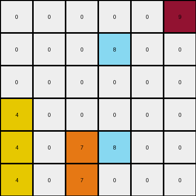

002 • History
=============

   :puzzle_id: 3-1e0a9b12
   :timestamp: 24.307.192933
   :call_count: 2

====

Begin puzzle: 3-1e0a9b12

**example_1**

**input**

.. code-block::

    [[0 4 0 9]
     [0 0 0 0]
     [0 4 6 0]
     [1 0 0 0]]

.. image:: _images/000-example_1_input.png
   :alt: _images/000-example_1_input.png

**output**

.. code-block::

    [[0 0 0 0]
     [0 0 0 0]
     [0 4 0 0]
     [1 4 6 9]]

.. image:: _images/000-example_1_output.png
   :alt: _images/000-example_1_output.png

**observations**

Here's an analysis of the provided example, focusing on identifying the transformation from input to output:

.. code-block:: yaml

   example_1:
     input:
       width: 4
       height: 4
       colors:
         - 0: 11
         - 1: 1
         - 4: 2
         - 6: 1
         - 9: 1
       objects:
         - size: 1x1, position: (0,1), color: yellow
         - size: 1x1, position: (2,1), color: yellow
         - size: 1x1, position: (3,0), color: maroon
         - size: 1x1, position: (2,2), color: magenta
         - size: 1x1, position: (3,0), color: blue

     output:
       width: 4
       height: 4
       colors:
         - 0: 12
         - 1: 1
         - 4: 2
         - 6: 1
         - 9: 1
       objects:
         - size: 1x1, position: (2,1), color: yellow
         - size: 1x1, position: (3,3), color: maroon
         - size: 1x1, position: (3,1), color: yellow
         - size: 1x1, position: (3,2), color: magenta
         - size: 1x1, position: (3,0), color: blue

     differences:
       cells_changed: 7
       colors_changed:  Seven cells changed from 0 to other colors.  The non-zero colored cells appear to move to the bottom row.
     transformation:
       - The non-zero colored cells are moved to the bottom row, maintaining their relative positions to each other and their original colors.
       - The remaining cells are filled with zeros.

**Rumination:**

The transformation appears to be a process of collecting all the non-zero elements from the input grid and placing them in the bottom row of the output grid, while maintaining their relative positions and colors.  The rest of the output grid is filled with zeros.  This suggests a simple rule-based transformation, and  no complex geometric or topological manipulation.  There's no obvious pattern in the arrangement of the non-zero cells in the input or output.

I need to see additional examples to confirm this hypothesis and check for edge cases or more complex variations.  The small number of examples doesn't allow me to determine the behavior when the input has more than one row of non-zero elements, or the order of elements if those elements happen to be multiple different colors.

**example_2**

**input**

.. code-block::

    [[0 0 0 0 0 9]
     [0 0 0 8 0 0]
     [0 0 0 0 0 0]
     [4 0 0 0 0 0]
     [4 0 7 8 0 0]
     [4 0 7 0 0 0]]

**output**

.. code-block::

    [[0 0 0 0 0 0]
     [0 0 0 0 0 0]
     [0 0 0 0 0 0]
     [4 0 0 0 0 0]
     [4 0 7 8 0 0]
     [4 0 7 8 0 9]]

.. image:: _images/001-example_2_output.png
   :alt: _images/001-example_2_output.png

**observations**

================================================================================

INSTRUCTIONS:

* review the example grids

* check for differences and patterns

.. seealso::

   - :doc:`002-prompt`
   - :doc:`002-response`

