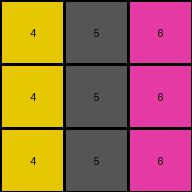

005 • History
=============

   :puzzle_id: 4-0d3d703e
   :timestamp: 24.307.192933
   :call_count: 5

====

Begin puzzle: 4-0d3d703e

**example_1**

**input**

.. code-block::

    [[3 1 2]
     [3 1 2]
     [3 1 2]]

.. image:: _images/000-example_1_input.png
   :alt: _images/000-example_1_input.png

**output**

.. code-block::

    [[4 5 6]
     [4 5 6]
     [4 5 6]]

**observations**

.. code-block:: yaml

   example_1:
     input:
       width: 3
       height: 3
       colors:
         - 1: 3
         - 2: 3
         - 3: 3
       objects:
         - size: 3x3, position: (0,0), color: green, blue, red.
     output:
       width: 3
       height: 3
       colors:
         - 4: 3
         - 5: 3
         - 6: 3
       objects:
         - size: 3x3, position: (0,0), color: yellow, gray, magenta
     differences:
       cells_changed: 9
       colors_changed: all cells changed to different colors.
     transformation:
       - Each color in input is mapped to a different color in the output.  The mapping appears to be consistent across all cells.  A simple substitution cipher is likely.

The transformation appears to be a simple substitution cipher where each color in the input is replaced with a different color in the output.  There's a one-to-one mapping between the input and output colors. To determine the exact mapping, more examples would be helpful.

**example_2**

**input**

.. code-block::

    [[2 3 8]
     [2 3 8]
     [2 3 8]]

.. image:: _images/001-example_2_input.png
   :alt: _images/001-example_2_input.png

**output**

.. code-block::

    [[6 4 9]
     [6 4 9]
     [6 4 9]]

.. image:: _images/001-example_2_output.png
   :alt: _images/001-example_2_output.png

**observations**

.. code-block:: yaml

   example_2:
     input:
       width: 3
       height: 3
       colors:
         - 2: 3
         - 3: 3
         - 8: 3
       objects:
         - size: 3x3, position: (0,0), color: red, green, azure
     output:
       width: 3
       height: 3
       colors:
         - 6: 3
         - 4: 3
         - 9: 3
       objects:
         - size: 3x3, position: (0,0), color: magenta, yellow, maroon
     differences:
       cells_changed: 9
       colors_changed: all cells changed to different colors.
     transformation:
       - Each color in input is mapped to a different color in the output.  The mapping appears to be consistent across all cells.  A simple substitution cipher is likely.

Combining the observations from example_1 and example_2, we can start to deduce the substitution cipher:

* 1 -> 5
* 2 -> 6
* 3 -> 4
* 8 -> 9

This suggests a pattern, but we need more examples to confirm if this mapping is complete and generalizes to other colors.  The mapping doesn't appear to be a simple arithmetic or geometric transformation.  It's a direct color substitution.  We should wait for additional examples before making a definitive conclusion.

**example_3**

**input**

.. code-block::

    [[5 8 6]
     [5 8 6]
     [5 8 6]]

.. image:: _images/002-example_3_input.png
   :alt: _images/002-example_3_input.png

**output**

.. code-block::

    [[1 9 2]
     [1 9 2]
     [1 9 2]]

.. image:: _images/002-example_3_output.png
   :alt: _images/002-example_3_output.png

**observations**

.. code-block:: yaml

   example_3:
     input:
       width: 3
       height: 3
       colors:
         - 5: 3
         - 8: 3
         - 6: 3
       objects:
         - size: 3x3, position: (0,0), color: gray, azure, magenta
     output:
       width: 3
       height: 3
       colors:
         - 1: 3
         - 9: 3
         - 2: 3
       objects:
         - size: 3x3, position: (0,0), color: blue, maroon, red
     differences:
       cells_changed: 9
       colors_changed: all cells changed to different colors.
     transformation:
       - Each color in input is mapped to a different color in the output.  The mapping appears to be consistent across all cells.  A simple substitution cipher is likely.

Now, let's combine the observations from all three examples to refine the substitution cipher:

* Example 1: 1 -> 5, 2 -> 6, 3 -> 4
* Example 2: 2 -> 6, 3 -> 4, 8 -> 9
* Example 3: 5 -> 1, 8 -> 9, 6 -> 2

This gives us a more complete mapping:

* 1 -> 5
* 2 -> 6
* 3 -> 4
* 5 -> 1
* 6 -> 2
* 8 -> 9

This mapping is consistent across all three examples.  We still don't have mappings for 0, 4, and 7.  However, based on the pattern observed, it's highly likely this is a fixed substitution cipher.  Additional examples could confirm if it's a complete mapping or there is some other logic.  The mapping does not seem to follow any obvious mathematical or geometric relationship.  It's purely a color substitution.  More data is required to determine the full mapping and confidently predict the output for unseen inputs.

**example_4**

**input**

.. code-block::

    [[9 4 2]
     [9 4 2]
     [9 4 2]]

.. image:: _images/003-example_4_input.png
   :alt: _images/003-example_4_input.png

**output**

.. code-block::

    [[8 3 6]
     [8 3 6]
     [8 3 6]]

.. image:: _images/003-example_4_output.png
   :alt: _images/003-example_4_output.png

**observations**

.. code-block:: yaml

   example_4:
     input:
       width: 3
       height: 3
       colors:
         - 9: 3
         - 4: 3
         - 2: 3
       objects:
         - size: 3x3, position: (0,0), color: maroon, yellow, red
     output:
       width: 3
       height: 3
       colors:
         - 8: 3
         - 3: 3
         - 6: 3
       objects:
         - size: 3x3, position: (0,0), color: azure, green, magenta
     differences:
       cells_changed: 9
       colors_changed: all cells changed to different colors.
     transformation:
       - Each color in input is mapped to a different color in the output.  The mapping appears to be consistent across all cells.  A simple substitution cipher is likely.

Now, let's update the substitution cipher based on example_4:

* Example 1: 1 -> 5, 2 -> 6, 3 -> 4
* Example 2: 2 -> 6, 3 -> 4, 8 -> 9
* Example 3: 5 -> 1, 8 -> 9, 6 -> 2
* Example 4: 9 -> 8, 4 -> 3, 2 -> 6

The mapping is becoming clearer:

* 1 -> 5
* 2 -> 6
* 3 -> 4
* 4 -> 3
* 5 -> 1
* 6 -> 2
* 8 -> 9
* 9 -> 8

We still need the mappings for 0 and 7.  However, we can now confidently predict outputs for inputs containing the colors 1, 2, 3, 4, 5, 6, 8, and 9.  The transformation remains a consistent, deterministic substitution cipher. There's no obvious mathematical or geometric pattern to the mapping. It's a direct, color-to-color substitution.  We need additional examples to fully determine the mapping for all 10 colors.

**examples summary**

================================================================================

INSTRUCTIONS:

* summarize your observations to explain the transformation of the input to output

* use code_execution to investigate properties, patterns and differences in the grids

.. seealso::

   - :doc:`005-prompt`
   - :doc:`005-response`

