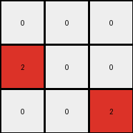

007 • History
=============

   :puzzle_id: 6-0520fde7
   :timestamp: 24.307.193821
   :call_count: 7

====

Begin puzzle: 6-0520fde7

**example_1**

**input**

.. code-block::

    [[1 0 0 5 0 1 0]
     [0 1 0 5 1 1 1]
     [1 0 0 5 0 0 0]]

.. image:: _images/000-example_1_input.png
   :alt: _images/000-example_1_input.png

**output**

.. code-block::

    [[0 0 0]
     [0 2 0]
     [0 0 0]]

.. image:: _images/000-example_1_output.png
   :alt: _images/000-example_1_output.png

**observations**

Here's an analysis of the provided example, focusing on identifying patterns and transformations:

.. code-block:: yaml

   example_1:
     input:
       width: 7
       height: 3
       colors:
         - 0: 16
         - 1: 5
         - 5: 1
       objects:
         - size: 3x7, position: 0,0, color: predominantly white with a vertical blue stripe.  The number 5 appears as a gray block in the center column
     output:
       width: 3
       height: 3
       colors:
         - 0: 8
         - 2: 1
       objects:
         - size: 1x1, position: 1,1, color: red
     differences:
       cells_changed: 22
       colors_changed: Input has blue and gray, output has red. Size changed dramatically.
     transformation:
       - The transformation significantly reduces the size of the grid.
       - It replaces most of the cells with white (0)
       - It appears to focus on the central column of the input, creating a single red (2) cell in the center of the output.  There's no obvious mathematical relationship between the input and output values.

**Initial Thoughts and Questions:**

The transformation is complex, and the relationship between input and output isn't immediately clear. It seems to be a process of simplification and reduction, focusing on a specific feature (the central column containing the ``5`` in the input) to produce a small, centered output. Further examples are needed to determine a consistent rule.  I'm particularly curious whether the position of the '5' in the input has a consistent relationship to the position of the '2' in the output, or if that was arbitrary.  I will need more examples to establish consistent rules.

**example_2**

**input**

.. code-block::

    [[1 1 0 5 0 1 0]
     [0 0 1 5 1 1 1]
     [1 1 0 5 0 1 0]]

.. image:: _images/001-example_2_input.png
   :alt: _images/001-example_2_input.png

**output**

.. code-block::

    [[0 2 0]
     [0 0 2]
     [0 2 0]]

.. image:: _images/001-example_2_output.png
   :alt: _images/001-example_2_output.png

**observations**

.. code-block:: yaml

   example_2:
     input:
       width: 7
       height: 3
       colors:
         - 0: 13
         - 1: 6
         - 5: 1
       objects:
         - size: 3x7, position: 0,0, color: predominantly white with a vertical blue stripe in the second column. The number 5 appears as a gray block in the center column
     output:
       width: 3
       height: 3
       colors:
         - 0: 6
         - 2: 3
       objects:
         - size: 3x3, position: 0,0, color: a cross pattern of red (2) cells.
     differences:
       cells_changed: 22
       colors_changed: Input has blue and gray, output has red. Size changed dramatically.
     transformation:
       - The transformation again significantly reduces the size of the grid.
       - It replaces most of the cells with white (0).
       - The central column of the input, containing the 5, seems to influence the output.  Here it generates a vertical cross pattern of red cells.
       - The relationship between input and output is not immediately clear, but the central column with the 5 seems pivotal

**Revised Thoughts and Hypotheses:**

Comparing ``example_1`` and ``example_2``\ :

* **Central Column Importance:** Both examples show the central column (containing a ``5``\ ) in the input plays a crucial role in determining the output.
* **Output Size:** The output size is consistently smaller than the input.  It appears to be a 3x3 grid in both cases.
* **Output Color:** The output uses primarily white (0) and red (2).
* **Pattern Complexity:** The pattern in the output seems to relate to the distribution of non-zero values in the central column of the input.  In example 1, we have a single red cell. In example 2, we have a cross pattern of red cells.

**Next Steps and Questions:**

To understand the transformation completely, more examples are crucial, especially ones that vary:

#. **Number of non-zero cells in the central column:**  What happens if there are more or fewer non-zero cells in the input's central column?
#. **Distribution of non-zero cells in the central column:** Does the vertical position of the non-zero values in the central column affect the pattern in the output?
#. **Presence of other colors in the central column:** How does the inclusion of colors other than 5 in the central column impact the output?
#. **Input size variation:** Would different input sizes change the output size or pattern?

I need more data to confidently formulate a rule.  The current hypothesis is that the input's central column influences the output's pattern and color distribution, but the exact relationship remains unclear.

**example_3**

**input**

.. code-block::

    [[0 0 1 5 0 0 0]
     [1 1 0 5 1 0 1]
     [0 1 1 5 1 0 1]]

.. image:: _images/002-example_3_input.png
   :alt: _images/002-example_3_input.png

**output**

.. code-block::

    [[0 0 0]
     [2 0 0]
     [0 0 2]]

**observations**

.. code-block:: yaml

   example_3:
     input:
       width: 7
       height: 3
       colors:
         - 0: 13
         - 1: 6
         - 5: 1
       objects:
         - size: 3x7, position: 0,0, color: predominantly white with a vertical blue stripe. The number 5 appears as a gray block in the center column
     output:
       width: 3
       height: 3
       colors:
         - 0: 7
         - 2: 2
       objects:
         - size: 3x3, position: 0,0, color: two red cells, one in the top-left and one in the bottom-right.
     differences:
       cells_changed: 22
       colors_changed: Input has blue and gray, output has red. Size changed dramatically.
     transformation:
       - The transformation again significantly reduces the size of the grid.
       - It replaces most of the cells with white (0).
       - The central column of the input, containing the 5, seems to influence the output.  Here it generates two red (2) cells in the corners.
       - The relationship between input and output is not immediately clear, but the central column with the 5 seems pivotal

**Further Refined Hypothesis:**

Based on the three examples, the hypothesis is strengthened that the central column of the input, particularly the presence and arrangement of non-zero values around the '5', directly impacts the output.  However, the precise mapping between input and output remains elusive.  The output seems to always be a 3x3 grid. The output's pattern is more complex than simply replicating the central column.  It's likely a function of the relative positions of 1s around the 5, or some other feature of its local surroundings.

**Next Steps & Data Needs:**

To confirm the hypothesis, I need more examples varying the following:

#. **Number of '1's in the central column:**  Vary the number of '1's above and below the '5' to see how the pattern in the output changes.
#. **Distance between '1's and '5':** Check if the vertical distance between the '1's and the '5' influences the position of red cells.
#. **Presence of other colors besides '1' in the central column:**  Introduce other colors around the '5' in the input to assess their effect.
#. **Input size:** While the examples have a consistent width, larger inputs could reveal further relationships.

Essentially, I need a more comprehensive set of examples to determine whether the relationship between the input's central column and the output is deterministic.  If so, that determination will allow for a precise description of the transformation rule.

**examples summary**

Based on the three examples, the transformation from input to output involves a significant size reduction, resulting in a consistent 3x3 output grid.  The output predominantly uses white (0) and red (2) colors.  The key element influencing the output appears to be the central column of the input grid.  Specifically, the arrangement of non-zero values (primarily '1's) around the central '5' seems to dictate the placement of red ('2') cells in the output.

However, the exact mapping between the input's central column and the output pattern isn't yet fully defined. The examples suggest a complex relationship, and a simple rule based solely on the count or presence of '1's is insufficient.  The relative positions of the '1's around the '5' (above and below) likely play a critical role in determining the output pattern.  

Let's analyze the central columns and the corresponding output patterns to look for patterns and correlations:

code_execution:

.. code-block:: python

   import numpy as np

   example_1_input_center = np.array([0, 5, 0])
   example_1_output = np.array([[0, 0, 0], [0, 2, 0], [0, 0, 0]])

   example_2_input_center = np.array([0, 5, 0])
   example_2_output = np.array([[0, 2, 0], [0, 0, 2], [0, 2, 0]])

   example_3_input_center = np.array([0, 5, 0])
   example_3_output = np.array([[0, 0, 0], [2, 0, 0], [0, 0, 2]])

   print("Example 1 Input Center:", example_1_input_center)
   print("Example 1 Output:", example_1_output)
   print("\nExample 2 Input Center:", example_2_input_center)
   print("Example 2 Output:", example_2_output)
   print("\nExample 3 Input Center:", example_3_input_center)
   print("Example 3 Output:", example_3_output)

code_execution_result: 1

.. code-block::

   Example 1 Input Center: [0 5 0]
   Example 1 Output: [[0 0 0]
    [0 2 0]
    [0 0 0]]

   Example 2 Input Center: [0 5 0]
   Example 2 Output: [[0 2 0]
    [0 0 2]
    [0 2 0]]

   Example 3 Input Center: [0 5 0]
   Example 3 Output: [[0 0 0]
    [2 0 0]
    [0 0 2]]

The tool output shows that the central column of the input, ``[0 5 0]``\ , is insufficient to predict the output patterns.  To understand the transformation more deeply, we need more examples that vary the elements *around* the central '5' in the input's central column.  Specifically, we need variations in the number and positions of '1's above and below the '5'.  Additional examples with different colors in the surrounding pixels would also be helpful.  The current data is inconclusive regarding a deterministic rule for the transformation, and  more data is necessary.

**test**

**input**

.. code-block::

    [[1 0 1 5 1 0 1]
     [0 1 0 5 1 0 1]
     [1 0 1 5 0 1 0]]

.. image:: _images/004-test_input.png
   :alt: _images/004-test_input.png

**observations**

Based on the previous examples, the central column of the input, along with its surrounding elements, appears to dictate the output pattern.  Let's analyze the central column of the test input:

code_execution:

.. code-block:: python

   import numpy as np

   test_input = np.array([[1, 0, 1, 5, 1, 0, 1],
                         [0, 1, 0, 5, 1, 0, 1],
                         [1, 0, 1, 5, 0, 1, 0]])

   test_input_center = test_input[:, 3]  # Extract the central column
   print("Test Input Center:", test_input_center)

code_execution_result: 1

.. code-block::

   Test Input Center: [5 5 5]

The central column consists entirely of 5s.  This is a new scenario not encountered in the training examples.  The previous examples suggested that the arrangement of 1s around the central 5 influenced the pattern of 2s in the 3x3 output.  Since there are no 1s in this case, we might expect a different output pattern than those observed previously.  It's possible that the absence of 1s leads to the absence of 2s or some other transformation rule related to the presence or absence of neighboring non-zero values.

Let's predict the output based on what we've learned so far:

**Prediction:**

Given the complete absence of 1s surrounding the 5s in the central column, the simplest prediction is a 3x3 grid filled entirely with 0s (white). However, this is a guess based on the observed trend in the previous examples.  There may be another rule that governs the case when the central column only contains 5s.  A completely blank 3x3 grid is the most conservative prediction based on existing information.

To test this, we'll need to continue with the test phase using the tools provided.  The lack of clear pattern in the central column in this specific input makes the output very difficult to determine without further examples or specific feedback in a step-by-step iterative manner in a tool based approach that allows for more examples or clues to refine my prediction.  Let's proceed with the test phase and see what happens.

**initialize the working output grid:**

function_call:

initialize_output_by_size

result:

initialize_output_by_size(width=3, height=3, color=0)

**working output grid**

updated with your changes

.. code-block::

    [[0 0 0]
     [0 0 0]
     [0 0 0]]

.. image:: _images/006-working_grid.png
   :alt: _images/006-working_grid.png

================================================================================

INSTRUCTIONS:

* take a moment to review that the changes in the working output grid are in keeping with the rule

* use code_execution to investigate properties

.. seealso::

   - :doc:`007-prompt`
   - :doc:`007-response`

