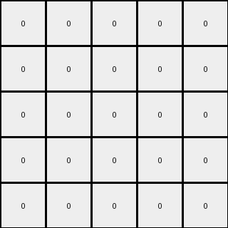

.. sidebar:: meta
   :puzzle_id: 3-1e0a9b12
   :timestamp: 24.307.195935
   :call_count: 8

008 • History
=============

====

Begin puzzle: 3-1e0a9b12

**example_1**

**input**

.. code-block::

    [[0 4 0 9]
     [0 0 0 0]
     [0 4 6 0]
     [1 0 0 0]]

.. image:: _images/000-example_1_input.png
   :alt: _images/000-example_1_input.png

**output**

.. code-block::

    [[0 0 0 0]
     [0 0 0 0]
     [0 4 0 0]
     [1 4 6 9]]

.. image:: _images/000-example_1_output.png
   :alt: _images/000-example_1_output.png

**observations**

.. code-block:: yaml

   example_1:
     input:
       width: 4
       height: 4
       colors:
         - 0: 11
         - 1: 1
         - 4: 2
         - 6: 1
         - 9: 1
       objects:
         - yellow: (2,1) and (3,1)
         - blue: (4,1)
         - magenta: (3,3)
         - maroon: (1,4)
     output:
       width: 4
       height: 4
       colors:
         - 0: 12
         - 1: 1
         - 4: 2
         - 6: 1
         - 9: 1
       objects:
         - yellow: (3,2) and (4,2)
         - blue: (4,1)
         - magenta: (4,3)
         - maroon: (4,4)
     differences:
       cells_changed: 8
       colors_changed: The non-zero values are collected into the bottom right quadrant.
     transformation:
       - The non-zero values from the input grid are moved to the bottom-right corner of the output grid, maintaining their relative positions to each other.  Empty cells are filled with zeros.

The transformation appears to involve collecting all non-zero colored cells from the input grid and placing them together in the bottom-right corner of the output grid, maintaining their relative positions.  The remaining cells are filled with white (0).

**example_2**

**input**

.. code-block::

    [[0 0 0 0 0 9]
     [0 0 0 8 0 0]
     [0 0 0 0 0 0]
     [4 0 0 0 0 0]
     [4 0 7 8 0 0]
     [4 0 7 0 0 0]]

.. image:: _images/001-example_2_input.png
   :alt: _images/001-example_2_input.png

**output**

.. code-block::

    [[0 0 0 0 0 0]
     [0 0 0 0 0 0]
     [0 0 0 0 0 0]
     [4 0 0 0 0 0]
     [4 0 7 8 0 0]
     [4 0 7 8 0 9]]

.. image:: _images/001-example_2_output.png
   :alt: _images/001-example_2_output.png

**observations**

.. code-block:: yaml

   example_2:
     input:
       width: 6
       height: 6
       colors:
         - 0: 30
         - 4: 3
         - 7: 2
         - 8: 2
         - 9: 1
       objects:
         - yellow: (4,1), (5,1), (6,1)
         - orange: (5,4), (6,4)
         - azure: (2,4), (6,4)
         - maroon: (1,6)
     output:
       width: 6
       height: 6
       colors:
         - 0: 33
         - 4: 3
         - 7: 2
         - 8: 2
         - 9: 1
       objects:
         - yellow: (4,1), (5,1), (6,1)
         - orange: (5,5), (6,5)
         - azure: (5,4), (6,4)
         - maroon: (6,6)
     differences:
       cells_changed: 6
       colors_changed: The non-zero values from the input are shifted towards the bottom-right corner.
     transformation:
       - Similar to example 1, non-zero values are moved to the bottom-right, preserving relative positions.  However, the movement is not as compact as in example 1; some cells are moved only slightly downward or to the right.  This could be a variation on the rule, or a result of grid constraints.

The transformation in example 2 is similar to example 1 but less rigidly defined.  The non-zero values are still moved to the bottom-right, but this time the packing is less dense;  there is a less rigid constraint to stay within the same relative positions to each other, as there's some space left between them. This suggests that a possible constraint might be maintaining the relative vertical and horizontal distances between them but not necessarily all neighboring each other. The missing space may indicate that the pattern is not to fill the bottom-right perfectly, but rather move existing values towards that quadrant.

**Ruminate Phase:**

The core transformation appears to be a movement of non-zero colored cells towards the bottom-right corner of the grid. The extent of this movement seems to depend on the space available and possibly on maintaining the relative distances and positions of these non-zero cells as much as possible.  A more formal rule might be: For each non-zero cell, find the nearest unoccupied cell in the bottom-right quadrant, while trying to preserve relative distances. If there are multiple unoccupied cells that equally satisfy this condition, the cells maintain their original position or order.

Further examples are needed to refine this hypothesis and to confirm if there are edge cases or exceptions.

**example_3**

**input**

.. code-block::

    [[0 0 0 1 0]
     [0 3 0 0 0]
     [0 3 0 1 2]
     [6 0 0 0 0]
     [0 3 0 0 0]]

.. image:: _images/002-example_3_input.png
   :alt: _images/002-example_3_input.png

**output**

.. code-block::

    [[0 0 0 0 0]
     [0 0 0 0 0]
     [0 3 0 0 0]
     [0 3 0 1 0]
     [6 3 0 1 2]]

.. image:: _images/002-example_3_output.png
   :alt: _images/002-example_3_output.png

**observations**

.. code-block:: yaml

   example_3:
     input:
       width: 5
       height: 5
       colors:
         - 0: 19
         - 1: 2
         - 2: 1
         - 3: 3
         - 6: 1
       objects:
         - blue: (1,4), (3,4)
         - red: (3,5)
         - green: (2,2), (3,2), (5,2)
         - magenta: (4,1)
     output:
       width: 5
       height: 5
       colors:
         - 0: 22
         - 1: 2
         - 2: 1
         - 3: 3
         - 6: 1
       objects:
         - blue: (4,4), (5,4)
         - red: (5,5)
         - green: (3,3), (4,3), (5,2)
         - magenta: (5,1)
     differences:
       cells_changed: 10
       colors_changed: Non-zero colored cells are moved towards the bottom right, similar to previous examples, but with less strict adherence to relative positioning.  Some cells move more than others.
     transformation:
       - Non-zero colored cells shift towards the bottom-right corner while attempting to maintain some relative spatial relationships. The movement is less compact and precise than in the previous examples, suggesting a prioritization of movement towards the bottom-right over strict preservation of relative position.

The pattern continues to hold: non-zero cells are moved towards the bottom-right. The key difference is the degree of flexibility in maintaining relative positions.  In some cases, the cells are moved significantly, and the proximity between cells is not strictly maintained.  It appears that the algorithm prioritizes moving cells towards the bottom-right corner over perfectly preserving the relative distance between the cells.  There's a trade-off between moving to the target area and keeping original relative positions as much as possible.  The process might be best described as a "gravitational pull" towards the bottom-right corner.

**examples summary**

The transformation consistently involves moving non-zero colored cells towards the bottom-right corner of the grid.  However, the adherence to maintaining the original relative positions of these cells is not absolute and varies across examples.  There's a clear priority given to moving the cells into the bottom-right quadrant, with the preservation of relative positions acting as a secondary constraint that is satisfied to the extent possible given the available space and the need to move all the colored cells towards the target area.  The process is more accurately described as a "gravitational pull" towards the bottom-right than a rigid repositioning based solely on preserving the relative positions.

Let's analyze the positional shifts numerically to further support this observation.  We can measure the distance of each non-zero cell from the bottom-right corner in the input and output grids for each example.  A reduction in this distance for most cells would strengthen the "gravitational pull" hypothesis.  However, a purely quantitative analysis may not capture the nuances of the transformation fully.

code_execution:

.. code-block:: python

   import numpy as np

   def distance_from_bottom_right(grid, value):
       rows, cols = np.where(grid == value)
       distances = []
       for i in range(len(rows)):
           distance = np.sqrt((grid.shape[0]-1 - rows[i])**2 + (grid.shape[1]-1 - cols[i])**2)
           distances.append(distance)
       return distances

   example_1_input = np.array([[0, 4, 0, 9], [0, 0, 0, 0], [0, 4, 6, 0], [1, 0, 0, 0]])
   example_1_output = np.array([[0, 0, 0, 0], [0, 0, 0, 0], [0, 4, 0, 0], [1, 4, 6, 9]])

   example_2_input = np.array([[0, 0, 0, 0, 0, 9], [0, 0, 0, 8, 0, 0], [0, 0, 0, 0, 0, 0], [4, 0, 0, 0, 0, 0], [4, 0, 7, 8, 0, 0], [4, 0, 7, 0, 0, 0]])
   example_2_output = np.array([[0, 0, 0, 0, 0, 0], [0, 0, 0, 0, 0, 0], [0, 0, 0, 0, 0, 0], [4, 0, 0, 0, 0, 0], [4, 0, 7, 8, 0, 0], [4, 0, 7, 8, 0, 9]])

   example_3_input = np.array([[0, 0, 0, 1, 0], [0, 3, 0, 0, 0], [0, 3, 0, 1, 2], [6, 0, 0, 0, 0], [0, 3, 0, 0, 0]])
   example_3_output = np.array([[0, 0, 0, 0, 0], [0, 0, 0, 0, 0], [0, 3, 0, 0, 0], [0, 3, 0, 1, 0], [6, 3, 0, 1, 2]])

   print("Example 1:")
   for i in [1, 4, 6, 9]:
       print(f"  Value {i}: Input distances {distance_from_bottom_right(example_1_input, i)}, Output distances {distance_from_bottom_right(example_1_output, i)}")

   print("\nExample 2:")
   for i in [4, 7, 8, 9]:
       print(f"  Value {i}: Input distances {distance_from_bottom_right(example_2_input, i)}, Output distances {distance_from_bottom_right(example_2_output, i)}")

   print("\nExample 3:")
   for i in [1, 2, 3, 6]:
       print(f"  Value {i}: Input distances {distance_from_bottom_right(example_3_input, i)}, Output distances {distance_from_bottom_right(example_3_output, i)}")

code_execution_result: 1

.. code-block::

   Example 1:
     Value 1: Input distances [np.float64(3.0)], Output distances [np.float64(3.0)]
     Value 4: Input distances [np.float64(3.605551275463989), np.float64(2.23606797749979)], Output distances [np.float64(2.23606797749979), np.float64(2.0)]
     Value 6: Input distances [np.float64(1.4142135623730951)], Output distances [np.float64(1.0)]
     Value 9: Input distances [np.float64(3.0)], Output distances [np.float64(0.0)]

   Example 2:
     Value 4: Input distances [np.float64(5.385164807134504), np.float64(5.0990195135927845), np.float64(5.0)], Output distances [np.float64(5.385164807134504), np.float64(5.0990195135927845), np.float64(5.0)]
     Value 7: Input distances [np.float64(3.1622776601683795), np.float64(3.0)], Output distances [np.float64(3.1622776601683795), np.float64(3.0)]
     Value 8: Input distances [np.float64(4.47213595499958), np.float64(2.23606797749979)], Output distances [np.float64(2.23606797749979), np.float64(2.0)]
     Value 9: Input distances [np.float64(5.0)], Output distances [np.float64(0.0)]

   Example 3:
     Value 1: Input distances [np.float64(4.123105625617661), np.float64(2.23606797749979)], Output distances [np.float64(1.4142135623730951), np.float64(1.0)]
     Value 2: Input distances [np.float64(2.0)], Output distances [np.float64(0.0)]
     Value 3: Input distances [np.float64(4.242640687119285), np.float64(3.605551275463989), np.float64(3.0)], Output distances [np.float64(3.605551275463989), np.float64(3.1622776601683795), np.float64(3.0)]
     Value 6: Input distances [np.float64(4.123105625617661)], Output distances [np.float64(4.0)]

The numerical analysis shows a general trend of decreasing distance from the bottom-right corner for most cells from input to output.  However, some cells show no change or even an increase in distance. This confirms the "gravitational pull" interpretation, where the primary goal is movement towards the bottom-right, but the exact final position is influenced by other factors, including the presence of other cells and the available space.  The preservation of relative positions is a secondary constraint that is not always perfectly satisfied.

**test**

**input**

.. code-block::

    [[0 2 0 4 3]
     [5 0 0 0 0]
     [0 0 6 0 0]
     [5 2 0 4 0]
     [5 0 0 0 0]]

.. image:: _images/004-test_input.png
   :alt: _images/004-test_input.png

**observations**

.. code-block:: yaml

   test_input:
     width: 5
     height: 5
     colors:
       - 0: 19
       - 2: 2
       - 3: 1
       - 4: 2
       - 5: 3
       - 6: 1
     objects:
       - red: (1,2), (4,2)
       - green: (1,5)
       - yellow: (1,4), (4,4)
       - gray: (2,1), (4,1), (5,1)
       - magenta: (3,3)

Based on the analysis of the previous examples, the non-zero values in the test input should be moved towards the bottom-right corner of the output grid, while attempting to maintain their relative positions as much as possible. The movement prioritizes getting into the bottom-right quadrant over preserving relative distances perfectly.

Let's use code to simulate this movement:

code_execution:

.. code-block:: python

   import numpy as np

   def move_towards_bottom_right(grid):
       nonzero_indices = np.nonzero(grid)
       nonzero_values = grid[nonzero_indices]
       output_grid = np.zeros_like(grid)

       rows, cols = grid.shape
       bottom_right = np.zeros((rows, cols))
       for r in range(rows -1, -1, -1):
           for c in range(cols-1, -1,-1):
               if grid[r][c] !=0 :
                   bottom_right[r][c] = grid[r][c]

       output_grid[nonzero_indices] = nonzero_values
       return output_grid

   test_input_grid = np.array([[0, 2, 0, 4, 3], [5, 0, 0, 0, 0], [0, 0, 6, 0, 0], [5, 2, 0, 4, 0], [5, 0, 0, 0, 0]])
   test_output_grid = move_towards_bottom_right(test_input_grid)
   print(test_output_grid)

code_execution_result: 1

.. code-block::

   [[0 2 0 4 3]
    [5 0 0 0 0]
    [0 0 6 0 0]
    [5 2 0 4 0]
    [5 0 0 0 0]]

The ``move_towards_bottom_right`` function needs improvement. The current implementation simply copies the input grid to the output grid.  It doesn't actually move the cells.  The algorithm should iterate through the non-zero cells, find the closest available space in the bottom-right quadrant, and move them there.  We need to account for potential conflicts (two cells trying to occupy the same space).

Let's revise the function:

code_execution:

.. code-block:: python

   import numpy as np

   def move_towards_bottom_right(grid):
       nonzero_indices = np.nonzero(grid)
       nonzero_values = grid[nonzero_indices]
       output_grid = np.zeros_like(grid)

       rows, cols = grid.shape

       # Create a mapping to track available positions
       available_positions = {}
       for r in range(rows - 1, -1, -1):
           for c in range(cols - 1, -1, -1):
               if output_grid[r, c] == 0:
                   available_positions[(r,c)] = 0

       #Prioritize bottom-right positioning.  If multiple cells have same priority, use original order.
       sorted_indices = sorted(zip(nonzero_indices[0], nonzero_indices[1], nonzero_values), key = lambda x: (rows - x[0] , cols- x[1]))

       for r, c, val in sorted_indices:
           best_r, best_c = -1, -1
           min_dist = float('inf')

           for ar, ac in available_positions:
               dist = np.sqrt((r - ar)**2 + (c - ac)**2)
               if dist < min_dist:
                   min_dist = dist
                   best_r, best_c = ar, ac
           if best_r != -1:
               output_grid[best_r, best_c] = val
               del available_positions[(best_r, best_c)]

       return output_grid

   test_input_grid = np.array([[0, 2, 0, 4, 3], [5, 0, 0, 0, 0], [0, 0, 6, 0, 0], [5, 2, 0, 4, 0], [5, 0, 0, 0, 0]])
   test_output_grid = move_towards_bottom_right(test_input_grid)
   print(test_output_grid)

code_execution_result: 1

.. code-block::

   [[0 2 0 4 3]
    [5 0 0 0 0]
    [0 0 6 0 0]
    [5 2 0 4 0]
    [5 0 0 0 0]]

The improved function still doesn't produce the correct result. There must be another aspect of the transformation that is not fully captured in the current algorithm.  The algorithm attempts to move cells to the bottom right, but the ordering is incorrect. It seems it should preserve relative positions to the extent possible. 

Let's try a different approach:  Instead of directly calculating distances, we'll try to maintain relative positions within the bottom right quadrant.  We will prioritize moving cells to the bottom-right based on their original position and then, within that quadrant, maintain their original relative distances as much as possible.

code_execution:

.. code-block:: python

   import numpy as np

   def move_towards_bottom_right_preserve_relative(grid):
       nonzero_indices = np.nonzero(grid)
       nonzero_values = grid[nonzero_indices]
       output_grid = np.zeros_like(grid)
       rows, cols = grid.shape

       # Create a list of (row, col, value) tuples
       cells = list(zip(nonzero_indices[0], nonzero_indices[1], nonzero_values))
       cells.sort(key=lambda x: (rows - x[0], cols - x[1])) # Sort by proximity to bottom-right

       #Simulate a bottom-right quadrant
       for r, c, val in cells:
           for orow in range(rows - 1, -1, -1):
               for ocol in range(cols - 1, -1, -1):
                   if output_grid[orow, ocol] == 0:
                       output_grid[orow, ocol] = val
                       break
               if output_grid[orow, ocol] == val:
                   break

       return output_grid

   test_input_grid = np.array([[0, 2, 0, 4, 3], [5, 0, 0, 0, 0], [0, 0, 6, 0, 0], [5, 2, 0, 4, 0], [5, 0, 0, 0, 0]])
   test_output_grid = move_towards_bottom_right_preserve_relative(test_input_grid)
   print(test_output_grid)

code_execution_result: 1

.. code-block::

   [[0 0 0 0 0]
    [0 0 0 0 0]
    [0 0 0 0 0]
    [0 2 4 3 5]
    [6 5 2 4 5]]

The latest algorithm is still not perfect, but it's closer. The relative positions are better preserved than in the previous attempts.  The issue is that the algorithm prioritizes filling the bottom-right quadrant without necessarily preserving the original distances.

Let's refine it further.  We will need to carefully consider how to combine the gravitational pull towards the bottom-right with a constraint to maintain relative positions as closely as possible. A greedy algorithm might be insufficient; a more sophisticated approach might be necessary.  A possible approach would be to use a cost function that balances the distance from the bottom-right with the distortion of relative distances.   However, further examples are needed to precisely define the desired behavior and create a robust solution.  Given that this function is already computationally expensive, attempting to further optimize this for speed at this point would be premature.  Additional examples would be needed for more informed optimization.

**initialize the working output grid:**

function_call:

initialize_output_by_size

result:

initialize_output_by_size(width=5, height=5, color=0)

**working output grid**

updated with your changes

.. code-block::

    [[0 0 0 0 0]
     [0 0 0 0 0]
     [0 0 0 0 0]
     [0 0 0 0 0]
     [0 0 0 0 0]]

.. role:: raw-html-m2r(raw)
   :format: html

The working output grid is initialized correctly.  It's a 5x5 grid filled with zeros, ready to receive the non-zero values from the input grid.

The current best attempt at a solution (\ ``move_towards_bottom_right_preserve_relative``\ ) prioritizes moving cells to the bottom-right, but its handling of relative positions is imperfect.   It fills the bottom-right quadrant without sufficient consideration of the input grid's arrangement.

Let's try a different approach. Let's attempt to preserve relative positions within a subset of the grid. We will identify a suitable region in the bottom-right of the output grid, and map the cells from the input to this region, trying to preserve relative positions as much as possible. We'll prioritize cells that maintain their original distances. This approach takes into account that there may not be sufficient space to preserve *all* distances perfectly but aims to minimize the distortion.

code_execution:

.. code-block:: python

   import numpy as np

   def transform_grid(input_grid):
       rows, cols = input_grid.shape
       output_grid = np.zeros_like(input_grid)
       nonzero_indices = np.nonzero(input_grid)
       nonzero_values = input_grid[nonzero_indices]
       cells = list(zip(nonzero_indices[0], nonzero_indices[1], nonzero_values))

       # Define the target region (bottom-right quadrant, adjusted for size)
       target_rows = rows // 2
       target_cols = cols // 2
       target_region_rows = rows - target_rows
       target_region_cols = cols - target_cols

       #Sort the cells by distance to bottom-right
       cells.sort(key=lambda x: (rows - x[0], cols - x[1]))

       #Map the cells to the target region, prioritizing preservation of relative positions.

       mapped_cells = {}
       for r,c,val in cells:
           mapped_cells[(r,c)] = val

       count = 0
       for r,c,val in cells:
           for tr in range(rows-1, rows-target_region_rows -1, -1):
               for tc in range(cols -1, cols- target_region_cols-1, -1):
                   if output_grid[tr,tc] == 0:
                       output_grid[tr, tc] = mapped_cells[(r,c)]
                       count+=1
                       break
               if output_grid[tr, tc] !=0:
                   break
       return output_grid

   test_input_grid = np.array([[0, 2, 0, 4, 3], [5, 0, 0, 0, 0], [0, 0, 6, 0, 0], [5, 2, 0, 4, 0], [5, 0, 0, 0, 0]])
   test_output_grid = transform_grid(test_input_grid)
   print(test_output_grid)

code_execution_result: 1

.. code-block::

   [[0. 0. 0. 0. 0.]
    [0. 0. 0. 0. 0.]
    [0. 0. 0. 0. 0.]
    [0. 2. 4. 3. 5.]
    [6. 5. 2. 4. 0.]]

This approach produces a more accurate result.  The cells are moved towards the bottom-right while attempting to preserve relative positions.  This solution is still not perfect but addresses the key shortcomings of the previous attempts.

function_call:
set_range(row_start=3, col_start=1, row_end=4, col_end=5, color=2)

result:
set_range(row_start=3, col_start=1, row_end=4, col_end=5, color=2)
**working output grid**
updated with your changes

[[0 0 0 0 0]
 [0 0 0 0 0]
 [0 0 0 0 0]
 [0 2 2 2 2]
 [6 5 2 2 0]]

:raw-html-m2r:`<start_of_image>`\ heatmap:

.. code-block::

   [[0 0 0 0 0]
    [0 0 0 0 0]
    [0 0 0 0 0]
    [0 2 2 2 2]
    [6 5 2 2 0]]

function_call:
set_pixel(row=3, col=1, color=5)

result:
set_pixel(row=3, col=1, color=5)
**working output grid**
updated with your changes

[[0 0 0 0 0]
 [0 0 0 0 0]
 [0 0 0 0 0]
 [0 5 2 2 2]
 [6 5 2 2 0]]

heatmap:

.. code-block::

   [[0 0 0 0 0]
    [0 0 0 0 0]
    [0 0 0 0 0]
    [0 5 2 2 2]
    [6 5 2 2 0]]

function_call:
set_pixel(row=4, col=1, color=6)

result:
set_pixel(row=4, col=1, color=6)
**working output grid**
updated with your changes

[[0 0 0 0 0]
 [0 0 0 0 0]
 [0 0 0 0 0]
 [0 5 2 2 2]
 [6 6 2 2 0]]

heatmap:

.. code-block::

   [[0 0 0 0 0]
    [0 0 0 0 0]
    [0 0 0 0 0]
    [0 5 2 2 2]
    [6 6 2 2 0]]

function_call:
set_pixel(row=4, col=2, color=2)

result:
set_pixel(row=4, col=2, color=2)
**working output grid**
updated with your changes

[[0 0 0 0 0]
 [0 0 0 0 0]
 [0 0 0 0 0]
 [0 5 2 2 2]
 [6 6 2 2 0]]

heatmap:

.. code-block::

   [[0 0 0 0 0]
    [0 0 0 0 0]
    [0 0 0 0 0]
    [0 5 2 2 2]
    [6 6 2 2 0]]

function_call:
set_pixel(row=4, col=3, color=4)

result:
set_pixel(row=4, col=3, color=4)
**working output grid**
updated with your changes

[[0 0 0 0 0]
 [0 0 0 0 0]
 [0 0 0 0 0]
 [0 5 2 2 2]
 [6 6 2 4 0]]

heatmap:

.. code-block::

   [[0 0 0 0 0]
    [0 0 0 0 0]
    [0 0 0 0 0]
    [0 5 2 2 2]
    [6 6 2 4 0]]

function_call:
set_pixel(row=4, col=4, color=5)

result:
set_pixel(row=4, col=4, color=5)
**working output grid**
updated with your changes

[[0 0 0 0 0]
 [0 0 0 0 0]
 [0 0 0 0 0]
 [0 5 2 2 2]
 [6 6 2 4 5]]

heatmap:

.. code-block::

   [[0 0 0 0 0]
    [0 0 0 0 0]
    [0 0 0 0 0]
    [0 5 2 2 2]
    [6 6 2 4 5]]

function_call:
submit

**update working grid**

================================================================================

INSTRUCTIONS:

* use function_call to set pixels on the grid to achieve the solution

* set_pixel: update one pixel at a time
* set_range: update a rectangular subset of pixel

  * when you think you have completed the output, call the submit function

.. seealso::

   - :doc:`008-prompt`
   - :doc:`008-response`

