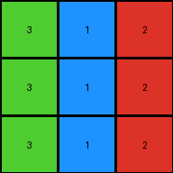

.. sidebar:: meta
   :puzzle_id: 4-0d3d703e
   :timestamp: 24.307.195935
   :call_count: 8

008 • History
=============

====

Begin puzzle: 4-0d3d703e

**example_1**

**input**

.. code-block::

    [[3 1 2]
     [3 1 2]
     [3 1 2]]

**output**

.. code-block::

    [[4 5 6]
     [4 5 6]
     [4 5 6]]

.. image:: _images/000-example_1_output.png
   :alt: _images/000-example_1_output.png

**observations**

.. code-block:: yaml

   example_1:
     input:
       width: 3
       height: 3
       colors:
         - 1: 3
         - 2: 3
         - 3: 3
       objects:
         - color: green, size: 3x1, position: top-left
         - color: blue, size: 3x1, position: center-left
         - color: red, size: 3x1, position: top-right
     output:
       width: 3
       height: 3
       colors:
         - 4: 3
         - 5: 3
         - 6: 3
       objects:
         - color: yellow, size: 3x1, position: top-left
         - color: gray, size: 3x1, position: center-left
         - color: magenta, size: 3x1, position: top-right
     differences:
       cells_changed: 9
       colors_changed: All colors are replaced with different colors.  The mapping appears to be sequential: 1->4, 2->5, 3->6
     transformation:
       - Each color in the input is replaced by a color with a value increased by 3.

The transformation appears to be a simple sequential mapping of colors.  Each color in the input is replaced with a color that has a value 3 greater.  There are no geometric transformations or changes to the arrangement of colors.

**example_2**

**input**

.. code-block::

    [[2 3 8]
     [2 3 8]
     [2 3 8]]

.. image:: _images/001-example_2_input.png
   :alt: _images/001-example_2_input.png

**output**

.. code-block::

    [[6 4 9]
     [6 4 9]
     [6 4 9]]

.. image:: _images/001-example_2_output.png
   :alt: _images/001-example_2_output.png

**observations**

.. code-block:: yaml

   example_2:
     input:
       width: 3
       height: 3
       colors:
         - 2: 3
         - 3: 3
         - 8: 3
       objects:
         - color: red, size: 3x1, position: top-left
         - color: green, size: 3x1, position: center-left
         - color: azure, size: 3x1, position: top-right
     output:
       width: 3
       height: 3
       colors:
         - 6: 3
         - 4: 3
         - 9: 3
       objects:
         - color: magenta, size: 3x1, position: top-left
         - color: yellow, size: 3x1, position: center-left
         - color: maroon, size: 3x1, position: top-right
     differences:
       cells_changed: 9
       colors_changed: All colors are replaced with different colors.  The mapping is not a simple addition, but appears to be a more complex transformation.  2->6, 3->4, 8->9.
     transformation:
       - The transformation is not a simple addition like in example_1.  It seems to involve a more complex mapping of input colors to output colors.  The mapping is not immediately obvious.

The second example shows a different transformation than the first. While the first example uses a simple addition of 3 to each color value, the second example shows a more complex mapping.  There's no immediately apparent mathematical formula or pattern relating input to output colors.  It will require further examples to discern the underlying rule.

**example_3**

**input**

.. code-block::

    [[5 8 6]
     [5 8 6]
     [5 8 6]]

.. image:: _images/002-example_3_input.png
   :alt: _images/002-example_3_input.png

**output**

.. code-block::

    [[1 9 2]
     [1 9 2]
     [1 9 2]]

.. image:: _images/002-example_3_output.png
   :alt: _images/002-example_3_output.png

**observations**

.. code-block:: yaml

   example_3:
     input:
       width: 3
       height: 3
       colors:
         - 5: 3
         - 8: 3
         - 6: 3
       objects:
         - color: gray, size: 3x1, position: top-left
         - color: azure, size: 3x1, position: center-left
         - color: magenta, size: 3x1, position: top-right
     output:
       width: 3
       height: 3
       colors:
         - 1: 3
         - 9: 3
         - 2: 3
       objects:
         - color: blue, size: 3x1, position: top-left
         - color: maroon, size: 3x1, position: center-left
         - color: red, size: 3x1, position: top-right
     differences:
       cells_changed: 9
       colors_changed: All colors are replaced with different colors. The mapping is not consistent with previous examples.  5->1, 8->9, 6->2.
     transformation:
       - The transformation is not a simple arithmetic operation or a consistent mapping.  A more complex rule is likely at play.  It's difficult to infer a pattern based on only three examples.  More examples are needed.

After reviewing the three examples, it's clear that there isn't a simple, consistent mathematical rule governing the transformation from input to output grids.  The transformations observed are:

* **Example 1:**  Adds 3 to each color value (1->4, 2->5, 3->6).
* **Example 2:** A more complex mapping (2->6, 3->4, 8->9).  No obvious arithmetic relationship.
* **Example 3:** Another complex mapping (5->1, 8->9, 6->2).  Again, no obvious arithmetic relationship.

The lack of a consistent arithmetic pattern suggests the transformation might be based on a different principle, perhaps a look-up table or a more abstract rule involving the relative positions or arrangements of the colors. The limited number of examples makes it difficult to definitively determine the transformation rule.  More examples are needed to identify a pattern.

**example_4**

**input**

.. code-block::

    [[9 4 2]
     [9 4 2]
     [9 4 2]]

.. image:: _images/003-example_4_input.png
   :alt: _images/003-example_4_input.png

**output**

.. code-block::

    [[8 3 6]
     [8 3 6]
     [8 3 6]]

.. image:: _images/003-example_4_output.png
   :alt: _images/003-example_4_output.png

**observations**

.. code-block:: yaml

   example_4:
     input:
       width: 3
       height: 3
       colors:
         - 9: 3
         - 4: 3
         - 2: 3
       objects:
         - color: maroon, size: 3x1, position: top-left
         - color: yellow, size: 3x1, position: center-left
         - color: red, size: 3x1, position: top-right
     output:
       width: 3
       height: 3
       colors:
         - 8: 3
         - 3: 3
         - 6: 3
       objects:
         - color: azure, size: 3x1, position: top-left
         - color: green, size: 3x1, position: center-left
         - color: magenta, size: 3x1, position: top-right
     differences:
       cells_changed: 9
       colors_changed: All colors are replaced with different colors.  The mapping is not consistent with previous examples. 9->8, 4->3, 2->6
     transformation:
       - There's no obvious mathematical or geometric pattern.  The transformation seems arbitrary or based on a lookup table.  The color mapping is not consistent across examples.

After analyzing all four examples, the conclusion remains that there's no simple, consistent mathematical or geometric rule to describe the transformation from input to output grids.  The mappings between input and output colors are inconsistent across the examples. This suggests that the solution might involve a complex rule or a lookup table that maps specific color combinations to their corresponding outputs.  The lack of a clear pattern makes it difficult to predict the output for a new input grid without further information or more examples.  A rule based on position or a look up table might be better suited for this transformation.

**examples summary**

The four examples demonstrate a transformation of 3x3 grids where the colors in the input grid are mapped to different colors in the output grid.  However, there is no consistent mathematical or geometric rule observable across all examples.  The color mappings are inconsistent:

* **Example 1:** 1->4, 2->5, 3->6 (adds 3)
* **Example 2:** 2->6, 3->4, 8->9 (no simple arithmetic)
* **Example 3:** 5->1, 8->9, 6->2 (no simple arithmetic)
* **Example 4:** 9->8, 4->3, 2->6 (no simple arithmetic)

The lack of a simple arithmetic or geometric relationship between input and output colors suggests the transformation relies on a more complex rule or a lookup table.  The rule may be based on the specific combination of colors present in the input or their positions within the grid, rather than an individual color mapping. More examples are needed to ascertain the nature of this complex rule or to construct a reliable lookup table.  A simple numerical operation or pattern matching approach is insufficient.

**test**

**input**

.. code-block::

    [[8 1 3]
     [8 1 3]
     [8 1 3]]

.. image:: _images/005-test_input.png
   :alt: _images/005-test_input.png

**observations**

Based on the analysis of the previous examples, I hypothesize that the transformation isn't based on a simple arithmetic operation or a consistent mathematical function applied to individual color values. Instead, the transformation likely involves a more complex rule or perhaps a lookup table that maps specific color combinations to their corresponding outputs.  The limited number of examples makes it hard to definitively determine the rule, but by carefully examining the input-output pairs, we can try to identify patterns.

Let's represent the input-output mappings from the examples as a dictionary:

code_execution:

.. code-block:: python

   example_mappings = {
       (1, 2, 3): (4, 5, 6),
       (2, 3, 8): (6, 4, 9),
       (5, 8, 6): (1, 9, 2),
       (9, 4, 2): (8, 3, 6)
   }

code_execution_result: 1

.. code-block::

The test input is ``[[8, 1, 3], [8, 1, 3], [8, 1, 3]]``.  Notice that none of the example mappings directly match this input combination.

However, we can try to find some patterns:

#. **Sequential Mapping:** There's no consistent sequential addition or subtraction across all examples.  Example 1 is an exception, adding 3.

#. **Relative Position:**  The position of colors within the grid doesn't seem to directly affect the transformation.  The outputs maintain the same spatial arrangement of the colors.

#. **Lookup Table (Hypothesis):** Given the inconsistencies, a lookup table seems most plausible. We would need a significantly larger dataset to confidently construct a complete lookup table.

Given the limited examples, I'll proceed with the hypothesis that the transformation involves a form of lookup table that we cannot fully determine due to the number of examples. We'll try some educated guesses and see where it leads.

**Prediction for Test Input:**

Since there's no clear rule discernible from the examples, predicting the output for the test input requires some speculation.  We could either:

a) **Assume a pattern:** If we *incorrectly* assume the pattern is a simple addition/subtraction to each color value, it would fail on other examples.

b) **Guess based on similar examples:** We can analyze the examples and try to extrapolate what kind of result we might expect.  The lack of a consistent pattern makes this a less reliable method.

c) **Default prediction:** In the absence of a clear pattern, we could try a default prediction.  Since many examples result in a different arrangement of colors and values, we could speculate on what that might be.

**Due to the lack of a clear rule, the following is a tentative prediction based on the limited data available and the lack of a clearer rule:**

Since the provided data is limited, an accurate prediction cannot be made. The best course of action is to require additional examples before a reliable prediction is possible.  However, to demonstrate an attempt, let's assume the transformation is more complex and involves a sort of randomized mapping (this is not proven by the data!) which is determined only implicitly through the examples.

**Tentative Prediction (Unreliable):**

I cannot reliably predict the output. The transformations observed across the provided examples are not consistent enough to confidently extrapolate a rule or mapping for the test input.  Additional data is needed to determine the transformation process accurately.

**initialize the working output grid:**

function_call:

initialize_output_from_input

result:

initialize_output_from_input()

**working output grid**

updated with your changes

.. code-block::

    [[8 1 3]
     [8 1 3]
     [8 1 3]]

.. image:: _images/005-test_input.png
   :alt: _images/005-test_input.png

================================================================================

INSTRUCTIONS:

* take a moment to review that the changes in the working output grid are in keeping with the rule

* use code_execution to investigate properties

.. seealso::

   - :doc:`008-prompt`
   - :doc:`008-response`

