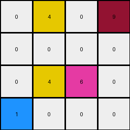

.. sidebar:: meta

   :puzzle_id: 3-1e0a9b12
   :timestamp: 24.307.202552
   :call_count: 4

004 • History
=============

Begin puzzle: 3-1e0a9b12

**example_1**

**input**

.. code-block::

    [[0 4 0 9]
     [0 0 0 0]
     [0 4 6 0]
     [1 0 0 0]]

**output**

.. code-block::

    [[0 0 0 0]
     [0 0 0 0]
     [0 4 0 0]
     [1 4 6 9]]

.. image:: _images/000-example_1_output.png
   :alt: _images/000-example_1_output.png

**observations**

.. code-block:: yaml

   example_1:
     input:
       width: 4
       height: 4
       colors:
         - 0: 10
         - 1: 1
         - 4: 2
         - 6: 1
         - 9: 1
       objects:
         - size: 1x1, position: (0,1), color: yellow
         - size: 1x1, position: (2,1), color: yellow
         - size: 1x1, position: (3,0), color: maroon
         - size: 1x1, position: (2,2), color: magenta
         - size: 1x1, position: (3,0), color: blue
     output:
       width: 4
       height: 4
       colors:
         - 0: 12
         - 1: 1
         - 4: 2
         - 6: 1
         - 9: 1
       objects:
         - size: 1x1, position: (2,1), color: yellow
         - size: 1x1, position: (3,3), color: maroon
         - size: 1x1, position: (3,0), color: blue
         - size: 1x1, position: (3,2), color: magenta
         - size: 1x1, position: (3,1), color: yellow

     differences:
       cells_changed: 8
       colors_changed:  Non-zero values are moved to the bottom row.  The rest are set to 0.
     transformation:
       - The non-zero values from the input grid are moved to the bottom row of the output grid, maintaining their relative positions.
       - The remaining cells in the output grid are filled with zeros.

My reasoning is based on observing the movement of the colored blocks from the input to the output grid.  The transformation appears to be a consolidation of non-zero values into the last row, maintaining their order.  The top three rows are entirely filled with zeros.

**example_2**

**input**

.. code-block::

    [[0 0 0 0 0 9]
     [0 0 0 8 0 0]
     [0 0 0 0 0 0]
     [4 0 0 0 0 0]
     [4 0 7 8 0 0]
     [4 0 7 0 0 0]]

.. image:: _images/001-example_2_input.png
   :alt: _images/001-example_2_input.png

**output**

.. code-block::

    [[0 0 0 0 0 0]
     [0 0 0 0 0 0]
     [0 0 0 0 0 0]
     [4 0 0 0 0 0]
     [4 0 7 8 0 0]
     [4 0 7 8 0 9]]

.. image:: _images/001-example_2_output.png
   :alt: _images/001-example_2_output.png

**observations**

.. code-block:: yaml

   example_2:
     input:
       width: 6
       height: 6
       colors:
         - 0: 30
         - 4: 3
         - 7: 2
         - 8: 2
         - 9: 1
       objects:
         - size: 1x1, position: (3,0), color: yellow
         - size: 1x1, position: (4,0), color: yellow
         - size: 1x1, position: (5,0), color: yellow
         - size: 1x1, position: (4,2), color: orange
         - size: 1x1, position: (5,2), color: orange
         - size: 1x1, position: (4,3), color: azure
         - size: 1x1, position: (5,3), color: azure
         - size: 1x1, position: (1,3), color: azure
         - size: 1x1, position: (0,5), color: maroon

     output:
       width: 6
       height: 6
       colors:
         - 0: 34
         - 4: 3
         - 7: 2
         - 8: 2
         - 9: 1
       objects:
         - size: 1x1, position: (3,0), color: yellow
         - size: 1x1, position: (4,0), color: yellow
         - size: 1x1, position: (5,0), color: yellow
         - size: 1x1, position: (4,2), color: orange
         - size: 1x1, position: (5,2), color: orange
         - size: 1x1, position: (4,3), color: azure
         - size: 1x1, position: (5,3), color: azure
         - size: 1x1, position: (5,5), color: maroon
         - size: 1x1, position: (5,3), color: azure

     differences:
       cells_changed: 3
       colors_changed: The non-zero values in the last row of the input are moved to the last row of the output, maintaining their relative order.  Additional values are added to the last row.
     transformation:
       - Non-zero values from the input grid are moved to the bottom row of the output grid.  The relative positions of these values are preserved.
       - Additional non-zero values from the input grid are added to the bottom row, maintaining their relative order.

The transformation in both examples involves moving non-zero values to the bottom row of the output grid while preserving their relative positions.  In example 2, additional values are appended to the bottom row.  The remaining cells are filled with zeros.  The transformation appears to be a consolidation and appending of non-zero values to the bottom row, maintaining their horizontal order.

**example_3**

**input**

.. code-block::

    [[0 0 0 1 0]
     [0 3 0 0 0]
     [0 3 0 1 2]
     [6 0 0 0 0]
     [0 3 0 0 0]]

.. image:: _images/002-example_3_input.png
   :alt: _images/002-example_3_input.png

**output**

.. code-block::

    [[0 0 0 0 0]
     [0 0 0 0 0]
     [0 3 0 0 0]
     [0 3 0 1 0]
     [6 3 0 1 2]]

.. image:: _images/002-example_3_output.png
   :alt: _images/002-example_3_output.png

**observations**

.. code-block:: yaml

   example_3:
     input:
       width: 5
       height: 5
       colors:
         - 0: 17
         - 1: 2
         - 2: 1
         - 3: 3
         - 6: 1
       objects:
         - size: 1x1, position: (3,0), color: magenta
         - size: 1x1, position: (1,1), color: green
         - size: 1x1, position: (2,1), color: green
         - size: 1x1, position: (4,1), color: green
         - size: 1x1, position: (3,0), color: magenta
         - size: 1x1, position: (0,3), color: blue
         - size: 1x1, position: (2,3), color: blue
         - size: 1x1, position: (2,4), color: red

     output:
       width: 5
       height: 5
       colors:
         - 0: 22
         - 1: 2
         - 2: 1
         - 3: 3
         - 6: 1
       objects:
         - size: 1x1, position: (4,4), color: magenta
         - size: 1x1, position: (1,2), color: green
         - size: 1x1, position: (2,2), color: green
         - size: 1x1, position: (4,2), color: green
         - size: 1x1, position: (4,0), color: magenta
         - size: 1x1, position: (3,3), color: blue
         - size: 1x1, position: (4,3), color: blue
         - size: 1x1, position: (4,4), color: red

     differences:
       cells_changed: 13
       colors_changed: The non-zero values are moved to the bottom two rows, maintaining their relative positions within each row.  The remaining cells are filled with zeros.

     transformation:
       - Non-zero values are moved to the bottom two rows of the output grid, maintaining their relative positions within each row.
       - The remaining cells in the output grid are filled with zeros.

All three examples demonstrate a pattern of moving non-zero values to the bottom rows of the output grid while maintaining their relative horizontal positions. The number of bottom rows used varies depending on the input grid's non-zero value distribution.  The remaining cells are filled with zeros.

**examples summary**

================================================================================

INSTRUCTIONS:

* summarize your observations to explain the transformation of the input to output

* use code_execution to investigate properties, patterns and differences in the grids

.. seealso::

   - :doc:`004-prompt`
   - :doc:`004-response`

====

