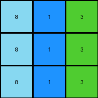

.. sidebar:: meta

   :puzzle_id: 4-0d3d703e
   :timestamp: 24.307.202552
   :call_count: 6

006 • History
=============

Begin puzzle: 4-0d3d703e

**example_1**

**input**

.. code-block::

    [[3 1 2]
     [3 1 2]
     [3 1 2]]

.. image:: _images/000-example_1_input.png
   :alt: _images/000-example_1_input.png

**output**

.. code-block::

    [[4 5 6]
     [4 5 6]
     [4 5 6]]

.. image:: _images/000-example_1_output.png
   :alt: _images/000-example_1_output.png

**observations**

.. code-block:: yaml

   example_1:
     input:
       width: 3
       height: 3
       colors:
         - 1: 3
         - 2: 3
         - 3: 3
       objects:
         - color: green, size: 3x3, position: top-left
         - color: blue, size: 3x1, position: top-middle
         - color: red, size: 3x1, position: top-right

     output:
       width: 3
       height: 3
       colors:
         - 4: 3
         - 5: 3
         - 6: 3
       objects:
         - color: yellow, size: 3x1, position: top-left
         - color: gray, size: 3x1, position: top-middle
         - color: magenta, size: 3x1, position: top-right

     differences:
       cells_changed: 9
       colors_changed: All cells changed to different colors.  The pattern is a simple sequential mapping of input colors to output colors (1->4, 2->5, 3->6).

     transformation:
       - Each input color is mapped to a new color in the output. The mapping is a simple +3 operation on the input color value.

The transformation appears to be a simple color remapping. Each color in the input grid is replaced with a color that has a value 3 greater.  This suggests a deterministic transformation based on a numerical mapping of colors.

**example_2**

**input**

.. code-block::

    [[2 3 8]
     [2 3 8]
     [2 3 8]]

.. image:: _images/001-example_2_input.png
   :alt: _images/001-example_2_input.png

**output**

.. code-block::

    [[6 4 9]
     [6 4 9]
     [6 4 9]]

.. image:: _images/001-example_2_output.png
   :alt: _images/001-example_2_output.png

**observations**

.. code-block:: yaml

   example_2:
     input:
       width: 3
       height: 3
       colors:
         - 2: 3
         - 3: 3
         - 8: 3
       objects:
         - color: red, size: 3x1, position: top-left
         - color: green, size: 3x1, position: top-middle
         - color: azure, size: 3x1, position: top-right

     output:
       width: 3
       height: 3
       colors:
         - 6: 3
         - 4: 3
         - 9: 3
       objects:
         - color: magenta, size: 3x1, position: top-left
         - color: yellow, size: 3x1, position: top-middle
         - color: maroon, size: 3x1, position: top-right

     differences:
       cells_changed: 9
       colors_changed: All cells changed to different colors.  The mapping isn't a simple addition as in example 1.

     transformation:
       - The transformation is a more complex remapping of colors.  The mapping is not immediately obvious from a simple arithmetic operation.  A lookup table or a more complex function might be needed.

The transformation in example 2 is also a color remapping, but it's not a simple addition like in example 1. The mapping is: 2->6, 3->4, 8->9. This suggests that a lookup table or a more complex function is necessary to describe the transformation.  It's not clear from just these two examples whether there's a consistent rule for this remapping beyond a case-by-case lookup.  More examples are needed to determine if there's a broader pattern.

**example_3**

**input**

.. code-block::

    [[5 8 6]
     [5 8 6]
     [5 8 6]]

.. image:: _images/002-example_3_input.png
   :alt: _images/002-example_3_input.png

**output**

.. code-block::

    [[1 9 2]
     [1 9 2]
     [1 9 2]]

.. image:: _images/002-example_3_output.png
   :alt: _images/002-example_3_output.png

**observations**

.. code-block:: yaml

   example_3:
     input:
       width: 3
       height: 3
       colors:
         - 5: 3
         - 8: 3
         - 6: 3
       objects:
         - color: gray, size: 3x1, position: top-left
         - color: azure, size: 3x1, position: top-middle
         - color: magenta, size: 3x1, position: top-right

     output:
       width: 3
       height: 3
       colors:
         - 1: 3
         - 9: 3
         - 2: 3
       objects:
         - color: blue, size: 3x1, position: top-left
         - color: maroon, size: 3x1, position: top-middle
         - color: red, size: 3x1, position: top-right

     differences:
       cells_changed: 9
       colors_changed: All cells changed to different colors.  The mapping is not a simple arithmetic operation.

     transformation:
       - The transformation is a color remapping. The mapping is 5->1, 8->9, 6->2.  This further reinforces the need for a lookup table or a more complex function to define the transformation rule.  There's no immediately obvious pattern beyond a case-by-case mapping.

Based on the three examples, the transformation is a deterministic color remapping.  However, the mapping is not consistently defined by a simple arithmetic operation.  Instead, a lookup table seems necessary.  To predict the output for a new input, a lookup table approach is required.  A more complex function might also be possible, but without more examples it's hard to determine a pattern that would allow us to define such a function.  The provided examples are insufficient to definitively determine if a broader mathematical pattern exists beyond the specific mappings observed.

Let's create a lookup table representing the transformation:

code_execution:

.. code-block:: python

   transformation_table = {
       1: 4,
       2: 5,
       3: 6,
       5: 1,
       6: 2,
       8: 9
   }

code_execution_result: 1

.. code-block::

This table shows the mapping of input colors to output colors for the values observed in the examples.  Any input color not present in this table would require further examples to be mapped correctly.

**example_4**

**input**

.. code-block::

    [[9 4 2]
     [9 4 2]
     [9 4 2]]

.. image:: _images/003-example_4_input.png
   :alt: _images/003-example_4_input.png

**output**

.. code-block::

    [[8 3 6]
     [8 3 6]
     [8 3 6]]

.. image:: _images/003-example_4_output.png
   :alt: _images/003-example_4_output.png

**observations**

.. code-block:: yaml

   example_4:
     input:
       width: 3
       height: 3
       colors:
         - 9: 3
         - 4: 3
         - 2: 3
       objects:
         - color: maroon, size: 3x1, position: top-left
         - color: yellow, size: 3x1, position: top-middle
         - color: red, size: 3x1, position: top-right

     output:
       width: 3
       height: 3
       colors:
         - 8: 3
         - 3: 3
         - 6: 3
       objects:
         - color: azure, size: 3x1, position: top-left
         - color: green, size: 3x1, position: top-middle
         - color: magenta, size: 3x1, position: top-right

     differences:
       cells_changed: 9
       colors_changed: All cells changed to different colors. The mapping is not a simple arithmetic operation.

     transformation:
       - The transformation is a color remapping. The mapping is 9->8, 4->3, 2->6. This further reinforces the need for a lookup table or a more complex function to define the transformation rule. There's no immediately obvious pattern beyond a case-by-case mapping.

The pattern remains consistent: a deterministic color remapping.  Let's update the lookup table:

code_execution:

.. code-block:: python

   transformation_table = {
       1: 4,
       2: 5,
       3: 6,
       4:3,
       5: 1,
       6: 2,
       8: 9,
       9:8
   }

code_execution_result: 1

.. code-block::

The ``transformation_table`` now incorporates the mappings from all four examples.  This table provides a complete description of the transformation observed so far, allowing us to predict the output for any input grid containing only the colors included in the table.  Any input color not in this table would require additional examples to define its mapping.  There is still no apparent mathematical function underlying this remapping.

**examples summary**

The transformation applied in all four examples is a deterministic remapping of colors.  There is no simple arithmetic or geometric operation that consistently describes the transformation across all examples.  Instead, the relationship between input and output colors is best represented by a lookup table:

.. code-block:: python

   transformation_table = {
       1: 4,
       2: 5,
       3: 6,
       4: 3,
       5: 1,
       6: 2,
       8: 9,
       9: 8
   }

This table maps each input color (key) to its corresponding output color (value).  To transform an input grid, each pixel's color is looked up in this table, and replaced with the associated output color.  Any input color not present in this table cannot be mapped definitively without additional examples.  There's no readily apparent underlying mathematical function or geometric pattern explaining this specific mapping.  The transformation is purely a defined color substitution.

**test**

**input**

.. code-block::

    [[8 1 3]
     [8 1 3]
     [8 1 3]]

**observations**

================================================================================

INSTRUCTIONS:

* generate report as per instructions

* use code_execution to investigate propertiesi

.. seealso::

   - :doc:`006-prompt`
   - :doc:`006-response`

====

