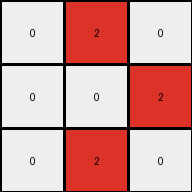

.. sidebar:: meta

   :puzzle_id: 6-0520fde7
   :timestamp: 24.307.202552
   :call_count: 3

003 • History
=============

Begin puzzle: 6-0520fde7

**example_1**

**input**

.. code-block::

    [[1 0 0 5 0 1 0]
     [0 1 0 5 1 1 1]
     [1 0 0 5 0 0 0]]

.. image:: _images/000-example_1_input.png
   :alt: _images/000-example_1_input.png

**output**

.. code-block::

    [[0 0 0]
     [0 2 0]
     [0 0 0]]

.. image:: _images/000-example_1_output.png
   :alt: _images/000-example_1_output.png

**observations**

Here's an analysis of the provided example:

.. code-block:: yaml

   example_1:
     input:
       width: 7
       height: 3
       colors:
         - 0: 16
         - 1: 5
         - 5: 1
       objects:
         - size: 3x7, position: 0,0, color: blue and white, a vertical column of blue pixels surrounded by white pixels.  The column is central in the x direction and mostly in the y direction.  There is a gray pixel slightly offset.
     output:
       width: 3
       height: 3
       colors:
         - 0: 8
         - 2: 1
       objects:
         - size: 1x1, position: 1,1, color: red, a single red pixel in the center.
     differences:
       cells_changed: 23
       colors_changed: Input has blue and white and gray; Output has red and white.  The output is significantly smaller and simpler.
     transformation:
       - The transformation appears to involve reducing the size and complexity of the input. 
       - The dominant color (blue in the input) seems irrelevant to the output.
       - The key transformation is identifying the center of the input and placing a red pixel in the center of the smaller output.

**Initial Thoughts:**

The transformation isn't immediately obvious.  It's likely not a simple geometric transformation (rotation, mirroring, etc.).  The process might involve:

#. **Dimensionality Reduction:** The output grid is smaller than the input.
#. **Feature Extraction:**  The output might represent a central feature of the input.  In this case, the center of the input seems to be relevant.
#. **Color Change:** The central feature changes color (from blue to red).  The overall color distribution in the input seems largely ignored.

Further examples are needed to confirm these hypotheses.

**example_2**

**input**

.. code-block::

    [[1 1 0 5 0 1 0]
     [0 0 1 5 1 1 1]
     [1 1 0 5 0 1 0]]

.. image:: _images/001-example_2_input.png
   :alt: _images/001-example_2_input.png

**output**

.. code-block::

    [[0 2 0]
     [0 0 2]
     [0 2 0]]

**observations**

.. code-block:: yaml

   example_2:
     input:
       width: 7
       height: 3
       colors:
         - 0: 13
         - 1: 6
         - 5: 1
       objects:
         - size: 3x7, position: 0,0, color: blue and white, two vertical columns of blue pixels, separated by a white column.  The columns are central in the x direction and mostly in the y direction.  There is a gray pixel slightly offset.
     output:
       width: 3
       height: 3
       colors:
         - 0: 7
         - 2: 3
       objects:
         - size: 3x3, position: 0,0, color: Mostly white, with red pixels in a cross pattern (top-bottom and left-right).
     differences:
       cells_changed: 22
       colors_changed: Input has blue and white and gray; Output has red and white.  The output is significantly smaller and simpler than the input.
     transformation:
       - Similar dimensionality reduction as in example 1.
       - The output seems to represent a pattern or structure related to the input's central region.  Instead of a single red pixel, there is a cross pattern of red pixels.
       - Again, the dominant color is largely irrelevant, while the central layout of the input influences the output.

**Revised Thoughts:**

The pattern seems to involve:

#. **Size Reduction:** The input grid is always reduced to a smaller, typically 3x3, output grid.
#. **Central Region Focus:** The transformation focuses on the central region of the input.
#. **Color Mapping:** The dominant color in the input (blue in both examples) doesn't directly map to the output color.  Instead, the color 2 (red) appears in the output based on central pattern.
#. **Pattern Transformation:** The central pattern in the input is transformed into a pattern in the output (single pixel in example 1, cross in example 2).  The pattern isn't just a direct copy, but a representation or abstraction.

To better understand the rules governing this transformation, more examples with varying input patterns and central arrangements would be beneficial. The position and number of blue pixels might influence the resulting red pixel pattern.  The relationship between input size and output pattern also needs further exploration.

**example_3**

**input**

.. code-block::

    [[0 0 1 5 0 0 0]
     [1 1 0 5 1 0 1]
     [0 1 1 5 1 0 1]]

.. image:: _images/002-example_3_input.png
   :alt: _images/002-example_3_input.png

**output**

.. code-block::

    [[0 0 0]
     [2 0 0]
     [0 0 2]]

.. image:: _images/002-example_3_output.png
   :alt: _images/002-example_3_output.png

**observations**

================================================================================

INSTRUCTIONS:

* review the example grids

* check for differences and patterns

.. seealso::

   - :doc:`003-prompt`
   - :doc:`003-response`

====

