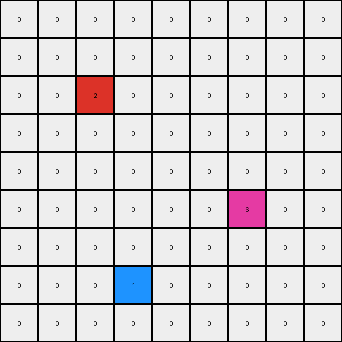

.. sidebar:: details

   :puzzle_id: 2-0ca9ddb6
   :timestamp: 24.307.205622
   :call_count: 4

004 • History
=============

Begin puzzle: 2-0ca9ddb6

**example_1**

**input**

.. code-block::

    [[0 0 0 0 0 0 0 0 0]
     [0 0 0 0 0 0 0 0 0]
     [0 0 0 0 0 0 0 0 0]
     [0 0 2 0 0 0 0 0 0]
     [0 0 0 0 0 0 0 0 0]
     [0 0 0 0 0 0 0 0 0]
     [0 0 0 0 0 0 1 0 0]
     [0 0 0 0 0 0 0 0 0]
     [0 0 0 0 0 0 0 0 0]]

.. image:: _images/000-example_1_input.png
   :alt: _images/000-example_1_input.png

**output**

.. code-block::

    [[0 0 0 0 0 0 0 0 0]
     [0 0 0 0 0 0 0 0 0]
     [0 4 0 4 0 0 0 0 0]
     [0 0 2 0 0 0 0 0 0]
     [0 4 0 4 0 0 0 0 0]
     [0 0 0 0 0 0 7 0 0]
     [0 0 0 0 0 7 1 7 0]
     [0 0 0 0 0 0 7 0 0]
     [0 0 0 0 0 0 0 0 0]]

.. image:: _images/000-example_1_output.png
   :alt: _images/000-example_1_output.png

**observations**

.. code-block:: yaml

   input:
     width: 9
     height: 9
     colors:
       - 0: 79
       - 1: 1
       - 2: 1
   objects:
     - a single red (2) pixel at (3,2)
     - a single blue (1) pixel at (6,6)

   output:
     width: 9
     height: 9
     colors:
       - 0: 68
       - 1: 1
       - 2: 1
       - 4: 4
       - 7: 4
   objects:
     - the original red (2) pixel remains at (3,2)
     - the original blue (1) pixel remains at (6,6)
     - four yellow (4) pixels positioned above and below the red pixel, offset left and right
     - four orange (7) pixels surrounding the blue pixel.

   differences:
     cells_changed: 8
     colors_changed: 
       - four cells changed to yellow (4)
       - four cells changed to orange (7)
   transformation:
     - It appears that the transformation involves creating a "plus sign" around the red (2) pixel with yellow (4) pixels, and a "hollow square" around the blue (1) pixel with orange (7) pixels. The size of the plus sign and hollow square is 1 in each direction from the source pixel.

**example_2**

**input**

.. code-block::

    [[0 0 0 8 0 0 0 0 0]
     [0 0 0 0 0 0 0 0 0]
     [0 0 0 0 0 0 2 0 0]
     [0 0 1 0 0 0 0 0 0]
     [0 0 0 0 0 0 0 0 0]
     [0 0 0 0 0 0 0 0 0]
     [0 0 0 0 0 0 1 0 0]
     [0 2 0 0 0 0 0 0 0]
     [0 0 0 0 0 0 0 0 0]]

.. image:: _images/001-example_2_input.png
   :alt: _images/001-example_2_input.png

**output**

.. code-block::

    [[0 0 0 8 0 0 0 0 0]
     [0 0 0 0 0 4 0 4 0]
     [0 0 7 0 0 0 2 0 0]
     [0 7 1 7 0 4 0 4 0]
     [0 0 7 0 0 0 0 0 0]
     [0 0 0 0 0 0 7 0 0]
     [4 0 4 0 0 7 1 7 0]
     [0 2 0 0 0 0 7 0 0]
     [4 0 4 0 0 0 0 0 0]]

.. image:: _images/001-example_2_output.png
   :alt: _images/001-example_2_output.png

**observations**

.. code-block:: yaml

   input:
     width: 9
     height: 9
     colors:
       - 0: 77
       - 1: 2
       - 2: 2
       - 8: 1
   objects:
     - two red (2) pixels at (6,2) and (1,7)
     - two blue (1) pixels at (2,3) and (6,6)
     - one azure (8) pixel at (3,0)

   output:
     width: 9
     height: 9
     colors:
       - 0: 64
       - 1: 2
       - 2: 2
       - 4: 4
       - 7: 6
       - 8: 1
   objects:
     - the original red (2) pixels remain at (6,2) and (1,7)
     - the original blue (1) pixels remain at (2,3) and (6,6)
     - the original azure (8) pixel remains at (3,0)
     - yellow (4) plus signs around each red (2) pixel
     - orange (7) hollow squares around each blue (1) pixel

   differences:
     cells_changed: 10
     colors_changed:
       - four cells changed to yellow (4) for each red (2) pixel
       - four cells changed to orange (7) for each blue (1) pixel
   transformation:
     - The same transformation as in Example 1 is applied to each red (2) and blue (1) pixel. Other color pixels like azure (8) are unchanged.

**example_3**

**input**

.. code-block::

    [[0 0 0 0 0 0 0 0 0]
     [0 0 0 0 0 0 0 0 0]
     [0 0 2 0 0 0 0 0 0]
     [0 0 0 0 0 0 0 0 0]
     [0 0 0 0 0 0 0 0 0]
     [0 0 0 0 0 0 6 0 0]
     [0 0 0 0 0 0 0 0 0]
     [0 0 0 1 0 0 0 0 0]
     [0 0 0 0 0 0 0 0 0]]

**output**

.. code-block::

    [[0 0 0 0 0 0 0 0 0]
     [0 4 0 4 0 0 0 0 0]
     [0 0 2 0 0 0 0 0 0]
     [0 4 0 4 0 0 0 0 0]
     [0 0 0 0 0 0 0 0 0]
     [0 0 0 0 0 0 6 0 0]
     [0 0 0 7 0 0 0 0 0]
     [0 0 7 1 7 0 0 0 0]
     [0 0 0 7 0 0 0 0 0]]

.. image:: _images/002-example_3_output.png
   :alt: _images/002-example_3_output.png

**observations**

.. code-block:: yaml

   input:
     width: 9
     height: 9
     colors:
       - 0: 79
       - 1: 1
       - 2: 1
       - 6: 1
   objects:
     - a single red (2) pixel at (2,2)
     - a single blue (1) pixel at (3,7)
     - a single magenta (6) pixel at (6,5)

   output:
     width: 9
     height: 9
     colors:
       - 0: 73
       - 1: 1
       - 2: 1
       - 4: 4
       - 6: 1
       - 7: 4
   objects:
     - the original red (2) pixel remains at (2,2)
     - the original blue (1) pixel remains at (3,7)
     - the original magenta (6) pixel remains at (6,5)
     - four yellow (4) pixels positioned above and below the red pixel, offset left and right
     - four orange (7) pixels surrounding the blue pixel

   differences:
     cells_changed: 8
     colors_changed: 
       - four cells changed to yellow (4)
       - four cells changed to orange (7)
   transformation:
     - As in the previous examples, a yellow (4) "plus sign" is drawn around the red (2) pixels, and an orange (7) "hollow square" is drawn around the blue (1) pixels. The magenta (6) pixel remains unchanged. It appears that the rule applies only to red (2) and blue (1) pixels.

**examples summary**

================================================================================

INSTRUCTIONS:

* summarize your observations to explain the transformation of the input to output

* use code_execution to investigate properties, patterns and differences in the grids

.. seealso::

   - :doc:`004-prompt`
   - :doc:`004-response`

====

