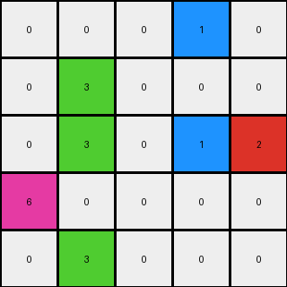

.. sidebar:: details

   :puzzle_id: 3-1e0a9b12
   :timestamp: 24.307.205622
   :call_count: 3

003 • History
=============

Begin puzzle: 3-1e0a9b12

**example_1**

**input**

.. code-block::

    [[0 4 0 9]
     [0 0 0 0]
     [0 4 6 0]
     [1 0 0 0]]

.. image:: _images/000-example_1_input.png
   :alt: _images/000-example_1_input.png

**output**

.. code-block::

    [[0 0 0 0]
     [0 0 0 0]
     [0 4 0 0]
     [1 4 6 9]]

.. image:: _images/000-example_1_output.png
   :alt: _images/000-example_1_output.png

**observations**

.. code-block:: yaml

   input:
     width: 4
     height: 4
     colors:
       - 0: 11
       - 1: 1
       - 4: 2
       - 6: 1
       - 9: 1
   objects:
     - two yellows (4) at (1,2) and (0,2)
     - magenta (6) at (2,2)
     - blue (1) at (0,0)
     - maroon (9) at (3,2)

   output:
     width: 4
     height: 4
     colors:
       - 0: 12
       - 1: 1
       - 4: 2
       - 6: 1
       - 9: 1
   objects:
     - two yellows (4) at (1,0) and (1,3)
     - magenta (6) at (2,3)
     - blue (1) at (0,3)
     - maroon (9) at (3,3)
   differences:
     cells_changed: 8
     colors_changed: none - same palette of colors in both
   transformation:
     - non-zero pixels shifted down and left to form horizontal line on bottom
     - color values appear to maintain relative order

**example_2**

**input**

.. code-block::

    [[0 0 0 0 0 9]
     [0 0 0 8 0 0]
     [0 0 0 0 0 0]
     [4 0 0 0 0 0]
     [4 0 7 8 0 0]
     [4 0 7 0 0 0]]

.. image:: _images/001-example_2_input.png
   :alt: _images/001-example_2_input.png

**output**

.. code-block::

    [[0 0 0 0 0 0]
     [0 0 0 0 0 0]
     [0 0 0 0 0 0]
     [4 0 0 0 0 0]
     [4 0 7 8 0 0]
     [4 0 7 8 0 9]]

.. image:: _images/001-example_2_output.png
   :alt: _images/001-example_2_output.png

**observations**

.. code-block:: yaml

   input:
     width: 6
     height: 6
     colors:
       - 0: 29
       - 4: 3
       - 7: 2
       - 8: 2
       - 9: 1
   objects:
     - three yellows (4) at (0,3), (0,4) and (0,5)
     - two oranges (7) at (2,4) and (2,5)
     - two azures (8) at (3,1) and (3,4)
     - maroon (9) at (5,0)

   output:
     width: 6
     height: 6
     colors:
       - 0: 28
       - 4: 3
       - 7: 2
       - 8: 2
       - 9: 1
   objects:
     - three yellows (4) at (0,3), (0,4) and (0,5)
     - two oranges (7) at (2,4) and (2,5)
     - two azures (8) at (3,4) and (3,5)
     - maroon (9) at (5,5)

   differences:
     cells_changed: 2
     colors_changed: none - same palette of colors in both
   transformation:
     - non-zero pixels shifted down and left to form horizontal line on bottom
     - duplicate pixels are removed (azure '8' from input (3,1))
     - color values appear to maintain relative order

**example_3**

**input**

.. code-block::

    [[0 0 0 1 0]
     [0 3 0 0 0]
     [0 3 0 1 2]
     [6 0 0 0 0]
     [0 3 0 0 0]]

**output**

.. code-block::

    [[0 0 0 0 0]
     [0 0 0 0 0]
     [0 3 0 0 0]
     [0 3 0 1 0]
     [6 3 0 1 2]]

.. image:: _images/002-example_3_output.png
   :alt: _images/002-example_3_output.png

**observations**

================================================================================

INSTRUCTIONS:

* review the example grids

* check for differences and patterns

.. seealso::

   - :doc:`003-prompt`
   - :doc:`003-response`

====

