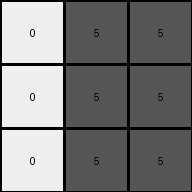

.. sidebar:: details

   :puzzle_id: 4-0d3d703e
   :timestamp: 24.307.205622
   :call_count: 10

010 • Prompt
============

**working output grid**

updated with your changes

.. code-block::

    [[0 5 5]
     [0 5 5]
     [0 5 5]]

INSTRUCTIONS:

* take a moment to review that the changes in the working output grid are in keeping with the rule

* use code_execution to investigate properties

.. seealso::

   - :doc:`010-history`
   - :doc:`010-response`

====

