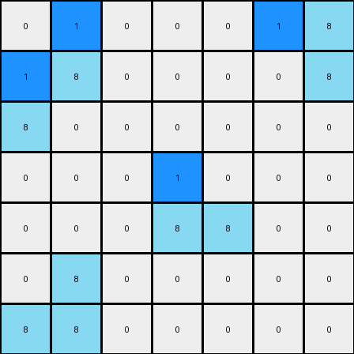

.. sidebar:: details

   :puzzle_id: 1-3aa6fb7a
   :timestamp: 24.327.173607
   :call_count: 14

014 • Prompt
============

**working output grid**

updated with your changes

.. code-block::

    [[0 1 0 0 0 1 8]
     [1 8 0 0 0 0 8]
     [8 0 0 0 0 0 0]
     [0 0 0 1 0 0 0]
     [0 0 0 8 8 0 0]
     [0 8 0 0 0 0 0]
     [8 8 0 0 0 0 0]]

INSTRUCTIONS:

* take a moment to review that the changes in the working output grid are in keeping with the rule

* use code_execution to investigate properties

.. seealso::

   - :doc:`014-history`
   - :doc:`014-response`

