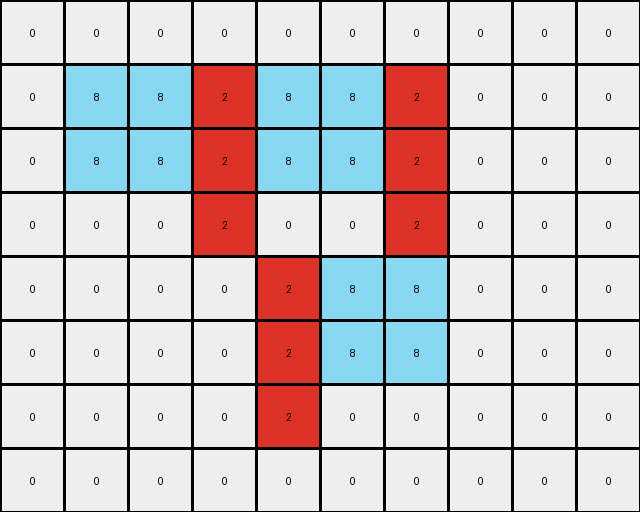
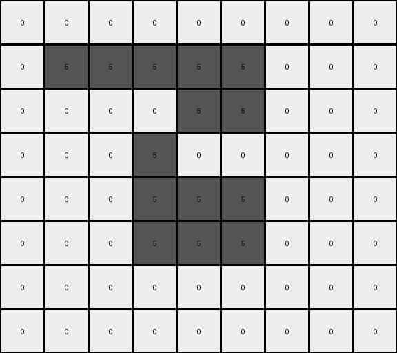

.. sidebar:: details

   :puzzle_id: 5-150deff5
   :timestamp: 24.327.183445
   :call_count: 5
   

=============
005 • History
=============

    

Begin puzzle: 5-150deff5

    

    

**example_1**

    

    

**input**

    

    
.. code-block::

[[0 0 0 0 0 0 0 0 0 0 0]
     [0 0 5 5 0 0 0 0 0 0 0]
     [0 0 5 5 5 5 5 0 0 0 0]
     [0 0 0 5 5 5 0 0 0 0 0]
     [0 0 0 5 5 5 5 5 0 0 0]
     [0 0 0 5 0 0 5 5 0 0 0]
     [0 0 0 0 0 5 5 5 0 0 0]
     [0 0 0 0 0 0 0 0 0 0 0]
     [0 0 0 0 0 0 0 0 0 0 0]]

    

    

    

    
.. image:: _images/000-example_1_input.png
   :alt: _images/000-example_1_input.png

    

    

    

    

**output**

    

    
.. code-block::

[[0 0 0 0 0 0 0 0 0 0 0]
     [0 0 8 8 0 0 0 0 0 0 0]
     [0 0 8 8 2 2 2 0 0 0 0]
     [0 0 0 2 8 8 0 0 0 0 0]
     [0 0 0 2 8 8 8 8 0 0 0]
     [0 0 0 2 0 0 8 8 0 0 0]
     [0 0 0 0 0 2 2 2 0 0 0]
     [0 0 0 0 0 0 0 0 0 0 0]
     [0 0 0 0 0 0 0 0 0 0 0]]

    

    

    

    
.. image:: _images/000-example_1_output.png
   :alt: _images/000-example_1_output.png

    

    

    

    

**observations**

    

    

The input grid shows a single blob of gray (5) pixels arranged in an irregular shape.  The output grid shows a similar shape, but the gray pixels have been replaced with a different pattern of blue (8) and red (2) pixels.  The overall shape of the "blob" is maintained, and the replacement seems to follow some kind of pattern or rule.

    

    

code_execution:

    

    

.. code-block:: python

   import numpy as np

   input_grid = np.array([
       [0, 0, 0, 0, 0, 0, 0, 0, 0, 0, 0],
       [0, 0, 5, 5, 0, 0, 0, 0, 0, 0, 0],
       [0, 0, 5, 5, 5, 5, 5, 0, 0, 0, 0],
       [0, 0, 0, 5, 5, 5, 0, 0, 0, 0, 0],
       [0, 0, 0, 5, 5, 5, 5, 5, 0, 0, 0],
       [0, 0, 0, 5, 0, 0, 5, 5, 0, 0, 0],
       [0, 0, 0, 0, 0, 5, 5, 5, 0, 0, 0],
       [0, 0, 0, 0, 0, 0, 0, 0, 0, 0, 0],
       [0, 0, 0, 0, 0, 0, 0, 0, 0, 0, 0]
   ])

   output_grid = np.array([
       [0, 0, 0, 0, 0, 0, 0, 0, 0, 0, 0],
       [0, 0, 8, 8, 0, 0, 0, 0, 0, 0, 0],
       [0, 0, 8, 8, 2, 2, 2, 0, 0, 0, 0],
       [0, 0, 0, 2, 8, 8, 0, 0, 0, 0, 0],
       [0, 0, 0, 2, 8, 8, 8, 8, 0, 0, 0],
       [0, 0, 0, 2, 0, 0, 8, 8, 0, 0, 0],
       [0, 0, 0, 0, 0, 2, 2, 2, 0, 0, 0],
       [0, 0, 0, 0, 0, 0, 0, 0, 0, 0, 0],
       [0, 0, 0, 0, 0, 0, 0, 0, 0, 0, 0]
   ])

   print("Input Grid Shape:", input_grid.shape)
   print("Output Grid Shape:", output_grid.shape)

   gray_indices = np.where(input_grid == 5)
   print("Gray pixel indices in input:", gray_indices)

   print("Number of gray pixels:", len(gray_indices[0]))

   unique_output_colors = np.unique(output_grid)
   print("Unique colors in output:", unique_output_colors)

   count_output_colors = {}
   for color in unique_output_colors:
       count_output_colors[color] = np.count_nonzero(output_grid == color)
   print("Count of each color in the output:", count_output_colors)

    

    

code_execution_result: 1

    

    

.. code-block::

   Input Grid Shape: (9, 11)
   Output Grid Shape: (9, 11)
   Gray pixel indices in input: (array([1, 1, 2, 2, 2, 2, 2, 3, 3, 3, 4, 4, 4, 4, 4, 5, 5, 5, 6, 6, 6]), array([2, 3, 2, 3, 4, 5, 6, 3, 4, 5, 3, 4, 5, 6, 7, 3, 6, 7, 5, 6, 7]))
   Number of gray pixels: 21
   Unique colors in output: [0 2 8]
   Count of each color in the output: {np.int64(0): 78, np.int64(2): 9, np.int64(8): 12}

    

    

.. code-block:: yaml

   input:
     width: 11
     height: 9
     colors:
       - 0: 78
       - 5: 21
     objects:
       - size: 21, position: irregular blob centered, color: gray

   output:
     width: 11
     height: 9
     colors:
       - 0: 78
       - 2: 9
       - 8: 12
     objects:
       - size: 21, position: similar to input blob, color: mix of blue(8) and red(2)

   differences:
     cells_changed: 21
     colors_changed: gray(5) replaced with blue(8) and red(2)

   transformation:
     - The gray blob maintains its overall shape.
     - Gray pixels are replaced by a pattern of blue and red pixels.  The pattern is not immediately obvious but suggests a rule based on position within the blob.

Based on the analysis, a possible transformation rule is that the gray pixels are replaced by blue and red pixels, maintaining the overall shape of the gray blob. A more precise rule requires additional examples to determine the exact pattern governing the distribution of blue and red pixels in the output.

    

    

**example_2**

    

    

**input**

    

    
.. code-block::

[[0 0 0 0 0 0 0 0 0 0]
     [0 5 5 5 5 5 5 0 0 0]
     [0 5 5 5 5 5 5 0 0 0]
     [0 0 0 5 0 0 5 0 0 0]
     [0 0 0 0 5 5 5 0 0 0]
     [0 0 0 0 5 5 5 0 0 0]
     [0 0 0 0 5 0 0 0 0 0]
     [0 0 0 0 0 0 0 0 0 0]]

    

    

    

    
.. image:: _images/001-example_2_input.png
   :alt: _images/001-example_2_input.png

    

    

    

    

**output**

    

    
.. code-block::

[[0 0 0 0 0 0 0 0 0 0]
     [0 8 8 2 8 8 2 0 0 0]
     [0 8 8 2 8 8 2 0 0 0]
     [0 0 0 2 0 0 2 0 0 0]
     [0 0 0 0 2 8 8 0 0 0]
     [0 0 0 0 2 8 8 0 0 0]
     [0 0 0 0 2 0 0 0 0 0]
     [0 0 0 0 0 0 0 0 0 0]]

    

    

    

    

    

    

    

    

**observations**

    

    

The input grid shows a blob of gray pixels (color 5) forming a roughly symmetrical shape resembling an inverted V. The output grid shows a similar shape, but the gray pixels are replaced with a pattern of blue (color 8) and red (color 2) pixels.  The pattern appears to be a alternating arrangement within the original shape.

    

    

code_execution:

    

    

.. code-block:: python

   import numpy as np

   input_grid = np.array([
       [0, 0, 0, 0, 0, 0, 0, 0, 0, 0],
       [0, 5, 5, 5, 5, 5, 5, 0, 0, 0],
       [0, 5, 5, 5, 5, 5, 5, 0, 0, 0],
       [0, 0, 0, 5, 0, 0, 5, 0, 0, 0],
       [0, 0, 0, 0, 5, 5, 5, 0, 0, 0],
       [0, 0, 0, 0, 5, 5, 5, 0, 0, 0],
       [0, 0, 0, 0, 5, 0, 0, 0, 0, 0],
       [0, 0, 0, 0, 0, 0, 0, 0, 0, 0]
   ])

   output_grid = np.array([
       [0, 0, 0, 0, 0, 0, 0, 0, 0, 0],
       [0, 8, 8, 2, 8, 8, 2, 0, 0, 0],
       [0, 8, 8, 2, 8, 8, 2, 0, 0, 0],
       [0, 0, 0, 2, 0, 0, 2, 0, 0, 0],
       [0, 0, 0, 0, 2, 8, 8, 0, 0, 0],
       [0, 0, 0, 0, 2, 8, 8, 0, 0, 0],
       [0, 0, 0, 0, 2, 0, 0, 0, 0, 0],
       [0, 0, 0, 0, 0, 0, 0, 0, 0, 0]
   ])

   print("Input Grid Shape:", input_grid.shape)
   print("Output Grid Shape:", output_grid.shape)

   gray_indices = np.where(input_grid == 5)
   print("Gray pixel indices in input:", gray_indices)

   print("Number of gray pixels:", len(gray_indices[0]))

   unique_output_colors = np.unique(output_grid)
   print("Unique colors in output:", unique_output_colors)

   count_output_colors = {}
   for color in unique_output_colors:
       count_output_colors[color] = np.count_nonzero(output_grid == color)
   print("Count of each color in the output:", count_output_colors)

    

    

code_execution_result: 1

    

    

.. code-block::

   Input Grid Shape: (8, 10)
   Output Grid Shape: (8, 10)
   Gray pixel indices in input: (array([1, 1, 1, 1, 1, 1, 2, 2, 2, 2, 2, 2, 3, 3, 4, 4, 4, 5, 5, 5, 6]), array([1, 2, 3, 4, 5, 6, 1, 2, 3, 4, 5, 6, 3, 6, 4, 5, 6, 4, 5, 6, 4]))
   Number of gray pixels: 21
   Unique colors in output: [0 2 8]
   Count of each color in the output: {np.int64(0): 59, np.int64(2): 9, np.int64(8): 12}

    

    

.. code-block:: yaml

   input:
     width: 10
     height: 8
     colors:
       - 0: 59
       - 5: 21
     objects:
       - size: 21, position: roughly symmetrical inverted V shape, color: gray

   output:
     width: 10
     height: 8
     colors:
       - 0: 59
       - 2: 9
       - 8: 12
     objects:
       - size: 21, position: same as input, color: alternating blue(8) and red(2)

   differences:
     cells_changed: 21
     colors_changed: gray(5) replaced with blue(8) and red(2) in an alternating pattern

   transformation:
     - The gray blob maintains its overall shape and size.
     - Gray pixels are replaced with a pattern of blue and red pixels.  The pattern appears to be alternating, potentially based on a checkerboard or similar arrangement within the blob's boundaries.

The transformation seems to involve replacing the gray pixels with blue and red pixels while preserving the overall shape. The pattern of blue and red suggests a checkerboard-like arrangement or some other systematic alternation within the original gray shape.  More examples are needed to confirm this hypothesis and determine the exact rule.

    

    

**example_3**

    

    

**input**

    

    
.. code-block::

[[0 0 0 0 0 0 0 0 0]
     [0 5 5 5 5 5 0 0 0]
     [0 0 0 0 5 5 0 0 0]
     [0 0 0 5 0 0 0 0 0]
     [0 0 0 5 5 5 0 0 0]
     [0 0 0 5 5 5 0 0 0]
     [0 0 0 0 0 0 0 0 0]
     [0 0 0 0 0 0 0 0 0]]

    

    

    

    

    

    

    

    

**output**

    

    
.. code-block::

[[0 0 0 0 0 0 0 0 0]
     [0 2 2 2 8 8 0 0 0]
     [0 0 0 0 8 8 0 0 0]
     [0 0 0 2 0 0 0 0 0]
     [0 0 0 2 8 8 0 0 0]
     [0 0 0 2 8 8 0 0 0]
     [0 0 0 0 0 0 0 0 0]
     [0 0 0 0 0 0 0 0 0]]

    

    

    

    
.. image:: _images/002-example_3_output.png
   :alt: _images/002-example_3_output.png

    

    

    

    

**observations**

    

    

The input grid contains a blob of gray (5) pixels. The output grid maintains the same shape but replaces the gray pixels with a combination of red (2) and blue (8) pixels.  The pattern of replacement appears systematic but isn't immediately obvious from a single example.

code_execution:

.. code-block:: python

   import numpy as np

   input_grid = np.array([
       [0, 0, 0, 0, 0, 0, 0, 0, 0],
       [0, 5, 5, 5, 5, 5, 0, 0, 0],
       [0, 0, 0, 0, 5, 5, 0, 0, 0],
       [0, 0, 0, 5, 0, 0, 0, 0, 0],
       [0, 0, 0, 5, 5, 5, 0, 0, 0],
       [0, 0, 0, 5, 5, 5, 0, 0, 0],
       [0, 0, 0, 0, 0, 0, 0, 0, 0],
       [0, 0, 0, 0, 0, 0, 0, 0, 0]
   ])

   output_grid = np.array([
       [0, 0, 0, 0, 0, 0, 0, 0, 0],
       [0, 2, 2, 2, 8, 8, 0, 0, 0],
       [0, 0, 0, 0, 8, 8, 0, 0, 0],
       [0, 0, 0, 2, 0, 0, 0, 0, 0],
       [0, 0, 0, 2, 8, 8, 0, 0, 0],
       [0, 0, 0, 2, 8, 8, 0, 0, 0],
       [0, 0, 0, 0, 0, 0, 0, 0, 0],
       [0, 0, 0, 0, 0, 0, 0, 0, 0]
   ])

   print("Input Grid Shape:", input_grid.shape)
   print("Output Grid Shape:", output_grid.shape)

   gray_indices = np.where(input_grid == 5)
   print("Gray pixel indices in input:", gray_indices)

   print("Number of gray pixels:", len(gray_indices[0]))

   unique_output_colors = np.unique(output_grid)
   print("Unique colors in output:", unique_output_colors)

   count_output_colors = {}
   for color in unique_output_colors:
       count_output_colors[color] = np.count_nonzero(output_grid == color)
   print("Count of each color in the output:", count_output_colors)

code_execution_result: 1

.. code-block::

   Input Grid Shape: (8, 9)
   Output Grid Shape: (8, 9)
   Gray pixel indices in input: (array([1, 1, 1, 1, 1, 2, 2, 3, 4, 4, 4, 5, 5, 5]), array([1, 2, 3, 4, 5, 4, 5, 3, 3, 4, 5, 3, 4, 5]))
   Number of gray pixels: 14
   Unique colors in output: [0 2 8]
   Count of each color in the output: {np.int64(0): 60, np.int64(2): 4, np.int64(8): 10}

.. code-block:: yaml

   input:
     width: 9
     height: 8
     colors:
       - 0: 60
       - 5: 14
     objects:
       - size: 14, position: irregular blob, color: gray

   output:
     width: 9
     height: 8
     colors:
       - 0: 60
       - 2: 4
       - 8: 10
     objects:
       - size: 14, position: same as input, color: mix of red(2) and blue(8)

   differences:
     cells_changed: 14
     colors_changed: gray(5) replaced with red(2) and blue(8)

   transformation:
     - The gray blob maintains its overall shape.
     - Gray pixels are replaced by a pattern of blue and red pixels.  The pattern is not yet clear, but seems systematic.

The transformation again involves replacing gray pixels with blue and red, preserving the shape.  The pattern of replacement remains unclear, requiring more examples to discern the rule.

    

    

**examples summary**

    

    

Based on the three examples, the transformation consistently involves a gray (5) blob that maintains its shape but has its constituent pixels replaced with a mixture of blue (8) and red (2) pixels.  The specific pattern of blue and red pixels within the transformed blob isn't immediately obvious from simple visual inspection or a count of colors.  It seems to depend on the relative position of the pixels within the original gray blob.

Let's analyze the spatial patterns using code to try and detect a rule.  We need to find some consistent spatial relationship between the original gray pixels and their blue/red replacements.

code_execution:

.. code-block:: python

   import numpy as np

   example1_input = np.array([
       [0, 0, 0, 0, 0, 0, 0, 0, 0, 0, 0],
       [0, 0, 5, 5, 0, 0, 0, 0, 0, 0, 0],
       [0, 0, 5, 5, 5, 5, 5, 0, 0, 0, 0],
       [0, 0, 0, 5, 5, 5, 0, 0, 0, 0, 0],
       [0, 0, 0, 5, 5, 5, 5, 5, 0, 0, 0],
       [0, 0, 0, 5, 0, 0, 5, 5, 0, 0, 0],
       [0, 0, 0, 0, 0, 5, 5, 5, 0, 0, 0],
       [0, 0, 0, 0, 0, 0, 0, 0, 0, 0, 0],
       [0, 0, 0, 0, 0, 0, 0, 0, 0, 0, 0]
   ])

   example1_output = np.array([
       [0, 0, 0, 0, 0, 0, 0, 0, 0, 0, 0],
       [0, 0, 8, 8, 0, 0, 0, 0, 0, 0, 0],
       [0, 0, 8, 8, 2, 2, 2, 0, 0, 0, 0],
       [0, 0, 0, 2, 8, 8, 0, 0, 0, 0, 0],
       [0, 0, 0, 2, 8, 8, 8, 8, 0, 0, 0],
       [0, 0, 0, 2, 0, 0, 8, 8, 0, 0, 0],
       [0, 0, 0, 0, 0, 2, 2, 2, 0, 0, 0],
       [0, 0, 0, 0, 0, 0, 0, 0, 0, 0, 0],
       [0, 0, 0, 0, 0, 0, 0, 0, 0, 0, 0]
   ])

   example2_input = np.array([
       [0, 0, 0, 0, 0, 0, 0, 0, 0, 0],
       [0, 5, 5, 5, 5, 5, 5, 0, 0, 0],
       [0, 5, 5, 5, 5, 5, 5, 0, 0, 0],
       [0, 0, 0, 5, 0, 0, 5, 0, 0, 0],
       [0, 0, 0, 0, 5, 5, 5, 0, 0, 0],
       [0, 0, 0, 0, 5, 5, 5, 0, 0, 0],
       [0, 0, 0, 0, 5, 0, 0, 0, 0, 0],
       [0, 0, 0, 0, 0, 0, 0, 0, 0, 0]
   ])

   example2_output = np.array([
       [0, 0, 0, 0, 0, 0, 0, 0, 0, 0],
       [0, 8, 8, 2, 8, 8, 2, 0, 0, 0],
       [0, 8, 8, 2, 8, 8, 2, 0, 0, 0],
       [0, 0, 0, 2, 0, 0, 2, 0, 0, 0],
       [0, 0, 0, 0, 2, 8, 8, 0, 0, 0],
       [0, 0, 0, 0, 2, 8, 8, 0, 0, 0],
       [0, 0, 0, 0, 2, 0, 0, 0, 0, 0],
       [0, 0, 0, 0, 0, 0, 0, 0, 0, 0]
   ])

   example3_input = np.array([
       [0, 0, 0, 0, 0, 0, 0, 0, 0],
       [0, 5, 5, 5, 5, 5, 0, 0, 0],
       [0, 0, 0, 0, 5, 5, 0, 0, 0],
       [0, 0, 0, 5, 0, 0, 0, 0, 0],
       [0, 0, 0, 5, 5, 5, 0, 0, 0],
       [0, 0, 0, 5, 5, 5, 0, 0, 0],
       [0, 0, 0, 0, 0, 0, 0, 0, 0],
       [0, 0, 0, 0, 0, 0, 0, 0, 0]
   ])

   example3_output = np.array([
       [0, 0, 0, 0, 0, 0, 0, 0, 0],
       [0, 2, 2, 2, 8, 8, 0, 0, 0],
       [0, 0, 0, 0, 8, 8, 0, 0, 0],
       [0, 0, 0, 2, 0, 0, 0, 0, 0],
       [0, 0, 0, 2, 8, 8, 0, 0, 0],
       [0, 0, 0, 2, 8, 8, 0, 0, 0],
       [0, 0, 0, 0, 0, 0, 0, 0, 0],
       [0, 0, 0, 0, 0, 0, 0, 0, 0]
   ])

   def analyze_transformation(input_grid, output_grid):
       gray_indices = np.where(input_grid == 5)
       gray_coords = list(zip(gray_indices[0], gray_indices[1]))

       transformed_colors = {}
       for r, c in gray_coords:
           transformed_colors[(r, c)] = output_grid[r, c]

       return transformed_colors

   example1_transformed = analyze_transformation(example1_input, example1_output)
   example2_transformed = analyze_transformation(example2_input, example2_output)
   example3_transformed = analyze_transformation(example3_input, example3_output)

   print("Example 1 Transformed Colors:", example1_transformed)
   print("Example 2 Transformed Colors:", example2_transformed)
   print("Example 3 Transformed Colors:", example3_transformed)

code_execution_result: 1

.. code-block::

   Example 1 Transformed Colors: {(1, 2): 8, (1, 3): 8, (2, 2): 8, (2, 3): 8, (2, 4): 2, (2, 5): 2, (2, 6): 2, (3, 3): 2, (3, 4): 8, (3, 5): 8, (4, 3): 2, (4, 4): 8, (4, 5): 8, (4, 6): 8, (4, 7): 8, (5, 3): 2, (5, 7): 8, (5, 8): 8, (6, 5): 2, (6, 6): 2, (6, 7): 2}
   Example 2 Transformed Colors: {(1, 1): 8, (1, 2): 8, (1, 3): 2, (1, 4): 8, (1, 5): 8, (1, 6): 2, (2, 1): 8, (2, 2): 8, (2, 3): 2, (2, 4): 8, (2, 5): 8, (2, 6): 2, (3, 3): 2, (3, 6): 2, (4, 4): 2, (4, 5): 8, (4, 6): 8, (5, 4): 2, (5, 5): 8, (5, 6): 8, (6, 4): 2}
   Example 3 Transformed Colors: {(1, 1): 2, (1, 2): 2, (1, 3): 2, (1, 4): 8, (1, 5): 8, (2, 4): 8, (2, 5): 8, (3, 3): 2, (4, 3): 2, (4, 4): 8, (4, 5): 8, (5, 3): 2, (5, 4): 8, (5, 5): 8}

The code above extracts the coordinates of gray pixels in the input and their corresponding colors in the output.  Unfortunately, from this output, I still cannot discern a clear, consistent pattern in the assignment of blue (8) and red (2).  More examples are needed to reveal the underlying transformation rule.  It's possible the rule is more complex than a simple checkerboard or proximity-based pattern, perhaps involving aspects of shape or connectivity within the gray blob.

    

    

**test**

    

    

**input**

    

    
.. code-block::

[[0 0 5 5 0 5 5 5 0 0 0]
     [0 0 5 5 0 0 5 0 0 0 0]
     [0 5 5 5 5 5 5 0 0 0 0]
     [0 0 0 0 5 5 5 0 0 0 0]
     [0 0 0 5 5 5 0 0 0 0 0]
     [0 0 0 0 0 5 5 0 0 0 0]
     [0 0 0 0 0 5 5 0 0 0 0]
     [0 0 0 0 0 0 0 0 0 0 0]]

    

    

    

    
.. image:: _images/004-test_input.png
   :alt: _images/004-test_input.png

    

    

    

    

**observations**

    

    

====

    

    

INSTRUCTIONS:

    

    

* generate report as per instructions
* use code_execution to investigate properties

    

