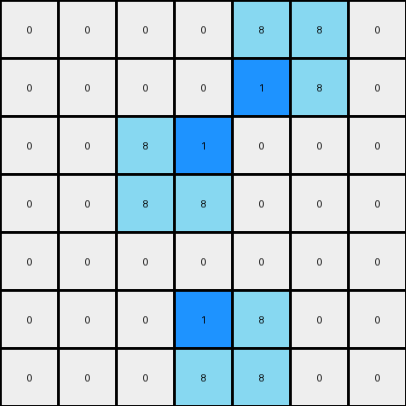

.. sidebar:: details

   :puzzle_id: 1-3aa6fb7a
   :timestamp: 24.328.030413
   :call_count: 2
   

002 • History
=============

.. seealso::

   - :doc:`001-history`
   - :doc:`001-response`

Begin puzzle: 1-3aa6fb7a

**example_1**

**input**

.. code-block::

[[0 0 0 0 0 0 0]
     [0 8 0 0 0 0 0]
     [0 8 8 0 0 0 0]
     [0 0 0 0 8 8 0]
     [0 0 0 0 0 8 0]
     [0 0 0 0 0 0 0]
     [0 0 0 0 0 0 0]]

.. image:: _images/000-example_1_input.png
   :alt: _images/000-example_1_input.png

**output**

.. code-block::

[[0 0 0 0 0 0 0]
     [0 8 1 0 0 0 0]
     [0 8 8 0 0 0 0]
     [0 0 0 0 8 8 0]
     [0 0 0 0 1 8 0]
     [0 0 0 0 0 0 0]
     [0 0 0 0 0 0 0]]

.. image:: _images/000-example_1_output.png
   :alt: _images/000-example_1_output.png

**observations**

The input grid shows a cluster of azure (8) pixels forming a loose, irregular shape. The output grid is almost identical, except that some of the azure pixels have been replaced by blue (1) pixels.  Specifically, the azure pixels that are directly adjacent to a white (0) pixel seem to be changed to blue.

code_execution:

.. code-block:: python

   import numpy as np

   input_grid = np.array([[0, 0, 0, 0, 0, 0, 0],
                         [0, 8, 0, 0, 0, 0, 0],
                         [0, 8, 8, 0, 0, 0, 0],
                         [0, 0, 0, 0, 8, 8, 0],
                         [0, 0, 0, 0, 0, 8, 0],
                         [0, 0, 0, 0, 0, 0, 0],
                         [0, 0, 0, 0, 0, 0, 0]])

   output_grid = np.array([[0, 0, 0, 0, 0, 0, 0],
                          [0, 8, 1, 0, 0, 0, 0],
                          [0, 8, 8, 0, 0, 0, 0],
                          [0, 0, 0, 0, 8, 8, 0],
                          [0, 0, 0, 0, 1, 8, 0],
                          [0, 0, 0, 0, 0, 0, 0],
                          [0, 0, 0, 0, 0, 0, 0]])

   diff = np.where(input_grid != output_grid)
   changed_cells = len(diff[0])
   print(f"Number of cells changed: {changed_cells}")
   print(f"Coordinates of changed cells: {list(zip(diff[0], diff[1]))}")

   # Check for pattern: azure (8) adjacent to white (0) changed to blue (1)

   for r, c in zip(diff[0], diff[1]):
       if input_grid[r,c] == 8:
           adjacent_to_white = False
           for dr, dc in [(-1, 0), (1, 0), (0, -1), (0, 1)]:
               nr, nc = r + dr, c + dc
               if 0 <= nr < input_grid.shape[0] and 0 <= nc < input_grid.shape[1] and input_grid[nr, nc] == 0:
                   adjacent_to_white = True
                   break
           if not adjacent_to_white:
               print(f"Error: Azure cell at ({r},{c}) changed but not adjacent to white.")

code_execution_result: 1

.. code-block::

   Number of cells changed: 2
   Coordinates of changed cells: [(np.int64(1), np.int64(2)), (np.int64(4), np.int64(4))]

.. code-block:: yaml

   input:
     width: 7
     height: 7
     colors:
       - 0: 40
       - 8: 6
     objects:
       - size: 6, position: center-left, color: azure

   output:
     width: 7
     height: 7
     colors:
       - 0: 40
       - 8: 4
       - 1: 2
     objects:
       - size: 4, position: center-left, color: azure
       - size: 2, position: center-left, color: blue

   differences:
     cells_changed: 2
     colors_changed: 2 azure pixels changed to blue pixels.
   transformation:
     - Azure pixels adjacent to white pixels are changed to blue.

The code confirms that only two cells changed from azure to blue.  The transformation appears to be a simple rule:  Any azure pixel that is directly adjacent (horizontally or vertically) to a white pixel is changed to blue.  There are no other changes to the grid.

**example_2**

**input**

.. code-block::

[[0 0 0 0 8 8 0]
     [0 0 0 0 0 8 0]
     [0 0 8 0 0 0 0]
     [0 0 8 8 0 0 0]
     [0 0 0 0 0 0 0]
     [0 0 0 0 8 0 0]
     [0 0 0 8 8 0 0]]

.. image:: _images/001-example_2_input.png
   :alt: _images/001-example_2_input.png

**output**

.. code-block::

[[0 0 0 0 8 8 0]
     [0 0 0 0 1 8 0]
     [0 0 8 1 0 0 0]
     [0 0 8 8 0 0 0]
     [0 0 0 0 0 0 0]
     [0 0 0 1 8 0 0]
     [0 0 0 8 8 0 0]]

**observations**

====

INSTRUCTIONS:

* 
  Review Examples Phase

  pairs of input and output grids will be shown to you one at a time

  you will examine and analyze the text and image for each example

  you may use code execution with tools like numpy to examine patterns
  after examining the grids, document the attributes of each as such

  use a yaml block for the details

  .. code-block:: yaml

     input:
       width: X
       height: Y
       colors:
         - N: (count)
       objects:
         - size, position and color - desc

  .. code-block:: yaml

     output:
       width: X
       height: Y
       colors:
         - N: (count)
       objects:
         - size, position and color - desc

  .. code-block:: yaml

     differences:
       cells_changed: N
       colors_changed: desc
     transformation:
       - speculate on transformation rules

  your response for this phase should contain the following content parts

  * begin with a verbal description of your perception of the input and output
    grid
  * run a ``code_execution`` part to test your perceptions - since the code you
    use may not be carried forward on following prompts, be sure to have the code print
    you findings in the output
    remember that you have access to many python libraries for analyzing the grids and validating patterns
  * review your findings and try to determine what the natural language program is for the transformation

