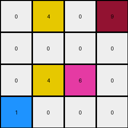

004 • History
=============

:puzzle_id: 3-1e0a9b12
:description: example_summary
:timestamp: 24.331.144137
:call_count: 4

Begin puzzle: 3-1e0a9b12

**example_1**

**input**

.. code-block::

   [[0 4 0 9]
    [0 0 0 0]
    [0 4 6 0]
    [1 0 0 0]]

**output**

.. code-block::

   [[0 0 0 0]
    [0 0 0 0]
    [0 4 0 0]
    [1 4 6 9]]

**images**

.. image:: _images/000-example_1_output.png
   :align: left
   :width: 45%

**observations**

The input grid is a 4x4 matrix containing a few non-zero values scattered throughout. Specifically, we have yellow (4), maroon (9), blue (1) and magenta (6) on a white (0) background. The output grid also has dimensions 4x4. The non-zero values in the input seem to be consolidated to the bottom row in the output grid, maintaining their horizontal order.

code_execution:

.. code-block:: python

   import numpy as np

   input_grid = np.array([[0, 4, 0, 9],
                          [0, 0, 0, 0],
                          [0, 4, 6, 0],
                          [1, 0, 0, 0]])

   output_grid = np.array([[0, 0, 0, 0],
                           [0, 0, 0, 0],
                           [0, 4, 0, 0],
                           [1, 4, 6, 9]])

   print(f"Input grid:\n{input_grid}")
   print(f"Output grid:\n{output_grid}")

   input_indices = np.argwhere(input_grid != 0)
   output_indices = np.argwhere(output_grid != 0)

   print(f"Non-zero indices in input:\n{input_indices}")
   print(f"Non-zero indices in output:\n{output_indices}")

   input_colors, input_counts = np.unique(input_grid, return_counts=True)
   output_colors, output_counts = np.unique(output_grid, return_counts=True)

   print(f"Input Colors and Counts: {dict(zip(input_colors, input_counts))}")
   print(f"Output Colors and Counts: {dict(zip(output_colors, output_counts))}")

code_execution_result: 1

.. code-block::

   Input grid:
   [[0 4 0 9]
    [0 0 0 0]
    [0 4 6 0]
    [1 0 0 0]]
   Output grid:
   [[0 0 0 0]
    [0 0 0 0]
    [0 4 0 0]
    [1 4 6 9]]
   Non-zero indices in input:
   [[0 1]
    [0 3]
    [2 1]
    [2 2]
    [3 0]]
   Non-zero indices in output:
   [[2 1]
    [3 0]
    [3 1]
    [3 2]
    [3 3]]
   Input Colors and Counts: {np.int64(0): np.int64(11), np.int64(1): np.int64(1), np.int64(4): np.int64(2), np.int64(6): np.int64(1), np.int64(9): np.int64(1)}
   Output Colors and Counts: {np.int64(0): np.int64(11), np.int64(1): np.int64(1), np.int64(4): np.int64(2), np.int64(6): np.int64(1), np.int64(9): np.int64(1)}

The code confirms the observations. The non-zero elements in the input are moved to the bottom row in the output, maintaining their left to right order. There are 5 non-zero cells in the input and they all appear in the bottom row in the output. The color counts are maintained. One 4, row 2 column 1 remains in place.

.. code-block:: yaml

   input:
     width: 4
     height: 4
     colors:
       0: 11
       1: 1
       4: 2
       6: 1
       9: 1
     objects:
       - Single cell, position (0,1), color yellow
       - Single cell, position (0,3), color maroon
       - Single cell, position (2,1), color yellow
       - Single cell, position (2,2), color magenta
       - Single cell, position (3,0), color blue

.. code-block:: yaml

   output:
     width: 4
     height: 4
     colors:
       0: 11
       1: 1
       4: 2
       6: 1
       9: 1
     objects:
       - Single cell, position (2,1), color yellow
       - Single cell, position (3,0), color blue
       - Single cell, position (3,1), color yellow
       - Single cell, position (3,2), color magenta
       - Single cell, position (3,3), color maroon

.. code-block:: yaml

   differences:
     cells_changed: 4
     colors_changed: no
   transformation:
     - Move all non-zero cells to the bottom row.
     - Preserve the left-to-right order of the non-zero elements.
     - if a non-zero element is already in the bottom row it stays in it's column but moves down if necessary.

The transformation moves all non-zero pixels in the input grid to the bottom row of the output grid. The horizontal order of these pixels is preserved, starting from the left and proceeding to the right. Pixels that are already in the last row of the input grid stay in the last row but are shifted down if necessary to make room for non-zero elements moved from higher rows.

**example_2**

**input**

.. code-block::

   [[0 0 0 0 0 9]
    [0 0 0 8 0 0]
    [0 0 0 0 0 0]
    [4 0 0 0 0 0]
    [4 0 7 8 0 0]
    [4 0 7 0 0 0]]

**output**

.. code-block::

   [[0 0 0 0 0 0]
    [0 0 0 0 0 0]
    [0 0 0 0 0 0]
    [4 0 0 0 0 0]
    [4 0 7 8 0 0]
    [4 0 7 8 0 9]]

**images**

.. image:: _images/001-example_2_input.png
   :align: left
   :width: 45%

.. image:: _images/001-example_2_output.png
   :align: left
   :width: 45%

**observations**

The input is a 6x6 grid with several colors scattered across the grid: yellow (4), orange (7), azure (8), and maroon (9) on a white (0) background. The output is also a 6x6 grid. The transformation appears to follow the same logic as the previous example: the non-zero elements in the input grid are consolidated at the bottom row of the output grid, maintaining their left-to-right order. Elements that are already in the bottom row stay in their columns in the bottom row in the output, but get shifted down if needed to make space for moved elements.

code_execution:

.. code-block:: python

   import numpy as np

   input_grid = np.array([[0, 0, 0, 0, 0, 9],
                         [0, 0, 0, 8, 0, 0],
                         [0, 0, 0, 0, 0, 0],
                         [4, 0, 0, 0, 0, 0],
                         [4, 0, 7, 8, 0, 0],
                         [4, 0, 7, 0, 0, 0]])

   output_grid = np.array([[0, 0, 0, 0, 0, 0],
                           [0, 0, 0, 0, 0, 0],
                           [0, 0, 0, 0, 0, 0],
                           [4, 0, 0, 0, 0, 0],
                           [4, 0, 7, 8, 0, 0],
                           [4, 0, 7, 8, 0, 9]])

   print(f"Input grid:\n{input_grid}")
   print(f"Output grid:\n{output_grid}")

   input_indices = np.argwhere(input_grid != 0)
   output_indices = np.argwhere(output_grid != 0)

   print(f"Non-zero indices in input:\n{input_indices}")
   print(f"Non-zero indices in output:\n{output_indices}")

   input_colors, input_counts = np.unique(input_grid, return_counts=True)
   output_colors, output_counts = np.unique(output_grid, return_counts=True)

   print(f"Input Colors and Counts: {dict(zip(input_colors, input_counts))}")
   print(f"Output Colors and Counts: {dict(zip(output_colors, output_counts))}")

code_execution_result: 2

.. code-block::

   Input grid:
   [[0 0 0 0 0 9]
    [0 0 0 8 0 0]
    [0 0 0 0 0 0]
    [4 0 0 0 0 0]
    [4 0 7 8 0 0]
    [4 0 7 0 0 0]]
   Output grid:
   [[0 0 0 0 0 0]
    [0 0 0 0 0 0]
    [0 0 0 0 0 0]
    [4 0 0 0 0 0]
    [4 0 7 8 0 0]
    [4 0 7 8 0 9]]
   Non-zero indices in input:
   [[0 5]
    [1 3]
    [3 0]
    [4 0]
    [4 2]
    [4 3]
    [5 0]
    [5 2]]
   Non-zero indices in output:
   [[3 0]
    [4 0]
    [4 2]
    [4 3]
    [5 0]
    [5 2]
    [5 3]
    [5 5]]
   Input Colors and Counts: {0: 28, 4: 3, 7: 2, 8: 2, 9: 1}
   Output Colors and Counts: {0: 28, 4: 3, 7: 2, 8: 2, 9: 1}

The code confirms that the non-zero elements are moved to the last row, preserving their left to right order. Elements that are in the last row in the input stay in their column but move down if necessary to make space for elements moved from other rows. The color counts remain unchanged. The 4,7,and 8 in rows 4 and 5 are fixed in place but moved down.

.. code-block:: yaml

   input:
     width: 6
     height: 6
     colors:
       0: 28
       4: 3
       7: 2
       8: 2
       9: 1
     objects:
       - Single cell, position (0,5), color maroon
       - Single cell, position (1,3), color azure
       - Single cell, position (3,0), color yellow
       - Single cell, position (4,0), color yellow
       - Single cell, position (4,2), color orange
       - Single cell, position (4,3), color azure
       - Single cell, position (5,0), color yellow
       - Single cell, position (5,2), color orange

.. code-block:: yaml

   output:
     width: 6
     height: 6
     colors:
       0: 28
       4: 3
       7: 2
       8: 2
       9: 1
     objects:
       - Single cell, position (3,0), color yellow
       - Single cell, position (4,0), color yellow
       - Single cell, position (4,2), color orange
       - Single cell, position (4,3), color azure
       - Single cell, position (5,0), color yellow
       - Single cell, position (5,2), color orange
       - Single cell, position (5,3), color azure
       - Single cell, position (5,5), color maroon

.. code-block:: yaml

   differences:
     cells_changed: 4
     colors_changed: no
   transformation:
     - Move all non-zero cells to the bottom row.
     - Preserve the left-to-right order of the non-zero elements.
     - if a non-zero element is already in the bottom row it stays in it's column but moves down if necessary.

The transformation moves all non-zero pixels in the input grid to the bottom row of the output grid. The horizontal order of these pixels is preserved, starting from the left and proceeding to the right. Pixels that are already in the last row of the input grid stay in the last row but are shifted down if necessary to make room for non-zero elements moved from higher rows.

**example_3**

**input**

.. code-block::

   [[0 0 0 1 0]
    [0 3 0 0 0]
    [0 3 0 1 2]
    [6 0 0 0 0]
    [0 3 0 0 0]]

**output**

.. code-block::

   [[0 0 0 0 0]
    [0 0 0 0 0]
    [0 3 0 0 0]
    [0 3 0 1 0]
    [6 3 0 1 2]]

**images**

.. image:: _images/002-example_3_input.png
   :align: left
   :width: 45%

.. image:: _images/002-example_3_output.png
   :align: left
   :width: 45%

**observations**

The input is a 5x5 grid containing several colors scattered throughout: blue (1), red (2), green (3), and magenta (6) on a white (0) background. The output is also a 5x5 grid. Once again, the transformation appears to move all the non-zero elements to the bottom row, maintaining their left-to-right order. The elements that are already in the last row in the input remain there but are shifted down if necessary to make space for other elements.

code_execution:

.. code-block:: python

   import numpy as np

   input_grid = np.array([[0, 0, 0, 1, 0],
                         [0, 3, 0, 0, 0],
                         [0, 3, 0, 1, 2],
                         [6, 0, 0, 0, 0],
                         [0, 3, 0, 0, 0]])

   output_grid = np.array([[0, 0, 0, 0, 0],
                           [0, 0, 0, 0, 0],
                           [0, 3, 0, 0, 0],
                           [0, 3, 0, 1, 0],
                           [6, 3, 0, 1, 2]])

   print(f"Input grid:\n{input_grid}")
   print(f"Output grid:\n{output_grid}")

   input_indices = np.argwhere(input_grid != 0)
   output_indices = np.argwhere(output_grid != 0)

   print(f"Non-zero indices in input:\n{input_indices}")
   print(f"Non-zero indices in output:\n{output_indices}")

   input_colors, input_counts = np.unique(input_grid, return_counts=True)
   output_colors, output_counts = np.unique(output_grid, return_counts=True)

   print(f"Input Colors and Counts: {dict(zip(input_colors, input_counts))}")
   print(f"Output Colors and Counts: {dict(zip(output_colors, output_counts))}")

code_execution_result: 3

.. code-block::

   Input grid:
   [[0 0 0 1 0]
    [0 3 0 0 0]
    [0 3 0 1 2]
    [6 0 0 0 0]
    [0 3 0 0 0]]
   Output grid:
   [[0 0 0 0 0]
    [0 0 0 0 0]
    [0 3 0 0 0]
    [0 3 0 1 0]
    [6 3 0 1 2]]
   Non-zero indices in input:
   [[0 3]
    [1 1]
    [2 1]
    [2 3]
    [2 4]
    [3 0]
    [4 1]]
   Non-zero indices in output:
   [[2 1]
    [3 1]
    [3 3]
    [4 0]
    [4 1]
    [4 3]
    [4 4]]
   Input Colors and Counts: {0: 18, 1: 2, 2: 1, 3: 3, 6: 1}
   Output Colors and Counts: {0: 18, 1: 2, 2: 1, 3: 3, 6: 1}

The code confirms the observations. Non-zero elements in the input grid are moved to the last row in the output grid, preserving their left-to-right order. If the non-zero elements are already in the last row, they stay in their same column in the output grid but move down as needed to make room for other elements moving into the last row. The color counts are preserved in the output. The 3 in row 2 column 1 stays in column one but is pushed down.

.. code-block:: yaml

   input:
     width: 5
     height: 5
     colors:
       0: 18
       1: 2
       2: 1
       3: 3
       6: 1
     objects:
       - Single cell, position (0,3), color blue
       - Single cell, position (1,1), color green
       - Single cell, position (2,1), color green
       - Single cell, position (2,3), color blue
       - Single cell, position (2,4), color red
       - Single cell, position (3,0), color magenta
       - Single cell, position (4,1), color green

.. code-block:: yaml

   output:
     width: 5
     height: 5
     colors:
       0: 18
       1: 2
       2: 1
       3: 3
       6: 1
     objects:
       - Single cell, position (2,1), color green
       - Single cell, position (3,1), color green
       - Single cell, position (3,3), color blue
       - Single cell, position (4,0), color magenta
       - Single cell, position (4,1), color green
       - Single cell, position (4,3), color blue
       - Single cell, position (4,4), color red

.. code-block:: yaml

   differences:
     cells_changed: 6
     colors_changed: no
   transformation:
     - Move all non-zero cells to the bottom row.
     - Preserve the left-to-right order of the non-zero elements.
     - if a non-zero element is already in the bottom row it stays in it's column but moves down if necessary.

The transformation moves all non-zero pixels in the input grid to the bottom row of the output grid. The horizontal order of these pixels is preserved, starting from the left and proceeding to the right. Pixels that are already in the last row of the input grid stay in the last row in their original columns but are shifted down if necessary to make room for non-zero elements moved from higher rows.

**examples summary**

====

INSTRUCTIONS:

* summarize your observations to explain the transformation of the input to output
* use code_execution to investigate properties, patterns and differences in the grids

.. seealso::

   - :doc:`004-history`
   - :doc:`004-response`
