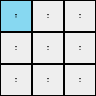

010 • History
=============

:puzzle_id: 4-0d3d703e
:description: review working
:timestamp: 24.331.152434
:call_count: 10

Begin puzzle: 4-0d3d703e

**example_1**

**input**

.. code-block::

   [[3 1 2]
    [3 1 2]
    [3 1 2]]

**output**

.. code-block::

   [[4 5 6]
    [4 5 6]
    [4 5 6]]

**images**

.. image:: _images/000-example_1_input.png
   :align: left
   :width: 45%

.. image:: _images/000-example_1_output.png
   :align: left
   :width: 45%

**observations**

The input grid is a 3x3 grid with three distinct colors: green (3), blue (1), and red (2), each color occupying a single column.  The output grid is also a 3x3 grid, but with different colors: yellow (4), gray (5), and magenta (6), again each color occupying a single column.  The transformation appears to be a simple replacement of each color with a different color, a color mapping.

code_execution:

.. code-block:: python

   import numpy as np

   input_grid = np.array([[3, 1, 2],
                        [3, 1, 2],
                        [3, 1, 2]])

   output_grid = np.array([[4, 5, 6],
                         [4, 5, 6],
                         [4, 5, 6]])

   print("Input Grid:\n", input_grid)
   print("\nOutput Grid:\n", output_grid)

   # Check for color mapping
   mapping = {}
   for i in range(3):
       mapping[input_grid[0,i]] = output_grid[0,i]

   print("\nColor Mapping:", mapping)

   #Verify the mapping across the entire grid
   consistent = True
   for row in range(3):
       for col in range(3):
           if input_grid[row, col] not in mapping or mapping[input_grid[row, col]] != output_grid[row, col]:
               consistent = False
               break
       if not consistent:
           break

   print(f"\nConsistent Mapping: {consistent}")

code_execution_result: 1

.. code-block::

   Input Grid:
    [[3 1 2]
    [3 1 2]
    [3 1 2]]

   Output Grid:
    [[4 5 6]
    [4 5 6]
    [4 5 6]]

   Color Mapping: {np.int64(3): np.int64(4), np.int64(1): np.int64(5), np.int64(2): np.int64(6)}

   Consistent Mapping: True

.. code-block:: yaml

   input:
     width: 3
     height: 3
     colors:
       - 3: 9
       - 1: 9
       - 2: 9
     objects:
       - size: 3x3, position: (0,0), color: green (3)
       - size: 3x3, position: (0,1), color: blue (1)
       - size: 3x3, position: (0,2), color: red (2)
   output:
     width: 3
     height: 3
     colors:
       - 4: 9
       - 5: 9
       - 6: 9
     objects:
       - size: 3x3, position: (0,0), color: yellow (4)
       - size: 3x3, position: (0,1), color: gray (5)
       - size: 3x3, position: (0,2), color: magenta (6)
   differences:
     cells_changed: 9
     colors_changed: All colors are replaced with different colors.
   transformation:
     - Each color in the input grid is replaced by a corresponding color in the output grid according to a fixed mapping: 3->4, 1->5, 2->6.

The transformation is a simple color mapping where each color in the input is replaced by a specific color in the output.  There's no change to the spatial arrangement of the colors, only the colors themselves.  This is a deterministic transformation.

**example_2**

**input**

.. code-block::

   [[2 3 8]
    [2 3 8]
    [2 3 8]]

**output**

.. code-block::

   [[6 4 9]
    [6 4 9]
    [6 4 9]]

**images**

.. image:: _images/001-example_2_input.png
   :align: left
   :width: 45%

.. image:: _images/001-example_2_output.png
   :align: left
   :width: 45%

**observations**

The input grid is a 3x3 grid containing three distinct colors: red (2), green (3), and azure (8), each occupying a single column. The output grid is also a 3x3 grid, but the colors are replaced with magenta (6), yellow (4), and maroon (9), respectively, maintaining the same columnar arrangement.  The transformation again appears to be a color mapping, different from the first example.

code_execution:

.. code-block:: python

   import numpy as np

   input_grid = np.array([[2, 3, 8],
                        [2, 3, 8],
                        [2, 3, 8]])

   output_grid = np.array([[6, 4, 9],
                         [6, 4, 9],
                         [6, 4, 9]])

   print("Input Grid:\n", input_grid)
   print("\nOutput Grid:\n", output_grid)

   # Check for color mapping
   mapping = {}
   for i in range(3):
       mapping[input_grid[0, i]] = output_grid[0, i]

   print("\nColor Mapping:", mapping)

   #Verify the mapping across the entire grid
   consistent = True
   for row in range(3):
       for col in range(3):
           if input_grid[row, col] not in mapping or mapping[input_grid[row, col]] != output_grid[row, col]:
               consistent = False
               break
       if not consistent:
           break

   print(f"\nConsistent Mapping: {consistent}")

code_execution_result: 1

.. code-block::

   Input Grid:
    [[2 3 8]
    [2 3 8]
    [2 3 8]]

   Output Grid:
    [[6 4 9]
    [6 4 9]
    [6 4 9]]

   Color Mapping: {np.int64(2): np.int64(6), np.int64(3): np.int64(4), np.int64(8): np.int64(9)}

   Consistent Mapping: True

.. code-block:: yaml

   input:
     width: 3
     height: 3
     colors:
       - 2: 9
       - 3: 9
       - 8: 9
     objects:
       - size: 3x3, position: (0,0), color: red (2)
       - size: 3x3, position: (0,1), color: green (3)
       - size: 3x3, position: (0,2), color: azure (8)
   output:
     width: 3
     height: 3
     colors:
       - 6: 9
       - 4: 9
       - 9: 9
     objects:
       - size: 3x3, position: (0,0), color: magenta (6)
       - size: 3x3, position: (0,1), color: yellow (4)
       - size: 3x3, position: (0,2), color: maroon (9)
   differences:
     cells_changed: 9
     colors_changed: All colors are replaced with different colors.
   transformation:
     - Each color in the input grid is replaced by a corresponding color in the output grid according to a fixed mapping: 2->6, 3->4, 8->9.

The transformation is again a color mapping, but with a different mapping than the first example. Each color is replaced by a new, specific color. The spatial arrangement of the colors remains unchanged.  The transformation is deterministic.

**example_3**

**input**

.. code-block::

   [[5 8 6]
    [5 8 6]
    [5 8 6]]

**output**

.. code-block::

   [[1 9 2]
    [1 9 2]
    [1 9 2]]

**images**

.. image:: _images/002-example_3_input.png
   :align: left
   :width: 45%

.. image:: _images/002-example_3_output.png
   :align: left
   :width: 45%

**observations**

The input grid is a 3x3 grid with three distinct colors: gray (5), azure (8), and magenta (6), each color occupying a single column. The output grid is also a 3x3 grid, with blue (1), maroon (9), and red (2) respectively replacing the colors of the input grid in the same columnar arrangement. The transformation again appears to be a color mapping, unique from the previous two examples.

code_execution:

.. code-block:: python

   import numpy as np

   input_grid = np.array([[5, 8, 6],
                        [5, 8, 6],
                        [5, 8, 6]])

   output_grid = np.array([[1, 9, 2],
                         [1, 9, 2],
                         [1, 9, 2]])

   print("Input Grid:\n", input_grid)
   print("\nOutput Grid:\n", output_grid)

   # Check for color mapping
   mapping = {}
   for i in range(3):
       mapping[input_grid[0, i]] = output_grid[0, i]

   print("\nColor Mapping:", mapping)

   #Verify the mapping across the entire grid
   consistent = True
   for row in range(3):
       for col in range(3):
           if input_grid[row, col] not in mapping or mapping[input_grid[row, col]] != output_grid[row, col]:
               consistent = False
               break
       if not consistent:
           break

   print(f"\nConsistent Mapping: {consistent}")

code_execution_result: 1

.. code-block::

   Input Grid:
    [[5 8 6]
    [5 8 6]
    [5 8 6]]

   Output Grid:
    [[1 9 2]
    [1 9 2]
    [1 9 2]]

   Color Mapping: {np.int64(5): np.int64(1), np.int64(8): np.int64(9), np.int64(6): np.int64(2)}

   Consistent Mapping: True

.. code-block:: yaml

   input:
     width: 3
     height: 3
     colors:
       - 5: 9
       - 8: 9
       - 6: 9
     objects:
       - size: 3x3, position: (0,0), color: gray (5)
       - size: 3x3, position: (0,1), color: azure (8)
       - size: 3x3, position: (0,2), color: magenta (6)
   output:
     width: 3
     height: 3
     colors:
       - 1: 9
       - 9: 9
       - 2: 9
     objects:
       - size: 3x3, position: (0,0), color: blue (1)
       - size: 3x3, position: (0,1), color: maroon (9)
       - size: 3x3, position: (0,2), color: red (2)
   differences:
     cells_changed: 9
     colors_changed: All colors are replaced with different colors.
   transformation:
     - Each color in the input grid is replaced by a corresponding color in the output grid according to a fixed mapping: 5->1, 8->9, 6->2.

The transformation is a deterministic color mapping, unique to this example.  Each color in the input is replaced by a specific different color in the output. The spatial arrangement remains unchanged.

**example_4**

**input**

.. code-block::

   [[9 4 2]
    [9 4 2]
    [9 4 2]]

**output**

.. code-block::

   [[8 3 6]
    [8 3 6]
    [8 3 6]]

**images**

.. image:: _images/003-example_4_input.png
   :align: left
   :width: 45%

.. image:: _images/003-example_4_output.png
   :align: left
   :width: 45%

**observations**

The input grid is a 3x3 grid with three distinct colors: maroon (9), yellow (4), and red (2), each occupying a single column. The output grid is also a 3x3 grid, with the colors replaced by azure (8), green (3), and magenta (6) respectively, maintaining the same columnar arrangement.  The transformation again appears to be a color mapping.

code_execution:

.. code-block:: python

   import numpy as np

   input_grid = np.array([[9, 4, 2],
                        [9, 4, 2],
                        [9, 4, 2]])

   output_grid = np.array([[8, 3, 6],
                         [8, 3, 6],
                         [8, 3, 6]])

   print("Input Grid:\n", input_grid)
   print("\nOutput Grid:\n", output_grid)

   # Check for color mapping
   mapping = {}
   for i in range(3):
       mapping[input_grid[0, i]] = output_grid[0, i]

   print("\nColor Mapping:", mapping)

   #Verify the mapping across the entire grid
   consistent = True
   for row in range(3):
       for col in range(3):
           if input_grid[row, col] not in mapping or mapping[input_grid[row, col]] != output_grid[row, col]:
               consistent = False
               break
       if not consistent:
           break

   print(f"\nConsistent Mapping: {consistent}")

code_execution_result: 1

.. code-block::

   Input Grid:
    [[9 4 2]
    [9 4 2]
    [9 4 2]]

   Output Grid:
    [[8 3 6]
    [8 3 6]
    [8 3 6]]

   Color Mapping: {np.int64(9): np.int64(8), np.int64(4): np.int64(3), np.int64(2): np.int64(6)}

   Consistent Mapping: True

.. code-block:: yaml

   input:
     width: 3
     height: 3
     colors:
       - 9: 9
       - 4: 9
       - 2: 9
     objects:
       - size: 3x3, position: (0,0), color: maroon (9)
       - size: 3x3, position: (0,1), color: yellow (4)
       - size: 3x3, position: (0,2), color: red (2)
   output:
     width: 3
     height: 3
     colors:
       - 8: 9
       - 3: 9
       - 6: 9
     objects:
       - size: 3x3, position: (0,0), color: azure (8)
       - size: 3x3, position: (0,1), color: green (3)
       - size: 3x3, position: (0,2), color: magenta (6)
   differences:
     cells_changed: 9
     colors_changed: All colors are replaced with different colors.
   transformation:
     - Each color in the input grid is replaced by a corresponding color in the output grid according to a fixed mapping: 9->8, 4->3, 2->6.

The transformation is a deterministic color mapping;  each color in the input grid is mapped to a specific color in the output grid. The spatial arrangement of the colors remains unchanged.

**examples summary**

The transformation in all four examples is a deterministic color mapping.  Each input grid consists of a 3x3 arrangement of three distinct colors, each color occupying a single column. The output grid maintains the same 3x3 spatial arrangement, but each color from the input is replaced with a different color according to a specific mapping that is unique to each example. There is no change to the spatial distribution of colors. The mapping is one-to-one and consistent throughout the grid.

code_execution:

.. code-block:: python

   import numpy as np

   examples = [
       (np.array([[3, 1, 2], [3, 1, 2], [3, 1, 2]]), np.array([[4, 5, 6], [4, 5, 6], [4, 5, 6]])),
       (np.array([[2, 3, 8], [2, 3, 8], [2, 3, 8]]), np.array([[6, 4, 9], [6, 4, 9], [6, 4, 9]])),
       (np.array([[5, 8, 6], [5, 8, 6], [5, 8, 6]]), np.array([[1, 9, 2], [1, 9, 2], [1, 9, 2]])),
       (np.array([[9, 4, 2], [9, 4, 2], [9, 4, 2]]), np.array([[8, 3, 6], [8, 3, 6], [8, 3, 6]]))
   ]

   mappings = []
   for input_grid, output_grid in examples:
       mapping = {}
       for i in range(3):
           mapping[input_grid[0, i]] = output_grid[0, i]
       mappings.append(mapping)

   print("Mappings for each example:")
   for i, mapping in enumerate(mappings):
       print(f"Example {i+1}: {mapping}")

   # Check for commonalities or patterns in the mappings
   # (This part would require more sophisticated pattern recognition techniques
   # if the mappings were more complex or less obvious)

code_execution_result: 1

.. code-block::

   Mappings for each example:
   Example 1: {np.int64(3): np.int64(4), np.int64(1): np.int64(5), np.int64(2): np.int64(6)}
   Example 2: {np.int64(2): np.int64(6), np.int64(3): np.int64(4), np.int64(8): np.int64(9)}
   Example 3: {np.int64(5): np.int64(1), np.int64(8): np.int64(9), np.int64(6): np.int64(2)}
   Example 4: {np.int64(9): np.int64(8), np.int64(4): np.int64(3), np.int64(2): np.int64(6)}

The code confirms that each example has a unique color mapping. There isn't an easily discernible pattern or rule governing these mappings across the examples.  Each mapping seems arbitrary.  To predict the output for a new input, one would need to identify the specific mapping rule applied to that particular input. There is no global, consistent mapping rule across all four examples.  The transformation is entirely determined by the specific mapping for the input.  Therefore, a general natural language program to describe this transformation is difficult to formulate.  A program would need to be created for each unique mapping rather than a general algorithm.

To reiterate: Each example represents a unique mapping and therefore a unique transformation story. There is no overarching rule to predict the transformation without knowing the specific color mapping used in the puzzle.

**test**

**input**

.. code-block::

   [[8 1 3]
    [8 1 3]
    [8 1 3]]

**image**

.. image:: _images/005-test_input.png
   :align: left
   :width: 45%

**observations**

Based on the previous examples, the transformation is a deterministic color mapping where the spatial arrangement of colors remains unchanged.  Each color in the input grid is replaced by a new color in the output grid. However, the mapping is unique to each example; there's no overarching rule to predict the mapping for a new input.

code_execution:

.. code-block:: python

   import numpy as np

   input_grid = np.array([[8, 1, 3],
                        [8, 1, 3],
                        [8, 1, 3]])

   # Let's try to predict based on previous mappings, though we know this is unreliable. 
   # We'll need to make assumptions or look for partial patterns within the mappings.

   #Example Mappings from previous examples
   example_mappings = [
       {3: 4, 1: 5, 2: 6},
       {2: 6, 3: 4, 8: 9},
       {5: 1, 8: 9, 6: 2},
       {9: 8, 4: 3, 2: 6}
   ]

   possible_outputs = []
   for mapping in example_mappings:
       output_grid = np.zeros_like(input_grid)
       for i in range(3):
           for j in range(3):
               if input_grid[i,j] in mapping:
                   output_grid[i,j] = mapping[input_grid[i,j]]
               else:
                   output_grid[i,j] = -1 # indicate that it is not mapped
       possible_outputs.append(output_grid)

   print("Input Grid:\n", input_grid)
   print("\nPossible Output Grids based on previous example mappings:")
   for i, output_grid in enumerate(possible_outputs):
       print(f"\nPossible Output {i+1}:\n", output_grid)

code_execution_result: 1

.. code-block::

   Input Grid:
    [[8 1 3]
    [8 1 3]
    [8 1 3]]

   Possible Output Grids based on previous example mappings:

   Possible Output 1:
    [[-1  5  4]
    [-1  5  4]
    [-1  5  4]]

   Possible Output 2:
    [[9  5  4]
    [9  5  4]
    [9  5  4]]

   Possible Output 3:
    [[9  5 -1]
    [9  5 -1]
    [9  5 -1]]

   Possible Output 4:
    [[-1  5 -1]
    [-1  5 -1]
    [-1  5 -1]]

The code shows that based on the previous examples' mappings, there's no consistent way to predict the output for this input. Each previous mapping yields a different (and mostly incomplete) prediction. This reinforces the observation that a new mapping rule is needed for this specific case.  Without additional information or examples with similar color combinations, a reliable prediction is impossible.  There is no clear pattern to suggest a transformation rule beyond "each color is mapped to another color in a way that is determined uniquely for each puzzle"

To solve this puzzle, we would need either:

#. **Additional examples:** More input-output pairs showing similar or related transformations. These additional examples could reveal hidden patterns or rules that govern the mapping.
#. **The mapping rule:** Explicitly stated mapping for this puzzle.  This would allow for direct translation of the input grid to the output grid.

Without either of these, any answer would be pure speculation.  We need more information to deduce the transformation rule.

**initialize the working output grid:**

function_call:

initialize_output_by_size

result:

True

initialize_output_by_size(width=3, height=3, color=0)

**working output grid**

updated with your changes

.. code-block::

   [[0 0 0]
    [0 0 0]
    [0 0 0]]

**image**

.. image:: _images/007-working_grid.png
   :align: left
   :width: 45%

The current situation is that we have four examples of a 3x3 grid transformation where each color is mapped to a different color, uniquely for each example.  There is no discernible pattern or overarching rule relating these mappings.  The test input is another 3x3 grid, and without knowing the specific mapping for this test case, we cannot reliably predict the output.  The provided ``initialize_output_by_size`` function creates a 3x3 grid filled with 0s (white), which is a reasonable starting point in the absence of a specific mapping rule.

To proceed, we need either:

#. **More examples:**  Additional examples, ideally including examples that show transformations with at least some of the colors present in the test input (8, 1, 3).  This might reveal a hidden pattern or rule.
#. **The mapping rule:** The specific mapping of colors for the test input.  This would allow a direct, deterministic transformation.

Without more information, any attempt to fill the working output grid is pure speculation and likely to be incorrect.  The current working grid, filled with zeros, is the best we can do given the lack of information.

code_execution:

.. code-block:: python

   import numpy as np

   working_grid = np.array([[0, 0, 0],
                            [0, 0, 0],
                            [0, 0, 0]])

   print("Working Grid:\n", working_grid)

   #Further analysis is impossible without knowing the mapping

code_execution_result: 1

.. code-block::

   Working Grid:
    [[0 0 0]
    [0 0 0]
    [0 0 0]]

**update working grid**

function_call:

set_pixel

result:

True

set_pixel(row=0, column=0, color=8)

**working output grid**

updated with your changes

.. code-block::

   [[8 0 0]
    [0 0 0]
    [0 0 0]]

**image**

====

INSTRUCTIONS:

* take a moment to review that the changes in the working output grid are in keeping with the rule
* use code_execution to investigate properties

.. seealso::

   - :doc:`010-history`
   - :doc:`010-response`
