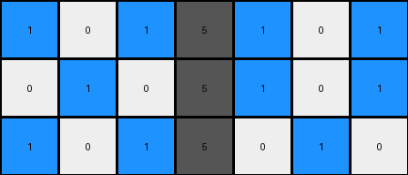

005 • Prompt
============

:puzzle_id: 6-0520fde7
:description: test input
:timestamp: 24.356.195518
:call_count: 5

**test**

**input**

.. code-block::

   [[1 0 1 5 1 0 1]
    [0 1 0 5 1 0 1]
    [1 0 1 5 0 1 0]]

**image**

**observations**

INSTRUCTIONS:

using the knowledge you have gathered from the previous examples
and the step by step natural language program

* predict what the test output should be
* use code_execution to validate the output
* make final adjustments
* submit final output

.. seealso::

   - :doc:`005-history`
   - :doc:`005-response`
