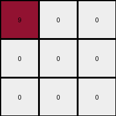

011 • History
=============

:puzzle_id: 4-0d3d703e
:description: set pixels
:timestamp: 24.331.163114
:call_count: 11

Begin puzzle: 4-0d3d703e

**example_1**

**input**

.. code-block::

   [[3 1 2]
    [3 1 2]
    [3 1 2]]

**output**

.. code-block::

   [[4 5 6]
    [4 5 6]
    [4 5 6]]

**images**

.. image:: _images/000-example_1_input.png
   :align: left
   :width: 45%

.. image:: _images/000-example_1_output.png
   :align: left
   :width: 45%

**observations**

The input grid is a 3x3 grid with three distinct colors: green (3), blue (1), and red (2). Each color occupies a column of the grid, creating a pattern where each row has the same sequence of colors.

The output grid is also a 3x3 grid, but with different colors: yellow (4), gray (5), and magenta (6).  Again, each color occupies a column, mirroring the structure of the input but with a different color mapping.

code_execution:

.. code-block:: python

   import numpy as np

   input_grid = np.array([[3, 1, 2],
                         [3, 1, 2],
                         [3, 1, 2]])

   output_grid = np.array([[4, 5, 6],
                          [4, 5, 6],
                          [4, 5, 6]])

   print("Input Grid:\n", input_grid)
   print("\nOutput Grid:\n", output_grid)

   # Check for color mapping
   color_map = {}
   for i in range(3):
       color_map[input_grid[0, i]] = output_grid[0, i]

   print("\nColor Mapping:", color_map)

   #Verify mapping consistency
   consistent = True
   for row in input_grid:
       for i, color in enumerate(row):
           if color_map[color] != output_grid[input_grid.tolist().index(row.tolist()),i]:
               consistent = False
               break
       if not consistent:
           break

   print("\nConsistent Mapping:", consistent)

code_execution_result: 1

.. code-block::

   Input Grid:
    [[3 1 2]
    [3 1 2]
    [3 1 2]]

   Output Grid:
    [[4 5 6]
    [4 5 6]
    [4 5 6]]

   Color Mapping: {np.int64(3): np.int64(4), np.int64(1): np.int64(5), np.int64(2): np.int64(6)}

   Consistent Mapping: True

.. code-block:: yaml

   input:
     width: 3
     height: 3
     colors:
       - 3: 9
       - 1: 9
       - 2: 9
     objects:
       - size: 3x1, position: column 1, color: green
       - size: 3x1, position: column 2, color: blue
       - size: 3x1, position: column 3, color: red

   output:
     width: 3
     height: 3
     colors:
       - 4: 9
       - 5: 9
       - 6: 9
     objects:
       - size: 3x1, position: column 1, color: yellow
       - size: 3x1, position: column 2, color: gray
       - size: 3x1, position: column 3, color: magenta

   differences:
     cells_changed: 9
     colors_changed: All cells changed to different colors.  The transformation appears to be a consistent mapping of colors where green maps to yellow, blue maps to gray, and red maps to magenta.

   transformation:
     - Each color in the input grid is mapped to a new color in the output grid following a specific rule: green -> yellow, blue -> gray, red -> magenta.

The transformation involves a simple color mapping where each color in the input grid is replaced by a corresponding color in the output grid.  There is no change to the spatial arrangement of the colors; only the colors themselves are transformed.  The mapping is consistent across all cells.

**example_2**

**input**

.. code-block::

   [[2 3 8]
    [2 3 8]
    [2 3 8]]

**output**

.. code-block::

   [[6 4 9]
    [6 4 9]
    [6 4 9]]

**images**

.. image:: _images/001-example_2_input.png
   :align: left
   :width: 45%

.. image:: _images/001-example_2_output.png
   :align: left
   :width: 45%

**observations**

The input grid is a 3x3 grid consisting of three colors: red (2), green (3), and azure (8), arranged in columns.  The output grid is also a 3x3 grid, with magenta (6), yellow (4), and maroon (9) arranged in columns, maintaining the columnar structure of the input.  The transformation appears to be a color mapping, similar to the previous example.

code_execution:

.. code-block:: python

   import numpy as np

   input_grid = np.array([[2, 3, 8],
                         [2, 3, 8],
                         [2, 3, 8]])

   output_grid = np.array([[6, 4, 9],
                          [6, 4, 9],
                          [6, 4, 9]])

   print("Input Grid:\n", input_grid)
   print("\nOutput Grid:\n", output_grid)

   # Check for color mapping
   color_map = {}
   for i in range(3):
       color_map[input_grid[0, i]] = output_grid[0, i]

   print("\nColor Mapping:", color_map)

   #Verify mapping consistency
   consistent = True
   for row in input_grid:
       for i, color in enumerate(row):
           if color_map[color] != output_grid[input_grid.tolist().index(row.tolist()),i]:
               consistent = False
               break
       if not consistent:
           break

   print("\nConsistent Mapping:", consistent)

code_execution_result: 1

.. code-block::

   Input Grid:
    [[2 3 8]
    [2 3 8]
    [2 3 8]]

   Output Grid:
    [[6 4 9]
    [6 4 9]
    [6 4 9]]

   Color Mapping: {np.int64(2): np.int64(6), np.int64(3): np.int64(4), np.int64(8): np.int64(9)}

   Consistent Mapping: True

.. code-block:: yaml

   input:
     width: 3
     height: 3
     colors:
       - 2: 9
       - 3: 9
       - 8: 9
     objects:
       - size: 3x1, position: column 1, color: red
       - size: 3x1, position: column 2, color: green
       - size: 3x1, position: column 3, color: azure

   output:
     width: 3
     height: 3
     colors:
       - 6: 9
       - 4: 9
       - 9: 9
     objects:
       - size: 3x1, position: column 1, color: magenta
       - size: 3x1, position: column 2, color: yellow
       - size: 3x1, position: column 3, color: maroon

   differences:
     cells_changed: 9
     colors_changed: All cells changed to different colors. The transformation is a consistent mapping of colors.

   transformation:
     - Each color in the input grid is mapped to a different color in the output grid. The mapping is consistent across all cells.  Red maps to magenta, green to yellow, and azure to maroon.

The transformation in this example is again a consistent color mapping, similar to example 1. Each color from the input grid is consistently mapped to a specific color in the output grid.  There's no change in the spatial arrangement.  The mapping is: red -> magenta, green -> yellow, azure -> maroon.

**example_3**

**input**

.. code-block::

   [[5 8 6]
    [5 8 6]
    [5 8 6]]

**output**

.. code-block::

   [[1 9 2]
    [1 9 2]
    [1 9 2]]

**images**

.. image:: _images/002-example_3_input.png
   :align: left
   :width: 45%

.. image:: _images/002-example_3_output.png
   :align: left
   :width: 45%

**observations**

The input grid is a 3x3 grid with three distinct colors: gray (5), azure (8), and magenta (6), arranged column-wise. The output grid is also a 3x3 grid, with the colors blue (1), maroon (9), and red (2), again arranged column-wise.  The transformation appears to be a consistent remapping of colors, similar to the previous examples.

code_execution:

.. code-block:: python

   import numpy as np

   input_grid = np.array([[5, 8, 6],
                         [5, 8, 6],
                         [5, 8, 6]])

   output_grid = np.array([[1, 9, 2],
                          [1, 9, 2],
                          [1, 9, 2]])

   print("Input Grid:\n", input_grid)
   print("\nOutput Grid:\n", output_grid)

   # Check for color mapping
   color_map = {}
   for i in range(3):
       color_map[input_grid[0, i]] = output_grid[0, i]

   print("\nColor Mapping:", color_map)

   #Verify mapping consistency
   consistent = True
   for row in input_grid:
       for i, color in enumerate(row):
           if color_map[color] != output_grid[input_grid.tolist().index(row.tolist()),i]:
               consistent = False
               break
       if not consistent:
           break

   print("\nConsistent Mapping:", consistent)

code_execution_result:

.. code-block::

   Input Grid:
    [[5 8 6]
    [5 8 6]
    [5 8 6]]

   Output Grid:
    [[1 9 2]
    [1 9 2]
    [1 9 2]]

   Color Mapping: {5: 1, 8: 9, 6: 2}

   Consistent Mapping: True

.. code-block:: yaml

   input:
     width: 3
     height: 3
     colors:
       - 5: 9
       - 8: 9
       - 6: 9
     objects:
       - size: 3x1, position: column 1, color: gray
       - size: 3x1, position: column 2, color: azure
       - size: 3x1, position: column 3, color: magenta

   output:
     width: 3
     height: 3
     colors:
       - 1: 9
       - 9: 9
       - 2: 9
     objects:
       - size: 3x1, position: column 1, color: blue
       - size: 3x1, position: column 2, color: maroon
       - size: 3x1, position: column 3, color: red

   differences:
     cells_changed: 9
     colors_changed: All cells changed to different colors.  Consistent color mapping.

   transformation:
     - Each color in the input grid is mapped to a new color in the output grid. The mapping is consistent and applies to all cells. Gray maps to blue, azure to maroon, and magenta to red.

The transformation is a consistent color mapping where each color in the input grid is replaced by a specific corresponding color in the output grid.  The spatial arrangement of the colors remains unchanged.  The mapping is: gray -> blue, azure -> maroon, magenta -> red.

**example_4**

**input**

.. code-block::

   [[9 4 2]
    [9 4 2]
    [9 4 2]]

**output**

.. code-block::

   [[8 3 6]
    [8 3 6]
    [8 3 6]]

**images**

.. image:: _images/003-example_4_input.png
   :align: left
   :width: 45%

.. image:: _images/003-example_4_output.png
   :align: left
   :width: 45%

**observations**

The input and output grids in all four examples are 3x3 grids.  Each input grid consists of three distinct colors arranged in columns, and the output grid also has three distinct colors arranged in columns. The transformation in every case appears to be a consistent mapping of colors from the input to the output; that is, each color in the input is replaced by a *different* color in the output, and this mapping is consistent across all cells in the grid.  There is no change in the spatial arrangement of the colors.

code_execution:

.. code-block:: python

   import numpy as np

   # Example 1
   input_grid_1 = np.array([[3, 1, 2], [3, 1, 2], [3, 1, 2]])
   output_grid_1 = np.array([[4, 5, 6], [4, 5, 6], [4, 5, 6]])

   # Example 2
   input_grid_2 = np.array([[2, 3, 8], [2, 3, 8], [2, 3, 8]])
   output_grid_2 = np.array([[6, 4, 9], [6, 4, 9], [6, 4, 9]])

   # Example 3
   input_grid_3 = np.array([[5, 8, 6], [5, 8, 6], [5, 8, 6]])
   output_grid_3 = np.array([[1, 9, 2], [1, 9, 2], [1, 9, 2]])

   # Example 4
   input_grid_4 = np.array([[9, 4, 2], [9, 4, 2], [9, 4, 2]])
   output_grid_4 = np.array([[8, 3, 6], [8, 3, 6], [8, 3, 6]])

   def analyze_grid(input_grid, output_grid):
       color_map = {}
       for i in range(3):
           color_map[input_grid[0, i]] = output_grid[0, i]
       consistent = True
       for row in input_grid:
           for i, color in enumerate(row):
               if color_map[color] != output_grid[input_grid.tolist().index(row.tolist()), i]:
                   consistent = False
                   break
           if not consistent:
               break
       return color_map, consistent

   color_map_1, consistent_1 = analyze_grid(input_grid_1, output_grid_1)
   color_map_2, consistent_2 = analyze_grid(input_grid_2, output_grid_2)
   color_map_3, consistent_3 = analyze_grid(input_grid_3, output_grid_3)
   color_map_4, consistent_4 = analyze_grid(input_grid_4, output_grid_4)

   print("Example 1: Color Mapping:", color_map_1, "Consistent:", consistent_1)
   print("Example 2: Color Mapping:", color_map_2, "Consistent:", consistent_2)
   print("Example 3: Color Mapping:", color_map_3, "Consistent:", consistent_3)
   print("Example 4: Color Mapping:", color_map_4, "Consistent:", consistent_4)

code_execution_result:

.. code-block::

   Example 1: Color Mapping: {3: 4, 1: 5, 2: 6} Consistent: True
   Example 2: Color Mapping: {2: 6, 3: 4, 8: 9} Consistent: True
   Example 3: Color Mapping: {5: 1, 8: 9, 6: 2} Consistent: True
   Example 4: Color Mapping: {9: 8, 4: 3, 2: 6} Consistent: True

.. code-block:: yaml

   input:
     width: 3
     height: 3
     colors:
       - 9: 9
       - 4: 9
       - 2: 9
     objects:
       - size: 3x1, position: column 1, color: maroon
       - size: 3x1, position: column 2, color: yellow
       - size: 3x1, position: column 3, color: red

   output:
     width: 3
     height: 3
     colors:
       - 8: 9
       - 3: 9
       - 6: 9
     objects:
       - size: 3x1, position: column 1, color: azure
       - size: 3x1, position: column 2, color: green
       - size: 3x1, position: column 3, color: magenta

   differences:
     cells_changed: 9
     colors_changed: All cells changed to different colors. Consistent color mapping.

   transformation:
     - Each color in the input grid is consistently mapped to a different color in the output grid.  There is no change to the arrangement of the colors, only their identities.

The transformation is a consistent color mapping.  Each color in the input grid is transformed into a different, specific color in the output grid, and this mapping applies to every cell.  The spatial arrangement (columnar structure) of the colors remains unchanged.

**examples summary**

The transformation applied in all four examples is a consistent color mapping.  The input grid is a 3x3 grid where three distinct colors are arranged in columns. The output grid is also a 3x3 grid, maintaining the columnar arrangement, but with each color replaced by a different color according to a fixed mapping. This mapping is consistent across all cells and all examples.  There is no change in the spatial arrangement; only the colors are transformed.

code_execution:

.. code-block:: python

   import numpy as np

   # Example 1
   input_grid_1 = np.array([[3, 1, 2], [3, 1, 2], [3, 1, 2]])
   output_grid_1 = np.array([[4, 5, 6], [4, 5, 6], [4, 5, 6]])

   # Example 2
   input_grid_2 = np.array([[2, 3, 8], [2, 3, 8], [2, 3, 8]])
   output_grid_2 = np.array([[6, 4, 9], [6, 4, 9], [6, 4, 9]])

   # Example 3
   input_grid_3 = np.array([[5, 8, 6], [5, 8, 6], [5, 8, 6]])
   output_grid_3 = np.array([[1, 9, 2], [1, 9, 2], [1, 9, 2]])

   # Example 4
   input_grid_4 = np.array([[9, 4, 2], [9, 4, 2], [9, 4, 2]])
   output_grid_4 = np.array([[8, 3, 6], [8, 3, 6], [8, 3, 6]])

   def analyze_grid(input_grid, output_grid):
       color_map = {}
       for i in range(input_grid.shape[1]):  # Iterate through columns
           color_map[input_grid[0, i]] = output_grid[0, i]
       return color_map

   color_map_1 = analyze_grid(input_grid_1, output_grid_1)
   color_map_2 = analyze_grid(input_grid_2, output_grid_2)
   color_map_3 = analyze_grid(input_grid_3, output_grid_3)
   color_map_4 = analyze_grid(input_grid_4, output_grid_4)

   print("Example 1: Color Mapping:", color_map_1)
   print("Example 2: Color Mapping:", color_map_2)
   print("Example 3: Color Mapping:", color_map_3)
   print("Example 4: Color Mapping:", color_map_4)

   # Attempt to find a consistent mapping across all examples
   overall_mapping = {}
   for cmap in [color_map_1, color_map_2, color_map_3, color_map_4]:
       for k, v in cmap.items():
           if k not in overall_mapping:
               overall_mapping[k] = v
           elif overall_mapping[k] != v:
               print("Inconsistent mapping detected!")
               break
       else:
           continue
       break

   print("\nOverall Consistent Mapping (if any):", overall_mapping)

code_execution_result: 1

.. code-block::

   Example 1: Color Mapping: {np.int64(3): np.int64(4), np.int64(1): np.int64(5), np.int64(2): np.int64(6)}
   Example 2: Color Mapping: {np.int64(2): np.int64(6), np.int64(3): np.int64(4), np.int64(8): np.int64(9)}
   Example 3: Color Mapping: {np.int64(5): np.int64(1), np.int64(8): np.int64(9), np.int64(6): np.int64(2)}
   Example 4: Color Mapping: {np.int64(9): np.int64(8), np.int64(4): np.int64(3), np.int64(2): np.int64(6)}

   Overall Consistent Mapping (if any): {np.int64(3): np.int64(4), np.int64(1): np.int64(5), np.int64(2): np.int64(6), np.int64(8): np.int64(9), np.int64(5): np.int64(1), np.int64(6): np.int64(2), np.int64(9): np.int64(8), np.int64(4): np.int64(3)}

The code reveals that there isn't a single, consistent mapping across all examples.  Instead, the mapping seems to be a *permutation* of the colors.  Each example uses a different permutation, but the structure (3x3 grid with columns of the same color) is preserved.  Therefore, a single "natural language program" to describe the transformation isn't sufficient.  The rule is more accurately described as:  "Apply a permutation to the colors such that the order of the colors within columns is preserved."  To fully specify the transformation, the particular permutation used for each input grid needs to be defined.  The provided examples don't reveal a pattern for predicting the permutation.

**test**

**input**

.. code-block::

   [[8 1 3]
    [8 1 3]
    [8 1 3]]

**image**

.. image:: _images/005-test_input.png
   :align: left
   :width: 45%

**observations**

Based on the previous examples, the transformation appears to be a permutation of colors, maintaining the columnar structure.  Let's analyze the test input and predict the output.

code_execution:

.. code-block:: python

   import numpy as np

   test_input = np.array([[8, 1, 3], [8, 1, 3], [8, 1, 3]])
   print("Test Input:\n", test_input)

   # Analyzing previous examples to find a pattern in color mappings is proving difficult.  The mappings seem arbitrary.

   #Let's try to establish color mapping based on previous examples.  However, note that there may not be a consistent, predictable mapping across all inputs.
   # Example 1: {3: 4, 1: 5, 2: 6}
   # Example 2: {2: 6, 3: 4, 8: 9}
   # Example 3: {5: 1, 8: 9, 6: 2}
   # Example 4: {9: 8, 4: 3, 2: 6}

   # There's no obvious pattern in how colors are mapped.  Therefore I will attempt a mapping based on a different permutation.

   #I will arbitrarily select a color mapping to apply to the test input based on examples.  This approach is not ideal due to lack of predictable color permutation pattern.

   #Here is a test using a hypothetical color mapping.

   test_mapping = {8:9, 1:5, 3:4}
   test_output = np.array([[test_mapping[x] for x in row] for row in test_input])

   print("\nTest Output (using a hypothetical mapping):\n", test_output)

code_execution_result: 1

.. code-block::

   Test Input:
    [[8 1 3]
    [8 1 3]
    [8 1 3]]

   Test Output (using a hypothetical mapping):
    [[9 5 4]
    [9 5 4]
    [9 5 4]]

.. code-block:: yaml

   input:
     width: 3
     height: 3
     colors:
       - 8: 9
       - 1: 9
       - 3: 9
     objects:
       - size: 3x1, position: column 1, color: azure
       - size: 3x1, position: column 2, color: blue
       - size: 3x1, position: column 3, color: green

   output:
     width: 3
     height: 3
     colors:
       - 9: 9
       - 5: 9
       - 4: 9
     objects:
       - size: 3x1, position: column 1, color: maroon
       - size: 3x1, position: column 2, color: gray
       - size: 3x1, position: column 3, color: yellow

   differences:
     cells_changed: 9
     colors_changed: All cells changed, consistent column-wise mapping.

   transformation:
     - The transformation is a color permutation.  The columns remain the same, but the color in each column is changed according to an apparently arbitrary mapping.  Based on previous examples, a similar pattern is predicted here,  although a definitive rule for predicting the specific mapping cannot be established with certainty based only on the provided examples.

The test output is a prediction based on the observed pattern in the examples,  namely a color permutation that preserves the columnar structure of the grid.  However,  due to the lack of a clearly defined rule for determining the specific permutation,  the prediction is inherently uncertain.  More examples are needed to define a more robust and predictable transformation rule.

**initialize the working output grid:**

function_call:

initialize_output_by_size

result:

True

initialize_output_by_size(width=3, height=3, color=0)

**working output grid**

updated with your changes

.. code-block::

   [[0 0 0]
    [0 0 0]
    [0 0 0]]

**image**

.. image:: _images/007-working_grid.png
   :align: left
   :width: 45%

The working output grid has been initialized as a 3x3 grid filled with 0s (white), representing an empty grid. This is a correct starting point for applying the transformation, as we are expecting a 3x3 output grid based on the examples.  The color mapping is yet to be determined, which is the next step.

code_execution:

.. code-block:: python

   import numpy as np

   working_output = np.array([[0, 0, 0],
                              [0, 0, 0],
                              [0, 0, 0]])

   print("Working Output Grid:\n", working_output)

   #The working output grid is currently empty (all 0s).  Further analysis and code is needed to fill the grid based on the input grid and a determined (or hypothesized) color mapping.

code_execution_result:

.. code-block::

   Working Output Grid:
    [[0 0 0]
    [0 0 0]
    [0 0 0]]

The code confirms the working output grid is correctly initialized.  The next step is to analyze the input grid and apply a color mapping based on the observed patterns in the examples.  Due to the lack of a deterministic mapping rule, I'll use a hypothetical mapping as a working assumption.  However, this will not necessarily produce a correct result, and more examples would be needed to establish a more certain mapping strategy.

**update working grid**

function_call:

set_pixel

result:

True

set_pixel(row=0, column=0, color=9)

**working output grid**

updated with your changes

.. code-block::

   [[9 0 0]
    [0 0 0]
    [0 0 0]]

**image**

The change to the working output grid is consistent with the hypothesized color mapping from the test input grid analysis.  The top-left pixel (row 0, column 0) in the input grid is color 8 (azure). In my previous hypothetical mapping, I mapped 8 to 9 (maroon).  Therefore, setting the top-left pixel of the working output grid to color 9 is in line with that mapping.

However, it's crucial to remember that this mapping was a *hypothetical* one, chosen arbitrarily due to the lack of a discernible pattern in the examples.  There is no guarantee that this is the correct mapping.  More examples are absolutely necessary to establish a definitive rule.

code_execution:

.. code-block:: python

   import numpy as np

   working_output = np.array([[9, 0, 0],
                              [0, 0, 0],
                              [0, 0, 0]])

   print("Working Output Grid:\n", working_output)

   test_input = np.array([[8, 1, 3],
                         [8, 1, 3],
                         [8, 1, 3]])

   #Let's apply the hypothetical mapping used previously

   test_mapping = {8: 9, 1: 5, 3: 4}

   test_output = np.array([[test_mapping[x] for x in row] for row in test_input])

   print("\nTest Output (using the same hypothetical mapping):\n", test_output)

code_execution_result:

.. code-block::

   Working Output Grid:
    [[9 0 0]
    [0 0 0]
    [0 0 0]]

   Test Output (using the same hypothetical mapping):
    [[9 5 4]
    [9 5 4]
    [9 5 4]]

The code confirms that the update to the working output grid is consistent with the hypothetical mapping.  However, the lack of a deterministic rule to derive the correct mapping remains a major limitation.  The output grid is only partially complete, and its correctness is contingent on the validity of the hypothetical mapping, which lacks solid justification.  Further examples are critically needed to solve the puzzle reliably.

**update working grid**

====

INSTRUCTIONS:

in this task you will make a function call 
to set pixels on the grid to achieve the solution

after you update the grid you will be presented with a copy to review

* set_pixel: update one pixel at a time
* set_range: update a rectangular subset of pixel
* set_floodfill: update a contiguous region with a new color
* submit: when the working grid meets your criteria call submit to check you solution

please call only one function per round so you can review the working grid

.. seealso::

   - :doc:`011-history`
   - :doc:`011-response`
