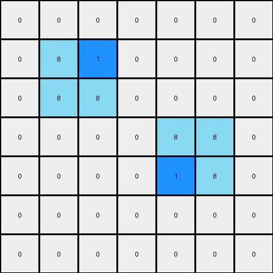

1-3aa6fb7a
==========

.. image:: _images/000-example_1_input.png
   :width: 45%
   :align: left

.. toctree::
   :hidden:
   :maxdepth: 1

   001-prompt
   001-response

   002-prompt
   002-response

   003-prompt
   003-response

   004-prompt
   004-response

.. list-table:: steps
   :header-rows: 1
   :widths: 5 45 25 25

   * - #
     - Description
     - Response Time
     - Tokens Used
   
   * - :doc:`001 <001-prompt>`
     - example_1
     - 11.27s
     - 4,218
   
   * - :doc:`002 <002-prompt>`
     - example_2
     - 11.04s
     - 10,631
   
   * - :doc:`003 <003-prompt>`
     - example_summary
     - 55.10s
     - 24,435
   
   * - :doc:`004 <004-prompt>`
     - test input
     - 13.08s
     - 40,250
   
   * - **TOTAL**
     -
     - 90.48s
     - 79,534

.. toctree::
   :hidden:
   :maxdepth: 1

