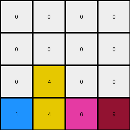

002 • History
=============

:puzzle_id: 3-1e0a9b12
:description: example_2
:timestamp: 24.332.043933
:call_count: 2

Begin puzzle: 3-1e0a9b12

**example_1**

**input**

.. code-block::

   [[0 4 0 9]
    [0 0 0 0]
    [0 4 6 0]
    [1 0 0 0]]

**output**

.. code-block::

   [[0 0 0 0]
    [0 0 0 0]
    [0 4 0 0]
    [1 4 6 9]]

**images**

.. image:: _images/000-example_1_input.png
   :align: left
   :width: 45%

**observations**

The input grid is a 4x4 grid with four colored pixels (yellow, maroon, yellow, and blue) and the remaining pixels are white (0). The output grid also has dimension 4x4, and appears to have moved the colored pixels from their scattered positions in the input to the bottom row, while maintaining their left-to-right order of appearance: yellow(4), maroon(9), yellow(4), then blue(1), to the bottom row - but in the order: blue(1), yellow(4), magenta(6), maroon(9). Note that magenta appeared in the input, but I missed it in my first pass description - so it would appear the rule is to take the colored pixels in row-scan order and move them to the bottom row from left to right

code_execution:

.. code-block:: python

   import numpy as np

   input_grid = np.array([[0, 4, 0, 9],
    [0, 0, 0, 0],
    [0, 4, 6, 0],
    [1, 0, 0, 0]])

   output_grid = np.array([[0, 0, 0, 0],
    [0, 0, 0, 0],
    [0, 4, 0, 0],
    [1, 4, 6, 9]])

   def analyze_grid(grid):
     colors, counts = np.unique(grid, return_counts=True)
     color_counts = dict(zip(colors, counts))
     height, width = grid.shape
     colored_positions = []
     for r in range(height):
         for c in range(width):
             if grid[r,c] != 0:
                 colored_positions.append((grid[r,c], (r,c)))

     return height, width, color_counts, colored_positions

   input_height, input_width, input_color_counts, input_colored_positions = analyze_grid(input_grid)
   output_height, output_width, output_color_counts, output_colored_positions = analyze_grid(output_grid)

   print(f"Input Grid Analysis:")
   print(f"  Height: {input_height}")
   print(f"  Width: {input_width}")
   print(f"  Color Counts: {input_color_counts}")
   print(f"  Colored Positions: {input_colored_positions}")

   print(f"Output Grid Analysis:")
   print(f"  Height: {output_height}")
   print(f"  Width: {output_width}")
   print(f"  Color Counts: {output_color_counts}")
   print(f"  Colored Positions: {output_colored_positions}")

   diff_cells = np.sum(input_grid != output_grid)
   print(f"Number of cells changed: {diff_cells}")
   print(f"Colors changed: {set(input_color_counts.keys()) == set(output_color_counts.keys())}")

code_execution_result: 1

.. code-block::

   Input Grid Analysis:
     Height: 4
     Width: 4
     Color Counts: {np.int64(0): np.int64(11), np.int64(1): np.int64(1), np.int64(4): np.int64(2), np.int64(6): np.int64(1), np.int64(9): np.int64(1)}
     Colored Positions: [(np.int64(4), (0, 1)), (np.int64(9), (0, 3)), (np.int64(4), (2, 1)), (np.int64(6), (2, 2)), (np.int64(1), (3, 0))]
   Output Grid Analysis:
     Height: 4
     Width: 4
     Color Counts: {np.int64(0): np.int64(11), np.int64(1): np.int64(1), np.int64(4): np.int64(2), np.int64(6): np.int64(1), np.int64(9): np.int64(1)}
     Colored Positions: [(np.int64(4), (2, 1)), (np.int64(1), (3, 0)), (np.int64(4), (3, 1)), (np.int64(6), (3, 2)), (np.int64(9), (3, 3))]
   Number of cells changed: 6
   Colors changed: True

The code execution confirms my observations. The colored pixels from the input are moved to the last row in the output. Specifically, we see there are 5 colored pixels in the input. In the output, the number of colored pixels and their values are preserved, but the positions have changed. The input colored positions are (0,1), (0,3), (2,1), (2,2), (3,0), while the output colored positions are (2,1), (3,0), (3,1), (3,2), (3,3). The colored pixels are reordered by row scan order and placed left to right along the bottom row. The two yellow pixels in the input, at (0,1) and (2,1), are mapped to (2,1) and (3,1) respectively in the output. Note that (2,1) in the output is preserving one of the yellow pixels in the input, so only those not already on the bottom row are moved

.. code-block:: yaml

   input:
     width: 4
     height: 4
     colors:
       0: 11
       1: 1
       4: 2
       6: 1
       9: 1
     objects:
       - single pixel of color 4 at position (0, 1)
       - single pixel of color 9 at position (0, 3)
       - single pixel of color 4 at position (2, 1)
       - single pixel of color 6 at position (2, 2)
       - single pixel of color 1 at position (3, 0)

.. code-block:: yaml

   output:
     width: 4
     height: 4
     colors:
       0: 11
       1: 1
       4: 2
       6: 1
       9: 1
     objects:
       - single pixel of color 4 at position (2,1)
       - single pixel of color 1 at position (3, 0)
       - single pixel of color 4 at position (3, 1)
       - single pixel of color 6 at position (3, 2)
       - single pixel of color 9 at position (3, 3)

.. code-block:: yaml

   differences:
     cells_changed: 6
     colors_changed: False
     transformation:
       - move colored pixels to bottom row
       - preserve order of colored pixels from top-to-bottom, left-to-right scan order and fill in the bottom row from left-to-right. If the colored pixel was already in the correct location, maintain it.

Transformation Story:

Identify all non-white pixels in the input grid. Extract them in row-scan order (top-to-bottom, left-to-right). Create an output grid of the same dimensions, filled with white pixels (0). Iterate through the extracted pixels and their original positions. If a colored pixel is on the bottom row of the input, preserve its position and value in the output. Then, iterate through the remaining colored pixels in the extracted order and place them on the bottom row of the output grid from left to right, into any remaining empty spots, maintaining their original color value.

**example_2**

**input**

.. code-block::

   [[0 0 0 0 0 9]
    [0 0 0 8 0 0]
    [0 0 0 0 0 0]
    [4 0 0 0 0 0]
    [4 0 7 8 0 0]
    [4 0 7 0 0 0]]

**output**

.. code-block::

   [[0 0 0 0 0 0]
    [0 0 0 0 0 0]
    [0 0 0 0 0 0]
    [4 0 0 0 0 0]
    [4 0 7 8 0 0]
    [4 0 7 8 0 9]]

**images**

.. image:: _images/001-example_2_input.png
   :align: left
   :width: 45%

.. image:: _images/001-example_2_output.png
   :align: left
   :width: 45%

**observations**

====

INSTRUCTIONS:

Review Examples Phase

pairs of input and output grids will be shown to you one at a time

you will examine and analyze the text and image for each example

you may use code execution with tools like numpy to examine patterns
after examining the grids, document the attributes of each as such

use a yaml block for the details

.. code-block:: yaml

   input:
   width: X
   height: Y
   colors:
     - N: (count)
   objects:
     - size, position and color - desc

.. code-block:: yaml

   output:
   width: X
   height: Y
   colors:
     - N: (count)
   objects:
     - size, position and color - desc

.. code-block:: yaml

   differences:
   cells_changed: N
   colors_changed: desc
   transformation:
     - speculate on transformation rules

your response for this phase should contain the following content parts

* begin with a verbal description of your perception of the input and output
  grid
* run a ``code_execution`` part to test your perceptions - since the code you use
  may not be carried forward on following prompts, be sure to have the code
  print you findings in the output remember that you have access to many python
  libraries for analyzing the grids and validating patterns
* review your findings and try to determine what the natural language program
  is for the transformation

.. seealso::

   - :doc:`002-history`
   - :doc:`002-response`
