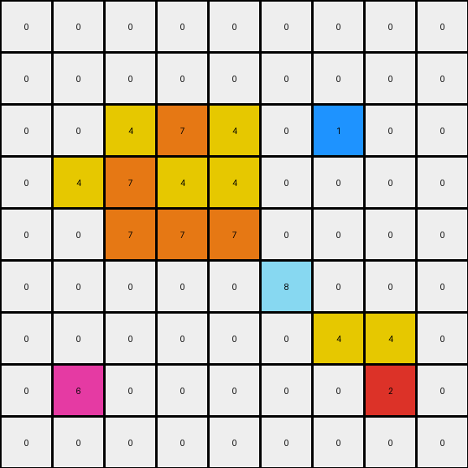

023 • Prompt
============

:puzzle_id: 2-0ca9ddb6
:description: review working
:timestamp: 24.329.064813
:call_count: 23

**working output grid**

updated with your changes

.. code-block::

   [[0 0 0 0 0 0 0 0 0]
    [0 0 0 0 0 0 0 0 0]
    [0 0 4 7 4 0 1 0 0]
    [0 4 7 4 4 0 0 0 0]
    [0 0 7 7 7 0 0 0 0]
    [0 0 0 0 0 8 0 0 0]
    [0 0 0 0 0 0 4 4 0]
    [0 6 0 0 0 0 0 2 0]
    [0 0 0 0 0 0 0 0 0]]

**image**

INSTRUCTIONS:

* take a moment to review that the changes in the working output grid are in keeping with the rule
* use code_execution to investigate properties

.. seealso::

   - :doc:`023-history`
   - :doc:`023-response`
