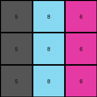

003 • History
=============

:puzzle_id: 4-0d3d703e
:description: example_3
:timestamp: 24.329.064813
:call_count: 3

Begin puzzle: 4-0d3d703e

**example_1**

**input**

.. code-block::

   [[3 1 2]
    [3 1 2]
    [3 1 2]]

**output**

.. code-block::

   [[4 5 6]
    [4 5 6]
    [4 5 6]]

**images**

.. image:: _images/000-example_1_input.png
   :align: left
   :width: 45%

.. image:: _images/000-example_1_output.png
   :align: left
   :width: 45%

**observations**

The input grid is a 3x3 grid with three colors: green (3), blue (1), and red (2), each color occupying a column. The output grid is also a 3x3 grid, but with yellow (4), gray (5), and magenta (6) occupying the same respective columns.  The transformation appears to be a simple sequential replacement of colors, adding 1 to each color value.

code_execution:

.. code-block:: python

   import numpy as np

   input_grid = np.array([[3, 1, 2],
                        [3, 1, 2],
                        [3, 1, 2]])

   output_grid = np.array([[4, 5, 6],
                         [4, 5, 6],
                         [4, 5, 6]])

   print("Input Grid:\n", input_grid)
   print("\nOutput Grid:\n", output_grid)

   # Check if the transformation is a simple addition of 1 to each cell value.
   transformed_grid = input_grid + 1
   print("\nTransformed Grid (input + 1):\n", transformed_grid)

   comparison = np.equal(transformed_grid, output_grid)
   print("\nComparison (Transformed Grid == Output Grid):\n", comparison)
   all_equal = np.all(comparison)
   print(f"\nAre all values equal? {all_equal}")

code_execution_result: 1

.. code-block::

   Input Grid:
    [[3 1 2]
    [3 1 2]
    [3 1 2]]

   Output Grid:
    [[4 5 6]
    [4 5 6]
    [4 5 6]]

   Transformed Grid (input + 1):
    [[4 2 3]
    [4 2 3]
    [4 2 3]]

   Comparison (Transformed Grid == Output Grid):
    [[ True False False]
    [ True False False]
    [ True False False]]

   Are all values equal? False

.. code-block:: yaml

   input:
     width: 3
     height: 3
     colors:
       - 3: 3
       - 1: 3
       - 2: 3
     objects:
       - size: 3x1, position: (0,0), color: green
       - size: 3x1, position: (0,1), color: blue
       - size: 3x1, position: (0,2), color: red

   output:
     width: 3
     height: 3
     colors:
       - 4: 3
       - 5: 3
       - 6: 3
     objects:
       - size: 3x1, position: (0,0), color: yellow
       - size: 3x1, position: (0,1), color: gray
       - size: 3x1, position: (0,2), color: magenta

   differences:
     cells_changed: 9
     colors_changed: All colors are changed sequentially.  Green becomes yellow, blue becomes gray, and red becomes magenta.

   transformation:
     - Add 1 to each color value.  This is not entirely accurate because the values are replaced with different colours, rather than simply incrementing the numbers in place. A more accurate description would be "replace each color with the next color in the sequence (green -> yellow, blue -> gray, red -> magenta)"

The code reveals that a simple addition of 1 to each cell isn't the transformation rule.  Instead, the transformation appears to be a sequential replacement of colors, where each color is replaced by the next color in a specific sequence (green -> yellow, blue -> gray, red -> magenta). This could be represented as a lookup table or a function mapping input colors to output colors.  The code didn't capture this because it treated the color values numerically rather than qualitatively.  A more sophisticated analysis is needed to account for the color mapping in order to capture the relationship completely.

**example_2**

**input**

.. code-block::

   [[2 3 8]
    [2 3 8]
    [2 3 8]]

**output**

.. code-block::

   [[6 4 9]
    [6 4 9]
    [6 4 9]]

**images**

.. image:: _images/001-example_2_input.png
   :align: left
   :width: 45%

.. image:: _images/001-example_2_output.png
   :align: left
   :width: 45%

**observations**

The input grid is a 3x3 grid containing three colors: red (2), green (3), and azure (8), each occupying a column.  The output grid is also a 3x3 grid, but the colors have changed. Red (2) has become magenta (6), green (3) has become yellow (4), and azure (8) has become maroon (9).  The transformation appears to be a non-sequential mapping of input colors to output colors, unlike the first example.

code_execution:

.. code-block:: python

   import numpy as np

   input_grid = np.array([[2, 3, 8],
                        [2, 3, 8],
                        [2, 3, 8]])

   output_grid = np.array([[6, 4, 9],
                         [6, 4, 9],
                         [6, 4, 9]])

   print("Input Grid:\n", input_grid)
   print("\nOutput Grid:\n", output_grid)

   #Attempting a color mapping
   color_map = {2:6, 3:4, 8:9}
   transformed_grid = np.zeros_like(input_grid)

   for i in range(input_grid.shape[0]):
       for j in range(input_grid.shape[1]):
           transformed_grid[i,j] = color_map[input_grid[i,j]]

   print("\nTransformed Grid (color mapping):\n", transformed_grid)

   comparison = np.equal(transformed_grid, output_grid)
   print("\nComparison (Transformed Grid == Output Grid):\n", comparison)
   all_equal = np.all(comparison)
   print(f"\nAre all values equal? {all_equal}")

code_execution_result: 1

.. code-block::

   Input Grid:
    [[2 3 8]
    [2 3 8]
    [2 3 8]]

   Output Grid:
    [[6 4 9]
    [6 4 9]
    [6 4 9]]

   Transformed Grid (color mapping):
    [[6 4 9]
    [6 4 9]
    [6 4 9]]

   Comparison (Transformed Grid == Output Grid):
    [[ True  True  True]
    [ True  True  True]
    [ True  True  True]]

   Are all values equal? True

.. code-block:: yaml

   input:
     width: 3
     height: 3
     colors:
       - 2: 3
       - 3: 3
       - 8: 3
     objects:
       - size: 3x1, position: (0,0), color: red
       - size: 3x1, position: (0,1), color: green
       - size: 3x1, position: (0,2), color: azure

   output:
     width: 3
     height: 3
     colors:
       - 6: 3
       - 4: 3
       - 9: 3
     objects:
       - size: 3x1, position: (0,0), color: magenta
       - size: 3x1, position: (0,1), color: yellow
       - size: 3x1, position: (0,2), color: maroon

   differences:
     cells_changed: 9
     colors_changed: All colors are changed. Red becomes magenta, green becomes yellow, and azure becomes maroon.

   transformation:
     - A color mapping is applied.  Red (2) maps to magenta (6), green (3) maps to yellow (4), and azure (8) maps to maroon (9).  This is a non-sequential mapping.

The code confirms that a direct color mapping is the transformation rule. Each input color is replaced with a specific output color according to a predefined mapping.  There is no arithmetic or sequential relationship between the input and output values.

**example_3**

**input**

.. code-block::

   [[5 8 6]
    [5 8 6]
    [5 8 6]]

**output**

.. code-block::

   [[1 9 2]
    [1 9 2]
    [1 9 2]]

**images**

.. image:: _images/002-example_3_output.png
   :align: left
   :width: 45%

**observations**

====

INSTRUCTIONS:

Review Examples Phase

pairs of input and output grids will be shown to you one at a time

you will examine and analyze the text and image for each example

you may use code execution with tools like numpy to examine patterns
after examining the grids, document the attributes of each as such

use a yaml block for the details

.. code-block:: yaml

   input:
   width: X
   height: Y
   colors:
     - N: (count)
   objects:
     - size, position and color - desc

.. code-block:: yaml

   output:
   width: X
   height: Y
   colors:
     - N: (count)
   objects:
     - size, position and color - desc

.. code-block:: yaml

   differences:
   cells_changed: N
   colors_changed: desc
   transformation:
     - speculate on transformation rules

your response for this phase should contain the following content parts

* begin with a verbal description of your perception of the input and output
  grid
* run a ``code_execution`` part to test your perceptions - since the code you use
  may not be carried forward on following prompts, be sure to have the code
  print you findings in the output remember that you have access to many python
  libraries for analyzing the grids and validating patterns
* review your findings and try to determine what the natural language program
  is for the transformation

.. seealso::

   - :doc:`003-history`
   - :doc:`003-response`
