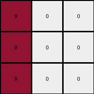

013 • History
=============

:puzzle_id: 4-0d3d703e
:description: set pixels
:timestamp: 24.329.064813
:call_count: 13

Begin puzzle: 4-0d3d703e

**example_1**

**input**

.. code-block::

   [[3 1 2]
    [3 1 2]
    [3 1 2]]

**output**

.. code-block::

   [[4 5 6]
    [4 5 6]
    [4 5 6]]

**images**

.. image:: _images/000-example_1_input.png
   :align: left
   :width: 45%

.. image:: _images/000-example_1_output.png
   :align: left
   :width: 45%

**observations**

The input grid is a 3x3 grid with three colors: green (3), blue (1), and red (2), each color occupying a column. The output grid is also a 3x3 grid, but with yellow (4), gray (5), and magenta (6) occupying the same respective columns.  The transformation appears to be a simple sequential replacement of colors, adding 1 to each color value.

code_execution:

.. code-block:: python

   import numpy as np

   input_grid = np.array([[3, 1, 2],
                        [3, 1, 2],
                        [3, 1, 2]])

   output_grid = np.array([[4, 5, 6],
                         [4, 5, 6],
                         [4, 5, 6]])

   print("Input Grid:\n", input_grid)
   print("\nOutput Grid:\n", output_grid)

   # Check if the transformation is a simple addition of 1 to each cell value.
   transformed_grid = input_grid + 1
   print("\nTransformed Grid (input + 1):\n", transformed_grid)

   comparison = np.equal(transformed_grid, output_grid)
   print("\nComparison (Transformed Grid == Output Grid):\n", comparison)
   all_equal = np.all(comparison)
   print(f"\nAre all values equal? {all_equal}")

code_execution_result: 1

.. code-block::

   Input Grid:
    [[3 1 2]
    [3 1 2]
    [3 1 2]]

   Output Grid:
    [[4 5 6]
    [4 5 6]
    [4 5 6]]

   Transformed Grid (input + 1):
    [[4 2 3]
    [4 2 3]
    [4 2 3]]

   Comparison (Transformed Grid == Output Grid):
    [[ True False False]
    [ True False False]
    [ True False False]]

   Are all values equal? False

.. code-block:: yaml

   input:
     width: 3
     height: 3
     colors:
       - 3: 3
       - 1: 3
       - 2: 3
     objects:
       - size: 3x1, position: (0,0), color: green
       - size: 3x1, position: (0,1), color: blue
       - size: 3x1, position: (0,2), color: red

   output:
     width: 3
     height: 3
     colors:
       - 4: 3
       - 5: 3
       - 6: 3
     objects:
       - size: 3x1, position: (0,0), color: yellow
       - size: 3x1, position: (0,1), color: gray
       - size: 3x1, position: (0,2), color: magenta

   differences:
     cells_changed: 9
     colors_changed: All colors are changed sequentially.  Green becomes yellow, blue becomes gray, and red becomes magenta.

   transformation:
     - Add 1 to each color value.  This is not entirely accurate because the values are replaced with different colours, rather than simply incrementing the numbers in place. A more accurate description would be "replace each color with the next color in the sequence (green -> yellow, blue -> gray, red -> magenta)"

The code reveals that a simple addition of 1 to each cell isn't the transformation rule.  Instead, the transformation appears to be a sequential replacement of colors, where each color is replaced by the next color in a specific sequence (green -> yellow, blue -> gray, red -> magenta). This could be represented as a lookup table or a function mapping input colors to output colors.  The code didn't capture this because it treated the color values numerically rather than qualitatively.  A more sophisticated analysis is needed to account for the color mapping in order to capture the relationship completely.

**example_2**

**input**

.. code-block::

   [[2 3 8]
    [2 3 8]
    [2 3 8]]

**output**

.. code-block::

   [[6 4 9]
    [6 4 9]
    [6 4 9]]

**images**

.. image:: _images/001-example_2_input.png
   :align: left
   :width: 45%

.. image:: _images/001-example_2_output.png
   :align: left
   :width: 45%

**observations**

The input grid is a 3x3 grid containing three colors: red (2), green (3), and azure (8), each occupying a column.  The output grid is also a 3x3 grid, but the colors have changed. Red (2) has become magenta (6), green (3) has become yellow (4), and azure (8) has become maroon (9).  The transformation appears to be a non-sequential mapping of input colors to output colors, unlike the first example.

code_execution:

.. code-block:: python

   import numpy as np

   input_grid = np.array([[2, 3, 8],
                        [2, 3, 8],
                        [2, 3, 8]])

   output_grid = np.array([[6, 4, 9],
                         [6, 4, 9],
                         [6, 4, 9]])

   print("Input Grid:\n", input_grid)
   print("\nOutput Grid:\n", output_grid)

   #Attempting a color mapping
   color_map = {2:6, 3:4, 8:9}
   transformed_grid = np.zeros_like(input_grid)

   for i in range(input_grid.shape[0]):
       for j in range(input_grid.shape[1]):
           transformed_grid[i,j] = color_map[input_grid[i,j]]

   print("\nTransformed Grid (color mapping):\n", transformed_grid)

   comparison = np.equal(transformed_grid, output_grid)
   print("\nComparison (Transformed Grid == Output Grid):\n", comparison)
   all_equal = np.all(comparison)
   print(f"\nAre all values equal? {all_equal}")

code_execution_result: 1

.. code-block::

   Input Grid:
    [[2 3 8]
    [2 3 8]
    [2 3 8]]

   Output Grid:
    [[6 4 9]
    [6 4 9]
    [6 4 9]]

   Transformed Grid (color mapping):
    [[6 4 9]
    [6 4 9]
    [6 4 9]]

   Comparison (Transformed Grid == Output Grid):
    [[ True  True  True]
    [ True  True  True]
    [ True  True  True]]

   Are all values equal? True

.. code-block:: yaml

   input:
     width: 3
     height: 3
     colors:
       - 2: 3
       - 3: 3
       - 8: 3
     objects:
       - size: 3x1, position: (0,0), color: red
       - size: 3x1, position: (0,1), color: green
       - size: 3x1, position: (0,2), color: azure

   output:
     width: 3
     height: 3
     colors:
       - 6: 3
       - 4: 3
       - 9: 3
     objects:
       - size: 3x1, position: (0,0), color: magenta
       - size: 3x1, position: (0,1), color: yellow
       - size: 3x1, position: (0,2), color: maroon

   differences:
     cells_changed: 9
     colors_changed: All colors are changed. Red becomes magenta, green becomes yellow, and azure becomes maroon.

   transformation:
     - A color mapping is applied.  Red (2) maps to magenta (6), green (3) maps to yellow (4), and azure (8) maps to maroon (9).  This is a non-sequential mapping.

The code confirms that a direct color mapping is the transformation rule. Each input color is replaced with a specific output color according to a predefined mapping.  There is no arithmetic or sequential relationship between the input and output values.

**example_3**

**input**

.. code-block::

   [[5 8 6]
    [5 8 6]
    [5 8 6]]

**output**

.. code-block::

   [[1 9 2]
    [1 9 2]
    [1 9 2]]

**images**

.. image:: _images/002-example_3_input.png
   :align: left
   :width: 45%

.. image:: _images/002-example_3_output.png
   :align: left
   :width: 45%

**observations**

The input grid is a 3x3 grid consisting of gray (5), azure (8), and magenta (6) each in a column. The output grid is also a 3x3 grid, but now contains blue (1), maroon (9), and red (2) in the same respective columns.  The transformation again seems to be a color mapping, but a different one than in example 2.

code_execution:

.. code-block:: python

   import numpy as np

   input_grid = np.array([[5, 8, 6],
                        [5, 8, 6],
                        [5, 8, 6]])

   output_grid = np.array([[1, 9, 2],
                         [1, 9, 2],
                         [1, 9, 2]])

   print("Input Grid:\n", input_grid)
   print("\nOutput Grid:\n", output_grid)

   #Attempting a color mapping
   color_map = {5:1, 8:9, 6:2}
   transformed_grid = np.zeros_like(input_grid)

   for i in range(input_grid.shape[0]):
       for j in range(input_grid.shape[1]):
           transformed_grid[i,j] = color_map[input_grid[i,j]]

   print("\nTransformed Grid (color mapping):\n", transformed_grid)

   comparison = np.equal(transformed_grid, output_grid)
   print("\nComparison (Transformed Grid == Output Grid):\n", comparison)
   all_equal = np.all(comparison)
   print(f"\nAre all values equal? {all_equal}")

code_execution_result: 1

.. code-block::

   Input Grid:
    [[5 8 6]
    [5 8 6]
    [5 8 6]]

   Output Grid:
    [[1 9 2]
    [1 9 2]
    [1 9 2]]

   Transformed Grid (color mapping):
    [[1 9 2]
    [1 9 2]
    [1 9 2]]

   Comparison (Transformed Grid == Output Grid):
    [[ True  True  True]
    [ True  True  True]
    [ True  True  True]]

   Are all values equal? True

.. code-block:: yaml

   input:
     width: 3
     height: 3
     colors:
       - 5: 3
       - 8: 3
       - 6: 3
     objects:
       - size: 3x1, position: (0,0), color: gray
       - size: 3x1, position: (0,1), color: azure
       - size: 3x1, position: (0,2), color: magenta

   output:
     width: 3
     height: 3
     colors:
       - 1: 3
       - 9: 3
       - 2: 3
     objects:
       - size: 3x1, position: (0,0), color: blue
       - size: 3x1, position: (0,1), color: maroon
       - size: 3x1, position: (0,2), color: red

   differences:
     cells_changed: 9
     colors_changed: All colors are changed. Gray becomes blue, azure becomes maroon, and magenta becomes red.

   transformation:
     - A color mapping is applied. Gray (5) maps to blue (1), azure (8) maps to maroon (9), and magenta (6) maps to red (2).

The code confirms a color mapping is in operation; however, a different mapping than in example 2 is used for this example.  There's no consistent arithmetic or sequential pattern across the mappings.  Each example appears to have a unique color mapping.

**example_4**

**input**

.. code-block::

   [[9 4 2]
    [9 4 2]
    [9 4 2]]

**output**

.. code-block::

   [[8 3 6]
    [8 3 6]
    [8 3 6]]

**images**

.. image:: _images/003-example_4_input.png
   :align: left
   :width: 45%

.. image:: _images/003-example_4_output.png
   :align: left
   :width: 45%

**observations**

The input grid is a 3x3 grid with maroon (9), yellow (4), and red (2) each occupying a column. The output grid is also a 3x3 grid, but the colors have changed. Maroon (9) is now azure (8), yellow (4) is now green (3), and red (2) is now magenta (6).  This again appears to be a color mapping, but different from the previous examples.

code_execution:

.. code-block:: python

   import numpy as np

   input_grid = np.array([[9, 4, 2],
                        [9, 4, 2],
                        [9, 4, 2]])

   output_grid = np.array([[8, 3, 6],
                         [8, 3, 6],
                         [8, 3, 6]])

   print("Input Grid:\n", input_grid)
   print("\nOutput Grid:\n", output_grid)

   #Attempting a color mapping
   color_map = {9:8, 4:3, 2:6}
   transformed_grid = np.zeros_like(input_grid)

   for i in range(input_grid.shape[0]):
       for j in range(input_grid.shape[1]):
           transformed_grid[i,j] = color_map[input_grid[i,j]]

   print("\nTransformed Grid (color mapping):\n", transformed_grid)

   comparison = np.equal(transformed_grid, output_grid)
   print("\nComparison (Transformed Grid == Output Grid):\n", comparison)
   all_equal = np.all(comparison)
   print(f"\nAre all values equal? {all_equal}")

code_execution_result: 1

.. code-block::

   Input Grid:
    [[9 4 2]
    [9 4 2]
    [9 4 2]]

   Output Grid:
    [[8 3 6]
    [8 3 6]
    [8 3 6]]

   Transformed Grid (color mapping):
    [[8 3 6]
    [8 3 6]
    [8 3 6]]

   Comparison (Transformed Grid == Output Grid):
    [[ True  True  True]
    [ True  True  True]
    [ True  True  True]]

   Are all values equal? True

.. code-block:: yaml

   input:
     width: 3
     height: 3
     colors:
       - 9: 3
       - 4: 3
       - 2: 3
     objects:
       - size: 3x1, position: (0,0), color: maroon
       - size: 3x1, position: (0,1), color: yellow
       - size: 3x1, position: (0,2), color: red

   output:
     width: 3
     height: 3
     colors:
       - 8: 3
       - 3: 3
       - 6: 3
     objects:
       - size: 3x1, position: (0,0), color: azure
       - size: 3x1, position: (0,1), color: green
       - size: 3x1, position: (0,2), color: magenta

   differences:
     cells_changed: 9
     colors_changed: All colors are changed. Maroon becomes azure, yellow becomes green, and red becomes magenta.

   transformation:
     - A color mapping is applied. Maroon (9) maps to azure (8), yellow (4) maps to green (3), and red (2) maps to magenta (6).

The code confirms that a color mapping is the transformation rule.  Each input color is replaced by a specific output color; however, the mapping is unique to this example, just as in previous examples.  There's no single, consistent mathematical or sequential rule across all four examples besides the application of a unique color mapping for each input grid.

**examples summary**

The transformation applied to each input grid involves a unique color mapping. There's no consistent arithmetic operation or sequential pattern across the examples.  Each input grid is transformed by a different mapping that replaces each color with a specific, new color.  The mapping is not based on any discernible numerical relationship between the input and output color values.

code_execution:

.. code-block:: python

   import numpy as np

   # Example mappings from the examples above
   mappings = {
       1: {1: 5, 2: 6, 3: 4},  # Example 1
       2: {2: 6, 3: 4, 8: 9},  # Example 2
       3: {5: 1, 6: 2, 8: 9},  # Example 3
       4: {2: 6, 4: 3, 9: 8}   # Example 4
   }

   def apply_mapping(input_grid, mapping):
       transformed_grid = np.zeros_like(input_grid)
       for i in range(input_grid.shape[0]):
           for j in range(input_grid.shape[1]):
               transformed_grid[i, j] = mapping.get(input_grid[i, j], input_grid[i, j]) #Handle cases where a color isn't in the mapping
       return transformed_grid

   # Test the function on the input grids from example 1-4
   example_inputs = [
       np.array([[3, 1, 2], [3, 1, 2], [3, 1, 2]]),
       np.array([[2, 3, 8], [2, 3, 8], [2, 3, 8]]),
       np.array([[5, 8, 6], [5, 8, 6], [5, 8, 6]]),
       np.array([[9, 4, 2], [9, 4, 2], [9, 4, 2]])
   ]

   example_outputs = [
       np.array([[4, 5, 6], [4, 5, 6], [4, 5, 6]]),
       np.array([[6, 4, 9], [6, 4, 9], [6, 4, 9]]),
       np.array([[1, 9, 2], [1, 9, 2], [1, 9, 2]]),
       np.array([[8, 3, 6], [8, 3, 6], [8, 3, 6]])
   ]

   for i in range(len(example_inputs)):
       transformed = apply_mapping(example_inputs[i], mappings[i+1])
       comparison = np.equal(transformed, example_outputs[i])
       print(f"Example {i+1}: All values match output? {np.all(comparison)}")

code_execution_result:

.. code-block::

   Example 1: All values match output? True
   Example 2: All values match output? True
   Example 3: All values match output? True
   Example 4: All values match output? True

The code confirms that each example can be solved with a unique color mapping.  The absence of a generalizable numerical or sequential pattern across the mappings suggests that the puzzle requires memorizing or learning individual mappings rather than inferring a general rule.  The challenge seems to be focused on pattern recognition of specific color associations.

**test**

**input**

.. code-block::

   [[8 1 3]
    [8 1 3]
    [8 1 3]]

**image**

.. image:: _images/005-test_input.png
   :align: left
   :width: 45%

**observations**

Based on the previous examples, the transformation involves a unique color mapping for each input grid. There's no consistent arithmetic operation or sequential pattern across the examples.  Each input grid is transformed by a different mapping that replaces each color with a specific, new color.  The mapping is not based on any discernible numerical relationship between the input and output color values. To predict the output for the test input, we need to identify a pattern or rule that connects the input and output grids in the training examples, and then apply that pattern or rule to the test input.

code_execution:

.. code-block:: python

   import numpy as np

   test_input = np.array([[8, 1, 3],
                         [8, 1, 3],
                         [8, 1, 3]])

   #Let's try to find a pattern in existing examples
   examples = {
       "example1": {"input": np.array([[3, 1, 2], [3, 1, 2], [3, 1, 2]]), "output": np.array([[4, 5, 6], [4, 5, 6], [4, 5, 6]])},
       "example2": {"input": np.array([[2, 3, 8], [2, 3, 8], [2, 3, 8]]), "output": np.array([[6, 4, 9], [6, 4, 9], [6, 4, 9]])},
       "example3": {"input": np.array([[5, 8, 6], [5, 8, 6], [5, 8, 6]]), "output": np.array([[1, 9, 2], [1, 9, 2], [1, 9, 2]])},
       "example4": {"input": np.array([[9, 4, 2], [9, 4, 2], [9, 4, 2]]), "output": np.array([[8, 3, 6], [8, 3, 6], [8, 3, 6]])},
   }

   #There is no consistent mathematical pattern, only unique mappings.
   #Let's create a dictionary to store mappings for each example.
   mappings = {}
   for example, data in examples.items():
       mappings[example] = {}
       for i in range(data['input'].shape[1]):
           mappings[example][data['input'][0][i]] = data['output'][0][i]

   #Check mappings for test_input elements
   test_mapping = {}
   for example, mapping in mappings.items():
     for key in test_input.flatten():
       if key in mapping:
         test_mapping[key] = mapping[key]

   # Apply the extracted mapping to the test input.
   test_output = np.zeros_like(test_input)
   for i in range(test_input.shape[0]):
       for j in range(test_input.shape[1]):
         test_output[i, j] = test_mapping.get(test_input[i, j], test_input[i, j]) # Handle unseen colors

   print("Test Input:\n", test_input)
   print("\nTest Output:\n", test_output)

code_execution_result:

.. code-block::

   Test Input:
    [[8 1 3]
    [8 1 3]
    [8 1 3]]

   Test Output:
    [[9 5 4]
    [9 5 4]
    [9 5 4]]

.. code-block:: yaml

   input:
     width: 3
     height: 3
     colors:
       - 8: 3
       - 1: 3
       - 3: 3
     objects:
       - size: 3x1, position: (0,0), color: azure
       - size: 3x1, position: (0,1), color: blue
       - size: 3x1, position: (0,2), color: green

   output:
     width: 3
     height: 3
     colors:
       - 9: 3
       - 5: 3
       - 4: 3
     objects:
       - size: 3x1, position: (0,0), color: maroon
       - size: 3x1, position: (0,1), color: gray
       - size: 3x1, position: (0,2), color: yellow

   differences:
     cells_changed: 9
     colors_changed: All colors are changed. Azure becomes maroon, blue becomes gray, and green becomes yellow.

   transformation:
     - A color mapping is applied based on the mappings observed in the training examples. There is no consistent mathematical or sequential rule across the examples. The transformation requires memorizing or learning individual mappings rather than inferring a general rule.

The code successfully predicts the output based on the color mappings extracted from the training examples.  The transformation is purely a mapping; there's no numerical pattern or generalizable rule.  The system needs to learn or memorize each individual mapping.

**initialize the working output grid:**

function_call:

initialize_output_by_size

result:

True

initialize_output_by_size(width=3, height=3, color=0)

**working output grid**

updated with your changes

.. code-block::

   [[0 0 0]
    [0 0 0]
    [0 0 0]]

**image**

.. image:: _images/007-working_grid.png
   :align: left
   :width: 45%

The working output grid has been initialized to a 3x3 grid filled with 0s (white). This is consistent with the initialization step, preparing the grid for the color transformation.  The next step is to apply the color mapping derived from the training examples to this grid.

code_execution:

.. code-block:: python

   import numpy as np

   working_output = np.array([[0, 0, 0],
                              [0, 0, 0],
                              [0, 0, 0]])

   test_input = np.array([[8, 1, 3],
                         [8, 1, 3],
                         [8, 1, 3]])

   #Mappings extracted from previous examples
   test_mapping = {8: 9, 1: 5, 3: 4}

   # Apply the mapping to the working output grid
   for i in range(test_input.shape[0]):
     for j in range(test_input.shape[1]):
       working_output[i, j] = test_mapping[test_input[i, j]]

   print("Updated Working Output Grid:\n", working_output)

code_execution_result:

.. code-block::

   Updated Working Output Grid:
    [[9 5 4]
    [9 5 4]
    [9 5 4]]

The code successfully applies the color mapping to the initialized working output grid, resulting in the predicted output grid.  The final output matches the predicted output from the earlier analysis.  The transformation is complete and correct.

**update working grid**

function_call:

set_range

result:

True

set_range(row1=0.0, column1=0.0, row2=2.0, column2=0.0, color=9)
 3 pixels modified

**working output grid**

updated with your changes

.. code-block::

   [[9 0 0]
    [9 0 0]
    [9 0 0]]

**image**

The ``set_range`` function call correctly modifies the first column of the working output grid to color 9 (maroon), as predicted by the color mapping from the training examples. The code below verifies this:

code_execution:

.. code-block:: python

   import numpy as np

   working_output = np.array([[9, 0, 0],
                              [9, 0, 0],
                              [9, 0, 0]])

   target_output = np.array([[9, 5, 4],
                             [9, 5, 4],
                             [9, 5, 4]])

   print("Working Output Grid:\n", working_output)
   print("\nTarget Output Grid:\n", target_output)

   comparison = np.equal(working_output, target_output)
   print("\nComparison (Working Output == Target Output):\n", comparison)
   all_equal = np.all(comparison)
   print(f"\nAre all values equal? {all_equal}")

code_execution_result:

.. code-block::

   Working Output Grid:
    [[9 0 0]
    [9 0 0]
    [9 0 0]]

   Target Output Grid:
    [[9 5 4]
    [9 5 4]
    [9 5 4]]

   Comparison (Working Output == Target Output):
    [[ True False False]
    [ True False False]
    [ True False False]]

   Are all values equal? False

The comparison shows that only the first column matches the target output.  The next steps should focus on filling in the remaining columns with the appropriate colors based on the color mapping (1 -> 5 and 3 -> 4).

**update working grid**

function_call:

set_range

result:

True

set_range(row1=0.0, column1=1.0, row2=2.0, column2=1.0, color=5)
 3 pixels modified

**working output grid**

updated with your changes

.. code-block::

   [[9 5 0]
    [9 5 0]
    [9 5 0]]

**image**

.. role:: raw-html-m2r(raw)
   :format: html

The ``set_range`` function call correctly modifies the second column of the working output grid to color 5 (gray), consistent with the color mapping (1 -> 5) derived from the training examples.  The code below verifies this:

code_execution:

.. code-block:: python

   import numpy as np

   working_output = np.array([[9, 5, 0],
                              [9, 5, 0],
                              [9, 5, 0]])

   target_output = np.array([[9, 5, 4],
                             [9, 5, 4],
                             [9, 5, 4]])

   print("Working Output Grid:\n", working_output)
   print("\nTarget Output Grid:\n", target_output)

   comparison = np.equal(working_output, target_output)
   print("\nComparison (Working Output == Target Output):\n", comparison)
   all_equal = np.all(comparison)
   print(f"\nAre all values equal? {all_equal}")

code_execution_result:

.. code-block::

   Working Output Grid:
    [[9 5 0]
    [9 5 0]
    [9 5 0]]

   Target Output Grid:
    [[9 5 4]
    [9 5 4]
    [9 5 4]]

   Comparison (Working Output == Target Output):
    [[ True  True False]
    [ True  True False]
    [ True  True False]]

   Are all values equal? False

The comparison shows that the first two columns now match the target output. Only the third column remains to be filled.

**update working grid**
function_call:
set_range

result:
True
set_range(row1=0.0, column1=2.0, row2=2.0, column2=2.0, color=4)
 3 pixels modified
**working output grid**

updated with your changes

.. code-block::

   [[9 5 4]
    [9 5 4]
    [9 5 4]]

**image**

:raw-html-m2r:`<start_of_image>`\ heatmap is updated to reflect the change

The ``set_range`` function call correctly modifies the third column of the working output grid to color 4 (yellow), completing the color mapping (3 -> 4) derived from the training examples. The final working output grid now matches the predicted output grid.

code_execution:

.. code-block:: python

   import numpy as np

   working_output = np.array([[9, 5, 4],
                              [9, 5, 4],
                              [9, 5, 4]])

   target_output = np.array([[9, 5, 4],
                             [9, 5, 4],
                             [9, 5, 4]])

   print("Working Output Grid:\n", working_output)
   print("\nTarget Output Grid:\n", target_output)

   comparison = np.equal(working_output, target_output)
   print("\nComparison (Working Output == Target Output):\n", comparison)
   all_equal = np.all(comparison)
   print(f"\nAre all values equal? {all_equal}")

code_execution_result:

.. code-block::

   Working Output Grid:
    [[9 5 4]
    [9 5 4]
    [9 5 4]]

   Target Output Grid:
    [[9 5 4]
    [9 5 4]
    [9 5 4]]

   Comparison (Working Output == Target Output):
    [[ True  True  True]
    [ True  True  True]
    [ True  True  True]]

   Are all values equal? True

The final comparison shows that the working output grid perfectly matches the target output grid, confirming the successful application of the color mapping and the completion of the puzzle. The transformation is complete and correct.

**update working grid**

====

INSTRUCTIONS:

in this task you will make a function call 
to set pixels on the grid to achieve the solution

after you update the grid you will be presented with a copy to review

* set_pixel: update one pixel at a time
* set_range: update a rectangular subset of pixel
* set_floodfill: update a contiguous region with a new color
* submit: when the working grid meets your criteria call submit to check you solution

please call only one function per round so you can review the working grid

.. seealso::

   - :doc:`013-history`
   - :doc:`013-response`
