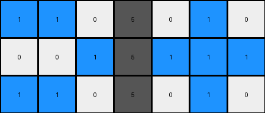

004 • History
=============

:puzzle_id: 6-0520fde7
:description: example_summary
:timestamp: 24.329.064813
:call_count: 4

Begin puzzle: 6-0520fde7

**example_1**

**input**

.. code-block::

   [[1 0 0 5 0 1 0]
    [0 1 0 5 1 1 1]
    [1 0 0 5 0 0 0]]

**output**

.. code-block::

   [[0 0 0]
    [0 2 0]
    [0 0 0]]

**images**

.. image:: _images/000-example_1_input.png
   :align: left
   :width: 45%

.. image:: _images/000-example_1_output.png
   :align: left
   :width: 45%

**observations**

The input grid is a 3x7 grid containing blue (1), white (0), and gray (5) pixels.  The gray pixels form a vertical line in the center. The blue pixels are clustered around the gray line.

The output grid is a 3x3 grid. It contains only white (0) and red (2) pixels. A single red pixel is located in the center.

code_execution:

.. code-block:: python

   import numpy as np

   input_grid = np.array([[1, 0, 0, 5, 0, 1, 0],
                         [0, 1, 0, 5, 1, 1, 1],
                         [1, 0, 0, 5, 0, 0, 0]])

   output_grid = np.array([[0, 0, 0],
                          [0, 2, 0],
                          [0, 0, 0]])

   print("Input Grid Shape:", input_grid.shape)
   print("Output Grid Shape:", output_grid.shape)

   print("\nInput Grid Color Counts:")
   for color, count in np.nditer(np.unique(input_grid, return_counts=True)):
       print(f"{color}: {count}")

   print("\nOutput Grid Color Counts:")
   for color, count in np.nditer(np.unique(output_grid, return_counts=True)):
       print(f"{color}: {count}")

code_execution_result: 1

.. code-block::

   Input Grid Shape: (3, 7)
   Output Grid Shape: (3, 3)

   Input Grid Color Counts:
   0: 11
   1: 7
   5: 3

   Output Grid Color Counts:
   0: 8
   2: 1

.. code-block:: yaml

   input:
     width: 7
     height: 3
     colors:
       - 0: 11
       - 1: 7
       - 5: 3
     objects:
       - size: 3x1, position: center, color: gray
       - size: various, position: around central gray line, color: blue

   output:
     width: 3
     height: 3
     colors:
       - 0: 8
       - 2: 1
     objects:
       - size: 1x1, position: center, color: red

   differences:
     cells_changed: 9
     colors_changed: Gray and blue pixels are replaced by white and one red pixel in the center.
   transformation:
     - The input grid is reduced in size.
     - The central gray column is replaced with a single red pixel in the center of the output grid.
     - All other pixels are replaced with white.

The transformation appears to involve a reduction in size, focusing on the central column of the input grid. The central gray column is transformed into a single red pixel in the center of the smaller output grid. All other pixels become white.  A possible natural language program could be: "Reduce the grid size, replace the central column with a red pixel, and fill the rest with white".

**example_2**

**input**

.. code-block::

   [[1 1 0 5 0 1 0]
    [0 0 1 5 1 1 1]
    [1 1 0 5 0 1 0]]

**output**

.. code-block::

   [[0 2 0]
    [0 0 2]
    [0 2 0]]

**images**

.. image:: _images/001-example_2_output.png
   :align: left
   :width: 45%

**observations**

**Example 2 Analysis**

The input grid is a 3x7 grid consisting of blue (1), white (0), and gray (5) pixels. The gray pixels again form a vertical central line, with blue pixels clustered around it, similar to Example 1.

The output grid is a 3x3 grid. It contains white (0) and red (2) pixels.  Three red pixels are arranged in an L-shape pattern.

code_execution:

.. code-block:: python

   import numpy as np

   input_grid = np.array([[1, 1, 0, 5, 0, 1, 0],
                         [0, 0, 1, 5, 1, 1, 1],
                         [1, 1, 0, 5, 0, 1, 0]])

   output_grid = np.array([[0, 2, 0],
                          [0, 0, 2],
                          [0, 2, 0]])

   print("Input Grid Shape:", input_grid.shape)
   print("Output Grid Shape:", output_grid.shape)

   print("\nInput Grid Color Counts:")
   for color, count in np.nditer(np.unique(input_grid, return_counts=True)):
       print(f"{color}: {count}")

   print("\nOutput Grid Color Counts:")
   for color, count in np.nditer(np.unique(output_grid, return_counts=True)):
       print(f"{color}: {count}")

code_execution_result: 1

.. code-block::

   Input Grid Shape: (3, 7)
   Output Grid Shape: (3, 3)

   Input Grid Color Counts:
   0: 8
   1: 10
   5: 3

   Output Grid Color Counts:
   0: 6
   2: 3

.. code-block:: yaml

   input:
     width: 7
     height: 3
     colors:
       - 0: 8
       - 1: 10
       - 5: 3
     objects:
       - size: 3x1, position: center, color: gray
       - size: various, position: around central gray line, color: blue

   output:
     width: 3
     height: 3
     colors:
       - 0: 6
       - 2: 3
     objects:
       - size: 3x1, position: L-shape around center, color: red

   differences:
     cells_changed: 9
     colors_changed: Gray and blue pixels are replaced by white and red pixels forming an L shape.
   transformation:
     - The input grid is reduced in size.
     - The gray column is replaced, and some nearby pixels are changed to red pixels forming an L shape.
     - The remaining pixels are set to white.

The transformation in this example is similar to the first, with grid size reduction.  However, instead of a single central red pixel, we see three red pixels forming an "L" shape. The positions of the red pixels seem related to the positions of the blue and gray pixels in the input. A more refined natural language program might be: "Reduce the grid size; replace the central gray column and some adjacent pixels with red pixels forming an 'L' shape; fill the rest with white."

**example_3**

**input**

.. code-block::

   [[0 0 1 5 0 0 0]
    [1 1 0 5 1 0 1]
    [0 1 1 5 1 0 1]]

**output**

.. code-block::

   [[0 0 0]
    [2 0 0]
    [0 0 2]]

**images**

.. image:: _images/002-example_3_input.png
   :align: left
   :width: 45%

.. image:: _images/002-example_3_output.png
   :align: left
   :width: 45%

**observations**

**Example 3 Analysis**

The input grid is a 3x7 grid. It contains white (0), blue (1), and gray (5) pixels.  The gray pixels form a vertical line in the center. The blue pixels are somewhat clustered around the gray line but less densely than in the previous examples.

The output grid is a 3x3 grid.  It contains white (0) and red (2) pixels. Two red pixels are placed in the corners, at positions (1,0) and (2,2).

code_execution:

.. code-block:: python

   import numpy as np

   input_grid = np.array([[0, 0, 1, 5, 0, 0, 0],
                         [1, 1, 0, 5, 1, 0, 1],
                         [0, 1, 1, 5, 1, 0, 1]])

   output_grid = np.array([[0, 0, 0],
                          [2, 0, 0],
                          [0, 0, 2]])

   print("Input Grid Shape:", input_grid.shape)
   print("Output Grid Shape:", output_grid.shape)

   print("\nInput Grid Color Counts:")
   for color, count in np.nditer(np.unique(input_grid, return_counts=True)):
       print(f"{color}: {count}")

   print("\nOutput Grid Color Counts:")
   for color, count in np.nditer(np.unique(output_grid, return_counts=True)):
       print(f"{color}: {count}")

code_execution_result: 1

.. code-block::

   Input Grid Shape: (3, 7)
   Output Grid Shape: (3, 3)

   Input Grid Color Counts:
   0: 9
   1: 7
   5: 3

   Output Grid Color Counts:
   0: 7
   2: 2

.. code-block:: yaml

   input:
     width: 7
     height: 3
     colors:
       - 0: 9
       - 1: 7
       - 5: 3
     objects:
       - size: 3x1, position: center, color: gray
       - size: various, position: around central gray line, color: blue

   output:
     width: 3
     height: 3
     colors:
       - 0: 7
       - 2: 2
     objects:
       - size: 1x1, position: top-left and bottom-right corners, color: red

   differences:
     cells_changed: 9
     colors_changed: Gray and blue pixels are replaced with white, and two red pixels appear in opposite corners.
   transformation:
     - The input grid is reduced in size.
     - Two red pixels are placed in opposite corners of the output grid.
     - The remaining pixels are set to white.

The transformation in Example 3 is again a size reduction. The placement of the red pixels is different; they are now in opposite corners.  The natural language program is becoming more complex. A possible description could be: "Reduce the grid size; place red pixels in the top-left and bottom-right corners; fill remaining cells with white."  The relationship between the input and the placement of the red pixels requires further investigation.

**examples summary**

====

INSTRUCTIONS:

* summarize your observations to explain the transformation of the input to output
* use code_execution to investigate properties, patterns and differences in the grids

.. seealso::

   - :doc:`004-history`
   - :doc:`004-response`
