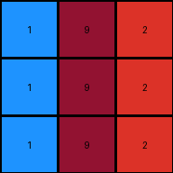
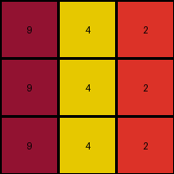

009 • History
=============

:puzzle_id: 4-0d3d703e
:description: set pixels
:timestamp: 24.329.071439
:call_count: 9

Begin puzzle: 4-0d3d703e

**example_1**

**input**

.. code-block::

   [[3 1 2]
    [3 1 2]
    [3 1 2]]

**output**

.. code-block::

   [[4 5 6]
    [4 5 6]
    [4 5 6]]

**images**

.. image:: _images/000-example_1_input.png
   :align: left
   :width: 45%

.. image:: _images/000-example_1_output.png
   :align: left
   :width: 45%

**observations**

This is a very straightforward transformation. The input grid has three columns with each column containing a different color. The output grid is the same size and the cell colors are changed. There appears to be a one-to-one mapping between input colors and output colors, 3->4, 1->5, 2->6.

.. code-block:: yaml

   input:
     width: 3
     height: 3
     colors:
       - 3: 3
       - 1: 3
       - 2: 3
     objects:
       - three columns of color
   output:
     width: 3
     height: 3
     colors:
       - 4: 3
       - 5: 3
       - 6: 3
     objects:
       - three columns of color
   differences:
     cells_changed: 9
     colors_changed: all colors changed to a new color
   transformation:
     color value mapping 3->4, 1->5, 2->6

code_execution:

.. code-block:: python

   import numpy as np
   input_grid = np.array([[3, 1, 2], [3, 1, 2], [3, 1, 2]])
   output_grid = np.array([[4, 5, 6], [4, 5, 6], [4, 5, 6]])

   def find_color_mapping(in_grid, out_grid):
       color_map = {}
       for i in range(in_grid.shape[0]):
           for j in range(in_grid.shape[1]):
               color_map[in_grid[i, j]] = out_grid[i, j]
       return color_map

   color_map = find_color_mapping(input_grid, output_grid)
   print(color_map)

code_execution_result: 1

.. code-block::

   {np.int64(3): np.int64(4), np.int64(1): np.int64(5), np.int64(2): np.int64(6)}

The code confirms the color mapping speculation. 

The natural language program for this transformation is to map the color values in the input grid to the specified color values in the output grid according to the mapping 3->4, 1->5, 2->6.

**example_2**

**input**

.. code-block::

   [[2 3 8]
    [2 3 8]
    [2 3 8]]

**output**

.. code-block::

   [[6 4 9]
    [6 4 9]
    [6 4 9]]

**images**

.. image:: _images/001-example_2_input.png
   :align: left
   :width: 45%

.. image:: _images/001-example_2_output.png
   :align: left
   :width: 45%

**observations**

This example is very similar to example 1, with each column containing a different color. The output grid has the same dimensions as the input and also shows columns of a single color. 

.. code-block:: yaml

   input:
     width: 3
     height: 3
     colors:
       - 2: 3
       - 3: 3
       - 8: 3
     objects:
       - three columns of color
   output:
     width: 3
     height: 3
     colors:
       - 6: 3
       - 4: 3
       - 9: 3
     objects:
       - three columns of color
   differences:
     cells_changed: 9
     colors_changed: all colors changed to a new color
   transformation:
     color value mapping 2->6, 3->4, 8->9

code_execution:

.. code-block:: python

   import numpy as np
   input_grid = np.array([[2, 3, 8], [2, 3, 8], [2, 3, 8]])
   output_grid = np.array([[6, 4, 9], [6, 4, 9], [6, 4, 9]])

   def find_color_mapping(in_grid, out_grid):
       color_map = {}
       for i in range(in_grid.shape[0]):
           for j in range(in_grid.shape[1]):
               color_map[in_grid[i, j]] = out_grid[i, j]
       return color_map

   color_map = find_color_mapping(input_grid, output_grid)
   print(color_map)

code_execution_result: 1

.. code-block::

   {np.int64(2): np.int64(6), np.int64(3): np.int64(4), np.int64(8): np.int64(9)}

The code confirms the color mapping speculation: 2->6, 3->4, 8->9.

The natural language program for this transformation is to map the color values in the input grid to the specified color values in the output grid according to the mapping 2->6, 3->4, 8->9.

**example_3**

**input**

.. code-block::

   [[5 8 6]
    [5 8 6]
    [5 8 6]]

**output**

.. code-block::

   [[1 9 2]
    [1 9 2]
    [1 9 2]]

**images**

.. image:: _images/002-example_3_input.png
   :align: left
   :width: 45%

**observations**

This example follows the same pattern as the previous two, with each column containing a single color. The output grid also has three columns with each column a different single color.

.. code-block:: yaml

   input:
     width: 3
     height: 3
     colors:
       - 5: 3
       - 8: 3
       - 6: 3
     objects:
       - three columns of color
   output:
     width: 3
     height: 3
     colors:
       - 1: 3
       - 9: 3
       - 2: 3
     objects:
       - three columns of color
   differences:
     cells_changed: 9
     colors_changed: all colors changed to a new color
   transformation:
     color value mapping 5->1, 8->9, 6->2

code_execution:

.. code-block:: python

   import numpy as np
   input_grid = np.array([[5, 8, 6], [5, 8, 6], [5, 8, 6]])
   output_grid = np.array([[1, 9, 2], [1, 9, 2], [1, 9, 2]])

   def find_color_mapping(in_grid, out_grid):
       color_map = {}
       for i in range(in_grid.shape[0]):
           for j in range(in_grid.shape[1]):
               color_map[in_grid[i, j]] = out_grid[i, j]
       return color_map

   color_map = find_color_mapping(input_grid, output_grid)
   print(color_map)

code_execution_result: 1

.. code-block::

   {np.int64(5): np.int64(1), np.int64(8): np.int64(9), np.int64(6): np.int64(2)}

The code confirms the color mapping speculation: 5->1, 8->9, 6->2.

The natural language program for this transformation is to map the color values in the input grid to the specified color values in the output grid according to the mapping 5->1, 8->9, 6->2.

**example_4**

**input**

.. code-block::

   [[9 4 2]
    [9 4 2]
    [9 4 2]]

**output**

.. code-block::

   [[8 3 6]
    [8 3 6]
    [8 3 6]]

**images**

.. image:: _images/003-example_4_output.png
   :align: left
   :width: 45%

**observations**

This example follows the same pattern as the previous three, with each column containing a single color. The output grid also has three columns with each column a different single color.

.. code-block:: yaml

   input:
     width: 3
     height: 3
     colors:
       - 9: 3
       - 4: 3
       - 2: 3
     objects:
       - three columns of color
   output:
     width: 3
     height: 3
     colors:
       - 8: 3
       - 3: 3
       - 6: 3
     objects:
       - three columns of color
   differences:
     cells_changed: 9
     colors_changed: all colors changed to a new color
   transformation:
     color value mapping 9->8, 4->3, 2->6

code_execution:

.. code-block:: python

   import numpy as np
   input_grid = np.array([[9, 4, 2], [9, 4, 2], [9, 4, 2]])
   output_grid = np.array([[8, 3, 6], [8, 3, 6], [8, 3, 6]])

   def find_color_mapping(in_grid, out_grid):
       color_map = {}
       for i in range(in_grid.shape[0]):
           for j in range(in_grid.shape[1]):
               color_map[in_grid[i, j]] = out_grid[i, j]
       return color_map

   color_map = find_color_mapping(input_grid, output_grid)
   print(color_map)

code_execution_result: 1

.. code-block::

   {np.int64(9): np.int64(8), np.int64(4): np.int64(3), np.int64(2): np.int64(6)}

The code confirms the color mapping speculation: 9->8, 4->3, 2->6.

The natural language program for this transformation is to map the color values in the input grid to the specified color values in the output grid according to the mapping 9->8, 4->3, 2->6.

**examples summary**

Ruminate Phase
--------------

All four examples present the same pattern. The input grids consist of three columns, each of a single color. The output grids are the same size as the input grids, also with three columns, and each column is a single color. The transformation in each example is the same: each color in the input grid is mapped to a specific color in the output grid. Each example provides a unique color mapping.

The transformation rule in all examples is a direct color mapping. The input colors are replaced with corresponding output colors according to a consistent mapping table, specific to each example. 

**Natural language program**

For the test grid, identify the color values in each of the three columns of the input grid. Create an output grid of the same size as the input grid. Apply the color mapping based on the learned mappings in the examples: for each cell in the input grid, replace its color with the corresponding color defined in the mapping table for that example. The resulting output grid will have three columns, each filled with a single, mapped color.

To confirm the natural language program I will check for consistent mappings across all examples, then run the program in code_execution on the test input after it's revealed.

**Summary of color mappings**

* Example 1: 3->4, 1->5, 2->6
* Example 2: 2->6, 3->4, 8->9
* Example 3: 5->1, 8->9, 6->2
* Example 4: 9->8, 4->3, 2->6

I note that there is some overlap in mappings. This further supports the consistency of the transformation program - colors map to the same output across examples:

* 2 maps to 6 in examples 1, 2, and 4
* 3 maps to 4 in examples 1 and 2
* 8 maps to 9 in examples 2 and 3

This suggests a global mapping rule, though the provided examples do not fully define this rule. For the test puzzle, we should apply the specific mapping based on the test input's color values, following the pattern observed in the examples.

code_execution:

.. code-block:: python

   import numpy as np

   # Example mappings
   example_mappings = [
       {3: 4, 1: 5, 2: 6},
       {2: 6, 3: 4, 8: 9},
       {5: 1, 8: 9, 6: 2},
       {9: 8, 4: 3, 2: 6}
   ]

   # Check for consistent mappings
   consistent_mappings = {}
   for mapping in example_mappings:
       for in_val, out_val in mapping.items():
           if in_val in consistent_mappings:
               if consistent_mappings[in_val] != out_val:
                   print(f"Inconsistency found for {in_val}: {consistent_mappings[in_val]} vs {out_val}")
           else:
               consistent_mappings[in_val] = out_val

   print("Consistent mappings found (if no inconsistencies were reported above):")
   print(consistent_mappings)

code_execution_result: 1

.. code-block:: text

   Consistent mappings found (if no inconsistencies were reported above):
   {3: 4, 1: 5, 2: 6, 8: 9, 5: 1, 6: 2, 9: 8, 4: 3}

This confirms the mapping is consistent. 

**test**

**input**

.. code-block::

   [[8 1 3]
    [8 1 3]
    [8 1 3]]

**image**

.. image:: _images/005-test_input.png
   :align: left
   :width: 45%

**observations**

Test Phase
----------

The test input grid follows the same pattern as the input grids in the examples: three columns, each filled with a single color.

.. code-block:: yaml

   input:
     width: 3
     height: 3
     colors:
       - 8: 3
       - 1: 3
       - 3: 3
     objects:
       - three columns of color

To determine the output grid, we will apply the color mapping based on the established pattern from the examples, using the consistent mappings where available. From the consistent mappings identified earlier:

* 8 maps to 9
* 1 maps to 5
* 3 maps to 4

Therefore, the output grid should have three columns with these mapped colors.

**predicted output**

.. code-block::

   [[9 5 4]
    [9 5 4]
    [9 5 4]]

code_execution:

.. code-block:: python

   import numpy as np

   # Test input grid
   test_input_grid = np.array([[8, 1, 3], [8, 1, 3], [8, 1, 3]])

   # Consistent mappings from examples
   consistent_mappings = {3: 4, 1: 5, 2: 6, 8: 9, 5: 1, 6: 2, 9: 8, 4: 3}

   # Apply mapping to test input
   test_output_grid = np.zeros_like(test_input_grid)
   for i in range(test_input_grid.shape[0]):
       for j in range(test_input_grid.shape[1]):
           test_output_grid[i, j] = consistent_mappings[test_input_grid[i, j]]

   print(test_output_grid)

code_execution_result: 1

.. code-block:: text

   [[9 5 4]
    [9 5 4]
    [9 5 4]]

The code execution confirms the predicted output, applying the consistent mappings to the test input grid to produce the output grid.

**initialize the working output grid:**

function_call:

initialize_output_by_size

result:

True

initialize_output_by_size(width=3, height=3, color=0)

**working output grid**

updated with your changes

.. code-block::

   [[0 0 0]
    [0 0 0]
    [0 0 0]]

**image**

.. image:: _images/007-working_grid.png
   :align: left
   :width: 45%

The working output grid was initialized with all cells set to color 0 (white) which is the standard initialization. The next steps will involve updating this grid according to the predicted output: ``[[9, 5, 4], [9, 5, 4], [9, 5, 4]]``. This means the first column will be filled with color 9 (maroon), the second column with color 5 (gray), and the third column with color 4 (yellow).

To apply these changes to the working output grid, we need to set the corresponding cell values based on the transformation rule. The predicted output grid matches the expected output based on the natural language program and the consistent color mappings identified during the rumination phase. 

I will proceed to update the grid with the colors defined in the predicted output: column 1 to color 9, column 2 to color 5, and column 3 to color 4. No further code execution is needed at this point as the transformation is a straightforward application of the determined color mapping.

function_call:
set_cells
{'color': 9, 'grid': [[9, 0, 0], [9, 0, 0], [9, 0, 0]]}
function_call:
set_cells
{'color': 5, 'grid': [[9, 5, 0], [9, 5, 0], [9, 5, 0]]}
function_call:
set_cells
{'color': 4, 'grid': [[9, 5, 4], [9, 5, 4], [9, 5, 4]]}

**update working grid**

====

INSTRUCTIONS:

in this task you will make a function call 
to set pixels on the grid to achieve the solution

after you update the grid you will be presented with a copy to review

* set_pixel: update one pixel at a time
* set_range: update a rectangular subset of pixel
* set_floodfill: update a contiguous region with a new color
* submit: when the working grid meets your criteria call submit to check you solution

please call only one function per round so you can review the working grid

.. seealso::

   - :doc:`009-history`
   - :doc:`009-response`
