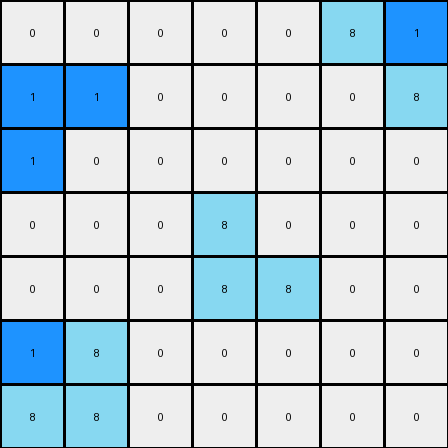

016 • Prompt
============

:puzzle_id: 1-3aa6fb7a
:description: review working
:timestamp: 24.331.163114
:call_count: 16

**working output grid**

updated with your changes

.. code-block::

   [[0 0 0 0 0 8 1]
    [1 1 0 0 0 0 8]
    [1 0 0 0 0 0 0]
    [0 0 0 8 0 0 0]
    [0 0 0 8 8 0 0]
    [1 8 0 0 0 0 0]
    [8 8 0 0 0 0 0]]

**image**

INSTRUCTIONS:

* take a moment to review that the changes in the working output grid are in keeping with the rule
* use code_execution to investigate properties

.. seealso::

   - :doc:`016-history`
   - :doc:`016-response`
