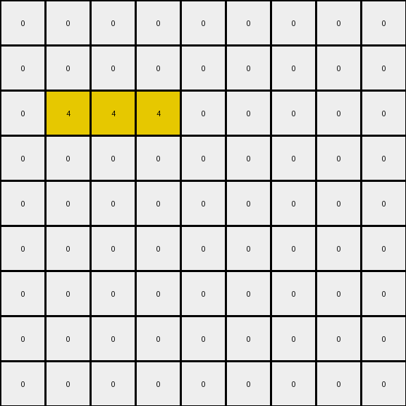

013 • Prompt
============

:puzzle_id: 2-0ca9ddb6
:description: review working
:timestamp: 24.331.163114
:call_count: 13

**working output grid**

updated with your changes

.. code-block::

   [[0 0 0 0 0 0 0 0 0]
    [0 0 0 0 0 0 0 0 0]
    [0 4 4 4 0 0 0 0 0]
    [0 0 0 0 0 0 0 0 0]
    [0 0 0 0 0 0 0 0 0]
    [0 0 0 0 0 0 0 0 0]
    [0 0 0 0 0 0 0 0 0]
    [0 0 0 0 0 0 0 0 0]
    [0 0 0 0 0 0 0 0 0]]

**image**

INSTRUCTIONS:

* take a moment to review that the changes in the working output grid are in keeping with the rule
* use code_execution to investigate properties

.. seealso::

   - :doc:`013-history`
   - :doc:`013-response`
