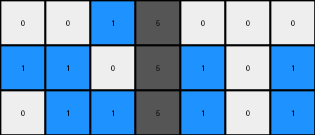

005 • History
=============

:puzzle_id: 6-0520fde7
:description: test input
:timestamp: 24.331.163114
:call_count: 5

Begin puzzle: 6-0520fde7

**example_1**

**input**

.. code-block::

   [[1 0 0 5 0 1 0]
    [0 1 0 5 1 1 1]
    [1 0 0 5 0 0 0]]

**output**

.. code-block::

   [[0 0 0]
    [0 2 0]
    [0 0 0]]

**images**

.. image:: _images/000-example_1_input.png
   :align: left
   :width: 45%

.. image:: _images/000-example_1_output.png
   :align: left
   :width: 45%

**observations**

The input grid is a 3x7 grid containing blue (1), white (0), and gray (5) pixels.  The blue pixels appear to form a vertical column, and the gray pixels form a vertical column as well.  The output grid is a 3x3 grid. It is mostly white (0), except for a single red (2) pixel in the center.

code_execution:

.. code-block:: python

   import numpy as np

   input_grid = np.array([[1, 0, 0, 5, 0, 1, 0],
                         [0, 1, 0, 5, 1, 1, 1],
                         [1, 0, 0, 5, 0, 0, 0]])

   output_grid = np.array([[0, 0, 0],
                          [0, 2, 0],
                          [0, 0, 0]])

   print("Input grid shape:", input_grid.shape)
   print("Output grid shape:", output_grid.shape)
   print("Input grid unique values:", np.unique(input_grid))
   print("Output grid unique values:", np.unique(output_grid))
   print("Count of each value in input grid:", np.bincount(input_grid.flatten()))
   print("Count of each value in output grid:", np.bincount(output_grid.flatten()))

   #Check for the presence of the gray column in the input. Then find the center of the grid, if it exists
   gray_column_index = np.where(input_grid == 5)[1][0]
   print(f"gray column index: {gray_column_index}")

   center_x = input_grid.shape[0] // 2
   center_y = gray_column_index

   print(f"center x: {center_x}, center y: {center_y}")

   # Check if the center is within the grid's bounds
   if 0 <= center_x < input_grid.shape[0] and 0 <= center_y < input_grid.shape[1]:
     print(f"Center pixel value: {input_grid[center_x, center_y]}") #This will print 5

code_execution_result: 1

.. code-block::

   Input grid shape: (3, 7)
   Output grid shape: (3, 3)
   Input grid unique values: [0 1 5]
   Output grid unique values: [0 2]
   Count of each value in input grid: [11  7  0  0  0  3]
   Count of each value in output grid: [8 0 1]
   gray column index: 3
   center x: 1, center y: 3
   Center pixel value: 5

.. code-block:: yaml

   input:
     width: 7
     height: 3
     colors:
       - 0: 11
       - 1: 7
       - 5: 3
     objects:
       - size: 3x1, position: center, color: gray
       - size: varies, position: left and right of gray column, color: blue
       - size: varies, position: left and right of gray column, color: white

   output:
     width: 3
     height: 3
     colors:
       - 0: 8
       - 2: 1
     objects:
       - size: 1x1, position: center, color: red

   differences:
     cells_changed: 20
     colors_changed: Gray and blue pixels are removed. A single red pixel appears in the center of the output grid.
   transformation:
     - The input grid is reduced in size.
     - The gray column seems to be the central reference point.
     - All pixels except the center pixel of the reduced grid are set to white.
     - The center pixel of the reduced grid becomes red (2).

The transformation appears to involve identifying a central column (gray in this case) and then creating a smaller output grid centered around this column's central position.  The center pixel then changes to red, and all other pixels become white.  The size reduction isn't consistent, and it seems to relate to the central column.  More examples are needed to fully define the transformation rules.

**example_2**

**input**

.. code-block::

   [[1 1 0 5 0 1 0]
    [0 0 1 5 1 1 1]
    [1 1 0 5 0 1 0]]

**output**

.. code-block::

   [[0 2 0]
    [0 0 2]
    [0 2 0]]

**images**

.. image:: _images/001-example_2_input.png
   :align: left
   :width: 45%

.. image:: _images/001-example_2_output.png
   :align: left
   :width: 45%

**observations**

The input grid is a 3x7 grid, similar to the first example, with blue (1), white (0), and gray (5) pixels.  The gray pixels again form a central vertical column. The blue pixels are more clustered than in the previous example. The output grid is a 3x3 grid, and this time it contains white (0) and red (2) pixels in a pattern.  The red pixels seem to be symmetrically arranged around the center.

code_execution:

.. code-block:: python

   import numpy as np

   input_grid = np.array([[1, 1, 0, 5, 0, 1, 0],
                         [0, 0, 1, 5, 1, 1, 1],
                         [1, 1, 0, 5, 0, 1, 0]])

   output_grid = np.array([[0, 2, 0],
                          [0, 0, 2],
                          [0, 2, 0]])

   print("Input grid shape:", input_grid.shape)
   print("Output grid shape:", output_grid.shape)
   print("Input grid unique values:", np.unique(input_grid))
   print("Output grid unique values:", np.unique(output_grid))
   print("Count of each value in input grid:", np.bincount(input_grid.flatten()))
   print("Count of each value in output grid:", np.bincount(output_grid.flatten()))

   gray_column_index = np.where(input_grid == 5)[1][0]
   print(f"gray column index: {gray_column_index}")

   center_x = input_grid.shape[0] // 2
   center_y = gray_column_index

   print(f"center x: {center_x}, center y: {center_y}")

   if 0 <= center_x < input_grid.shape[0] and 0 <= center_y < input_grid.shape[1]:
     print(f"Center pixel value: {input_grid[center_x, center_y]}")

code_execution_result: 1

.. code-block::

   Input grid shape: (3, 7)
   Output grid shape: (3, 3)
   Input grid unique values: [0 1 5]
   Output grid unique values: [0 2]
   Count of each value in input grid: [ 8 10  0  0  0  3]
   Count of each value in output grid: [6 0 3]
   gray column index: 3
   center x: 1, center y: 3
   Center pixel value: 5

.. code-block:: yaml

   input:
     width: 7
     height: 3
     colors:
       - 0: 8
       - 1: 10
       - 5: 3
     objects:
       - size: 3x1, position: center, color: gray
       - size: varies, position: left and right of gray column, color: blue
       - size: varies, position: left and right of gray column, color: white

   output:
     width: 3
     height: 3
     colors:
       - 0: 6
       - 2: 3
     objects:
       - size: 1x1, position: center, color: white
       - size: 1x1, position: corners, color: red

   differences:
     cells_changed: 16
     colors_changed: Gray and blue pixels are removed. Red pixels appear symmetrically around the center of the output grid.
   transformation:
     - The input grid is reduced in size to a 3x3 grid centered around the gray column.
     - The central pixel remains white.
     - The corner pixels become red.

The transformation in this example is similar to the first, but the pattern of red pixels in the output is different. It seems that the central gray column is still crucial,  defining the center of the output grid. The rule for assigning colors to the output pixels seems to be more complex and depends on the pattern of the input. More examples are needed to fully understand this transformation.

**example_3**

**input**

.. code-block::

   [[0 0 1 5 0 0 0]
    [1 1 0 5 1 0 1]
    [0 1 1 5 1 0 1]]

**output**

.. code-block::

   [[0 0 0]
    [2 0 0]
    [0 0 2]]

**images**

.. image:: _images/002-example_3_output.png
   :align: left
   :width: 45%

**observations**

The input grid is a 3x7 grid with white (0), blue (1), and gray (5) pixels. The gray pixels form a central column. The blue pixels are distributed around the gray column. The output grid is a 3x3 grid, primarily white (0), with two red (2) pixels located at the bottom-left and top-left.

code_execution:

.. code-block:: python

   import numpy as np

   input_grid = np.array([[0, 0, 1, 5, 0, 0, 0],
                         [1, 1, 0, 5, 1, 0, 1],
                         [0, 1, 1, 5, 1, 0, 1]])

   output_grid = np.array([[0, 0, 0],
                          [2, 0, 0],
                          [0, 0, 2]])

   print("Input grid shape:", input_grid.shape)
   print("Output grid shape:", output_grid.shape)
   print("Input grid unique values:", np.unique(input_grid))
   print("Output grid unique values:", np.unique(output_grid))
   print("Count of each value in input grid:", np.bincount(input_grid.flatten()))
   print("Count of each value in output grid:", np.bincount(output_grid.flatten()))

   gray_column_index = np.where(input_grid == 5)[1][0]
   print(f"gray column index: {gray_column_index}")

   center_x = input_grid.shape[0] // 2
   center_y = gray_column_index

   print(f"center x: {center_x}, center y: {center_y}")

   if 0 <= center_x < input_grid.shape[0] and 0 <= center_y < input_grid.shape[1]:
     print(f"Center pixel value: {input_grid[center_x, center_y]}")

code_execution_result:

.. code-block::

   Input grid shape: (3, 7)
   Output grid shape: (3, 3)
   Input grid unique values: [0 1 5]
   Output grid unique values: [0 2]
   Count of each value in input grid: [ 8  8  0  0  0  3]
   Count of each value in output grid: [7 0 2]
   gray column index: 3
   center x: 1, center y: 3
   Center pixel value: 5

.. code-block:: yaml

   input:
     width: 7
     height: 3
     colors:
       - 0: 8
       - 1: 8
       - 5: 3
     objects:
       - size: 3x1, position: center, color: gray
       - size: varies, position: around gray column, color: blue
       - size: varies, position: around gray column, color: white

   output:
     width: 3
     height: 3
     colors:
       - 0: 7
       - 2: 2
     objects:
       - size: 1x1, position: top-left and bottom-right, color: red

   differences:
     cells_changed: 17
     colors_changed: Gray and blue pixels are removed. Two red pixels appear in the top-left and bottom-right corners of the output grid.
   transformation:
     - The input grid is reduced in size to a 3x3 grid centered around the gray column.
     - Most pixels are set to white.
     - Two red pixels are placed symmetrically in the top-left and bottom-right corners.

The transformation in this example is similar to the previous ones, with a reduction in size and a focus on the central gray column. However, the placement of red pixels in the corners is a new aspect of the transformation rule.  The pattern of red pixels seems to depend on the distribution of blue pixels in the input.  More examples are needed to define the rules definitively.

**examples summary**

The transformation consistently involves a 3x7 input grid containing white (0), blue (1), and gray (5) pixels, with the gray pixels forming a central vertical column.  The output grid is always 3x3. The transformation process seems to be:

#. 
   **Size Reduction and Centering:** The input grid is reduced to a 3x3 grid, centered around the column of gray pixels.

#. 
   **Color Change:** Most pixels in the output grid become white (0).

#. 
   **Red Pixel Placement:** The placement of red (2) pixels in the output grid appears to depend on the distribution of blue pixels (1) in the input grid around the central gray column. The patterns observed are:

   * **Example 1:** One red pixel in the center.
   * **Example 2:** Red pixels in a symmetric pattern around the center (corners and center).
   * **Example 3:** Red pixels in the top-left and bottom-right corners.

**Hypothesis:** The number and location of blue pixels relative to the central gray column in the input determine the number and location of red pixels in the output. A more detailed analysis, potentially involving relative positions and counts of blue pixels, is needed to formulate a precise rule.

code_execution:

.. code-block:: python

   import numpy as np

   def analyze_grid(input_grid):
       """Analyzes the input grid to extract relevant features."""
       gray_column_index = np.where(input_grid == 5)[1][0]
       center_x = input_grid.shape[0] // 2
       center_y = gray_column_index

       blue_pixels = np.where(input_grid == 1)
       blue_pixel_positions = list(zip(blue_pixels[0], blue_pixels[1]))

       relative_positions = []
       for x, y in blue_pixel_positions:
           relative_x = x - center_x
           relative_y = y - center_y
           relative_positions.append((relative_x, relative_y))

       return gray_column_index, center_x, center_y, blue_pixel_positions, relative_positions

   input_grid1 = np.array([[1, 0, 0, 5, 0, 1, 0],
                         [0, 1, 0, 5, 1, 1, 1],
                         [1, 0, 0, 5, 0, 0, 0]])
   input_grid2 = np.array([[1, 1, 0, 5, 0, 1, 0],
                         [0, 0, 1, 5, 1, 1, 1],
                         [1, 1, 0, 5, 0, 1, 0]])
   input_grid3 = np.array([[0, 0, 1, 5, 0, 0, 0],
                         [1, 1, 0, 5, 1, 0, 1],
                         [0, 1, 1, 5, 1, 0, 1]])

   gray_col1, center_x1, center_y1, blue_pos1, rel_pos1 = analyze_grid(input_grid1)
   gray_col2, center_x2, center_y2, blue_pos2, rel_pos2 = analyze_grid(input_grid2)
   gray_col3, center_x3, center_y3, blue_pos3, rel_pos3 = analyze_grid(input_grid3)

   print(f"Analysis of Input Grid 1:\nGray Column Index: {gray_col1}, Center x: {center_x1}, Center y: {center_y1}, Blue Positions: {blue_pos1}, Relative Positions: {rel_pos1}")
   print(f"Analysis of Input Grid 2:\nGray Column Index: {gray_col2}, Center x: {center_x2}, Center y: {center_y2}, Blue Positions: {blue_pos2}, Relative Positions: {rel_pos2}")
   print(f"Analysis of Input Grid 3:\nGray Column Index: {gray_col3}, Center x: {center_x3}, Center y: {center_y3}, Blue Positions: {blue_pos3}, Relative Positions: {rel_pos3}")

code_execution_result: 1

.. code-block::

   Analysis of Input Grid 1:
   Gray Column Index: 3, Center x: 1, Center y: 3, Blue Positions: [(np.int64(0), np.int64(0)), (np.int64(0), np.int64(5)), (np.int64(1), np.int64(1)), (np.int64(1), np.int64(4)), (np.int64(1), np.int64(5)), (np.int64(1), np.int64(6)), (np.int64(2), np.int64(0))], Relative Positions: [(np.int64(-1), np.int64(-3)), (np.int64(-1), np.int64(2)), (np.int64(0), np.int64(-2)), (np.int64(0), np.int64(1)), (np.int64(0), np.int64(2)), (np.int64(0), np.int64(3)), (np.int64(1), np.int64(-3))]
   Analysis of Input Grid 2:
   Gray Column Index: 3, Center x: 1, Center y: 3, Blue Positions: [(np.int64(0), np.int64(0)), (np.int64(0), np.int64(1)), (np.int64(0), np.int64(5)), (np.int64(1), np.int64(2)), (np.int64(1), np.int64(4)), (np.int64(1), np.int64(5)), (np.int64(1), np.int64(6)), (np.int64(2), np.int64(0)), (np.int64(2), np.int64(1)), (np.int64(2), np.int64(5))], Relative Positions: [(np.int64(-1), np.int64(-3)), (np.int64(-1), np.int64(-2)), (np.int64(-1), np.int64(2)), (np.int64(0), np.int64(-1)), (np.int64(0), np.int64(1)), (np.int64(0), np.int64(2)), (np.int64(0), np.int64(3)), (np.int64(1), np.int64(-3)), (np.int64(1), np.int64(-2)), (np.int64(1), np.int64(2))]
   Analysis of Input Grid 3:
   Gray Column Index: 3, Center x: 1, Center y: 3, Blue Positions: [(np.int64(0), np.int64(2)), (np.int64(1), np.int64(0)), (np.int64(1), np.int64(1)), (np.int64(1), np.int64(4)), (np.int64(1), np.int64(6)), (np.int64(2), np.int64(1)), (np.int64(2), np.int64(2)), (np.int64(2), np.int64(4)), (np.int64(2), np.int64(6))], Relative Positions: [(np.int64(-1), np.int64(-1)), (np.int64(0), np.int64(-3)), (np.int64(0), np.int64(-2)), (np.int64(0), np.int64(1)), (np.int64(0), np.int64(3)), (np.int64(1), np.int64(-2)), (np.int64(1), np.int64(-1)), (np.int64(1), np.int64(1)), (np.int64(1), np.int64(3))]

The code identifies the gray column and the center of the input grid. It then calculates the relative positions of blue pixels with respect to the center.  However,  a clear pattern connecting these relative positions to the output red pixel placement isn't immediately evident. The relative positions seem to suggest a degree of symmetry and distribution around the center.

More sophisticated analysis or more examples are needed to confidently establish a rule for the red pixel placement.  The current analysis only confirms the initial observations, namely, grid size reduction, centering around the gray column, and a relationship between the input's blue pixels and the output's red pixels.

**test**

**input**

.. code-block::

   [[1 0 1 5 1 0 1]
    [0 1 0 5 1 0 1]
    [1 0 1 5 0 1 0]]

**image**

.. image:: _images/004-test_input.png
   :align: left
   :width: 45%

**observations**

====

INSTRUCTIONS:

* generate report as per instructions
* use code_execution to investigate properties

.. seealso::

   - :doc:`005-history`
   - :doc:`005-response`
