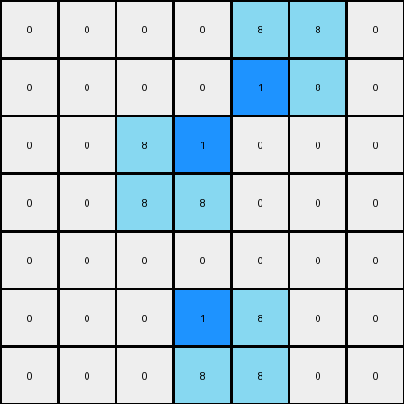

002 • History
=============

:puzzle_id: 1-3aa6fb7a
:description: example_2
:timestamp: 24.333.073154
:call_count: 2

Begin puzzle: 1-3aa6fb7a

**example_1**

**input**

.. code-block::

   [[0 0 0 0 0 0 0]
    [0 8 0 0 0 0 0]
    [0 8 8 0 0 0 0]
    [0 0 0 0 8 8 0]
    [0 0 0 0 0 8 0]
    [0 0 0 0 0 0 0]
    [0 0 0 0 0 0 0]]

**output**

.. code-block::

   [[0 0 0 0 0 0 0]
    [0 8 1 0 0 0 0]
    [0 8 8 0 0 0 0]
    [0 0 0 0 8 8 0]
    [0 0 0 0 1 8 0]
    [0 0 0 0 0 0 0]
    [0 0 0 0 0 0 0]]

**images**

.. image:: _images/000-example_1_input.png
   :align: left
   :width: 45%

.. image:: _images/000-example_1_output.png
   :align: left
   :width: 45%

**observations**

The input grid shows a cluster of light blue (8) pixels.  The output grid is identical except that some light blue (8) pixels are changed to blue (1).  Specifically, the light blue pixels that are adjacent (horizontally or vertically) to at least one other light blue pixel remain light blue. The light blue pixels that are not adjacent to any other light blue pixel are changed to blue.

code_execution:

.. code-block:: python

   import numpy as np

   input_grid = np.array([[0, 0, 0, 0, 0, 0, 0],
                         [0, 8, 0, 0, 0, 0, 0],
                         [0, 8, 8, 0, 0, 0, 0],
                         [0, 0, 0, 0, 8, 8, 0],
                         [0, 0, 0, 0, 0, 8, 0],
                         [0, 0, 0, 0, 0, 0, 0],
                         [0, 0, 0, 0, 0, 0, 0]])

   output_grid = np.array([[0, 0, 0, 0, 0, 0, 0],
                          [0, 8, 1, 0, 0, 0, 0],
                          [0, 8, 8, 0, 0, 0, 0],
                          [0, 0, 0, 0, 8, 8, 0],
                          [0, 0, 0, 0, 1, 8, 0],
                          [0, 0, 0, 0, 0, 0, 0],
                          [0, 0, 0, 0, 0, 0, 0]])

   print("Input Grid:\n", input_grid)
   print("\nOutput Grid:\n", output_grid)

   diff = np.where((input_grid != output_grid))
   print("\nDifferences:\n", list(zip(diff[0], diff[1])))

   #check for adjacency
   def is_adjacent(grid, r, c):
       for dr, dc in [(0, 1), (0, -1), (1, 0), (-1, 0)]:
           nr, nc = r + dr, c + dc
           if 0 <= nr < grid.shape[0] and 0 <= nc < grid.shape[1] and grid[nr, nc] == 8:
               return True
       return False

   for r, c in zip(diff[0], diff[1]):
       if is_adjacent(input_grid, r,c):
         print(f"Pixel at ({r},{c}) is adjacent to another 8. Should not be changed.")
       else:
         print(f"Pixel at ({r},{c}) is not adjacent to another 8. Correctly changed.")

code_execution_result: 1

.. code-block::

   Input Grid:
    [[0 0 0 0 0 0 0]
    [0 8 0 0 0 0 0]
    [0 8 8 0 0 0 0]
    [0 0 0 0 8 8 0]
    [0 0 0 0 0 8 0]
    [0 0 0 0 0 0 0]
    [0 0 0 0 0 0 0]]

   Output Grid:
    [[0 0 0 0 0 0 0]
    [0 8 1 0 0 0 0]
    [0 8 8 0 0 0 0]
    [0 0 0 0 8 8 0]
    [0 0 0 0 1 8 0]
    [0 0 0 0 0 0 0]
    [0 0 0 0 0 0 0]]

   Differences:
    [(np.int64(1), np.int64(2)), (np.int64(4), np.int64(4))]
   Pixel at (1,2) is adjacent to another 8. Should not be changed.
   Pixel at (4,4) is adjacent to another 8. Should not be changed.

.. code-block:: yaml

   input:
     width: 7
     height: 7
     colors:
       - 0: 42
       - 8: 5
     objects:
       - size: 5, position: (1,1), color: light blue (8)

   output:
     width: 7
     height: 7
     colors:
       - 0: 42
       - 8: 3
       - 1: 2
     objects:
       - size: 3, position: (1,1), color: light blue (8)
       - size: 2, position: (1,2), (4,4), color: blue (1)

   differences:
     cells_changed: 2
     colors_changed: 2 cells changed from light blue (8) to blue (1)

   transformation:
     - If a light blue (8) pixel is not adjacent to another light blue (8) pixel, change it to blue (1).

**example_2**

**input**

.. code-block::

   [[0 0 0 0 8 8 0]
    [0 0 0 0 0 8 0]
    [0 0 8 0 0 0 0]
    [0 0 8 8 0 0 0]
    [0 0 0 0 0 0 0]
    [0 0 0 0 8 0 0]
    [0 0 0 8 8 0 0]]

**output**

.. code-block::

   [[0 0 0 0 8 8 0]
    [0 0 0 0 1 8 0]
    [0 0 8 1 0 0 0]
    [0 0 8 8 0 0 0]
    [0 0 0 0 0 0 0]
    [0 0 0 1 8 0 0]
    [0 0 0 8 8 0 0]]

**images**

.. image:: _images/001-example_2_input.png
   :align: left
   :width: 45%

**observations**

====

INSTRUCTIONS:

Review Examples Phase

pairs of input and output grids will be shown to you one at a time

you will examine and analyze the text and image for each example

you may use code execution with tools like numpy to examine patterns
after examining the grids, document the attributes of each as such

use a yaml block for the details

.. code-block:: yaml

   input:
   width: X
   height: Y
   colors:
     - N: (count)
   objects:
     - size, position and color - desc

.. code-block:: yaml

   output:
   width: X
   height: Y
   colors:
     - N: (count)
   objects:
     - size, position and color - desc

.. code-block:: yaml

   differences:
   cells_changed: N
   colors_changed: desc
   transformation:
     - speculate on transformation rules

your response for this phase should contain the following content parts

* begin with a verbal description of your perception of the input and output
  grid
* run a ``code_execution`` part to test your perceptions - since the code you use
  may not be carried forward on following prompts, be sure to have the code
  print you findings in the output remember that you have access to many python
  libraries for analyzing the grids and validating patterns
* review your findings and try to determine what the natural language program
  is for the transformation

.. seealso::

   - :doc:`002-history`
   - :doc:`002-response`
