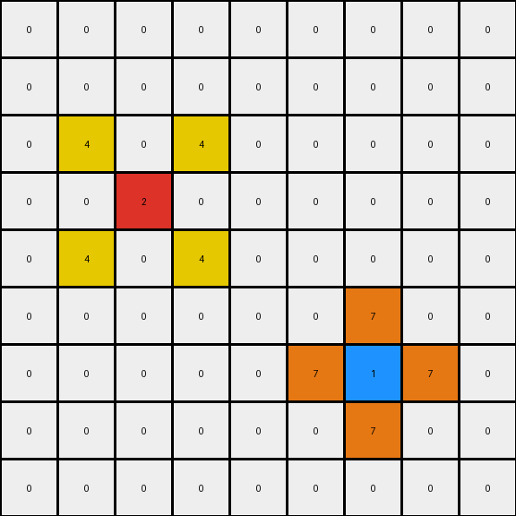

001 • Prompt
============

:puzzle_id: 2-0ca9ddb6
:description: example_1
:timestamp: 24.356.195518
:call_count: 1

**example_1**

**input**

.. code-block::

   [[0 0 0 0 0 0 0 0 0]
    [0 0 0 0 0 0 0 0 0]
    [0 0 0 0 0 0 0 0 0]
    [0 0 2 0 0 0 0 0 0]
    [0 0 0 0 0 0 0 0 0]
    [0 0 0 0 0 0 0 0 0]
    [0 0 0 0 0 0 1 0 0]
    [0 0 0 0 0 0 0 0 0]
    [0 0 0 0 0 0 0 0 0]]

**output**

.. code-block::

   [[0 0 0 0 0 0 0 0 0]
    [0 0 0 0 0 0 0 0 0]
    [0 4 0 4 0 0 0 0 0]
    [0 0 2 0 0 0 0 0 0]
    [0 4 0 4 0 0 0 0 0]
    [0 0 0 0 0 0 7 0 0]
    [0 0 0 0 0 7 1 7 0]
    [0 0 0 0 0 0 7 0 0]
    [0 0 0 0 0 0 0 0 0]]

**images**

.. image:: _images/000-example_1_input.png
   :align: left
   :width: 45%

**observations**

INSTRUCTIONS:

Review Example
--------------

pairs of input and output grids will be shown to you one at a time

* document your initial observations and impressions

  * begin with a verbal description of your perception of the input and output
    grid

* 
  use ``code_execution`` to examine the grid information and verify the
  assumptions about size, colors, objects, and transformations. Focus your
  analysis on aspects like:

  * Counting the occurrences of each color.
  * Identifying the coordinates of pixels that have changed color or position.
  * Determining if the dimensions of the grid have changed.
  * Analyzing the count, size, shape, and relative positions of objects (contiguous
    blocks of the same color).

* 
  since the code you use may not be carried forward on following prompts, be
  sure to have the code print your findings in the output

* use what you learn to develop a natural language program of the
  transformation rule.
* review your findings and try to determine the natural language description of
  the transformation rule. How does the information captured in the YAML block
  inform your understanding of the transformation?

use a yaml block to capture details (examples):

.. code-block:: yaml

   input:
     width: X
     height: Y
     colors:
       - N: (count)
     objects:
       - size, position and color - desc

.. code-block:: yaml

   differences:
     cells_changed: N
     colors_changed: desc
     transformation:
       - speculate on transformation rules

final step - provide a thorough natural language program
to tell another intelligent entity how to transform the input grid into the
output grid

.. seealso::

   - :doc:`001-history`
   - :doc:`001-response`
