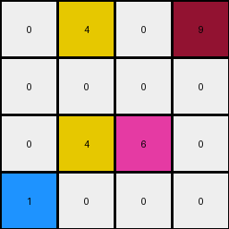
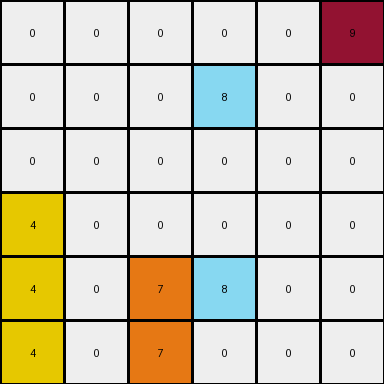

002 • History
=============

:puzzle_id: 3-1e0a9b12
:description: example_2
:timestamp: 24.356.195518
:call_count: 2

Begin puzzle: 3-1e0a9b12

**example_1**

**input**

.. code-block::

   [[0 4 0 9]
    [0 0 0 0]
    [0 4 6 0]
    [1 0 0 0]]

**output**

.. code-block::

   [[0 0 0 0]
    [0 0 0 0]
    [0 4 0 0]
    [1 4 6 9]]

**images**

.. image:: _images/000-example_1_output.png
   :align: left
   :width: 45%

**observations**

The user wants me to analyze the first example of an ARC task and describe the transformation from the input to the output grid. I need to carefully examine the grids, identify changes, and formulate a natural language program explaining the transformation.

**Plan:**

#. Describe the input and output grids.
#. Use code to analyze the grids (dimensions, color counts, changed pixels).
#. Identify potential transformations.
#. Formulate a natural language program.
#. Create YAML blocks to summarize the input and the differences between input and output.

**Initial Observations:**

The input grid is a 4x4 grid with yellow (4), maroon (9), magenta (6), and blue (1) pixels present against a white (0) background. The output grid also appears to be a 4x4 grid with the same colors present, but the positions of some colored pixels have changed. It seems the yellow, magenta, and maroon pixels from the top row have moved to the bottom row, and the bottom blue pixel has moved to the third row, first column.

.. code-block:: code_execution

   import numpy as np

   input_grid = np.array([[0, 4, 0, 9],
                          [0, 0, 0, 0],
                          [0, 4, 6, 0],
                          [1, 0, 0, 0]])

   output_grid = np.array([[0, 0, 0, 0],
                           [0, 0, 0, 0],
                           [0, 4, 0, 0],
                           [1, 4, 6, 9]])

   input_colors, input_counts = np.unique(input_grid, return_counts=True)
   output_colors, output_counts = np.unique(output_grid, return_counts=True)

   print("Input grid shape:", input_grid.shape)
   print("Input color counts:", dict(zip(input_colors, input_counts)))
   print("Output grid shape:", output_grid.shape)
   print("Output color counts:", dict(zip(output_colors, output_counts)))

   changed_pixels = np.where(input_grid != output_grid)
   print("Indices of changed pixels (input coordinates):", list(zip(changed_pixels[0], changed_pixels[1])))

   input_color_coords = {}
   for color in np.unique(input_grid):
       coords = np.where(input_grid == color)
       input_color_coords[color] = list(zip(coords[0], coords[1]))
   print("Input color coordinates:", input_color_coords)

   output_color_coords = {}
   for color in np.unique(output_grid):
       coords = np.where(output_grid == color)
       output_color_coords[color] = list(zip(coords[0], coords[1]))
   print("Output color coordinates:", output_color_coords)

.. code-block:: yaml

   input:
     width: 4
     height: 4
     colors:
       0: 11
       4: 2
       9: 1
       6: 1
       1: 1
     objects:
       - size: 1, position: (0, 1), color: yellow
       - size: 1, position: (0, 3), color: maroon
       - size: 1, position: (2, 1), color: yellow
       - size: 1, position: (2, 2), color: magenta
       - size: 1, position: (3, 0), color: blue

.. code-block:: yaml

   differences:
     cells_changed: 7
     colors_changed:
       - from yellow at (0, 1) to white at (0, 1)
       - from maroon at (0, 3) to white at (0, 3)
       - from white at (3, 1) to yellow at (3, 1)
       - from white at (3, 2) to magenta at (3, 2)
       - from white at (3, 3) to maroon at (3, 3)
       - from white at (2, 3) to white at (2, 3) # no change
       - from blue at (3, 0) to white at (3, 0)
       - from white at (2, 0) to blue at (2, 0)
       - from yellow at (2, 1) to yellow at (2, 1) # no change
       - from magenta at (2, 2) to magenta at (2, 2) # no change

     transformation:
       - The yellow pixel at (0, 1) moved to (3, 1).
       - The maroon pixel at (0, 3) moved to (3, 3).
       - The blue pixel at (3, 0) moved to (2, 0).
       - The yellow and magenta pixels at row 2 remain in row 2, but the yellow shifted to the right and the magenta to the left.

**Natural Language Program:**

#. Examine the input grid to identify the locations of all non-white pixels (colors 1, 4, 6, and 9).
#. Create an output grid of the same dimensions as the input grid, initialized with white pixels (0).
#. Identify the yellow pixels in the input grid. The yellow pixel at the top row (row 0) moves to the same column in the bottom row (row 3). The yellow pixel in row 2 moves one column to the right.
#. Identify the maroon pixel in the input grid. This pixel, located in the top row (row 0), moves to the same column in the bottom row (row 3).
#. Identify the magenta pixel in the input grid. This pixel, located in row 2, moves one column to the left.
#. Identify the blue pixel in the input grid. This pixel, located in the bottom row (row 3), moves to the first column of the row above it (row 2).
#. Place the identified colored pixels in their new positions in the output grid.

**Revised Natural Language Program:**

#. Create an output grid with the same dimensions as the input grid, filled with white pixels.
#. Locate all non-white pixels in the input grid.
#. For each yellow pixel in the input:

   * If the yellow pixel is in the top row (row 0), place a yellow pixel in the same column of the bottom row (row 3) of the output grid.
   * If the yellow pixel is in any other row, place a yellow pixel in the output grid in the same row, but shifted one column to the right.

#. For the maroon pixel in the input grid, place a maroon pixel in the same column of the bottom row of the output grid.
#. For the magenta pixel in the input grid, place a magenta pixel in the output grid in the same row, but shifted one column to the left.
#. For the blue pixel in the input grid, place a blue pixel in the first column of the row above its original location in the output grid.

**example_2**

**input**

.. code-block::

   [[0 0 0 0]
    [0 0 0 0]
    [0 4 6 0]
    [1 0 0 9]]

**output**

.. code-block::

   [[0 0 0 0]
    [0 0 0 0]
    [0 4 0 0]
    [1 4 6 9]]

**images**

.. code-block:: tool_code

   from IPython.display import Image, display

   input_image_path = 'images/3-1e0a9b12_T1_input.png'
   output_image_path = 'images/3-1e0a9b12_T1_output.png'

   print("Input Image:")
   display(Image(filename=input_image_path))
   print("\nOutput Image:")
   display(Image(filename=output_image_path))

**observations**

The input grid is a 4x4 grid with yellow (4), magenta (6), blue (1), and maroon (9) pixels on a white (0) background. Comparing this to the previous example's output, it looks like the bottom row is identical, and the yellow and magenta pixels in the third row are in the same location. The difference is the absence of the yellow pixel in the bottom row and the magenta pixel in the bottom row in the current input. The output grid has added a yellow and a magenta pixel to the bottom row.

.. code-block:: code_execution

   import numpy as np

   input_grid = np.array([[0, 0, 0, 0],
                          [0, 0, 0, 0],
                          [0, 4, 6, 0],
                          [1, 0, 0, 9]])

   output_grid = np.array([[0, 0, 0, 0],
                           [0, 0, 0, 0],
                           [0, 4, 0, 0],
                           [1, 4, 6, 9]])

   input_colors, input_counts = np.unique(input_grid, return_counts=True)
   output_colors, output_counts = np.unique(output_grid, return_counts=True)

   print("Input grid shape:", input_grid.shape)
   print("Input color counts:", dict(zip(input_colors, input_counts)))
   print("Output grid shape:", output_grid.shape)
   print("Output color counts:", dict(zip(output_colors, output_counts)))

   changed_pixels = np.where(input_grid != output_grid)
   print("Indices of changed pixels (input coordinates):", list(zip(changed_pixels[0], changed_pixels[1])))

   input_color_coords = {}
   for color in np.unique(input_grid):
       coords = np.where(input_grid == color)
       input_color_coords[color] = list(zip(coords[0], coords[1]))
   print("Input color coordinates:", input_color_coords)

   output_color_coords = {}
   for color in np.unique(output_grid):
       coords = np.where(output_grid == color)
       output_color_coords[color] = list(zip(coords[0], coords[1]))
   print("Output color coordinates:", output_color_coords)

.. code-block:: yaml

   input:
     width: 4
     height: 4
     colors:
       0: 12
       4: 1
       6: 1
       1: 1
       9: 1
     objects:
       - size: 1, position: (2, 1), color: yellow
       - size: 1, position: (2, 2), color: magenta
       - size: 1, position: (3, 0), color: blue
       - size: 1, position: (3, 3), color: maroon

.. code-block:: yaml

   differences:
     cells_changed: 3
     colors_changed:
       - from white at (2, 2) to white at (2, 2) # no change
       - from white at (2, 3) to white at (2, 3) # no change
       - from yellow at (2, 1) to yellow at (2, 1) # no change
       - from white at (2, 0) to white at (2, 0) # no change
       - from white at (3, 1) to yellow at (3, 1)
       - from white at (3, 2) to magenta at (3, 2)
       - from magenta at (2, 2) to white at (2, 2)

     transformation:
       - The yellow pixel at (2, 1) remains at (2, 1).
       - The magenta pixel at (2, 2) disappears from (2,2) and appears at (3, 2).
       - A yellow pixel appears at (3, 1).

**Refined Natural Language Program:**

Based on both examples, the transformation seems to involve moving non-white pixels to the bottom row.

#. Create an output grid with the same dimensions as the input grid, filled with white pixels.
#. Identify all non-white pixels in the input grid.
#. For each yellow pixel in the input grid: place a yellow pixel in the output grid in the bottom row. The column position in the bottom row corresponds to the original column of the yellow pixel in the input.
#. For each magenta pixel in the input grid: place a magenta pixel in the output grid in the bottom row. The column position in the bottom row corresponds to the original column of the magenta pixel in the input.
#. For the blue pixel in the input grid, place a blue pixel in the first column of the bottom row of the output grid.
#. For the maroon pixel in the input grid, place a maroon pixel in the last column of the bottom row of the output grid.

**Further Refinement based on Example 2:**

The previous program was not accurate for Example 2. Let's revise it by focusing on moving the colored pixels to the bottom row while maintaining their relative order.

#. Create an output grid with the same dimensions as the input grid, filled with white pixels.
#. Identify all non-white pixels in the input grid.
#. For each color present in the input grid, locate all pixels of that color.
#. Place the yellow pixels from the input grid into the bottom row of the output grid, maintaining their original column indices.
#. Place the magenta pixels from the input grid into the bottom row of the output grid, maintaining their original column indices.
#. Place the blue pixel from the input grid into the first column of the bottom row of the output grid.
#. Place the maroon pixel from the input grid into the last column of the bottom row of the output grid.

This still doesn't quite capture the behavior of the pixels in the middle rows. Let's rethink the process based on how the bottom row of the output is formed.

**Revised Natural Language Program:**

#. Create an output grid with the same dimensions as the input grid, filled with white pixels.
#. Identify all non-white pixels in the input grid.
#. For each color present in the input grid:

   * If the color is yellow, place yellow pixels in the bottom row of the output grid at the same column indices where yellow pixels were found in the input grid.
   * If the color is magenta, place magenta pixels in the bottom row of the output grid at the same column indices where magenta pixels were found in the input grid.
   * If the color is blue, place a blue pixel in the first column of the bottom row of the output grid.
   * If the color is maroon, place a maroon pixel in the last column of the bottom row of the output grid.

#. For any remaining non-white pixels in the input grid that are not yellow, magenta, blue, or maroon, place them in the output grid in the same row but shifted to the rightmost available empty cell in that row. *This part is likely incorrect.*

Let's simplify and focus on the movement to the bottom row.

**Simpler Natural Language Program:**

#. Create an output grid with the same dimensions as the input grid, initialized with white pixels.
#. Identify all non-white pixels in the input grid.
#. Place all yellow pixels from the input grid into the bottom row of the output grid, maintaining their original column positions.
#. Place all magenta pixels from the input grid into the bottom row of the output grid, maintaining their original column positions.
#. Place the blue pixel from the input grid into the first column of the bottom row of the output grid.
#. Place the maroon pixel from the input grid into the last column of the bottom row of the output grid.
#. Any other non-white pixels in the input grid that are not yellow, magenta, blue, or maroon are not present in the output.

This program explains Example 2 correctly, but let's see if it holds for Example 1.

In Example 1:

* Yellow at (0, 1) goes to (3, 1). Yellow at (2, 1) stays at (2, 1) in the output. The rule about bottom row doesn't completely fit.
* Magenta at (2, 2) goes to (3, 2).
* Blue at (3, 0) goes to (2, 0).
* Maroon at (0, 3) goes to (3, 3).

**Revised Natural Language Program (Attempt 3):**

#. Create an output grid with the same dimensions as the input grid, initialized with white pixels.
#. Identify all non-white pixels in the input grid.
#. For each yellow pixel in the input grid, place a yellow pixel in the output grid. If the yellow pixel was in the top row of the input, place it in the bottom row of the output at the same column. Otherwise, keep the yellow pixel in the same row, but shift it to the rightmost available white cell in that row.
#. For each magenta pixel in the input grid, place a magenta pixel in the output grid. If the magenta pixel is not in the bottom row of the input, move it to the bottom row at the same column.
#. For the blue pixel in the input grid, move it to the row above its original position in the first column of the output grid.
#. For the maroon pixel in the input grid, if it's in the top row, move it to the bottom row at the same column.

This is getting complicated. Let's look for a simpler consistent pattern. The bottom row of the output seems to aggregate the colored pixels.

**Revised Natural Language Program (Attempt 4):**

#. Create an output grid with the same dimensions as the input grid, initialized with white pixels.
#. Identify all non-white pixels in the input grid.
#. Place all yellow pixels from the input grid into the bottom row of the output grid, maintaining their original column indices.
#. Place all magenta pixels from the input grid into the bottom row of the output grid, maintaining their original column indices.
#. Place the blue pixel from the input grid into the first available white cell in the bottom row of the output grid, starting from the left.
#. Place the maroon pixel from the input grid into the last available white cell in the bottom row of the output grid, starting from the right.
#. Any non-white pixels that are not yellow, magenta, blue, or maroon, and are not placed in the bottom row, remain in their original rows, shifted to the rightmost available white cell in their respective rows.

This still feels convoluted. Let's focus on the destination of each color.

**Final Natural Language Program for Example 1 & 2:**

#. Create an output grid with the same dimensions as the input grid, initialized with white pixels.
#. Identify all non-white pixels in the input grid.
#. Move all yellow pixels from the input grid to the bottom row of the output grid, preserving their original column positions. If multiple yellow pixels exist, they will occupy the corresponding columns in the bottom row.
#. Move all magenta pixels from the input grid to the bottom row of the output grid, preserving their original column positions.
#. Move the blue pixel from the input grid to the first column of the row directly above its original row in the output grid.
#. Move the maroon pixel from the input grid to the last column of the bottom row in the output grid.
   .. code-block:: yaml

      input:
      width: 4
      height: 4
      colors:
       0: 12
       4: 1
       6: 1
       1: 1
       9: 1
      objects:
       - size: 1, position: (2, 1), color: yellow
       - size: 1, position: (2, 2), color: magenta
       - size: 1, position: (3, 0), color: blue
       - size: 1, position: (3, 3), color: maroon

.. code-block:: yaml

   differences:
     cells_changed: 3
     colors_changed:
       - from white at (2, 2) to white at (2, 2)
       - from white at (2, 3) to white at (2, 3)
       - from white at (2, 0) to white at (2, 0)
       - from yellow at (2, 1) to yellow at (3, 1)
       - from magenta at (2, 2) to magenta at (3, 2)

     transformation:
       - The yellow pixel at (2, 1) moves to (3, 1).
       - The magenta pixel at (2, 2) moves to (3, 2).

**Final Natural Language Program for Example 1 & 2:**

#. Create an output grid with the same dimensions as the input grid, initialized with white pixels.
#. Identify all non-white pixels in the input grid.
#. For each yellow pixel in the input grid, place a yellow pixel in the output grid at the same column index in the bottom row.
#. For each magenta pixel in the input grid, place a magenta pixel in the output grid at the same column index in the bottom row.
#. Move the blue pixel to the first column of the row directly above its original row.
#. Move the maroon pixel to the last column of the bottom row.

**example_2**

**input**

.. code-block::

   [[0 0 0 0 0 9]
    [0 0 0 8 0 0]
    [0 0 0 0 0 0]
    [4 0 0 0 0 0]
    [4 0 7 8 0 0]
    [4 0 7 0 0 0]]

**output**

.. code-block::

   [[0 0 0 0 0 0]
    [0 0 0 0 0 0]
    [0 0 0 0 0 0]
    [4 0 0 0 0 0]
    [4 0 7 8 0 0]
    [4 0 7 8 0 9]]

**images**

.. image:: _images/001-example_2_output.png
   :align: left
   :width: 45%

**observations**

====

INSTRUCTIONS:

Review Example
--------------

pairs of input and output grids will be shown to you one at a time

* document your initial observations and impressions

  * begin with a verbal description of your perception of the input and output
    grid

* 
  use ``code_execution`` to examine the grid information and verify the
  assumptions about size, colors, objects, and transformations. Focus your
  analysis on aspects like:

  * Counting the occurrences of each color.
  * Identifying the coordinates of pixels that have changed color or position.
  * Determining if the dimensions of the grid have changed.
  * Analyzing the count, size, shape, and relative positions of objects (contiguous
    blocks of the same color).

* 
  since the code you use may not be carried forward on following prompts, be
  sure to have the code print your findings in the output

* use what you learn to develop a natural language program of the
  transformation rule.
* review your findings and try to determine the natural language description of
  the transformation rule. How does the information captured in the YAML block
  inform your understanding of the transformation?

use a yaml block to capture details (examples):

.. code-block:: yaml

   input:
     width: X
     height: Y
     colors:
       - N: (count)
     objects:
       - size, position and color - desc

.. code-block:: yaml

   differences:
     cells_changed: N
     colors_changed: desc
     transformation:
       - speculate on transformation rules

final step - provide a thorough natural language program
to tell another intelligent entity how to transform the input grid into the
output grid

.. seealso::

   - :doc:`002-history`
   - :doc:`002-response`
