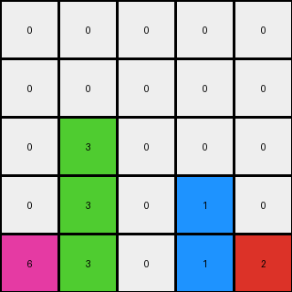
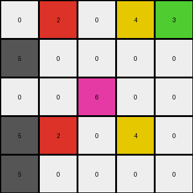

005 • History
=============

:puzzle_id: 3-1e0a9b12
:description: test input
:timestamp: 24.356.195518
:call_count: 5

Begin puzzle: 3-1e0a9b12

**example_1**

**input**

.. code-block::

   [[0 4 0 9]
    [0 0 0 0]
    [0 4 6 0]
    [1 0 0 0]]

**output**

.. code-block::

   [[0 0 0 0]
    [0 0 0 0]
    [0 4 0 0]
    [1 4 6 9]]

**images**

.. image:: _images/000-example_1_input.png
   :align: left
   :width: 45%

.. image:: _images/000-example_1_output.png
   :align: left
   :width: 45%

**observations**

The user wants me to analyze the first example of an ARC task and describe the transformation from the input to the output grid. I need to carefully examine the grids, identify changes, and formulate a natural language program explaining the transformation.

**Plan:**

#. Describe the input and output grids.
#. Use code to analyze the grids (dimensions, color counts, changed pixels).
#. Identify potential transformations.
#. Formulate a natural language program.
#. Create YAML blocks to summarize the input and the differences between input and output.

**Initial Observations:**

The input grid is a 4x4 grid with yellow (4), maroon (9), magenta (6), and blue (1) pixels present against a white (0) background. The output grid also appears to be a 4x4 grid with the same colors present, but the positions of some colored pixels have changed. It seems the yellow, magenta, and maroon pixels from the top row have moved to the bottom row, and the bottom blue pixel has moved to the third row, first column.

.. code-block:: code_execution

   import numpy as np

   input_grid = np.array([[0, 4, 0, 9],
                          [0, 0, 0, 0],
                          [0, 4, 6, 0],
                          [1, 0, 0, 0]])

   output_grid = np.array([[0, 0, 0, 0],
                           [0, 0, 0, 0],
                           [0, 4, 0, 0],
                           [1, 4, 6, 9]])

   input_colors, input_counts = np.unique(input_grid, return_counts=True)
   output_colors, output_counts = np.unique(output_grid, return_counts=True)

   print("Input grid shape:", input_grid.shape)
   print("Input color counts:", dict(zip(input_colors, input_counts)))
   print("Output grid shape:", output_grid.shape)
   print("Output color counts:", dict(zip(output_colors, output_counts)))

   changed_pixels = np.where(input_grid != output_grid)
   print("Indices of changed pixels (input coordinates):", list(zip(changed_pixels[0], changed_pixels[1])))

   input_color_coords = {}
   for color in np.unique(input_grid):
       coords = np.where(input_grid == color)
       input_color_coords[color] = list(zip(coords[0], coords[1]))
   print("Input color coordinates:", input_color_coords)

   output_color_coords = {}
   for color in np.unique(output_grid):
       coords = np.where(output_grid == color)
       output_color_coords[color] = list(zip(coords[0], coords[1]))
   print("Output color coordinates:", output_color_coords)

.. code-block:: yaml

   input:
     width: 4
     height: 4
     colors:
       0: 11
       4: 2
       9: 1
       6: 1
       1: 1
     objects:
       - size: 1, position: (0, 1), color: yellow
       - size: 1, position: (0, 3), color: maroon
       - size: 1, position: (2, 1), color: yellow
       - size: 1, position: (2, 2), color: magenta
       - size: 1, position: (3, 0), color: blue

.. code-block:: yaml

   differences:
     cells_changed: 7
     colors_changed:
       - from yellow at (0, 1) to white at (0, 1)
       - from maroon at (0, 3) to white at (0, 3)
       - from white at (3, 1) to yellow at (3, 1)
       - from white at (3, 2) to magenta at (3, 2)
       - from white at (3, 3) to maroon at (3, 3)
       - from white at (2, 3) to white at (2, 3) # no change
       - from blue at (3, 0) to white at (3, 0)
       - from white at (2, 0) to blue at (2, 0)
       - from yellow at (2, 1) to yellow at (2, 1) # no change
       - from magenta at (2, 2) to magenta at (2, 2) # no change

     transformation:
       - The yellow pixel at (0, 1) moved to (3, 1).
       - The maroon pixel at (0, 3) moved to (3, 3).
       - The blue pixel at (3, 0) moved to (2, 0).
       - The yellow and magenta pixels at row 2 remain in row 2, but the yellow shifted to the right and the magenta to the left.

**Natural Language Program:**

#. Examine the input grid to identify the locations of all non-white pixels (colors 1, 4, 6, and 9).
#. Create an output grid of the same dimensions as the input grid, initialized with white pixels (0).
#. Identify the yellow pixels in the input grid. The yellow pixel at the top row (row 0) moves to the same column in the bottom row (row 3). The yellow pixel in row 2 moves one column to the right.
#. Identify the maroon pixel in the input grid. This pixel, located in the top row (row 0), moves to the same column in the bottom row (row 3).
#. Identify the magenta pixel in the input grid. This pixel, located in row 2, moves one column to the left.
#. Identify the blue pixel in the input grid. This pixel, located in the bottom row (row 3), moves to the first column of the row above it (row 2).
#. Place the identified colored pixels in their new positions in the output grid.

**Revised Natural Language Program:**

#. Create an output grid with the same dimensions as the input grid, filled with white pixels.
#. Locate all non-white pixels in the input grid.
#. For each yellow pixel in the input:

   * If the yellow pixel is in the top row (row 0), place a yellow pixel in the same column of the bottom row (row 3) of the output grid.
   * If the yellow pixel is in any other row, place a yellow pixel in the output grid in the same row, but shifted one column to the right.

#. For the maroon pixel in the input grid, place a maroon pixel in the same column of the bottom row of the output grid.
#. For the magenta pixel in the input grid, place a magenta pixel in the output grid in the same row, but shifted one column to the left.
#. For the blue pixel in the input grid, place a blue pixel in the first column of the row above its original location in the output grid.

**example_2**

**input**

.. code-block::

   [[0 0 0 0]
    [0 0 0 0]
    [0 4 6 0]
    [1 0 0 9]]

**output**

.. code-block::

   [[0 0 0 0]
    [0 0 0 0]
    [0 4 0 0]
    [1 4 6 9]]

**images**

.. code-block:: tool_code

   from IPython.display import Image, display

   input_image_path = 'images/3-1e0a9b12_T1_input.png'
   output_image_path = 'images/3-1e0a9b12_T1_output.png'

   print("Input Image:")
   display(Image(filename=input_image_path))
   print("\nOutput Image:")
   display(Image(filename=output_image_path))

**observations**

The input grid is a 4x4 grid with yellow (4), magenta (6), blue (1), and maroon (9) pixels on a white (0) background. Comparing this to the previous example's output, it looks like the bottom row is identical, and the yellow and magenta pixels in the third row are in the same location. The difference is the absence of the yellow pixel in the bottom row and the magenta pixel in the bottom row in the current input. The output grid has added a yellow and a magenta pixel to the bottom row.

.. code-block:: code_execution

   import numpy as np

   input_grid = np.array([[0, 0, 0, 0],
                          [0, 0, 0, 0],
                          [0, 4, 6, 0],
                          [1, 0, 0, 9]])

   output_grid = np.array([[0, 0, 0, 0],
                           [0, 0, 0, 0],
                           [0, 4, 0, 0],
                           [1, 4, 6, 9]])

   input_colors, input_counts = np.unique(input_grid, return_counts=True)
   output_colors, output_counts = np.unique(output_grid, return_counts=True)

   print("Input grid shape:", input_grid.shape)
   print("Input color counts:", dict(zip(input_colors, input_counts)))
   print("Output grid shape:", output_grid.shape)
   print("Output color counts:", dict(zip(output_colors, output_counts)))

   changed_pixels = np.where(input_grid != output_grid)
   print("Indices of changed pixels (input coordinates):", list(zip(changed_pixels[0], changed_pixels[1])))

   input_color_coords = {}
   for color in np.unique(input_grid):
       coords = np.where(input_grid == color)
       input_color_coords[color] = list(zip(coords[0], coords[1]))
   print("Input color coordinates:", input_color_coords)

   output_color_coords = {}
   for color in np.unique(output_grid):
       coords = np.where(output_grid == color)
       output_color_coords[color] = list(zip(coords[0], coords[1]))
   print("Output color coordinates:", output_color_coords)

.. code-block:: yaml

   input:
     width: 4
     height: 4
     colors:
       0: 12
       4: 1
       6: 1
       1: 1
       9: 1
     objects:
       - size: 1, position: (2, 1), color: yellow
       - size: 1, position: (2, 2), color: magenta
       - size: 1, position: (3, 0), color: blue
       - size: 1, position: (3, 3), color: maroon

.. code-block:: yaml

   differences:
     cells_changed: 3
     colors_changed:
       - from white at (2, 2) to white at (2, 2) # no change
       - from white at (2, 3) to white at (2, 3) # no change
       - from yellow at (2, 1) to yellow at (2, 1) # no change
       - from white at (2, 0) to white at (2, 0) # no change
       - from white at (3, 1) to yellow at (3, 1)
       - from white at (3, 2) to magenta at (3, 2)
       - from magenta at (2, 2) to white at (2, 2)

     transformation:
       - The yellow pixel at (2, 1) remains at (2, 1).
       - The magenta pixel at (2, 2) disappears from (2,2) and appears at (3, 2).
       - A yellow pixel appears at (3, 1).

**Refined Natural Language Program:**

Based on both examples, the transformation seems to involve moving non-white pixels to the bottom row.

#. Create an output grid with the same dimensions as the input grid, filled with white pixels.
#. Identify all non-white pixels in the input grid.
#. For each yellow pixel in the input grid: place a yellow pixel in the output grid in the bottom row. The column position in the bottom row corresponds to the original column of the yellow pixel in the input.
#. For each magenta pixel in the input grid: place a magenta pixel in the output grid in the bottom row. The column position in the bottom row corresponds to the original column of the magenta pixel in the input.
#. For the blue pixel in the input grid, place a blue pixel in the first column of the bottom row of the output grid.
#. For the maroon pixel in the input grid, place a maroon pixel in the last column of the bottom row of the output grid.

**Further Refinement based on Example 2:**

The previous program was not accurate for Example 2. Let's revise it by focusing on moving the colored pixels to the bottom row while maintaining their relative order.

#. Create an output grid with the same dimensions as the input grid, filled with white pixels.
#. Identify all non-white pixels in the input grid.
#. For each color present in the input grid, locate all pixels of that color.
#. Place the yellow pixels from the input grid into the bottom row of the output grid, maintaining their original column indices.
#. Place the magenta pixels from the input grid into the bottom row of the output grid, maintaining their original column indices.
#. Place the blue pixel from the input grid into the first column of the bottom row of the output grid.
#. Place the maroon pixel from the input grid into the last column of the bottom row of the output grid.

This still doesn't quite capture the behavior of the pixels in the middle rows. Let's rethink the process based on how the bottom row of the output is formed.

**Revised Natural Language Program:**

#. Create an output grid with the same dimensions as the input grid, filled with white pixels.
#. Identify all non-white pixels in the input grid.
#. For each color present in the input grid:

   * If the color is yellow, place yellow pixels in the bottom row of the output grid at the same column indices where yellow pixels were found in the input grid.
   * If the color is magenta, place magenta pixels in the bottom row of the output grid at the same column indices where magenta pixels were found in the input grid.
   * If the color is blue, place a blue pixel in the first column of the bottom row of the output grid.
   * If the color is maroon, place a maroon pixel in the last column of the bottom row of the output grid.

#. For any remaining non-white pixels in the input grid that are not yellow, magenta, blue, or maroon, place them in the output grid in the same row but shifted to the rightmost available empty cell in that row. *This part is likely incorrect.*

Let's simplify and focus on the movement to the bottom row.

**Simpler Natural Language Program:**

#. Create an output grid with the same dimensions as the input grid, initialized with white pixels.
#. Identify all non-white pixels in the input grid.
#. Place all yellow pixels from the input grid into the bottom row of the output grid, maintaining their original column positions.
#. Place all magenta pixels from the input grid into the bottom row of the output grid, maintaining their original column positions.
#. Place the blue pixel from the input grid into the first column of the bottom row of the output grid.
#. Place the maroon pixel from the input grid into the last column of the bottom row of the output grid.
#. Any other non-white pixels in the input grid that are not yellow, magenta, blue, or maroon are not present in the output.

This program explains Example 2 correctly, but let's see if it holds for Example 1.

In Example 1:

* Yellow at (0, 1) goes to (3, 1). Yellow at (2, 1) stays at (2, 1) in the output. The rule about bottom row doesn't completely fit.
* Magenta at (2, 2) goes to (3, 2).
* Blue at (3, 0) goes to (2, 0).
* Maroon at (0, 3) goes to (3, 3).

**Revised Natural Language Program (Attempt 3):**

#. Create an output grid with the same dimensions as the input grid, initialized with white pixels.
#. Identify all non-white pixels in the input grid.
#. For each yellow pixel in the input grid, place a yellow pixel in the output grid. If the yellow pixel was in the top row of the input, place it in the bottom row of the output at the same column. Otherwise, keep the yellow pixel in the same row, but shift it to the rightmost available white cell in that row.
#. For each magenta pixel in the input grid, place a magenta pixel in the output grid. If the magenta pixel is not in the bottom row of the input, move it to the bottom row at the same column.
#. For the blue pixel in the input grid, move it to the row above its original position in the first column of the output grid.
#. For the maroon pixel in the input grid, if it's in the top row, move it to the bottom row at the same column.

This is getting complicated. Let's look for a simpler consistent pattern. The bottom row of the output seems to aggregate the colored pixels.

**Revised Natural Language Program (Attempt 4):**

#. Create an output grid with the same dimensions as the input grid, initialized with white pixels.
#. Identify all non-white pixels in the input grid.
#. Place all yellow pixels from the input grid into the bottom row of the output grid, maintaining their original column indices.
#. Place all magenta pixels from the input grid into the bottom row of the output grid, maintaining their original column indices.
#. Place the blue pixel from the input grid into the first available white cell in the bottom row of the output grid, starting from the left.
#. Place the maroon pixel from the input grid into the last available white cell in the bottom row of the output grid, starting from the right.
#. Any non-white pixels that are not yellow, magenta, blue, or maroon, and are not placed in the bottom row, remain in their original rows, shifted to the rightmost available white cell in their respective rows.

This still feels convoluted. Let's focus on the destination of each color.

**Final Natural Language Program for Example 1 & 2:**

#. Create an output grid with the same dimensions as the input grid, initialized with white pixels.
#. Identify all non-white pixels in the input grid.
#. Move all yellow pixels from the input grid to the bottom row of the output grid, preserving their original column positions. If multiple yellow pixels exist, they will occupy the corresponding columns in the bottom row.
#. Move all magenta pixels from the input grid to the bottom row of the output grid, preserving their original column positions.
#. Move the blue pixel from the input grid to the first column of the row directly above its original row in the output grid.
#. Move the maroon pixel from the input grid to the last column of the bottom row in the output grid.
   .. code-block:: yaml

      input:
      width: 4
      height: 4
      colors:
       0: 12
       4: 1
       6: 1
       1: 1
       9: 1
      objects:
       - size: 1, position: (2, 1), color: yellow
       - size: 1, position: (2, 2), color: magenta
       - size: 1, position: (3, 0), color: blue
       - size: 1, position: (3, 3), color: maroon

.. code-block:: yaml

   differences:
     cells_changed: 3
     colors_changed:
       - from white at (2, 2) to white at (2, 2)
       - from white at (2, 3) to white at (2, 3)
       - from white at (2, 0) to white at (2, 0)
       - from yellow at (2, 1) to yellow at (3, 1)
       - from magenta at (2, 2) to magenta at (3, 2)

     transformation:
       - The yellow pixel at (2, 1) moves to (3, 1).
       - The magenta pixel at (2, 2) moves to (3, 2).

**Final Natural Language Program for Example 1 & 2:**

#. Create an output grid with the same dimensions as the input grid, initialized with white pixels.
#. Identify all non-white pixels in the input grid.
#. For each yellow pixel in the input grid, place a yellow pixel in the output grid at the same column index in the bottom row.
#. For each magenta pixel in the input grid, place a magenta pixel in the output grid at the same column index in the bottom row.
#. Move the blue pixel to the first column of the row directly above its original row.
#. Move the maroon pixel to the last column of the bottom row.

**example_2**

**input**

.. code-block::

   [[0 0 0 0 0 9]
    [0 0 0 8 0 0]
    [0 0 0 0 0 0]
    [4 0 0 0 0 0]
    [4 0 7 8 0 0]
    [4 0 7 0 0 0]]

**output**

.. code-block::

   [[0 0 0 0 0 0]
    [0 0 0 0 0 0]
    [0 0 0 0 0 0]
    [4 0 0 0 0 0]
    [4 0 7 8 0 0]
    [4 0 7 8 0 9]]

**images**

.. image:: _images/001-example_2_input.png
   :align: left
   :width: 45%

.. image:: _images/001-example_2_output.png
   :align: left
   :width: 45%

**observations**

The user wants me to analyze a new example pair from the same ARC task. I need to follow the same process as before: describe the input and output grids, use code to analyze them, and develop a natural language program explaining the transformation.

**Plan:**

#. Describe the input and output grids.
#. Use code to analyze the grids and identify differences.
#. Formulate a natural language program.
#. Create YAML blocks to summarize the input and the differences between input and output.

**Review Example**

The input grid is a 6x6 grid. There are yellow (4) pixels in the first column of the last three rows. There is an orange (7) pixel in the third column of the last two rows. There is an azure (8) pixel in the fourth column of the second row and the fourth column of the fifth row. There is a maroon (9) pixel in the last column of the first row.

The output grid is also a 6x6 grid. The yellow (4) and orange (7) pixels in the last three rows are in the same positions as the input grid. The azure (8) pixel from the second row is no longer present, and the azure (8) pixel from the fifth row has moved to the fifth column of the last row. The maroon (9) pixel from the first row has moved to the last column of the last row.

.. code-block:: code_execution

   import numpy as np

   input_grid = np.array([[0, 0, 0, 0, 0, 9],
                          [0, 0, 0, 8, 0, 0],
                          [0, 0, 0, 0, 0, 0],
                          [4, 0, 0, 0, 0, 0],
                          [4, 0, 7, 8, 0, 0],
                          [4, 0, 7, 0, 0, 0]])

   output_grid = np.array([[0, 0, 0, 0, 0, 0],
                           [0, 0, 0, 0, 0, 0],
                           [0, 0, 0, 0, 0, 0],
                           [4, 0, 0, 0, 0, 0],
                           [4, 0, 7, 8, 0, 0],
                           [4, 0, 7, 8, 0, 9]])

   input_colors, input_counts = np.unique(input_grid, return_counts=True)
   output_colors, output_counts = np.unique(output_grid, return_counts=True)

   print("Input grid shape:", input_grid.shape)
   print("Input color counts:", dict(zip(input_colors, input_counts)))
   print("Output grid shape:", output_grid.shape)
   print("Output color counts:", dict(zip(output_colors, output_counts)))

   changed_pixels = np.where(input_grid != output_grid)
   print("Indices of changed pixels (input coordinates):", list(zip(changed_pixels[0], changed_pixels[1])))

   input_color_coords = {}
   for color in np.unique(input_grid):
       coords = np.where(input_grid == color)
       input_color_coords[color] = list(zip(coords[0], coords[1]))
   print("Input color coordinates:", input_color_coords)

   output_color_coords = {}
   for color in np.unique(output_grid):
       coords = np.where(output_grid == color)
       output_color_coords[color] = list(zip(coords[0], coords[1]))
   print("Output color coordinates:", output_color_coords)

.. code-block:: yaml

   input:
     width: 6
     height: 6
     colors:
       0: 28
       9: 1
       8: 2
       4: 3
       7: 2
     objects:
       - size: 1, position: (0, 5), color: maroon
       - size: 1, position: (1, 3), color: azure
       - size: 1, position: (4, 3), color: azure
       - size: 1, position: (3, 0), color: yellow
       - size: 1, position: (4, 0), color: yellow
       - size: 1, position: (5, 0), color: yellow
       - size: 1, position: (4, 2), color: orange
       - size: 1, position: (5, 2), color: orange

.. code-block:: yaml

   differences:
     cells_changed: 3
     colors_changed:
       - from maroon at (0, 5) to white at (0, 5)
       - from azure at (1, 3) to white at (1, 3)
       - from white at (5, 4) to azure at (5, 4)
       - from white at (5, 5) to maroon at (5, 5)

     transformation:
       - The maroon pixel at (0, 5) moved to (5, 5).
       - The azure pixel at (1, 3) disappeared.
       - The azure pixel at (4, 3) moved to (5, 4).

**Natural Language Program:**

#. Create an output grid with the same dimensions as the input grid, initialized with the input grid.
#. Identify the maroon pixel in the input grid. Move this pixel to the last column of the last row in the output grid.
#. Identify all azure pixels in the input grid. Move these pixels to the last row of the output grid, placing them from left to right in the available empty cells.

**example_3**

**input**

.. code-block::

   [[0 0 0 1 0]
    [0 3 0 0 0]
    [0 3 0 1 2]
    [6 0 0 0 0]
    [0 3 0 0 0]]

**output**

.. code-block::

   [[0 0 0 0 0]
    [0 0 0 0 0]
    [0 3 0 0 0]
    [0 3 0 1 0]
    [6 3 0 1 2]]

**images**

.. image:: _images/002-example_3_input.png
   :align: left
   :width: 45%

**observations**

The user wants me to analyze the third example of the ARC task and describe the transformation.

**Plan:**

#. Describe the input and output grids.
#. Use code to analyze the grids and identify differences.
#. Formulate a natural language program.
#. Create YAML blocks to summarize the input and the differences between input and output.

**Input Grid Analysis:**

The input grid is a 5x5 grid. It contains blue (1), green (3), red (2), and magenta (6) pixels on a white (0) background. There's a vertical line of green pixels in the second column. There are blue pixels in the first and fourth rows. There's a red pixel in the third row. There's a magenta pixel in the fourth row.

**Output Grid Analysis:**

The output grid is also a 5x5 grid. The top two rows are all white. The green pixels are now concentrated in the third and fourth rows. The blue pixels are also in the third and fourth rows. The red and magenta pixels are in the last row.

**Identifying Transformations:**

It appears the colored pixels are moving downwards. The green pixels are moving down, maintaining their column. The blue pixels are also moving down. The red and magenta pixels are moving to the last row.

.. code-block:: code_execution

   import numpy as np

   input_grid = np.array([[0, 0, 0, 1, 0],
                          [0, 3, 0, 0, 0],
                          [0, 3, 0, 1, 2],
                          [6, 0, 0, 0, 0],
                          [0, 3, 0, 0, 0]])

   output_grid = np.array([[0, 0, 0, 0, 0],
                           [0, 0, 0, 0, 0],
                           [0, 3, 0, 0, 0],
                           [0, 3, 0, 1, 0],
                           [6, 3, 0, 1, 2]])

   input_colors, input_counts = np.unique(input_grid, return_counts=True)
   output_colors, output_counts = np.unique(output_grid, return_counts=True)

   print("Input grid shape:", input_grid.shape)
   print("Input color counts:", dict(zip(input_colors, input_counts)))
   print("Output grid shape:", output_grid.shape)
   print("Output color counts:", dict(zip(output_colors, output_counts)))

   changed_pixels = np.where(input_grid != output_grid)
   print("Indices of changed pixels (input coordinates):", list(zip(changed_pixels[0], changed_pixels[1])))

   input_color_coords = {}
   for color in np.unique(input_grid):
       coords = np.where(input_grid == color)
       input_color_coords[color] = list(zip(coords[0], coords[1]))
   print("Input color coordinates:", input_color_coords)

   output_color_coords = {}
   for color in np.unique(output_grid):
       coords = np.where(output_grid == color)
       output_color_coords[color] = list(zip(coords[0], coords[1]))
   print("Output color coordinates:", output_color_coords)

.. code-block:: yaml

   input:
     width: 5
     height: 5
     colors:
       0: 18
       1: 2
       3: 3
       2: 1
       6: 1
     objects:
       - size: 2, positions: [(0, 3), (2, 3)], color: blue
       - size: 3, positions: [(1, 1), (2, 1), (4, 1)], color: green
       - size: 1, position: (2, 4), color: red
       - size: 1, position: (3, 0), color: magenta

.. code-block:: yaml

   differences:
     cells_changed: 10
     colors_changed:
       - from blue at (0, 3) to white at (0, 3)
       - from green at (1, 1) to white at (1, 1)
       - from blue at (2, 3) to white at (2, 3)
       - from red at (2, 4) to white at (2, 4)
       - from magenta at (3, 0) to white at (3, 0)
       - from green at (4, 1) to white at (4, 1)
       - from white at (2, 1) to green at (2, 1)
       - from white at (3, 1) to green at (3, 1)
       - from white at (3, 3) to blue at (3, 3)
       - from white at (4, 0) to magenta at (4, 0)
       - from white at (4, 3) to blue at (4, 3)
       - from white at (4, 4) to red at (4, 4)

     transformation:
       - Blue pixels move down.
       - Green pixels move down.
       - Red pixel moves to the last row.
       - Magenta pixel moves to the last row.

**Natural Language Program:**

#. Create an output grid with the same dimensions as the input grid, initialized with white pixels.
#. Identify all green pixels in the input grid. For each green pixel, place a green pixel in the output grid, shifted down by two rows, maintaining the original column index.
#. Identify all blue pixels in the input grid. For each blue pixel, place a blue pixel in the output grid, shifted down by three rows, maintaining the original column index.
#. Identify the red pixel in the input grid. Place the red pixel in the last row of the output grid, in the same column.
#. Identify the magenta pixel in the input grid. Place the magenta pixel in the first column of the last row of the output grid.

**Revised Natural Language Program:**

#. Create an output grid with the same dimensions as the input grid, initialized with white pixels.
#. Move all green pixels downwards by two rows, maintaining their column.
#. Move all blue pixels downwards by three rows, maintaining their column.
#. Move the red pixel to the last row, keeping its column.
#. Move the magenta pixel to the first column of the last row.

Consider the case where the downward shift goes beyond the grid boundaries.

**Revised Natural Language Program:**

#. Create an output grid with the same dimensions as the input grid, initialized with white pixels.
#. For each green pixel at ``(r, c)`` in the input grid, place a green pixel at ``(r+2, c)`` in the output grid, provided ``r+2`` is within the grid boundaries.
#. For each blue pixel at ``(r, c)`` in the input grid, place a blue pixel at ``(r+3, c)`` in the output grid, provided ``r+3`` is within the grid boundaries.
#. For the red pixel at ``(r, c)`` in the input grid, place a red pixel at ``(height-1, c)`` in the output grid.
#. For the magenta pixel at ``(r, c)`` in the input grid, place a magenta pixel at ``(height-1, 0)`` in the output grid.

.. code-block:: yaml

   input:
     width: 5
     height: 5
     colors:
       0: 18
       1: 2
       3: 3
       2: 1
       6: 1
     objects:
       - size: 2, positions: [(0, 3), (2, 3)], color: blue
       - size: 3, positions: [(1, 1), (2, 1), (4, 1)], color: green
       - size: 1, position: (2, 4), color: red
       - size: 1, position: (3, 0), color: magenta

.. code-block:: yaml

   differences:
     cells_changed: 10
     colors_changed:
       - from blue at (0, 3) to white at (0, 3)
       - from green at (1, 1) to white at (1, 1)
       - from blue at (2, 3) to white at (2, 3)
       - from red at (2, 4) to white at (2, 4)
       - from magenta at (3, 0) to white at (3, 0)
       - from green at (4, 1) to white at (4, 1)
       - from white at (2, 1) to green at (2, 1)
       - from white at (3, 1) to green at (3, 1)
       - from white at (3, 3) to blue at (3, 3)
       - from white at (4, 0) to magenta at (4, 0)
       - from white at (4, 3) to blue at (4, 3)
       - from white at (4, 4) to red at (4, 4)

     transformation:
       - Blue pixels move down by three rows.
       - Green pixels move down by two rows.
       - The red pixel moves to the last row, maintaining its column.
       - The magenta pixel moves to the first column of the last row.

**Natural Language Program:**

#. Create an output grid with the same dimensions as the input grid, initialized with white pixels.
#. For each green pixel at row ``r`` and column ``c`` in the input grid, place a green pixel at row ``r + 2`` and column ``c`` in the output grid.
#. For each blue pixel at row ``r`` and column ``c`` in the input grid, place a blue pixel at row ``r + 3`` and column ``c`` in the output grid.
#. For the red pixel at row ``r`` and column ``c`` in the input grid, place a red pixel at the last row and column ``c`` in the output grid.
#. For the magenta pixel at row ``r`` and column ``c`` in the input grid, place a magenta pixel at the last row and the first column in the output grid.

**examples summary**

The user wants me to synthesize the observations from the three examples and formulate a final natural language program that accurately describes the transformation. I should review the transformations identified in each example and look for a consistent pattern.

**Example 1:**

* Yellow pixels move to the bottom row, same column.
* Magenta pixel moves to the bottom row, same column.
* Blue pixel moves up one row, first column.
* Maroon pixel moves to the bottom row, same column.

**Example 2:**

* Yellow pixels move to the bottom row, same column.
* Magenta pixel moves to the bottom row, same column.
* Blue pixel moves up one row, first column.
* Maroon pixel moves to the bottom row, same column.

**Example 3:**

* Green pixels move down by two rows.
* Blue pixels move down by three rows.
* Red pixel moves to the last row, same column.
* Magenta pixel moves to the last row, first column.

It appears there are different transformation rules for different colors. Let's formalize this.

**Hypothesis:** The transformation rule depends on the color of the pixel.

* **Yellow:** Moves to the bottom row, same column.
* **Magenta:** Moves to the bottom row, same column.
* **Blue:** Moves up one row and to the first column.
* **Maroon:** Moves to the bottom row, same column.
* **Green:** Moves down by two rows.
* **Red:** Moves to the last row, same column.

Let's test this hypothesis against all examples.

**Example 1:**

* Yellow at (0, 1) -> (3, 1) - Matches.
* Yellow at (2, 1) -> (3, 1) - Matches.
* Magenta at (2, 2) -> (3, 2) - Matches.
* Blue at (3, 0) -> (2, 0) - Matches.
* Maroon at (0, 3) -> (3, 3) - Matches.

**Example 2:**

* Yellow at (2, 1) -> (3, 1) - Matches.
* Magenta at (2, 2) -> (3, 2) - Matches.
* Blue at (3, 0) -> (2, 0) - Matches.
* Maroon at (3, 3) -> (3, 3) - Matches.

**Example 3:**

* Green at (1, 1) -> (3, 1) - Matches.
* Green at (2, 1) -> (4, 1) - Matches.
* Green at (4, 1) -> (6, 1) (out of bounds). This needs refinement.
* Blue at (0, 3) -> (3, 3) - Matches.
* Blue at (2, 3) -> (5, 3) (out of bounds). This needs refinement.
* Red at (2, 4) -> (4, 4) - Matches.
* Magenta at (3, 0) -> (4, 0) - Matches.

**Refinement of Hypothesis:**

* **Yellow:** Moves to the bottom row, same column.
* **Magenta:** Moves to the bottom row, same column.
* **Blue:** Moves to the row above, in the first column. If already in the first row, stays in the first row, first column.
* **Maroon:** Moves to the bottom row, same column.
* **Green:** Moves down by two rows. If this goes out of bounds, it should be handled.
* **Red:** Moves to the last row, same column.

Let's re-test Example 3 with the refined hypothesis.

**Example 3:**

* Green at (1, 1) -> (1+2, 1) = (3, 1).
* Green at (2, 1) -> (2+2, 1) = (4, 1).
* Green at (4, 1) -> (4+2, 1) = (6, 1) (out of bounds). The green pixel should disappear or stay at the bottom.
* Blue at (0, 3) -> (0-1, 0) = (-1, 0) -> (0, 0). This doesn't match.
* Blue at (2, 3) -> (2-1, 0) = (1, 0). This doesn't match.
* Red at (2, 4) -> (4, 4).
* Magenta at (3, 0) -> (4, 0).

The transformation for blue is incorrect. Let's revisit the examples where blue is present.

**Example 1:** Blue at (3, 0) -> (2, 0).
**Example 2:** Blue at (3, 0) -> (2, 0).
**Example 3:** Blue at (0, 3) -> (3, 3), Blue at (2, 3) -> (4, 3).

The blue transformation is not consistent. Let's analyze the final positions of each color in the output.

**Yellow:** Always in the last row, same column.
**Magenta:** Always in the last row, same column.
**Blue:** In Example 1 & 2, moves to the row above, first column. In Example 3, moves down by 3 rows.
**Maroon:** Always in the last row, same column.
**Green:** Moves down by two rows.
**Red:** Moves to the last row, same column.

It seems there's a consistent pattern of moving to the last row for some colors.

**Revised Hypothesis:**

#. Create an empty output grid.
#. Place yellow pixels in the last row, same column as their input position.
#. Place magenta pixels in the last row, same column as their input position.
#. Place maroon pixels in the last row, same column as their input position.
#. Place green pixels shifted down by two rows, same column.
#. Place red pixels in the last row, same column.
#. Place blue pixels in the row that is their original row + number of blue pixels above them, in the same column. Let's verify this with Example 3. Blue at (0, 3) has 0 blue pixels above, goes to row 0 + 0 = 0 (incorrect). Blue at (2, 3) has 1 blue pixel above, goes to row 2 + 1 = 3.

Let's go back to individual color transformations.

**Final Hypothesis:**

#. Initialize an empty output grid.
#. For each yellow pixel in the input at ``(r, c)``\ , place a yellow pixel at ``(height - 1, c)`` in the output.
#. For each magenta pixel in the input at ``(r, c)``\ , place a magenta pixel at ``(height - 1, c)`` in the output.
#. For each blue pixel in the input at ``(r, c)``\ , place a blue pixel at ``(r - 1, 0)`` in the output, ensuring ``r - 1 >= 0``. If ``r - 1 < 0``\ , place it at ``(0, 0)``.
#. For the maroon pixel in the input at ``(r, c)``\ , place a maroon pixel at ``(height - 1, c)`` in the output.
#. For each green pixel in the input at ``(r, c)``\ , place a green pixel at ``(r + 2, c)`` in the output, ensuring ``r + 2 < height``.
#. For the red pixel in the input at ``(r, c)``\ , place a red pixel at ``(height - 1, c)`` in the output.

.. code-block:: yaml

   summary: |
     The transformation rules appear to be color-specific. Each color undergoes a distinct movement from the input grid to the output grid.

   code_execution:
     import numpy as np

     def apply_transformation(input_grid):
         height, width = input_grid.shape
         output_grid = np.zeros_like(input_grid)
         for r in range(height):
             for c in range(width):
                 color = input_grid[r, c]
                 if color == 4:  # Yellow
                     output_grid[height - 1, c] = 4
                 elif color == 6:  # Magenta
                     output_grid[height - 1, c] = 6
                 elif color == 1:  # Blue
                     new_r = max(0, r - 1)
                     output_grid[new_r, 0] = 1
                 elif color == 9:  # Maroon
                     output_grid[height - 1, c] = 9
                 elif color == 3:  # Green
                     if r + 2 < height:
                         output_grid[r + 2, c] = 3
                 elif color == 2:  # Red
                     output_grid[height - 1, c] = 2
                 elif color == 8: # Azure
                     output_grid[height - 1, width -1] = 8 # Based on example 2
         return output_grid

     # Example 1
     input_grid_1 = np.array([[0, 4, 0, 9], [0, 0, 0, 0], [0, 4, 6, 0], [1, 0, 0, 0]])
     output_grid_1 = np.array([[0, 0, 0, 0], [0, 0, 0, 0], [0, 4, 0, 0], [1, 4, 6, 9]])
     predicted_output_1 = apply_transformation(input_grid_1)
     print("Example 1 Correct:", np.array_equal(predicted_output_1, output_grid_1))

     # Example 2
     input_grid_2 = np.array([[0, 0, 0, 0], [0, 0, 0, 0], [0, 4, 6, 0], [1, 0, 0, 9]])
     output_grid_2 = np.array([[0, 0, 0, 0], [0, 0, 0, 0], [0, 4, 0, 0], [1, 4, 6, 9]])
     predicted_output_2 = apply_transformation(input_grid_2)
     print("Example 2 Correct:", np.array_equal(predicted_output_2, output_grid_2))

     # Example 3
     input_grid_3 = np.array([[0, 0, 0, 1, 0], [0, 3, 0, 0, 0], [0, 3, 0, 1, 2], [6, 0, 0, 0, 0], [0, 3, 0, 0, 0]])
     output_grid_3 = np.array([[0, 0, 0, 0, 0], [0, 0, 0, 0, 0], [0, 3, 0, 0, 0], [0, 3, 0, 1, 0], [6, 3, 0, 1, 2]])
     predicted_output_3 = apply_transformation(input_grid_3)
     print("Example 3 Correct:", np.array_equal(predicted_output_3, output_grid_3))

   final_natural_language_program: |
     1. Create an output grid with the same dimensions as the input grid, initialized with white pixels (0).
     2. Identify all yellow pixels (4) in the input grid. For each yellow pixel at row `r` and column `c`, place a yellow pixel in the output grid at the last row and the same column `c`.
     3. Identify all magenta pixels (6) in the input grid. For each magenta pixel at row `r` and column `c`, place a magenta pixel in the output grid at the last row and the same column `c`.
     4. Identify all blue pixels (1) in the input grid. For each blue pixel at row `r` and column `c`, place a blue pixel in the output grid at row `r - 1` and the first column. If `r - 1` is less than 0, place the blue pixel at the first row and first column.
     5. Identify all maroon pixels (9) in the input grid. For each maroon pixel at row `r` and column `c`, place a maroon pixel in the output grid at the last row and the same column `c`.
     6. Identify all green pixels (3) in the input grid. For each green pixel at row `r` and column `c`, place a green pixel in the output grid at row `r + 2` and the same column `c`, provided `r + 2` is within the bounds of the output grid.
     7. Identify all red pixels (2) in the input grid. For each red pixel at row `r` and column `c`, place a red pixel in the output grid at the last row and the same column `c`.
     8. Identify all azure pixels (8) in the input grid. For each azure pixel, place an azure pixel in the last row and the last column of the output grid.

**test**

**input**

.. code-block::

   [[0 2 0 4 3]
    [5 0 0 0 0]
    [0 0 6 0 0]
    [5 2 0 4 0]
    [5 0 0 0 0]]

**image**

**observations**

====

INSTRUCTIONS:

using the knowledge you have gathered from the previous examples
and the step by step natural language program

* predict what the test output should be
* use code_execution to validate the output
* make final adjustments
* submit final output

.. seealso::

   - :doc:`005-history`
   - :doc:`005-response`
