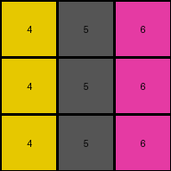
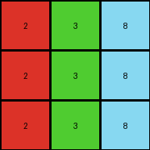

002 • History
=============

:puzzle_id: 4-0d3d703e
:description: example_2
:timestamp: 24.356.195518
:call_count: 2

Begin puzzle: 4-0d3d703e

**example_1**

**input**

.. code-block::

   [[3 1 2]
    [3 1 2]
    [3 1 2]]

**output**

.. code-block::

   [[4 5 6]
    [4 5 6]
    [4 5 6]]

**images**

.. image:: _images/000-example_1_input.png
   :align: left
   :width: 45%

**observations**

The user wants me to analyze the first example of an ARC task. I need to describe the input and output grids, use code to analyze them, and then formulate a natural language program that explains the transformation.

**Plan:**

#. Describe the input grid.
#. Describe the output grid.
#. Use code to analyze the input and output grids (size, colors, differences).
#. Formulate a natural language program for the transformation.

Okay, let's analyze the first example.

The input grid is a 3x3 grid. The first column is green, the second column is blue, and the third column is red.

The output grid is also a 3x3 grid. The first column is yellow, the second column is gray, and the third column is magenta.

.. code-block:: yaml

   input:
     width: 3
     height: 3
     colors:
       3: 3 (green)
       1: 3 (blue)
       2: 3 (red)
     objects:
       - size: 3, position: column 1, color: green
       - size: 3, position: column 2, color: blue
       - size: 3, position: column 3, color: red

.. code-block:: yaml

   output:
     width: 3
     height: 3
     colors:
       4: 3 (yellow)
       5: 3 (gray)
       6: 3 (magenta)
     objects:
       - size: 3, position: column 1, color: yellow
       - size: 3, position: column 2, color: gray
       - size: 3, position: column 3, color: magenta

Now let's use code to identify the differences.

.. code-block:: tool_code

   def analyze_grid(grid):
       height = len(grid)
       width = len(grid[0])
       colors = {}
       for row in grid:
           for cell in row:
               colors[cell] = colors.get(cell, 0) + 1
       return {"width": width, "height": height, "colors": colors}

   input_grid = [[3, 1, 2], [3, 1, 2], [3, 1, 2]]
   output_grid = [[4, 5, 6], [4, 5, 6], [4, 5, 6]]

   input_analysis = analyze_grid(input_grid)
   output_analysis = analyze_grid(output_grid)

   print("Input analysis:", input_analysis)
   print("Output analysis:", output_analysis)

   differences = {}
   if input_analysis['width'] != output_analysis['width'] or input_analysis['height'] != output_analysis['height']:
       differences['size_change'] = 'yes'
   else:
       differences['size_change'] = 'no'

   changed_cells = 0
   color_changes = {}
   for r in range(input_analysis['height']):
       for c in range(input_analysis['width']):
           if input_grid[r][c] != output_grid[r][c]:
               changed_cells += 1
               old_color = input_grid[r][c]
               new_color = output_grid[r][c]
               if old_color not in color_changes:
                   color_changes[old_color] = new_color

   differences['cells_changed'] = changed_cells
   differences['color_changes'] = color_changes

   print("Differences:", differences)

.. code-block:: yaml

   differences:
     cells_changed: 9
     colors_changed: {3: 4, 1: 5, 2: 6}
     transformation:
       - It looks like each color in the input is consistently mapped to a new color in the output.
       - Green (3) maps to Yellow (4).
       - Blue (1) maps to Gray (5).
       - Red (2) maps to Magenta (6).
       - The grid dimensions remain the same.

**Natural language program:**

The input grid is a 3x3 grid with three distinct colors arranged in columns: green in the first, blue in the second, and red in the third. The output grid has the same dimensions. To generate the output grid, iterate through each pixel in the input grid. If the pixel is green, change its color to yellow. If the pixel is blue, change its color to gray. If the pixel is red, change its color to magenta. The positions of the colors remain the same; only the colors themselves are changed according to this mapping.

**example_2**

**input**

.. code-block::

   [[2 3 8]
    [2 3 8]
    [2 3 8]]

**output**

.. code-block::

   [[6 4 9]
    [6 4 9]
    [6 4 9]]

**images**

.. image:: _images/001-example_2_output.png
   :align: left
   :width: 45%

**observations**

====

INSTRUCTIONS:

Review Example
--------------

pairs of input and output grids will be shown to you one at a time

* document your initial observations and impressions

  * begin with a verbal description of your perception of the input and output
    grid

* 
  use ``code_execution`` to examine the grid information and verify the
  assumptions about size, colors, objects, and transformations. Focus your
  analysis on aspects like:

  * Counting the occurrences of each color.
  * Identifying the coordinates of pixels that have changed color or position.
  * Determining if the dimensions of the grid have changed.
  * Analyzing the count, size, shape, and relative positions of objects (contiguous
    blocks of the same color).

* 
  since the code you use may not be carried forward on following prompts, be
  sure to have the code print your findings in the output

* use what you learn to develop a natural language program of the
  transformation rule.
* review your findings and try to determine the natural language description of
  the transformation rule. How does the information captured in the YAML block
  inform your understanding of the transformation?

use a yaml block to capture details (examples):

.. code-block:: yaml

   input:
     width: X
     height: Y
     colors:
       - N: (count)
     objects:
       - size, position and color - desc

.. code-block:: yaml

   differences:
     cells_changed: N
     colors_changed: desc
     transformation:
       - speculate on transformation rules

final step - provide a thorough natural language program
to tell another intelligent entity how to transform the input grid into the
output grid

.. seealso::

   - :doc:`002-history`
   - :doc:`002-response`
