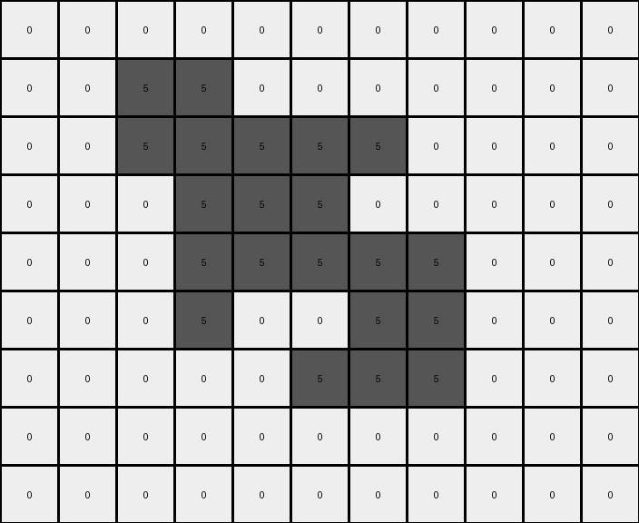
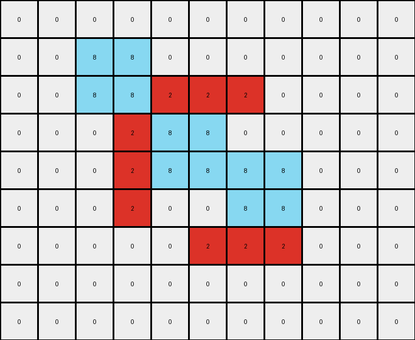
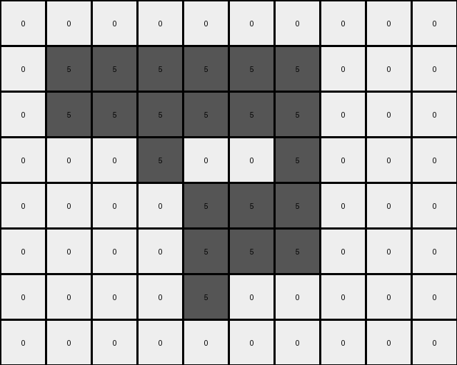

002 • History
=============

:puzzle_id: 5-150deff5
:description: example_2
:timestamp: 24.356.195518
:call_count: 2

Begin puzzle: 5-150deff5

**example_1**

**input**

.. code-block::

   [[0 0 0 0 0 0 0 0 0 0 0]
    [0 0 5 5 0 0 0 0 0 0 0]
    [0 0 5 5 5 5 5 0 0 0 0]
    [0 0 0 5 5 5 0 0 0 0 0]
    [0 0 0 5 5 5 5 5 0 0 0]
    [0 0 0 5 0 0 5 5 0 0 0]
    [0 0 0 0 0 5 5 5 0 0 0]
    [0 0 0 0 0 0 0 0 0 0 0]
    [0 0 0 0 0 0 0 0 0 0 0]]

**output**

.. code-block::

   [[0 0 0 0 0 0 0 0 0 0 0]
    [0 0 8 8 0 0 0 0 0 0 0]
    [0 0 8 8 2 2 2 0 0 0 0]
    [0 0 0 2 8 8 0 0 0 0 0]
    [0 0 0 2 8 8 8 8 0 0 0]
    [0 0 0 2 0 0 8 8 0 0 0]
    [0 0 0 0 0 2 2 2 0 0 0]
    [0 0 0 0 0 0 0 0 0 0 0]
    [0 0 0 0 0 0 0 0 0 0 0]]

**images**

**observations**

The user wants me to analyze an input-output pair of grids in an ARC task. I need to describe the grids, identify the differences between them, and formulate a natural language program for the transformation.

**Plan:**

#. Describe the input grid.
#. Describe the output grid.
#. Identify the differences between the input and output grids.
#. Hypothesize the transformation rule based on the differences.
#. Formulate a natural language program.

**Execution:**

**Input Grid Analysis:**

* The input grid has dimensions 9x11.
* It contains gray (5) and white (0) pixels.
* There is a central gray object resembling a stylized "H".

**Output Grid Analysis:**

* The output grid has the same dimensions, 9x11.
* It contains azure (8), red (2), and white (0) pixels.
* The central object has changed colors. The outer pixels of the original gray object are now azure, and the inner pixels are now red.

**Differences:**

* The gray pixels in the input have been transformed into azure and red in the output.
* The shape of the object remains the same.

**Hypothesized Transformation:**

* The transformation involves recoloring the connected component of gray pixels. The outermost layer of the gray object is colored azure, and the interior of that object is colored red.

Okay, let's analyze the first example.

The input grid shows a gray shape on a white background. The output grid shows a similar shape, but with different colors.

.. code-block:: yaml

   input:
     width: 11
     height: 9
     colors:
       0: 74
       5: 25
     objects:
       - color: gray
         shape: H-like
         pixels: 25
         positions: Determined by the coordinates of the gray pixels

.. code-block:: yaml

   output:
     width: 11
     height: 9
     colors:
       0: 74
       8: 12
       2: 13
     objects:
       - color: azure
         shape: outer boundary of the original gray shape
         pixels: 12
         positions: Determined by the coordinates of the azure pixels
       - color: red
         shape: inner part of the original gray shape
         pixels: 13
         positions: Determined by the coordinates of the red pixels

.. code-block:: yaml

   differences:
     cells_changed: 25
     colors_changed: gray to azure and red
     transformation:
       - Identify the connected component of gray pixels.
       - Change the color of the outermost layer of this component to azure.
       - Change the color of the inner part of this component to red.

**Natural Language Program:**

#. Identify the contiguous block of gray pixels in the input grid.
#. Create an output grid identical to the input grid.
#. Identify the pixels that form the outer boundary of the gray object. These are the gray pixels that have at least one neighboring pixel (horizontally or vertically) that is white.
#. Change the color of these boundary pixels in the output grid to azure.
#. Identify the remaining gray pixels within the boundary of the original gray object.
#. Change the color of these remaining pixels in the output grid to red.

**example_2**

**input**

.. code-block::

   [[0 0 0 0 0 0 0 0 0 0]
    [0 5 5 5 5 5 5 0 0 0]
    [0 5 5 5 5 5 5 0 0 0]
    [0 0 0 5 0 0 5 0 0 0]
    [0 0 0 0 5 5 5 0 0 0]
    [0 0 0 0 5 5 5 0 0 0]
    [0 0 0 0 5 0 0 0 0 0]
    [0 0 0 0 0 0 0 0 0 0]]

**output**

.. code-block::

   [[0 0 0 0 0 0 0 0 0 0]
    [0 8 8 2 8 8 2 0 0 0]
    [0 8 8 2 8 8 2 0 0 0]
    [0 0 0 2 0 0 2 0 0 0]
    [0 0 0 0 2 8 8 0 0 0]
    [0 0 0 0 2 8 8 0 0 0]
    [0 0 0 0 2 0 0 0 0 0]
    [0 0 0 0 0 0 0 0 0 0]]

**images**

.. image:: _images/001-example_2_output.png
   :align: left
   :width: 45%

**observations**

====

INSTRUCTIONS:

Review Example
--------------

pairs of input and output grids will be shown to you one at a time

* document your initial observations and impressions

  * begin with a verbal description of your perception of the input and output
    grid

* 
  use ``code_execution`` to examine the grid information and verify the
  assumptions about size, colors, objects, and transformations. Focus your
  analysis on aspects like:

  * Counting the occurrences of each color.
  * Identifying the coordinates of pixels that have changed color or position.
  * Determining if the dimensions of the grid have changed.
  * Analyzing the count, size, shape, and relative positions of objects (contiguous
    blocks of the same color).

* 
  since the code you use may not be carried forward on following prompts, be
  sure to have the code print your findings in the output

* use what you learn to develop a natural language program of the
  transformation rule.
* review your findings and try to determine the natural language description of
  the transformation rule. How does the information captured in the YAML block
  inform your understanding of the transformation?

use a yaml block to capture details (examples):

.. code-block:: yaml

   input:
     width: X
     height: Y
     colors:
       - N: (count)
     objects:
       - size, position and color - desc

.. code-block:: yaml

   differences:
     cells_changed: N
     colors_changed: desc
     transformation:
       - speculate on transformation rules

final step - provide a thorough natural language program
to tell another intelligent entity how to transform the input grid into the
output grid

.. seealso::

   - :doc:`002-history`
   - :doc:`002-response`
