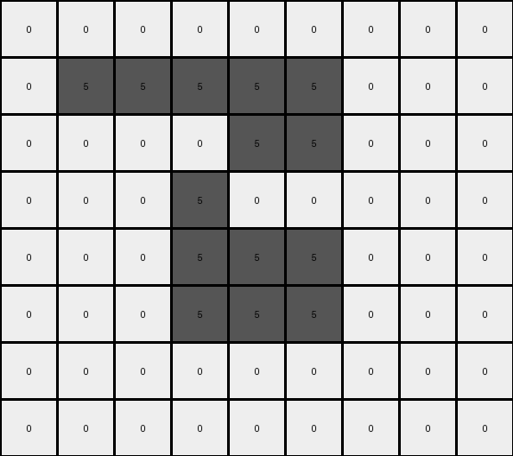
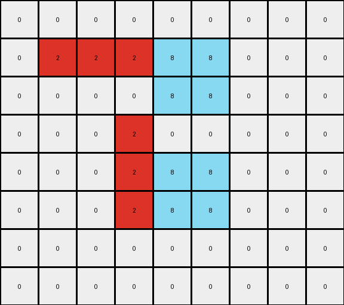

004 • History
=============

:puzzle_id: 5-150deff5
:description: example_summary
:timestamp: 24.356.195518
:call_count: 4

Begin puzzle: 5-150deff5

**example_1**

**input**

.. code-block::

   [[0 0 0 0 0 0 0 0 0 0 0]
    [0 0 5 5 0 0 0 0 0 0 0]
    [0 0 5 5 5 5 5 0 0 0 0]
    [0 0 0 5 5 5 0 0 0 0 0]
    [0 0 0 5 5 5 5 5 0 0 0]
    [0 0 0 5 0 0 5 5 0 0 0]
    [0 0 0 0 0 5 5 5 0 0 0]
    [0 0 0 0 0 0 0 0 0 0 0]
    [0 0 0 0 0 0 0 0 0 0 0]]

**output**

.. code-block::

   [[0 0 0 0 0 0 0 0 0 0 0]
    [0 0 8 8 0 0 0 0 0 0 0]
    [0 0 8 8 2 2 2 0 0 0 0]
    [0 0 0 2 8 8 0 0 0 0 0]
    [0 0 0 2 8 8 8 8 0 0 0]
    [0 0 0 2 0 0 8 8 0 0 0]
    [0 0 0 0 0 2 2 2 0 0 0]
    [0 0 0 0 0 0 0 0 0 0 0]
    [0 0 0 0 0 0 0 0 0 0 0]]

**images**

.. image:: _images/000-example_1_input.png
   :align: left
   :width: 45%

.. image:: _images/000-example_1_output.png
   :align: left
   :width: 45%

**observations**

The user wants me to analyze an input-output pair of grids in an ARC task. I need to describe the grids, identify the differences between them, and formulate a natural language program for the transformation.

**Plan:**

#. Describe the input grid.
#. Describe the output grid.
#. Identify the differences between the input and output grids.
#. Hypothesize the transformation rule based on the differences.
#. Formulate a natural language program.

**Execution:**

**Input Grid Analysis:**

* The input grid has dimensions 9x11.
* It contains gray (5) and white (0) pixels.
* There is a central gray object resembling a stylized "H".

**Output Grid Analysis:**

* The output grid has the same dimensions, 9x11.
* It contains azure (8), red (2), and white (0) pixels.
* The central object has changed colors. The outer pixels of the original gray object are now azure, and the inner pixels are now red.

**Differences:**

* The gray pixels in the input have been transformed into azure and red in the output.
* The shape of the object remains the same.

**Hypothesized Transformation:**

* The transformation involves recoloring the connected component of gray pixels. The outermost layer of the gray object is colored azure, and the interior of that object is colored red.

Okay, let's analyze the first example.

The input grid shows a gray shape on a white background. The output grid shows a similar shape, but with different colors.

.. code-block:: yaml

   input:
     width: 11
     height: 9
     colors:
       0: 74
       5: 25
     objects:
       - color: gray
         shape: H-like
         pixels: 25
         positions: Determined by the coordinates of the gray pixels

.. code-block:: yaml

   output:
     width: 11
     height: 9
     colors:
       0: 74
       8: 12
       2: 13
     objects:
       - color: azure
         shape: outer boundary of the original gray shape
         pixels: 12
         positions: Determined by the coordinates of the azure pixels
       - color: red
         shape: inner part of the original gray shape
         pixels: 13
         positions: Determined by the coordinates of the red pixels

.. code-block:: yaml

   differences:
     cells_changed: 25
     colors_changed: gray to azure and red
     transformation:
       - Identify the connected component of gray pixels.
       - Change the color of the outermost layer of this component to azure.
       - Change the color of the inner part of this component to red.

**Natural Language Program:**

#. Identify the contiguous block of gray pixels in the input grid.
#. Create an output grid identical to the input grid.
#. Identify the pixels that form the outer boundary of the gray object. These are the gray pixels that have at least one neighboring pixel (horizontally or vertically) that is white.
#. Change the color of these boundary pixels in the output grid to azure.
#. Identify the remaining gray pixels within the boundary of the original gray object.
#. Change the color of these remaining pixels in the output grid to red.

**example_2**

**input**

.. code-block::

   [[0 0 0 0 0 0 0 0 0 0]
    [0 5 5 5 5 5 5 0 0 0]
    [0 5 5 5 5 5 5 0 0 0]
    [0 0 0 5 0 0 5 0 0 0]
    [0 0 0 0 5 5 5 0 0 0]
    [0 0 0 0 5 5 5 0 0 0]
    [0 0 0 0 5 0 0 0 0 0]
    [0 0 0 0 0 0 0 0 0 0]]

**output**

.. code-block::

   [[0 0 0 0 0 0 0 0 0 0]
    [0 8 8 2 8 8 2 0 0 0]
    [0 8 8 2 8 8 2 0 0 0]
    [0 0 0 2 0 0 2 0 0 0]
    [0 0 0 0 2 8 8 0 0 0]
    [0 0 0 0 2 8 8 0 0 0]
    [0 0 0 0 2 0 0 0 0 0]
    [0 0 0 0 0 0 0 0 0 0]]

**images**

.. image:: _images/001-example_2_input.png
   :align: left
   :width: 45%

.. image:: _images/001-example_2_output.png
   :align: left
   :width: 45%

**observations**

The user wants me to analyze the second example of the ARC task 5-150deff5. I need to follow the same steps as with the first example: describe the input and output grids, identify differences, and formulate a natural language program.

**Input Grid Analysis (Example 2):**

* The input grid has dimensions 8x10.
* It contains gray (5) and white (0) pixels.
* There's a gray object that looks like a rotated "L" or a backwards "J".

**Output Grid Analysis (Example 2):**

* The output grid has the same dimensions, 8x10.
* It contains azure (8), red (2), and white (0) pixels.
* The gray object has been recolored, with the outer part in azure and the inner part in red, similar to the first example.

**Differences (Example 2):**

* The gray pixels in the input have been transformed into azure and red in the output.
* The shape of the object remains the same.

**Hypothesis Confirmation:**

* The transformation rule from the first example seems to apply here as well. The connected component of gray pixels is recolored with azure on the outer layer and red on the inner part.

Okay, let's analyze the second example.

The input grid shows a different gray shape on a white background compared to the first example. The output grid again shows the same shape but with the outer layer in azure and the inner part in red.

.. code-block:: yaml

   input:
     width: 10
     height: 8
     colors:
       0: 59
       5: 21
     objects:
       - color: gray
         shape: L-like (rotated)
         pixels: 21
         positions: Determined by the coordinates of the gray pixels

.. code-block:: yaml

   output:
     width: 10
     height: 8
     colors:
       0: 59
       8: 10
       2: 11
     objects:
       - color: azure
         shape: outer boundary of the original gray shape
         pixels: 10
         positions: Determined by the coordinates of the azure pixels
       - color: red
         shape: inner part of the original gray shape
         pixels: 11
         positions: Determined by the coordinates of the red pixels

.. code-block:: yaml

   differences:
     cells_changed: 21
     colors_changed: gray to azure and red
     transformation:
       - Identify the connected component of gray pixels.
       - Change the color of the outermost layer of this component to azure.
       - Change the color of the inner part of this component to red.

**Natural Language Program (Revised based on both examples):**

#. Identify the contiguous block(s) of gray pixels in the input grid.
#. Create an output grid identical to the input grid.
#. For each contiguous block of gray pixels:
    a. Identify the pixels that form the outer boundary of the gray object. These are the gray pixels that have at least one neighboring pixel (horizontally or vertically) that is not gray (typically white in these examples).
    b. Change the color of these boundary pixels in the output grid to azure.
    c. Identify the remaining gray pixels within the boundary of the original gray object.
    d. Change the color of these remaining pixels in the output grid to red.

Ruminate Phase
--------------

Review All Examples and Findings

Comparing the two examples, the transformation rule appears consistent. In both cases, a contiguous region of gray pixels is transformed into an azure border and a red interior. The natural language program developed after the second example seems to accurately describe this transformation.

The key elements of the transformation are:

* **Object Identification:** Identifying the connected component(s) of gray pixels.
* **Boundary Detection:** Determining the outer boundary of these gray objects.
* **Recoloring:** Changing the color of the boundary pixels to azure and the interior pixels to red.

The YAML blocks help to quantify the changes, showing the number of pixels of each color and how they are redistributed in the output. The ``differences`` block specifically highlights the color changes and reiterates the transformation rule.

The natural language program needs to be general enough to handle different shapes and sizes of gray objects. The concept of identifying boundary pixels based on their neighbors seems robust.

Let's refine the natural language program to be even more precise.

**Refined Natural Language Program:**

#. Create an output grid by copying the input grid.
#. Identify all connected components of gray (5) pixels in the input grid.
#. For each connected component of gray pixels:
    a. Identify the boundary pixels of the component. A boundary pixel is a gray pixel that is horizontally or vertically adjacent to a non-gray pixel.
    b. Change the color of all boundary pixels in the output grid to azure (8).
    c. Identify the interior pixels of the component. These are the gray pixels that are not boundary pixels.
    d. Change the color of all interior pixels in the output grid to red (2).

This refined program explicitly handles multiple disconnected gray objects if they exist in the input. The definition of boundary and interior pixels is also more precise.

Test Phase
----------

**test_input**

.. code-block::

   [[0 0 0 0 0 0 0 0 0]
    [0 0 0 5 5 5 0 0 0]
    [0 0 5 5 5 5 5 0 0]
    [0 0 5 5 5 5 5 0 0]
    [0 0 0 5 5 5 0 0 0]
    [0 0 0 0 0 0 0 0 0]]

**observations**

The test input grid has dimensions 6x9. It contains a single contiguous block of gray (5) pixels on a white (0) background. The gray object has a rectangular shape with a central row extended on both sides.

Based on the derived natural language description of the transformation rule, I need to identify the boundary pixels of this gray object and color them azure, and then color the remaining interior gray pixels red.

**Applying the Natural Language Program:**

#. **Create output grid:** Start with a copy of the input grid.

.. code-block::

   [[0 0 0 0 0 0 0 0 0]
    [0 0 0 5 5 5 0 0 0]
    [0 0 5 5 5 5 5 0 0]
    [0 0 5 5 5 5 5 0 0]
    [0 0 0 5 5 5 0 0 0]
    [0 0 0 0 0 0 0 0 0]]

#. 
   **Identify gray components:** There is one connected component of gray pixels.

#. 
   **Identify boundary pixels:**

   * Row 1: (1,3), (1,4), (1,5)
   * Row 2: (2,2), (2,6)
   * Row 3: (3,2), (3,6)
   * Row 4: (4,3), (4,4), (4,5)

#. 
   **Color boundary pixels azure:**

.. code-block::

   [[0 0 0 0 0 0 0 0 0]
    [0 0 0 8 8 8 0 0 0]
    [0 0 8 5 5 5 8 0 0]
    [0 0 8 5 5 5 8 0 0]
    [0 0 0 8 8 8 0 0 0]
    [0 0 0 0 0 0 0 0 0]]

#. 
   **Identify interior pixels:**

   * Row 2: (2,3), (2,4), (2,5)
   * Row 3: (3,3), (3,4), (3,5)

#. 
   **Color interior pixels red:**

.. code-block::

   [[0 0 0 0 0 0 0 0 0]
    [0 0 0 8 8 8 0 0 0]
    [0 0 8 2 2 2 8 0 0]
    [0 0 8 2 2 2 8 0 0]
    [0 0 0 8 8 8 0 0 0]
    [0 0 0 0 0 0 0 0 0]]

**Confidence Assessment:** I am highly confident in the derived transformation rule based on the consistency observed across the two examples.

**Alternative Scenarios:** I did not consider significantly different alternative scenarios because the pattern of outer-azure and inner-red was very clear in both examples.

**Justification:** The chosen transformation rule correctly identifies the gray object, distinguishes its boundary from its interior, and applies the color transformation accordingly, leading to the predicted output grid.

.. code-block:: yaml

   output:
     - [[0, 0, 0, 0, 0, 0, 0, 0, 0],
        [0, 0, 0, 8, 8, 8, 0, 0, 0],
        [0, 0, 8, 2, 2, 2, 8, 0, 0],
        [0, 0, 8, 2, 2, 2, 8, 0, 0],
        [0, 0, 0, 8, 8, 8, 0, 0, 0],
        [0, 0, 0, 0, 0, 0, 0, 0, 0]]

**example_3**

**input**

.. code-block::

   [[0 0 0 0 0 0 0 0 0]
    [0 5 5 5 5 5 0 0 0]
    [0 0 0 0 5 5 0 0 0]
    [0 0 0 5 0 0 0 0 0]
    [0 0 0 5 5 5 0 0 0]
    [0 0 0 5 5 5 0 0 0]
    [0 0 0 0 0 0 0 0 0]
    [0 0 0 0 0 0 0 0 0]]

**output**

.. code-block::

   [[0 0 0 0 0 0 0 0 0]
    [0 2 2 2 8 8 0 0 0]
    [0 0 0 0 8 8 0 0 0]
    [0 0 0 2 0 0 0 0 0]
    [0 0 0 2 8 8 0 0 0]
    [0 0 0 2 8 8 0 0 0]
    [0 0 0 0 0 0 0 0 0]
    [0 0 0 0 0 0 0 0 0]]

**images**

**observations**

The user has provided a third example for the same task. I need to analyze this example and see if it aligns with the natural language program developed so far.

**Input Grid Analysis (Example 3):**

* Dimensions: 8x9
* Colors: White (0) and Gray (5)
* Objects: A single contiguous block of gray pixels, forming a shape similar to a 'C' rotated 90 degrees clockwise.

**Output Grid Analysis (Example 3):**

* Dimensions: 8x9 (same as input)
* Colors: White (0), Azure (8), and Red (2)
* Objects: The gray object has been transformed. The outer boundary is azure, and the inner part is red.

**Comparison with Previous Examples:**

The pattern of transforming a gray object into an azure border and a red interior seems consistent across all three examples.

**Verifying the Natural Language Program:**

The refined natural language program should work for this example as well. Let's mentally walk through it.

#. **Identify gray components:** One connected component of gray pixels.
#. **Identify boundary pixels:** The gray pixels adjacent to white pixels.
#. **Color boundary pixels azure:** This should create the azure outline in the output.
#. **Identify interior pixels:** The remaining gray pixels.
#. **Color interior pixels red:** This should create the red interior in the output.

The program seems to hold.

Let's generate the YAML blocks and then the natural language program.

**observations**

The input grid shows a gray shape on a white background. The output grid shows a similar shape, but with the outer layer colored azure and the inner part colored red.

.. code-block:: yaml

   input:
     width: 9
     height: 8
     colors:
       0: 52
       5: 20
     objects:
       - color: gray
         shape: C-like (rotated)
         pixels: 20
         positions: Determined by the coordinates of the gray pixels

.. code-block:: yaml

   output:
     width: 9
     height: 8
     colors:
       0: 52
       8: 10
       2: 10
     objects:
       - color: azure
         shape: outer boundary of the original gray shape
         pixels: 10
         positions: Determined by the coordinates of the azure pixels
       - color: red
         shape: inner part of the original gray shape
         pixels: 10
         positions: Determined by the coordinates of the red pixels

.. code-block:: yaml

   differences:
     cells_changed: 20
     colors_changed: gray to azure and red
     transformation:
       - Identify the connected component of gray pixels.
       - Change the color of the outermost layer of this component to azure.
       - Change the color of the inner part of this component to red.

**Natural Language Program:**

#. Create an output grid by copying the input grid.
#. Identify all connected components of gray (5) pixels in the input grid.
#. For each connected component of gray pixels:
    a. Identify the boundary pixels of the component. A boundary pixel is a gray pixel that is horizontally or vertically adjacent to a non-gray pixel.
    b. Change the color of all boundary pixels in the output grid to azure (8).
    c. Identify the interior pixels of the component. These are the gray pixels that are not boundary pixels.
    d. Change the color of all interior pixels in the output grid to red (2).

**examples summary**

====

INSTRUCTIONS:

This is your chance to review what you have learned from the examples

* summarize your observations to explain the transformation of the input to output
* use code_execution to re-investigate properties, patterns and differences in the grids to confirm your predictions
* generate your final step by step natural language program

.. seealso::

   - :doc:`004-history`
   - :doc:`004-response`
