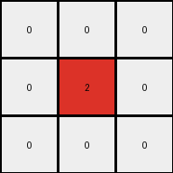
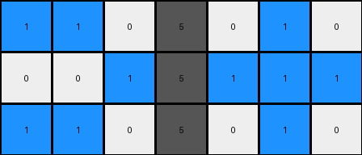
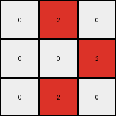

002 • History
=============

:puzzle_id: 6-0520fde7
:description: example_2
:timestamp: 24.356.195518
:call_count: 2

Begin puzzle: 6-0520fde7

**example_1**

**input**

.. code-block::

   [[1 0 0 5 0 1 0]
    [0 1 0 5 1 1 1]
    [1 0 0 5 0 0 0]]

**output**

.. code-block::

   [[0 0 0]
    [0 2 0]
    [0 0 0]]

**images**

.. image:: _images/000-example_1_input.png
   :align: left
   :width: 45%

**observations**

The user wants me to analyze the first example of an ARC task. I need to describe the input and output grids, use code to analyze them, and then formulate a natural language program explaining the transformation.

**Plan:**

#. Describe the input grid.
#. Describe the output grid.
#. Use code to analyze the input and output grids, focusing on color counts, changed pixels, dimensions, and objects.
#. Document findings in YAML blocks.
#. Formulate a natural language program for the transformation.

Okay, let's analyze the first example.

The input grid is 3 rows by 7 columns. It contains blue (1), white (0), and gray (5) pixels. There appear to be horizontal lines of blue pixels separated by white pixels, with a vertical column of gray pixels in the middle.

The output grid is 3 rows by 3 columns. It contains white (0) and red (2) pixels. There is a single red pixel in the center surrounded by white pixels.

.. code-block:: python

   import numpy as np
   from collections import Counter

   input_grid = np.array([[1, 0, 0, 5, 0, 1, 0],
                          [0, 1, 0, 5, 1, 1, 1],
                          [1, 0, 0, 5, 0, 0, 0]])
   output_grid = np.array([[0, 0, 0],
                           [0, 2, 0],
                           [0, 0, 0]])

   input_colors = Counter(input_grid.flatten())
   output_colors = Counter(output_grid.flatten())

   changed_pixels = np.where(input_grid != output_grid)
   changed_input_coords = list(zip(changed_pixels[0], changed_pixels[1]))

   print("Input Grid Analysis:")
   print(f"  Shape: {input_grid.shape}")
   print(f"  Colors: {input_colors}")

   print("\nOutput Grid Analysis:")
   print(f"  Shape: {output_grid.shape}")
   print(f"  Colors: {output_colors}")

   print("\nDifferences:")
   print(f"  Input changed pixels coordinates: {changed_input_coords}")

.. code-block:: yaml

   input:
     width: 7
     height: 3
     colors:
       blue: 3
       white: 11
       gray: 3
     objects:
       - color: blue
         form: horizontal line
         positions: [[0,0],[0,5]], [[1,1]], [[1,4],[1,5],[1,6]], [[2,0]]
       - color: gray
         form: vertical line
         positions: [[0,3],[1,3],[2,3]]
   output:
     width: 3
     height: 3
     colors:
       white: 8
       red: 1
     objects:
       - color: red
         form: single pixel
         position: [1,1]

.. code-block:: yaml

   differences:
     cells_changed: 21
     colors_changed:
       input: [1, 0, 5]
       output: [0, 2]
     transformation:
       - The output grid is a smaller central portion of the input grid.
       - The central gray column in the input seems to correspond to the red pixel in the output.

**Natural Language Program:**

The input grid contains horizontal lines of blue pixels and a central vertical line of gray pixels on a white background. The output grid is a 3x3 grid where the central pixel is red and the rest are white.

To create the output grid from the input grid:

#. Identify the center column of the input grid.
#. Create a 3x3 output grid filled with white pixels.
#. Set the color of the center pixel of the output grid to red. The color of this pixel is derived from the color of the pixels in the center column of the input grid. Specifically, if the center column of the input grid contains gray pixels, the center pixel of the output grid should be red.

**example_2**

**input**

.. code-block::

   [[1 1 0 5 0 1 0]
    [0 0 1 5 1 1 1]
    [1 1 0 5 0 1 0]]

**output**

.. code-block::

   [[0 2 0]
    [0 0 2]
    [0 2 0]]

**images**

**observations**

====

INSTRUCTIONS:

Review Example
--------------

pairs of input and output grids will be shown to you one at a time

* document your initial observations and impressions

  * begin with a verbal description of your perception of the input and output
    grid

* 
  use ``code_execution`` to examine the grid information and verify the
  assumptions about size, colors, objects, and transformations. Focus your
  analysis on aspects like:

  * Counting the occurrences of each color.
  * Identifying the coordinates of pixels that have changed color or position.
  * Determining if the dimensions of the grid have changed.
  * Analyzing the count, size, shape, and relative positions of objects (contiguous
    blocks of the same color).

* 
  since the code you use may not be carried forward on following prompts, be
  sure to have the code print your findings in the output

* use what you learn to develop a natural language program of the
  transformation rule.
* review your findings and try to determine the natural language description of
  the transformation rule. How does the information captured in the YAML block
  inform your understanding of the transformation?

use a yaml block to capture details (examples):

.. code-block:: yaml

   input:
     width: X
     height: Y
     colors:
       - N: (count)
     objects:
       - size, position and color - desc

.. code-block:: yaml

   differences:
     cells_changed: N
     colors_changed: desc
     transformation:
       - speculate on transformation rules

final step - provide a thorough natural language program
to tell another intelligent entity how to transform the input grid into the
output grid

.. seealso::

   - :doc:`002-history`
   - :doc:`002-response`
