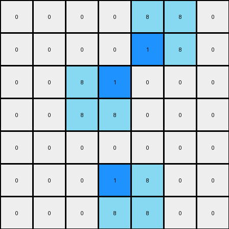

003 • History
=============

:puzzle_id: 1-3aa6fb7a
:description: example_summary
:timestamp: 24.357.081407
:call_count: 3

Begin puzzle: 1-3aa6fb7a

**example_1**

**input**

.. code-block::

   [[0 0 0 0 0 0 0]
    [0 8 0 0 0 0 0]
    [0 8 8 0 0 0 0]
    [0 0 0 0 8 8 0]
    [0 0 0 0 0 8 0]
    [0 0 0 0 0 0 0]
    [0 0 0 0 0 0 0]]

**output**

.. code-block::

   [[0 0 0 0 0 0 0]
    [0 8 1 0 0 0 0]
    [0 8 8 0 0 0 0]
    [0 0 0 0 8 8 0]
    [0 0 0 0 1 8 0]
    [0 0 0 0 0 0 0]
    [0 0 0 0 0 0 0]]

**images**

.. image:: _images/000-example_1_input.png
   :align: left
   :width: 45%

.. image:: _images/000-example_1_output.png
   :align: left
   :width: 45%

**observations**

The user wants me to analyze an example pair of input and output grids from an ARC task. I need to observe the grids, identify differences, and formulate a natural language program that describes the transformation from input to output.

**Plan:**

#. **Perceptual Description:** Describe the input and output grids verbally.
#. **Code Examination:** Use code to extract grid information (dimensions, colors, object properties, differences).
#. **YAML Documentation:** Capture key information about the input and differences in YAML format.
#. **Transformation Rule (Hypothesis):** Based on the observations, propose a preliminary natural language description of the transformation.
#. **Natural Language Program:** Refine the transformation rule into a detailed natural language program.

The input grid contains an 'azure' (8) object that resembles a sideways 'L' shape in the top-left and bottom-right. The background is 'white' (0). The output grid is nearly identical to the input, except that two 'white' (0) pixels adjacent to the 'azure' (8) object have been changed to 'blue' (1).

.. code-block:: python

   import numpy as np
   from collections import Counter

   input_grid = np.array([[0, 0, 0, 0, 0, 0, 0],
                          [0, 8, 0, 0, 0, 0, 0],
                          [0, 8, 8, 0, 0, 0, 0],
                          [0, 0, 0, 0, 8, 8, 0],
                          [0, 0, 0, 0, 0, 8, 0],
                          [0, 0, 0, 0, 0, 0, 0],
                          [0, 0, 0, 0, 0, 0, 0]])

   output_grid = np.array([[0, 0, 0, 0, 0, 0, 0],
                           [0, 8, 1, 0, 0, 0, 0],
                           [0, 8, 8, 0, 0, 0, 0],
                           [0, 0, 0, 0, 8, 8, 0],
                           [0, 0, 0, 0, 1, 8, 0],
                           [0, 0, 0, 0, 0, 0, 0],
                           [0, 0, 0, 0, 0, 0, 0]])

   input_colors = Counter(input_grid.flatten())
   output_colors = Counter(output_grid.flatten())

   print("Input Grid Analysis:")
   print(f"  Dimensions: {input_grid.shape}")
   print(f"  Color counts: {input_colors}")

   print("\nOutput Grid Analysis:")
   print(f"  Dimensions: {output_grid.shape}")
   print(f"  Color counts: {output_colors}")

   diff_coords = np.where(input_grid != output_grid)
   changed_pixels = list(zip(diff_coords[0], diff_coords[1]))
   print("\nDifferences:")
   print(f"  Number of cells changed: {len(changed_pixels)}")
   print("  Coordinates of changed pixels (input -> output):")
   for r, c in changed_pixels:
       print(f"    ({r}, {c}): {input_grid[r, c]} -> {output_grid[r, c]}")

.. code-block:: yaml

   input:
     width: 7
     height: 7
     colors:
       0: 45
       8: 6
     objects:
       - color: azure
         shape: L-like
         positions: [(1, 1), (2, 1), (2, 2), (3, 4), (3, 5), (4, 5)]

.. code-block:: yaml

   differences:
     cells_changed: 2
     colors_changed:
       - white to blue
     transformation:
       - Adjacent white pixels to the azure object are changed to blue.
       - The change seems to occur at the concave corners of the azure 'L' shape.

**Natural Language Program:**

The input grid is a 7x7 grid primarily filled with 'white' (0) pixels. There is a single 'azure' (8) object formed by a contiguous block of pixels, resembling a sideways 'L' shape made of two segments. The first segment is vertical in the top-left, and the second is horizontal in the bottom-right.

To create the output grid, start with a copy of the input grid. Identify the 'azure' (8) object. Locate the 'white' (0) pixels that are directly adjacent (horizontally or vertically) to the 'azure' (8) object, specifically those that fill the concave corners of the 'L' shape. Change the color of these adjacent 'white' (0) pixels to 'blue' (1). The color palette for the output grid includes 'white' (0), 'blue' (1), and 'azure' (8).

**example_2**

**input**

.. code-block::

   [[0 0 0 0 8 8 0]
    [0 0 0 0 0 8 0]
    [0 0 8 0 0 0 0]
    [0 0 8 8 0 0 0]
    [0 0 0 0 0 0 0]
    [0 0 0 0 8 0 0]
    [0 0 0 8 8 0 0]]

**output**

.. code-block::

   [[0 0 0 0 8 8 0]
    [0 0 0 0 1 8 0]
    [0 0 8 1 0 0 0]
    [0 0 8 8 0 0 0]
    [0 0 0 0 0 0 0]
    [0 0 0 1 8 0 0]
    [0 0 0 8 8 0 0]]

**images**

.. image:: _images/001-example_2_input.png
   :align: left
   :width: 45%

**observations**

The user has provided a second example pair for the same puzzle. I need to analyze this new example and see if it confirms or contradicts the hypothesis formed from the first example.

**Plan:**

#. **Perceptual Description:** Describe the input and output grids verbally.
#. **Code Examination:** Use code to extract grid information and compare it with the first example.
#. **YAML Documentation:** Update the YAML blocks with information from the second example.
#. **Refine Transformation Rule:** Based on both examples, refine the natural language description of the transformation.

**example_2**

**input**

.. code-block::

   [[0 0 0 0 8 8 0]
    [0 0 0 0 0 8 0]
    [0 0 8 0 0 0 0]
    [0 0 8 8 0 0 0]
    [0 0 0 0 0 0 0]
    [0 0 0 0 8 0 0]
    [0 0 0 8 8 0 0]]

**output**

.. code-block::

   [[0 0 0 0 8 8 0]
    [0 0 0 0 1 8 0]
    [0 0 8 1 0 0 0]
    [0 0 8 8 0 0 0]
    [0 0 0 0 0 0 0]
    [0 0 0 1 8 0 0]
    [0 0 0 8 8 0 0]]

**images**

.. code-block:: json

   {}

**observations**

The input grid contains an 'azure' (8) object, again resembling an 'L' shape, but rotated and positioned differently compared to the first example. The background is 'white' (0). The output grid is almost identical to the input, with a few 'white' (0) pixels adjacent to the 'azure' (8) object changed to 'blue' (1). It appears the transformation rule identified in the first example is consistent here.

.. code-block:: python

   import numpy as np
   from collections import Counter

   input_grid_2 = np.array([[0, 0, 0, 0, 8, 8, 0],
                            [0, 0, 0, 0, 0, 8, 0],
                            [0, 0, 8, 0, 0, 0, 0],
                            [0, 0, 8, 8, 0, 0, 0],
                            [0, 0, 0, 0, 0, 0, 0],
                            [0, 0, 0, 0, 8, 0, 0],
                            [0, 0, 0, 8, 8, 0, 0]])

   output_grid_2 = np.array([[0, 0, 0, 0, 8, 8, 0],
                             [0, 0, 0, 0, 1, 8, 0],
                             [0, 0, 8, 1, 0, 0, 0],
                             [0, 0, 8, 8, 0, 0, 0],
                             [0, 0, 0, 0, 0, 0, 0],
                             [0, 0, 0, 1, 8, 0, 0],
                             [0, 0, 0, 8, 8, 0, 0]])

   input_colors_2 = Counter(input_grid_2.flatten())
   output_colors_2 = Counter(output_grid_2.flatten())

   print("Input Grid 2 Analysis:")
   print(f"  Dimensions: {input_grid_2.shape}")
   print(f"  Color counts: {input_colors_2}")

   print("\nOutput Grid 2 Analysis:")
   print(f"  Dimensions: {output_grid_2.shape}")
   print(f"  Color counts: {output_colors_2}")

   diff_coords_2 = np.where(input_grid_2 != output_grid_2)
   changed_pixels_2 = list(zip(diff_coords_2[0], diff_coords_2[1]))
   print("\nDifferences (Example 2):")
   print(f"  Number of cells changed: {len(changed_pixels_2)}")
   print("  Coordinates of changed pixels (input -> output):")
   for r, c in changed_pixels_2:
       print(f"    ({r}, {c}): {input_grid_2[r, c]} -> {output_grid_2[r, c]}")

.. code-block:: yaml

   input:
     width: 7
     height: 7
     colors:
       0: 45
       8: 6
     objects:
       - color: azure
         shape: L-like
         positions: [(0, 4), (0, 5), (1, 5), (2, 2), (3, 2), (3, 3)] # Example 2

.. code-block:: yaml

   differences:
     cells_changed: 2
     colors_changed:
       - white to blue
     transformation:
       - Adjacent white pixels to the azure object are changed to blue.
       - The change seems to occur at the concave corners of the azure 'L' shape.

**Natural Language Program:**

The input grid is a 7x7 grid primarily filled with 'white' (0) pixels. There is a single 'azure' (8) object formed by a contiguous block of pixels, resembling a sideways 'L' shape made of two segments.

To create the output grid, start with a copy of the input grid. Identify the 'azure' (8) object. Locate the 'white' (0) pixels that are directly adjacent (horizontally or vertically) to the 'azure' (8) object, specifically those that fill the concave corners of the 'L' shape. Change the color of these adjacent 'white' (0) pixels to 'blue' (1). The color palette for the output grid includes 'white' (0), 'blue' (1), and 'azure' (8).

**Revised Natural Language Program based on both examples:**

The task involves transforming an input grid into an output grid by modifying the colors of certain pixels based on their proximity to an 'azure' (8) L-shaped object.

The input grid consists of a background of 'white' (0) pixels and a single object composed of 'azure' (8) pixels. This 'azure' object has an 'L' shape, potentially oriented in different ways (e.g., upright, inverted, sideways).

To generate the output grid:

#. **Initialization:** Begin with a copy of the input grid.
#. **Object Identification:** Identify the contiguous block of 'azure' (8) pixels, which forms the 'L' shape.
#. **Adjacent Pixel Identification:** Locate the 'white' (0) pixels that are directly adjacent (horizontally or vertically) to the 'azure' (8) object. Specifically, target the 'white' pixels that occupy the inner corner or concave angle of the 'L' shape. There will typically be two such 'white' pixels.
#. **Color Transformation:** Change the color of these identified adjacent 'white' (0) pixels to 'blue' (1).
#. **Color Palette:** The output grid will contain pixels of 'white' (0), 'blue' (1), and 'azure' (8).

**examples summary**

====

INSTRUCTIONS:

This is your chance to review what you have learned from the examples

* summarize your observations to explain the transformation of the input to output
* use code_execution to re-investigate properties, patterns and differences in the grids to confirm your predictions
* generate your final step by step natural language program

Consider the following in this phase:

* **Confidence Assessment:** How confident are you in your derived transformation rule?
* **Alternative Scenarios:** Did you consider any alternative transformation rules? If so, why did you choose the current one?
* **Justification:** Briefly explain how your chosen transformation rule leads to the predicted output grid for the test case.

Ruminate Phase
--------------

During this phase, you should review all examples presented and your findings
and do your best to validate your natural language program.

consider what you have learned from all the examples provided. This is a crucial phase for identifying consistent patterns and formulating a general rule.

Your primary objective is to review the natural language program you've
developed

Actively compare the findings from the analysis of each example pair. Identify elements that remain consistent across transformations (invariants) and elements that change.

Formulate multiple hypotheses about the underlying transformation rule that explains the observed input-output relationships.

Use ``code_execution`` to evaluate and test the proposed transformation stories against all examples. Focus on validating your hypotheses by checking if the predicted output based on your rule matches the actual output for each example. Consider these aspects in your validation:

* Does the rule apply consistently across all examples?
* Are there any exceptions or inconsistencies?
* Can the rule be generalized or does it need to be more specific?

If inconsistencies arise, revisit your analysis of the individual examples and refine your hypotheses. The process of understanding the transformation rule is iterative.

Our goal is to arrive at a natural language program that describes the transformation. This program should be a concise and accurate description of the general rule governing the input-to-output transformation.

.. seealso::

   - :doc:`003-history`
   - :doc:`003-response`
