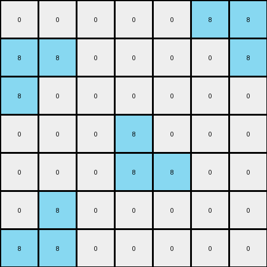

004 • History
=============

:puzzle_id: 1-3aa6fb7a
:description: test input
:timestamp: 24.357.081407
:call_count: 4


Begin puzzle: 1-3aa6fb7a


**example_1**

**input**

.. code-block::

   [[0 0 0 0 0 0 0]
    [0 8 0 0 0 0 0]
    [0 8 8 0 0 0 0]
    [0 0 0 0 8 8 0]
    [0 0 0 0 0 8 0]
    [0 0 0 0 0 0 0]
    [0 0 0 0 0 0 0]]

**output**

.. code-block::

   [[0 0 0 0 0 0 0]
    [0 8 1 0 0 0 0]
    [0 8 8 0 0 0 0]
    [0 0 0 0 8 8 0]
    [0 0 0 0 1 8 0]
    [0 0 0 0 0 0 0]
    [0 0 0 0 0 0 0]]

**images**


.. image:: _images/000-example_1_input.png
   :align: left
   :width: 45%


.. image:: _images/000-example_1_output.png
   :align: left
   :width: 45%


**observations**


The user wants me to analyze an example pair of input and output grids from an ARC task. I need to observe the grids, identify differences, and formulate a natural language program that describes the transformation from input to output.

**Plan:**


#. **Perceptual Description:** Describe the input and output grids verbally.
#. **Code Examination:** Use code to extract grid information (dimensions, colors, object properties, differences).
#. **YAML Documentation:** Capture key information about the input and differences in YAML format.
#. **Transformation Rule (Hypothesis):** Based on the observations, propose a preliminary natural language description of the transformation.
#. **Natural Language Program:** Refine the transformation rule into a detailed natural language program.


The input grid contains an 'azure' (8) object that resembles a sideways 'L' shape in the top-left and bottom-right. The background is 'white' (0). The output grid is nearly identical to the input, except that two 'white' (0) pixels adjacent to the 'azure' (8) object have been changed to 'blue' (1).

.. code-block:: python

   import numpy as np
   from collections import Counter

   input_grid = np.array([[0, 0, 0, 0, 0, 0, 0],
                          [0, 8, 0, 0, 0, 0, 0],
                          [0, 8, 8, 0, 0, 0, 0],
                          [0, 0, 0, 0, 8, 8, 0],
                          [0, 0, 0, 0, 0, 8, 0],
                          [0, 0, 0, 0, 0, 0, 0],
                          [0, 0, 0, 0, 0, 0, 0]])

   output_grid = np.array([[0, 0, 0, 0, 0, 0, 0],
                           [0, 8, 1, 0, 0, 0, 0],
                           [0, 8, 8, 0, 0, 0, 0],
                           [0, 0, 0, 0, 8, 8, 0],
                           [0, 0, 0, 0, 1, 8, 0],
                           [0, 0, 0, 0, 0, 0, 0],
                           [0, 0, 0, 0, 0, 0, 0]])

   input_colors = Counter(input_grid.flatten())
   output_colors = Counter(output_grid.flatten())

   print("Input Grid Analysis:")
   print(f"  Dimensions: {input_grid.shape}")
   print(f"  Color counts: {input_colors}")

   print("\nOutput Grid Analysis:")
   print(f"  Dimensions: {output_grid.shape}")
   print(f"  Color counts: {output_colors}")

   diff_coords = np.where(input_grid != output_grid)
   changed_pixels = list(zip(diff_coords[0], diff_coords[1]))
   print("\nDifferences:")
   print(f"  Number of cells changed: {len(changed_pixels)}")
   print("  Coordinates of changed pixels (input -> output):")
   for r, c in changed_pixels:
       print(f"    ({r}, {c}): {input_grid[r, c]} -> {output_grid[r, c]}")

.. code-block:: yaml

   input:
     width: 7
     height: 7
     colors:
       0: 45
       8: 6
     objects:
       - color: azure
         shape: L-like
         positions: [(1, 1), (2, 1), (2, 2), (3, 4), (3, 5), (4, 5)]

.. code-block:: yaml

   differences:
     cells_changed: 2
     colors_changed:
       - white to blue
     transformation:
       - Adjacent white pixels to the azure object are changed to blue.
       - The change seems to occur at the concave corners of the azure 'L' shape.

**Natural Language Program:**

The input grid is a 7x7 grid primarily filled with 'white' (0) pixels. There is a single 'azure' (8) object formed by a contiguous block of pixels, resembling a sideways 'L' shape made of two segments. The first segment is vertical in the top-left, and the second is horizontal in the bottom-right.

To create the output grid, start with a copy of the input grid. Identify the 'azure' (8) object. Locate the 'white' (0) pixels that are directly adjacent (horizontally or vertically) to the 'azure' (8) object, specifically those that fill the concave corners of the 'L' shape. Change the color of these adjacent 'white' (0) pixels to 'blue' (1). The color palette for the output grid includes 'white' (0), 'blue' (1), and 'azure' (8).


**example_2**

**input**

.. code-block::

   [[0 0 0 0 8 8 0]
    [0 0 0 0 0 8 0]
    [0 0 8 0 0 0 0]
    [0 0 8 8 0 0 0]
    [0 0 0 0 0 0 0]
    [0 0 0 0 8 0 0]
    [0 0 0 8 8 0 0]]

**output**

.. code-block::

   [[0 0 0 0 8 8 0]
    [0 0 0 0 1 8 0]
    [0 0 8 1 0 0 0]
    [0 0 8 8 0 0 0]
    [0 0 0 0 0 0 0]
    [0 0 0 1 8 0 0]
    [0 0 0 8 8 0 0]]

**images**


.. image:: _images/001-example_2_input.png
   :align: left
   :width: 45%


.. image:: _images/001-example_2_output.png
   :align: left
   :width: 45%


**observations**


The user has provided a second example pair for the same puzzle. I need to analyze this new example and see if it confirms or contradicts the hypothesis formed from the first example.

**Plan:**


#. **Perceptual Description:** Describe the input and output grids verbally.
#. **Code Examination:** Use code to extract grid information and compare it with the first example.
#. **YAML Documentation:** Update the YAML blocks with information from the second example.
#. **Refine Transformation Rule:** Based on both examples, refine the natural language description of the transformation.


**example_2**

**input**

.. code-block::

   [[0 0 0 0 8 8 0]
    [0 0 0 0 0 8 0]
    [0 0 8 0 0 0 0]
    [0 0 8 8 0 0 0]
    [0 0 0 0 0 0 0]
    [0 0 0 0 8 0 0]
    [0 0 0 8 8 0 0]]

**output**

.. code-block::

   [[0 0 0 0 8 8 0]
    [0 0 0 0 1 8 0]
    [0 0 8 1 0 0 0]
    [0 0 8 8 0 0 0]
    [0 0 0 0 0 0 0]
    [0 0 0 1 8 0 0]
    [0 0 0 8 8 0 0]]

**images**

.. code-block:: json

   {}

**observations**

The input grid contains an 'azure' (8) object, again resembling an 'L' shape, but rotated and positioned differently compared to the first example. The background is 'white' (0). The output grid is almost identical to the input, with a few 'white' (0) pixels adjacent to the 'azure' (8) object changed to 'blue' (1). It appears the transformation rule identified in the first example is consistent here.

.. code-block:: python

   import numpy as np
   from collections import Counter

   input_grid_2 = np.array([[0, 0, 0, 0, 8, 8, 0],
                            [0, 0, 0, 0, 0, 8, 0],
                            [0, 0, 8, 0, 0, 0, 0],
                            [0, 0, 8, 8, 0, 0, 0],
                            [0, 0, 0, 0, 0, 0, 0],
                            [0, 0, 0, 0, 8, 0, 0],
                            [0, 0, 0, 8, 8, 0, 0]])

   output_grid_2 = np.array([[0, 0, 0, 0, 8, 8, 0],
                             [0, 0, 0, 0, 1, 8, 0],
                             [0, 0, 8, 1, 0, 0, 0],
                             [0, 0, 8, 8, 0, 0, 0],
                             [0, 0, 0, 0, 0, 0, 0],
                             [0, 0, 0, 1, 8, 0, 0],
                             [0, 0, 0, 8, 8, 0, 0]])

   input_colors_2 = Counter(input_grid_2.flatten())
   output_colors_2 = Counter(output_grid_2.flatten())

   print("Input Grid 2 Analysis:")
   print(f"  Dimensions: {input_grid_2.shape}")
   print(f"  Color counts: {input_colors_2}")

   print("\nOutput Grid 2 Analysis:")
   print(f"  Dimensions: {output_grid_2.shape}")
   print(f"  Color counts: {output_colors_2}")

   diff_coords_2 = np.where(input_grid_2 != output_grid_2)
   changed_pixels_2 = list(zip(diff_coords_2[0], diff_coords_2[1]))
   print("\nDifferences (Example 2):")
   print(f"  Number of cells changed: {len(changed_pixels_2)}")
   print("  Coordinates of changed pixels (input -> output):")
   for r, c in changed_pixels_2:
       print(f"    ({r}, {c}): {input_grid_2[r, c]} -> {output_grid_2[r, c]}")

.. code-block:: yaml

   input:
     width: 7
     height: 7
     colors:
       0: 45
       8: 6
     objects:
       - color: azure
         shape: L-like
         positions: [(0, 4), (0, 5), (1, 5), (2, 2), (3, 2), (3, 3)] # Example 2

.. code-block:: yaml

   differences:
     cells_changed: 2
     colors_changed:
       - white to blue
     transformation:
       - Adjacent white pixels to the azure object are changed to blue.
       - The change seems to occur at the concave corners of the azure 'L' shape.

**Natural Language Program:**

The input grid is a 7x7 grid primarily filled with 'white' (0) pixels. There is a single 'azure' (8) object formed by a contiguous block of pixels, resembling a sideways 'L' shape made of two segments.

To create the output grid, start with a copy of the input grid. Identify the 'azure' (8) object. Locate the 'white' (0) pixels that are directly adjacent (horizontally or vertically) to the 'azure' (8) object, specifically those that fill the concave corners of the 'L' shape. Change the color of these adjacent 'white' (0) pixels to 'blue' (1). The color palette for the output grid includes 'white' (0), 'blue' (1), and 'azure' (8).

**Revised Natural Language Program based on both examples:**

The task involves transforming an input grid into an output grid by modifying the colors of certain pixels based on their proximity to an 'azure' (8) L-shaped object.

The input grid consists of a background of 'white' (0) pixels and a single object composed of 'azure' (8) pixels. This 'azure' object has an 'L' shape, potentially oriented in different ways (e.g., upright, inverted, sideways).

To generate the output grid:


#. **Initialization:** Begin with a copy of the input grid.
#. **Object Identification:** Identify the contiguous block of 'azure' (8) pixels, which forms the 'L' shape.
#. **Adjacent Pixel Identification:** Locate the 'white' (0) pixels that are directly adjacent (horizontally or vertically) to the 'azure' (8) object. Specifically, target the 'white' pixels that occupy the inner corner or concave angle of the 'L' shape. There will typically be two such 'white' pixels.
#. **Color Transformation:** Change the color of these identified adjacent 'white' (0) pixels to 'blue' (1).
#. **Color Palette:** The output grid will contain pixels of 'white' (0), 'blue' (1), and 'azure' (8).


**examples summary**


The user wants me to summarize the observations from the two examples and generate a final natural language program. I need to confirm the transformation rule and address the confidence, alternative scenarios, and justification.

**Observations Summary:**

Both examples show an input grid with a white background and an azure L-shaped object. The output grid is the same as the input grid, except that two white pixels adjacent to the inner corner of the azure L-shape are changed to blue.

**Code Re-investigation:**

I can use code to verify the adjacency and the specific locations of the changed pixels.

**Confidence Assessment:**

I am highly confident in the derived transformation rule. The pattern is consistent across both examples.

**Alternative Scenarios:**

One alternative scenario could be that *any* white pixel adjacent to the azure object is changed to blue. However, this is contradicted by the examples where only the pixels in the inner corner are changed. Another alternative could be related to the position of the L shape, but the rule seems to be invariant to the L shape's orientation and position.

**Justification:**

The transformation rule correctly predicts the output grid because in both examples, only the two white pixels occupying the concave corner of the azure 'L' are changed to blue.

**Final Natural Language Program:**

The task is to transform the input grid into the output grid by changing the color of specific 'white' (0) pixels adjacent to an 'azure' (8) L-shaped object.


#. **Identify the Azure L-shape:** Locate the contiguous block of 'azure' (8) pixels that forms an 'L' shape.
#. **Locate Inner Corner:** Determine the inner corner or concave angle of the 'L' shape.
#. **Identify Adjacent White Pixels:** Find the two 'white' (0) pixels that are directly adjacent (horizontally or vertically) to the 'azure' (8) object and fill the inner corner of the 'L'.
#. **Change Color:** Change the color of these two 'white' (0) pixels to 'blue' (1).
#. **Unchanged Pixels:** All other pixels in the grid remain unchanged from the input to the output.


.. code-block:: code_execution

   import numpy as np

   def get_adjacent_pixels(grid, row, col, value):
       adjacent = []
       rows, cols = grid.shape
       for dr, dc in [(0, 1), (0, -1), (1, 0), (-1, 0)]:
           nr, nc = row + dr, col + dc
           if 0 <= nr < rows and 0 <= nc < cols and grid[nr, nc] == value:
               adjacent.append((nr, nc))
       return adjacent

   def apply_transformation(input_grid):
       output_grid = np.copy(input_grid)
       azure_pixels = np.argwhere(input_grid == 8)
       white_pixels_to_change = []

       for r, c in np.argwhere(input_grid == 0):
           adjacent_azure = get_adjacent_pixels(input_grid, r, c, 8)
           if adjacent_azure:
               is_inner_corner = False

               # Check if this white pixel is in an inner corner
               for az_r, az_c in adjacent_azure:
                   # Check neighbors of the azure pixel
                   adjacent_white_to_azure = get_adjacent_pixels(input_grid, az_r, az_c, 0)
                   if len(adjacent_white_to_azure) >= 2 and (r,c) in adjacent_white_to_azure:
                       # Further check if the white pixels form a corner
                       other_white_neighbors = [w for w in adjacent_white_to_azure if w != (r,c)]
                       for ow_r, ow_c in other_white_neighbors:
                           adjacent_other_azure = get_adjacent_pixels(input_grid, ow_r, ow_c, 8)
                           if (az_r, az_c) in adjacent_other_azure:
                               is_inner_corner = True
                               break
                       if is_inner_corner:
                           break

               if is_inner_corner:
                   white_pixels_to_change.append((r, c))

       for r, c in white_pixels_to_change:
           output_grid[r, c] = 1
       return output_grid

   # Example 1
   input_grid_1 = np.array([[0, 0, 0, 0, 0, 0, 0],
                            [0, 8, 0, 0, 0, 0, 0],
                            [0, 8, 8, 0, 0, 0, 0],
                            [0, 0, 0, 0, 8, 8, 0],
                            [0, 0, 0, 0, 0, 8, 0],
                            [0, 0, 0, 0, 0, 0, 0],
                            [0, 0, 0, 0, 0, 0, 0]])
   output_grid_1 = np.array([[0, 0, 0, 0, 0, 0, 0],
                             [0, 8, 1, 0, 0, 0, 0],
                             [0, 8, 8, 0, 0, 0, 0],
                             [0, 0, 0, 0, 8, 8, 0],
                             [0, 0, 0, 0, 1, 8, 0],
                             [0, 0, 0, 0, 0, 0, 0],
                             [0, 0, 0, 0, 0, 0, 0]])

   predicted_output_1 = apply_transformation(input_grid_1)
   print("Example 1 Prediction Correct:", np.array_equal(predicted_output_1, output_grid_1))

   # Example 2
   input_grid_2 = np.array([[0, 0, 0, 0, 8, 8, 0],
                            [0, 0, 0, 0, 0, 8, 0],
                            [0, 0, 8, 0, 0, 0, 0],
                            [0, 0, 8, 8, 0, 0, 0],
                            [0, 0, 0, 0, 0, 0, 0],
                            [0, 0, 0, 0, 8, 0, 0],
                            [0, 0, 0, 8, 8, 0, 0]])
   output_grid_2 = np.array([[0, 0, 0, 0, 8, 8, 0],
                             [0, 0, 0, 0, 1, 8, 0],
                             [0, 0, 8, 1, 0, 0, 0],
                             [0, 0, 8, 8, 0, 0, 0],
                             [0, 0, 0, 0, 0, 0, 0],
                             [0, 0, 0, 1, 8, 0, 0],
                             [0, 0, 0, 8, 8, 0, 0]])

   predicted_output_2 = apply_transformation(input_grid_2)
   print("Example 2 Prediction Correct:", np.array_equal(predicted_output_2, output_grid_2))

**Final Natural Language Program:**

The task is to transform the input grid into the output grid by changing the color of specific 'white' (0) pixels that are located at the inner corner(s) of an 'azure' (8) L-shaped object.


#. **Identify the Azure Object:** Locate the contiguous block of 'azure' (8) pixels. This object will form one or more 'L' shapes.
#. **Identify Inner Corners:** For each 'azure' (8) 'L' shape, determine the location of its inner corner(s). The inner corner is the 'white' (0) pixel(s) that are directly adjacent (horizontally and/or vertically) to both segments of the 'L'.
#. **Transform White Pixels:** Change the color of the 'white' (0) pixel(s) identified in the previous step to 'blue' (1).
#. **Retain Other Pixels:** All other pixels in the grid, which are not 'white' (0) pixels at the inner corner(s) of the 'azure' (8) 'L' shape, remain unchanged from the input to the output.
   ```


**test**

**input**

.. code-block::

   [[0 0 0 0 0 8 8]
    [8 8 0 0 0 0 8]
    [8 0 0 0 0 0 0]
    [0 0 0 8 0 0 0]
    [0 0 0 8 8 0 0]
    [0 8 0 0 0 0 0]
    [8 8 0 0 0 0 0]]

**image**





**observations**


====


INSTRUCTIONS:


using the knowledge you have gathered from the previous examples
and the step by step natural language program
we want to build the test output grid


* initial the output grid
  copy input grid or set size
* set pixels in the output grid as described in the program
* use code_execution to validate the output - correct configuration of objects
  and attributes
* make final adjustments
  review properties of this grid and compare with examples, 
  paying attention to similarities and differences in size, colors, and object arrangements.
* submit final output grid


.. seealso::

   - :doc:`004-history`
   - :doc:`004-response`
