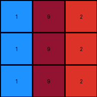

003 • History
=============

:puzzle_id: 4-0d3d703e
:description: example_3
:timestamp: 24.357.081407
:call_count: 3

Begin puzzle: 4-0d3d703e

**example_1**

**input**

.. code-block::

   [[3 1 2]
    [3 1 2]
    [3 1 2]]

**output**

.. code-block::

   [[4 5 6]
    [4 5 6]
    [4 5 6]]

**images**

.. image:: _images/000-example_1_input.png
   :align: left
   :width: 45%

.. image:: _images/000-example_1_output.png
   :align: left
   :width: 45%

**observations**

The user wants me to analyze the first example of an ARC task and describe the transformation from the input to the output grid. I need to observe the grids, identify differences, and then formulate a natural language program that explains the transformation rule.

**Plan:**

#. Describe the input and output grids.
#. Use code to analyze the grids and identify specific changes.
#. Document the findings in YAML format.
#. Develop a natural language program to describe the transformation.

Okay, let's examine the first example pair.

The input grid is a 3x3 grid. The leftmost column is green (3), the middle column is blue (1), and the rightmost column is red (2).

The output grid is also a 3x3 grid. The leftmost column is yellow (4), the middle column is gray (5), and the rightmost column is magenta (6).

.. code-block:: python

   import numpy as np

   input_grid = np.array([[3, 1, 2], [3, 1, 2], [3, 1, 2]])
   output_grid = np.array([[4, 5, 6], [4, 5, 6], [4, 5, 6]])

   input_colors = {}
   for row in input_grid:
       for pixel in row:
           color = int(pixel)
           input_colors[color] = input_colors.get(color, 0) + 1

   output_colors = {}
   for row in output_grid:
       for pixel in row:
           color = int(pixel)
           output_colors[color] = output_colors.get(color, 0) + 1

   changed_pixels = []
   for r in range(input_grid.shape[0]):
       for c in range(input_grid.shape[1]):
           if input_grid[r, c] != output_grid[r, c]:
               changed_pixels.append(((r, c), int(input_grid[r, c]), int(output_grid[r, c])))

   print("Input grid shape:", input_grid.shape)
   print("Output grid shape:", output_grid.shape)
   print("Input color counts:", input_colors)
   print("Output color counts:", output_colors)
   print("Changed pixels (coordinates, old_color, new_color):", changed_pixels)

.. code-block:: yaml

   input:
     width: 3
     height: 3
     colors:
       3: 3 (green)
       1: 3 (blue)
       2: 3 (red)
     objects:
       - size: 3, position: column 1, color: green
       - size: 3, position: column 2, color: blue
       - size: 3, position: column 3, color: red

.. code-block:: yaml

   differences:
     cells_changed: 9
     colors_changed:
       green to yellow in the first column
       blue to gray in the second column
       red to magenta in the third column
     transformation:
       - Each column's color is transformed into a new color.
       - The transformation seems to be consistent across all rows within a column.

**Natural Language Program:**

The input grid is a 3x3 grid with three distinct vertical columns of color. The leftmost column is entirely green, the middle column is entirely blue, and the rightmost column is entirely red.

To create the output grid, initialize a new 3x3 grid.

Determine the new color for each column based on the input column's color. The green color in the first column of the input is transformed to yellow in the first column of the output. The blue color in the second column of the input is transformed to gray in the second column of the output. The red color in the third column of the input is transformed to magenta in the third column of the output.

Assign the transformed color to every pixel within the corresponding column in the output grid.

**example_2**

**input**

.. code-block::

   [[2 3 8]
    [2 3 8]
    [2 3 8]]

**output**

.. code-block::

   [[6 4 9]
    [6 4 9]
    [6 4 9]]

**images**

.. image:: _images/001-example_2_input.png
   :align: left
   :width: 45%

.. image:: _images/001-example_2_output.png
   :align: left
   :width: 45%

**observations**

The user wants me to analyze the second example pair of an ARC task and build upon the understanding I developed from the first example.

**Plan:**

#. Describe the input and output grids visually.
#. Use code to analyze the grids, focusing on color changes and potential patterns.
#. Document the findings in YAML format, noting any similarities or differences compared to the first example.
#. Refine the natural language program based on the new information.

**Example 2 Analysis:**

The input grid is a 3x3 grid. The leftmost column is red (2), the middle column is green (3), and the rightmost column is azure (8).

The output grid is also a 3x3 grid. The leftmost column is magenta (6), the middle column is yellow (4), and the rightmost column is maroon (9).

It seems like the transformation rule from the first example, where each column's color is independently transformed, might still apply here. Let's use code to confirm the color mappings.

**example_2**

**input**

.. code-block::

   [[2 3 8]
    [2 3 8]
    [2 3 8]]

**output**

.. code-block::

   [[6 4 9]
    [6 4 9]
    [6 4 9]]

**observations**
The input grid is a 3x3 grid. It visually appears to have three distinct vertical columns of color. The leftmost column is red, the middle column is green, and the rightmost column is azure.

The output grid is also a 3x3 grid. It also appears to have three distinct vertical columns of color. The leftmost column is magenta, the middle column is yellow, and the rightmost column is maroon.

.. code-block:: python

   import numpy as np

   input_grid = np.array([[2, 3, 8], [2, 3, 8], [2, 3, 8]])
   output_grid = np.array([[6, 4, 9], [6, 4, 9], [6, 4, 9]])

   input_colors = {}
   for row in input_grid:
       for pixel in row:
           color = int(pixel)
           input_colors[color] = input_colors.get(color, 0) + 1

   output_colors = {}
   for row in output_grid:
       for pixel in row:
           color = int(pixel)
           output_colors[color] = output_colors.get(color, 0) + 1

   changed_pixels = []
   for r in range(input_grid.shape[0]):
       for c in range(input_grid.shape[1]):
           if input_grid[r, c] != output_grid[r, c]:
               changed_pixels.append(((r, c), int(input_grid[r, c]), int(output_grid[r, c])))

   print("Input grid shape:", input_grid.shape)
   print("Output grid shape:", output_grid.shape)
   print("Input color counts:", input_colors)
   print("Output color counts:", output_colors)
   print("Changed pixels (coordinates, old_color, new_color):", changed_pixels)

.. code-block:: yaml

   input:
     width: 3
     height: 3
     colors:
       2: 3 (red)
       3: 3 (green)
       8: 3 (azure)
     objects:
       - size: 3, position: column 1, color: red
       - size: 3, position: column 2, color: green
       - size: 3, position: column 3, color: azure

.. code-block:: yaml

   differences:
     cells_changed: 9
     colors_changed:
       red to magenta in the first column
       green to yellow in the second column
       azure to maroon in the third column
     transformation:
       - Each column's color is transformed into a new color.
       - The transformation is consistent across all rows within a column.
       - The transformation appears to be a mapping of input column color to output column color.

**Natural Language Program:**

The input grid is a 3x3 grid characterized by three distinct vertical columns of color. The leftmost column is uniformly red, the middle column is uniformly green, and the rightmost column is uniformly azure.

To generate the output grid, start with a new 3x3 grid.

Determine the transformation for each column's color. Observe the color of the first column in the input grid. This color (red) is transformed into magenta for the first column of the output grid. Similarly, the color of the second column in the input grid (green) is transformed into yellow for the second column of the output grid. The color of the third column in the input grid (azure) is transformed into maroon for the third column of the output grid.

Apply this color transformation to every pixel within the corresponding column of the output grid. All pixels in the first column become magenta, all pixels in the second column become yellow, and all pixels in the third column become maroon.

**Ruminate on All Examples and Findings**
Reviewing both examples, a consistent pattern emerges. The transformation operates on a column-by-column basis. Each distinct color present in the input grid's columns is mapped to a specific new color in the output grid's corresponding columns. The grid dimensions remain the same. The objects are the vertical columns themselves, defined by their uniform color.

From Example 1:

* Green (Input Column 1) -> Yellow (Output Column 1)
* Blue (Input Column 2) -> Gray (Output Column 2)
* Red (Input Column 3) -> Magenta (Output Column 3)

From Example 2:

* Red (Input Column 1) -> Magenta (Output Column 1)
* Green (Input Column 2) -> Yellow (Output Column 2)
* Azure (Input Column 3) -> Maroon (Output Column 3)

Combining these observations, we can deduce a general transformation rule. The transformation is a direct color mapping applied to each column independently.

**Revised Natural Language Program:**

The transformation operates on a 3x3 grid. The input grid is characterized by three distinct vertical columns, each filled with a uniform color.

To generate the output grid, create a new 3x3 grid.

Identify the unique color present in each column of the input grid.

Establish a color mapping rule based on the input examples. This mapping dictates how each input column color is transformed into an output column color. Based on the examples, the mapping is as follows:

* Green transforms to Yellow.
* Blue transforms to Gray.
* Red transforms to Magenta.
* Azure transforms to Maroon.

Iterate through each column of the input grid. For each column, determine its color. Using the established color mapping, find the corresponding output color. Fill the corresponding column in the output grid with this transformed color.

For instance, if the first column of the input is green, the first column of the output will be yellow. If the second column of the input is blue, the second column of the output will be gray, and so on. The color transformation for each column is independent of the other columns.

**example_3**

**input**

.. code-block::

   [[5 8 6]
    [5 8 6]
    [5 8 6]]

**output**

.. code-block::

   [[1 9 2]
    [1 9 2]
    [1 9 2]]

**images**

.. image:: _images/002-example_3_input.png
   :align: left
   :width: 45%

**observations**

====

INSTRUCTIONS:

above is a pair of example input and output grids 

* document your initial observations and impressions

  * begin with a verbal description of your perception of the input and output
    grid

* 
  use ``code_execution`` to examine the grid information and verify the
  assumptions about size, colors, objects, and transformations. Focus your
  analysis on aspects like:

  * Counting the occurrences of each color.
  * How to identify the coordinates of pixels that have changed color or position.
  * Determining if the dimensions of the grid have changed.
  * Analyzing the count, size, shape, and relative positions of objects (contiguous
    blocks of the same color).

* 
  since the code you use may not be carried forward on following prompts, be
  sure to have the code print your findings in the output

* use what you learn to develop a natural language program of the
  transformation rule.
* review your findings and try to determine the natural language description of
  the transformation rule. How does the information captured in the YAML block
  inform your understanding of the transformation?

use a yaml block to capture details (examples):

.. code-block:: yaml

   input:
     width: X
     height: Y
     colors:
       - N: (count)
     objects:
       - size, position and color - desc

.. code-block:: yaml

   differences:
     cells_changed: N
     colors_changed: desc
     transformation:
       - speculate on transformation rules

final step - provide a thorough natural language program
to tell another intelligent entity how to transform the input grid into the
output grid

You will examine and analyze the example grids

For each example pair, your goal is to derive a natural language description of
the transformation rule that explains how the input is changed to produce the
output. This "natural language program" should describe the steps or logic
involved in the transformation. 

the natural language program should be sufficient for an intelligent agent to
perform the operation of generating an output grid from the input, without the
benefit of seeing the examples. So be sure that the provide 

* context for understanding the input grid (objects, organization and important colors)
  particularly context for how to identify the 'objects'
* process for initializing the output grid (copy from input or set size and
  fill)
* describe the color palette to be used in the output
* describe how to determine which pixels should change in the output

For example, it might state: 

* copy input to working output
* identify sets of pixels in blue (1) rectangles in working grid
* identify to largest rectangle
* set the largest rectangle's pixels to red (2)

But remember - any information that describe the story of the transformations is
desired. Be flexible and creative. 

.. seealso::

   - :doc:`003-history`
   - :doc:`003-response`
