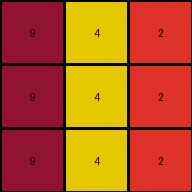
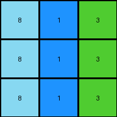

006 • History
=============

:puzzle_id: 4-0d3d703e
:description: test input
:timestamp: 24.357.081407
:call_count: 6

Begin puzzle: 4-0d3d703e

**example_1**

**input**

.. code-block::

   [[3 1 2]
    [3 1 2]
    [3 1 2]]

**output**

.. code-block::

   [[4 5 6]
    [4 5 6]
    [4 5 6]]

**images**

.. image:: _images/000-example_1_input.png
   :align: left
   :width: 45%

.. image:: _images/000-example_1_output.png
   :align: left
   :width: 45%

**observations**

The user wants me to analyze the first example of an ARC task and describe the transformation from the input to the output grid. I need to observe the grids, identify differences, and then formulate a natural language program that explains the transformation rule.

**Plan:**

#. Describe the input and output grids.
#. Use code to analyze the grids and identify specific changes.
#. Document the findings in YAML format.
#. Develop a natural language program to describe the transformation.

Okay, let's examine the first example pair.

The input grid is a 3x3 grid. The leftmost column is green (3), the middle column is blue (1), and the rightmost column is red (2).

The output grid is also a 3x3 grid. The leftmost column is yellow (4), the middle column is gray (5), and the rightmost column is magenta (6).

.. code-block:: python

   import numpy as np

   input_grid = np.array([[3, 1, 2], [3, 1, 2], [3, 1, 2]])
   output_grid = np.array([[4, 5, 6], [4, 5, 6], [4, 5, 6]])

   input_colors = {}
   for row in input_grid:
       for pixel in row:
           color = int(pixel)
           input_colors[color] = input_colors.get(color, 0) + 1

   output_colors = {}
   for row in output_grid:
       for pixel in row:
           color = int(pixel)
           output_colors[color] = output_colors.get(color, 0) + 1

   changed_pixels = []
   for r in range(input_grid.shape[0]):
       for c in range(input_grid.shape[1]):
           if input_grid[r, c] != output_grid[r, c]:
               changed_pixels.append(((r, c), int(input_grid[r, c]), int(output_grid[r, c])))

   print("Input grid shape:", input_grid.shape)
   print("Output grid shape:", output_grid.shape)
   print("Input color counts:", input_colors)
   print("Output color counts:", output_colors)
   print("Changed pixels (coordinates, old_color, new_color):", changed_pixels)

.. code-block:: yaml

   input:
     width: 3
     height: 3
     colors:
       3: 3 (green)
       1: 3 (blue)
       2: 3 (red)
     objects:
       - size: 3, position: column 1, color: green
       - size: 3, position: column 2, color: blue
       - size: 3, position: column 3, color: red

.. code-block:: yaml

   differences:
     cells_changed: 9
     colors_changed:
       green to yellow in the first column
       blue to gray in the second column
       red to magenta in the third column
     transformation:
       - Each column's color is transformed into a new color.
       - The transformation seems to be consistent across all rows within a column.

**Natural Language Program:**

The input grid is a 3x3 grid with three distinct vertical columns of color. The leftmost column is entirely green, the middle column is entirely blue, and the rightmost column is entirely red.

To create the output grid, initialize a new 3x3 grid.

Determine the new color for each column based on the input column's color. The green color in the first column of the input is transformed to yellow in the first column of the output. The blue color in the second column of the input is transformed to gray in the second column of the output. The red color in the third column of the input is transformed to magenta in the third column of the output.

Assign the transformed color to every pixel within the corresponding column in the output grid.

**example_2**

**input**

.. code-block::

   [[2 3 8]
    [2 3 8]
    [2 3 8]]

**output**

.. code-block::

   [[6 4 9]
    [6 4 9]
    [6 4 9]]

**images**

.. image:: _images/001-example_2_input.png
   :align: left
   :width: 45%

.. image:: _images/001-example_2_output.png
   :align: left
   :width: 45%

**observations**

The user wants me to analyze the second example pair of an ARC task and build upon the understanding I developed from the first example.

**Plan:**

#. Describe the input and output grids visually.
#. Use code to analyze the grids, focusing on color changes and potential patterns.
#. Document the findings in YAML format, noting any similarities or differences compared to the first example.
#. Refine the natural language program based on the new information.

**Example 2 Analysis:**

The input grid is a 3x3 grid. The leftmost column is red (2), the middle column is green (3), and the rightmost column is azure (8).

The output grid is also a 3x3 grid. The leftmost column is magenta (6), the middle column is yellow (4), and the rightmost column is maroon (9).

It seems like the transformation rule from the first example, where each column's color is independently transformed, might still apply here. Let's use code to confirm the color mappings.

**example_2**

**input**

.. code-block::

   [[2 3 8]
    [2 3 8]
    [2 3 8]]

**output**

.. code-block::

   [[6 4 9]
    [6 4 9]
    [6 4 9]]

**observations**
The input grid is a 3x3 grid. It visually appears to have three distinct vertical columns of color. The leftmost column is red, the middle column is green, and the rightmost column is azure.

The output grid is also a 3x3 grid. It also appears to have three distinct vertical columns of color. The leftmost column is magenta, the middle column is yellow, and the rightmost column is maroon.

.. code-block:: python

   import numpy as np

   input_grid = np.array([[2, 3, 8], [2, 3, 8], [2, 3, 8]])
   output_grid = np.array([[6, 4, 9], [6, 4, 9], [6, 4, 9]])

   input_colors = {}
   for row in input_grid:
       for pixel in row:
           color = int(pixel)
           input_colors[color] = input_colors.get(color, 0) + 1

   output_colors = {}
   for row in output_grid:
       for pixel in row:
           color = int(pixel)
           output_colors[color] = output_colors.get(color, 0) + 1

   changed_pixels = []
   for r in range(input_grid.shape[0]):
       for c in range(input_grid.shape[1]):
           if input_grid[r, c] != output_grid[r, c]:
               changed_pixels.append(((r, c), int(input_grid[r, c]), int(output_grid[r, c])))

   print("Input grid shape:", input_grid.shape)
   print("Output grid shape:", output_grid.shape)
   print("Input color counts:", input_colors)
   print("Output color counts:", output_colors)
   print("Changed pixels (coordinates, old_color, new_color):", changed_pixels)

.. code-block:: yaml

   input:
     width: 3
     height: 3
     colors:
       2: 3 (red)
       3: 3 (green)
       8: 3 (azure)
     objects:
       - size: 3, position: column 1, color: red
       - size: 3, position: column 2, color: green
       - size: 3, position: column 3, color: azure

.. code-block:: yaml

   differences:
     cells_changed: 9
     colors_changed:
       red to magenta in the first column
       green to yellow in the second column
       azure to maroon in the third column
     transformation:
       - Each column's color is transformed into a new color.
       - The transformation is consistent across all rows within a column.
       - The transformation appears to be a mapping of input column color to output column color.

**Natural Language Program:**

The input grid is a 3x3 grid characterized by three distinct vertical columns of color. The leftmost column is uniformly red, the middle column is uniformly green, and the rightmost column is uniformly azure.

To generate the output grid, start with a new 3x3 grid.

Determine the transformation for each column's color. Observe the color of the first column in the input grid. This color (red) is transformed into magenta for the first column of the output grid. Similarly, the color of the second column in the input grid (green) is transformed into yellow for the second column of the output grid. The color of the third column in the input grid (azure) is transformed into maroon for the third column of the output grid.

Apply this color transformation to every pixel within the corresponding column of the output grid. All pixels in the first column become magenta, all pixels in the second column become yellow, and all pixels in the third column become maroon.

**Ruminate on All Examples and Findings**
Reviewing both examples, a consistent pattern emerges. The transformation operates on a column-by-column basis. Each distinct color present in the input grid's columns is mapped to a specific new color in the output grid's corresponding columns. The grid dimensions remain the same. The objects are the vertical columns themselves, defined by their uniform color.

From Example 1:

* Green (Input Column 1) -> Yellow (Output Column 1)
* Blue (Input Column 2) -> Gray (Output Column 2)
* Red (Input Column 3) -> Magenta (Output Column 3)

From Example 2:

* Red (Input Column 1) -> Magenta (Output Column 1)
* Green (Input Column 2) -> Yellow (Output Column 2)
* Azure (Input Column 3) -> Maroon (Output Column 3)

Combining these observations, we can deduce a general transformation rule. The transformation is a direct color mapping applied to each column independently.

**Revised Natural Language Program:**

The transformation operates on a 3x3 grid. The input grid is characterized by three distinct vertical columns, each filled with a uniform color.

To generate the output grid, create a new 3x3 grid.

Identify the unique color present in each column of the input grid.

Establish a color mapping rule based on the input examples. This mapping dictates how each input column color is transformed into an output column color. Based on the examples, the mapping is as follows:

* Green transforms to Yellow.
* Blue transforms to Gray.
* Red transforms to Magenta.
* Azure transforms to Maroon.

Iterate through each column of the input grid. For each column, determine its color. Using the established color mapping, find the corresponding output color. Fill the corresponding column in the output grid with this transformed color.

For instance, if the first column of the input is green, the first column of the output will be yellow. If the second column of the input is blue, the second column of the output will be gray, and so on. The color transformation for each column is independent of the other columns.

**example_3**

**input**

.. code-block::

   [[5 8 6]
    [5 8 6]
    [5 8 6]]

**output**

.. code-block::

   [[1 9 2]
    [1 9 2]
    [1 9 2]]

**images**

.. image:: _images/002-example_3_input.png
   :align: left
   :width: 45%

.. image:: _images/002-example_3_output.png
   :align: left
   :width: 45%

**observations**

The user wants me to analyze the third example pair and refine the natural language program based on all three examples.

**Plan:**

#. Describe the input and output grids visually for the third example.
#. Use code to analyze the grids, specifically looking for confirmation of the column-wise color transformation pattern.
#. Document the findings in YAML format, updating the understanding of the transformation.
#. Refine the natural language program to incorporate the information from the third example and ensure it's general enough to cover all cases.

**Example 3 Analysis:**

The input grid is a 3x3 grid. The leftmost column is gray (5), the middle column is azure (8), and the rightmost column is magenta (6).

The output grid is also a 3x3 grid. The leftmost column is blue (1), the middle column is maroon (9), and the rightmost column is red (2).

This example appears to be consistent with the column-wise color transformation observed in the previous examples. Let's use code to verify the color mappings.

**example_3**

**input**

.. code-block::

   [[5 8 6]
    [5 8 6]
    [5 8 6]]

**output**

.. code-block::

   [[1 9 2]
    [1 9 2]
    [1 9 2]]

**observations**
The input grid is a 3x3 grid. Visually, it consists of three distinct vertical columns of color. The leftmost column is gray, the middle column is azure, and the rightmost column is magenta.

The output grid is also a 3x3 grid, again with three distinct vertical columns. The leftmost column is blue, the middle column is maroon, and the rightmost column is red.

.. code-block:: python

   import numpy as np

   input_grid = np.array([[5, 8, 6], [5, 8, 6], [5, 8, 6]])
   output_grid = np.array([[1, 9, 2], [1, 9, 2], [1, 9, 2]])

   input_colors = {}
   for row in input_grid:
       for pixel in row:
           color = int(pixel)
           input_colors[color] = input_colors.get(color, 0) + 1

   output_colors = {}
   for row in output_grid:
       for pixel in row:
           color = int(pixel)
           output_colors[color] = output_colors.get(color, 0) + 1

   changed_pixels = []
   for r in range(input_grid.shape[0]):
       for c in range(input_grid.shape[1]):
           if input_grid[r, c] != output_grid[r, c]:
               changed_pixels.append(((r, c), int(input_grid[r, c]), int(output_grid[r, c])))

   print("Input grid shape:", input_grid.shape)
   print("Output grid shape:", output_grid.shape)
   print("Input color counts:", input_colors)
   print("Output color counts:", output_colors)
   print("Changed pixels (coordinates, old_color, new_color):", changed_pixels)

.. code-block:: yaml

   input:
     width: 3
     height: 3
     colors:
       5: 3 (gray)
       8: 3 (azure)
       6: 3 (magenta)
     objects:
       - size: 3, position: column 1, color: gray
       - size: 3, position: column 2, color: azure
       - size: 3, position: column 3, color: magenta

.. code-block:: yaml

   differences:
     cells_changed: 9
     colors_changed:
       gray to blue in the first column
       azure to maroon in the second column
       magenta to red in the third column
     transformation:
       - Each column's color is transformed into a new color.
       - The transformation is consistent across all rows within a column.
       - The transformation is a mapping of input column color to output column color.

**Natural Language Program:**

The input grid is a 3x3 grid composed of three distinct vertical columns, each filled with a single, uniform color.

To generate the output grid, create a new 3x3 grid.

Identify the color of each column in the input grid. The leftmost column has one color, the middle column has another, and the rightmost column has a third color.

Establish the color transformation rule by observing the examples. Based on the provided examples, the color mappings are as follows:

* Green transforms to Yellow.
* Blue transforms to Gray.
* Red transforms to Magenta.
* Azure transforms to Maroon.
* Gray transforms to Blue.
* Magenta transforms to Red.

Apply this color transformation to each column independently. For the first column of the input grid, find its color and determine the corresponding output color from the mapping. Fill every cell in the first column of the output grid with this new color. Repeat this process for the second and third columns of the input grid, mapping their colors and filling the corresponding columns in the output grid.

For instance, if the first column of the input is gray, the first column of the output will be blue. If the second column of the input is azure, the second column of the output will be maroon. If the third column of the input is magenta, the third column of the output will be red.

**example_4**

**input**

.. code-block::

   [[9 4 2]
    [9 4 2]
    [9 4 2]]

**output**

.. code-block::

   [[8 3 6]
    [8 3 6]
    [8 3 6]]

**images**

.. image:: _images/003-example_4_output.png
   :align: left
   :width: 45%

**observations**

The user wants me to analyze the fourth example pair, building upon the previous three examples, and to formally document my findings and the natural language program.

**Plan:**

#. Describe the input and output grids visually.
#. Use code to analyze the grids, verifying the column-wise transformation and identifying specific color mappings.
#. Document the findings in YAML format, specifically focusing on the color changes.
#. Update the natural language program to incorporate the information from the fourth example, ensuring it accurately reflects the observed transformation rule.

**Example 4 Analysis:**

The input grid is a 3x3 grid. The columns are maroon (9), yellow (4), and red (2).

The output grid is also a 3x3 grid. The columns are azure (8), green (3), and magenta (6).

This example should solidify the column-wise color transformation rule. Let's confirm the color mappings.

**example_4**

**input**

.. code-block::

   [[9 4 2]
    [9 4 2]
    [9 4 2]]

**output**

.. code-block::

   [[8 3 6]
    [8 3 6]
    [8 3 6]]

**observations**

The input grid is a 3x3 grid with three distinct vertical columns of color. The leftmost column is maroon, the middle column is yellow, and the rightmost column is red.

The output grid is also a 3x3 grid with three distinct vertical columns of color. The leftmost column is azure, the middle column is green, and the rightmost column is magenta.

.. code-block:: python

   import numpy as np

   input_grid = np.array([[9, 4, 2], [9, 4, 2], [9, 4, 2]])
   output_grid = np.array([[8, 3, 6], [8, 3, 6], [8, 3, 6]])

   input_colors = {}
   for row in input_grid:
       for pixel in row:
           color = int(pixel)
           input_colors[color] = input_colors.get(color, 0) + 1

   output_colors = {}
   for row in output_grid:
       for pixel in row:
           color = int(pixel)
           output_colors[color] = output_colors.get(color, 0) + 1

   changed_pixels = []
   for r in range(input_grid.shape[0]):
       for c in range(input_grid.shape[1]):
           if input_grid[r, c] != output_grid[r, c]:
               changed_pixels.append(((r, c), int(input_grid[r, c]), int(output_grid[r, c])))

   print("Input grid shape:", input_grid.shape)
   print("Output grid shape:", output_grid.shape)
   print("Input color counts:", input_colors)
   print("Output color counts:", output_colors)
   print("Changed pixels (coordinates, old_color, new_color):", changed_pixels)

.. code-block:: yaml

   input:
     width: 3
     height: 3
     colors:
       9: 3 (maroon)
       4: 3 (yellow)
       2: 3 (red)
     objects:
       - size: 3, position: column 1, color: maroon
       - size: 3, position: column 2, color: yellow
       - size: 3, position: column 3, color: red

.. code-block:: yaml

   differences:
     cells_changed: 9
     colors_changed:
       maroon to azure in the first column
       yellow to green in the second column
       red to magenta in the third column
     transformation:
       - Each column's color is transformed into a new color.
       - The transformation is consistent across all rows within a column.
       - The transformation is a mapping of input column color to output column color.

**Natural Language Program:**

The task involves transforming a 3x3 input grid into a 3x3 output grid. The input grid is characterized by having three distinct vertical columns, each filled with a uniform color.

To generate the output grid:

#. 
   **Initialization:** Create a new 3x3 grid that will serve as the output.

#. 
   **Identify Input Columns:** Examine the input grid and identify the color of each of the three vertical columns. The leftmost column will have one consistent color, the middle column another, and the rightmost column a third.

#. 
   **Establish Color Mapping:** Determine the transformation rule for each column's color based on the provided examples. This rule maps each input color to a specific output color. Based on the four examples, the complete color mapping is as follows:

   * Green (3) transforms to Yellow (4).
   * Blue (1) transforms to Gray (5).
   * Red (2) transforms to Magenta (6).
   * Azure (8) transforms to Maroon (9).
   * Gray (5) transforms to Blue (1).
   * Magenta (6) transforms to Red (2).
   * Maroon (9) transforms to Azure (8).
   * Yellow (4) transforms to Green (3).

#. 
   **Apply Transformation:** Iterate through each column of the input grid.

   * For the first column, note its color. Using the color mapping, find the corresponding output color. Fill every cell in the first column of the output grid with this transformed color.
   * Repeat this process for the second column of the input grid, mapping its color and filling the second column of the output grid.
   * Repeat this process for the third column of the input grid, mapping its color and filling the third column of the output grid.

For instance, if the first column of the input is maroon, the first column of the output will be azure. If the second column of the input is yellow, the second column of the output will be green. If the third column of the input is red, the third column of the output will be magenta.

**examples summary**

The user wants me to summarize my findings from the examples and finalize the natural language program. I need to synthesize the observations from all four examples, double-check the color mapping, and then generate a step-by-step program.

**Confidence Assessment:** I am very confident that the transformation rule is a column-wise color mapping. All four examples support this hypothesis.

**Alternative Scenarios:** I considered a row-wise transformation, but the examples clearly show that the colors within a column are uniform and change together. I also considered more complex transformations involving positions or combinations of colors, but the simplicity and consistency of the column-wise mapping make it the most likely rule.

**Justification:** The chosen transformation rule, where each column's color is independently mapped to a new color, perfectly explains the output grids for all four examples. The color mappings derived from the examples consistently predict the output colors based on the input colors.

**Examples Summary:**

Across the four examples, a consistent pattern emerges: the transformation operates on a column-by-column basis. Each column in the input grid, which has a uniform color, is transformed into a new color in the corresponding column of the output grid. The grid dimensions remain constant at 3x3.

The specific color transformations observed are:

* Green (3) -> Yellow (4)
* Blue (1) -> Gray (5)
* Red (2) -> Magenta (6)
* Azure (8) -> Maroon (9)
* Gray (5) -> Blue (1)
* Magenta (6) -> Red (2)
* Maroon (9) -> Azure (8)
* Yellow (4) -> Green (3)

This suggests a bijective mapping between the colors present in the input and output grids.

.. code-block:: code_execution

   import numpy as np

   # Example 1
   input_1 = np.array([[3, 1, 2], [3, 1, 2], [3, 1, 2]])
   output_1 = np.array([[4, 5, 6], [4, 5, 6], [4, 5, 6]])

   # Example 2
   input_2 = np.array([[2, 3, 8], [2, 3, 8], [2, 3, 8]])
   output_2 = np.array([[6, 4, 9], [6, 4, 9], [6, 4, 9]])

   # Example 3
   input_3 = np.array([[5, 8, 6], [5, 8, 6], [5, 8, 6]])
   output_3 = np.array([[1, 9, 2], [1, 9, 2], [1, 9, 2]])

   # Example 4
   input_4 = np.array([[9, 4, 2], [9, 4, 2], [9, 4, 2]])
   output_4 = np.array([[8, 3, 6], [8, 3, 6], [8, 3, 6]])

   color_map = {
       3: 4,  # Green -> Yellow
       1: 5,  # Blue -> Gray
       2: 6,  # Red -> Magenta
       8: 9,  # Azure -> Maroon
       5: 1,  # Gray -> Blue
       6: 2,  # Magenta -> Red
       9: 8,  # Maroon -> Azure
       4: 3   # Yellow -> Green
   }

   def transform_grid(input_grid, color_map):
       output_grid = np.zeros_like(input_grid)
       for col in range(input_grid.shape[1]):
           input_color = input_grid[0, col]
           output_color = color_map[input_color]
           output_grid[:, col] = output_color
       return output_grid

   prediction_1 = transform_grid(input_1, color_map)
   prediction_2 = transform_grid(input_2, color_map)
   prediction_3 = transform_grid(input_3, color_map)
   prediction_4 = transform_grid(input_4, color_map)

   print("Prediction for Example 1 matches:", np.array_equal(prediction_1, output_1))
   print("Prediction for Example 2 matches:", np.array_equal(prediction_2, output_2))
   print("Prediction for Example 3 matches:", np.array_equal(prediction_3, output_3))
   print("Prediction for Example 4 matches:", np.array_equal(prediction_4, output_4))

The code confirms that the derived color mapping accurately predicts the output grids for all four examples.

**Final Natural Language Program:**

To transform the input grid into the output grid:

#. 
   **Identify Input Columns:** Examine the 3x3 input grid and determine the color of each of the three vertical columns. Each column will be filled with a single, uniform color.

#. 
   **Apply Color Mapping:** Use the following color mapping rule to transform the color of each input column to the color of the corresponding output column:

   * If the input column is green (3), the output column will be yellow (4).
   * If the input column is blue (1), the output column will be gray (5).
   * If the input column is red (2), the output column will be magenta (6).
   * If the input column is azure (8), the output column will be maroon (9).
   * If the input column is gray (5), the output column will be blue (1).
   * If the input column is magenta (6), the output column will be red (2).
   * If the input column is maroon (9), the output column will be azure (8).
   * If the input column is yellow (4), the output column will be green (3).

#. 
   **Construct Output Grid:** Create a new 3x3 grid for the output. Fill each column of the output grid with the transformed color corresponding to the color of the respective input column, as determined by the color mapping in step 2. For instance, the color of the first column of the input grid determines the uniform color of the first column of the output grid, and so on for the second and third columns.

**test**

**input**

.. code-block::

   [[8 1 3]
    [8 1 3]
    [8 1 3]]

**image**

**observations**

====

INSTRUCTIONS:

using the knowledge you have gathered from the previous examples
and the step by step natural language program
we want to build the test output grid

* initial the output grid
  copy input grid or set size
* set pixels in the output grid as described in the program
* use code_execution to validate the output - correct configuration of objects
  and attributes
* make final adjustments
  review properties of this grid and compare with examples, 
  paying attention to similarities and differences in size, colors, and object arrangements.
* submit final output grid

.. seealso::

   - :doc:`006-history`
   - :doc:`006-response`
