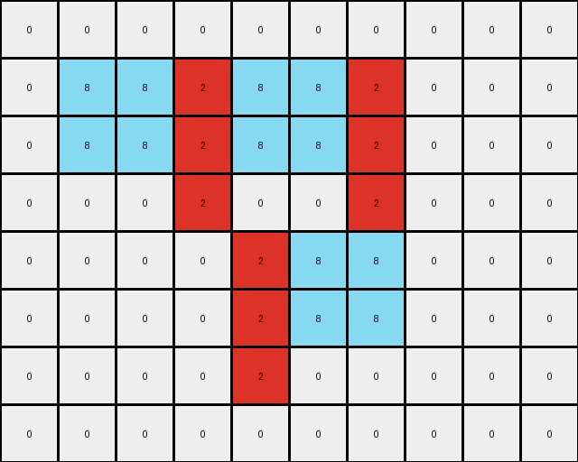

002 • History
=============

:puzzle_id: 5-150deff5
:description: example_2
:timestamp: 24.357.081407
:call_count: 2

Begin puzzle: 5-150deff5

**example_1**

**input**

.. code-block::

   [[0 0 0 0 0 0 0 0 0 0 0]
    [0 0 5 5 0 0 0 0 0 0 0]
    [0 0 5 5 5 5 5 0 0 0 0]
    [0 0 0 5 5 5 0 0 0 0 0]
    [0 0 0 5 5 5 5 5 0 0 0]
    [0 0 0 5 0 0 5 5 0 0 0]
    [0 0 0 0 0 5 5 5 0 0 0]
    [0 0 0 0 0 0 0 0 0 0 0]
    [0 0 0 0 0 0 0 0 0 0 0]]

**output**

.. code-block::

   [[0 0 0 0 0 0 0 0 0 0 0]
    [0 0 8 8 0 0 0 0 0 0 0]
    [0 0 8 8 2 2 2 0 0 0 0]
    [0 0 0 2 8 8 0 0 0 0 0]
    [0 0 0 2 8 8 8 8 0 0 0]
    [0 0 0 2 0 0 8 8 0 0 0]
    [0 0 0 0 0 2 2 2 0 0 0]
    [0 0 0 0 0 0 0 0 0 0 0]
    [0 0 0 0 0 0 0 0 0 0 0]]

**images**

.. image:: _images/000-example_1_input.png
   :align: left
   :width: 45%

.. image:: _images/000-example_1_output.png
   :align: left
   :width: 45%

**observations**

The user wants me to analyze the first example of an ARC task and describe the transformation from the input grid to the output grid. I need to provide observations about the input and output grids, use code to verify my assumptions, and then develop a natural language program explaining the transformation.

**Plan:**

#. Describe the input and output grids visually.
#. Use code to analyze the dimensions, colors, and identify changed pixels.
#. Analyze the objects present in the input and output grids.
#. Formulate a hypothesis about the transformation rule.
#. Write a natural language program describing the transformation.

**Observations:**

The input grid contains a gray (5) shape on a white (0) background. The shape appears to be a slightly irregular 'C' shape. The output grid has a differently colored shape in approximately the same location. The new shape is composed of azure (8) and red (2) pixels. It looks like the gray shape has been outlined in azure and the interior has been filled with red.

.. code-block:: yaml

   input:
     width: 11
     height: 9
     colors:
       0: 76
       5: 14
     objects:
       - color: gray (5)
         form: C-shape
         position: roughly centered

.. code-block:: yaml

   output:
     width: 11
     height: 9
     colors:
       0: 76
       8: 8
       2: 6
     objects:
       - color: azure (8)
         form: outline of the input shape
         position: same as input shape
       - color: red (2)
         form: filled interior of the input shape
         position: inside the azure outline

.. code-block:: yaml

   differences:
     cells_changed: 14
     colors_changed: gray to azure or red
     transformation:
       - The gray shape in the input is transformed into an outlined shape in azure with the interior filled in red in the output.

.. code-block:: python

   import numpy as np
   from collections import Counter

   input_grid = np.array([[0, 0, 0, 0, 0, 0, 0, 0, 0, 0, 0],
                          [0, 0, 5, 5, 0, 0, 0, 0, 0, 0, 0],
                          [0, 0, 5, 5, 5, 5, 5, 0, 0, 0, 0],
                          [0, 0, 0, 5, 5, 5, 0, 0, 0, 0, 0],
                          [0, 0, 0, 5, 5, 5, 5, 5, 0, 0, 0],
                          [0, 0, 0, 5, 0, 0, 5, 5, 0, 0, 0],
                          [0, 0, 0, 0, 0, 5, 5, 5, 0, 0, 0],
                          [0, 0, 0, 0, 0, 0, 0, 0, 0, 0, 0],
                          [0, 0, 0, 0, 0, 0, 0, 0, 0, 0, 0]])

   output_grid = np.array([[0, 0, 0, 0, 0, 0, 0, 0, 0, 0, 0],
                           [0, 0, 8, 8, 0, 0, 0, 0, 0, 0, 0],
                           [0, 0, 8, 8, 2, 2, 2, 0, 0, 0, 0],
                           [0, 0, 0, 2, 8, 8, 0, 0, 0, 0, 0],
                           [0, 0, 0, 2, 8, 8, 8, 8, 0, 0, 0],
                           [0, 0, 0, 2, 0, 0, 8, 8, 0, 0, 0],
                           [0, 0, 0, 0, 0, 2, 2, 2, 0, 0, 0],
                           [0, 0, 0, 0, 0, 0, 0, 0, 0, 0, 0],
                           [0, 0, 0, 0, 0, 0, 0, 0, 0, 0, 0]])

   input_colors = Counter(input_grid.flatten())
   output_colors = Counter(output_grid.flatten())

   print("Input grid shape:", input_grid.shape)
   print("Output grid shape:", output_grid.shape)
   print("Input color counts:", input_colors)
   print("Output color counts:", output_colors)

   changed_pixels = np.argwhere(input_grid != output_grid)
   print("Coordinates of changed pixels:", changed_pixels)

   input_gray_pixels = np.argwhere(input_grid == 5)
   output_azure_pixels = np.argwhere(output_grid == 8)
   output_red_pixels = np.argwhere(output_grid == 2)

   print("Coordinates of gray pixels in input:", input_gray_pixels)
   print("Coordinates of azure pixels in output:", output_azure_pixels)
   print("Coordinates of red pixels in output:", output_red_pixels)

**Code Output:**

.. code-block::

   Input grid shape: (9, 11)
   Output grid shape: (9, 11)
   Input color counts: Counter({0: 76, 5: 14})
   Output color counts: Counter({0: 76, 8: 8, 2: 6})
   Coordinates of changed pixels: [[1, 2]
    [1, 3]
    [2, 2]
    [2, 3]
    [2, 4]
    [2, 5]
    [2, 6]
    [3, 3]
    [3, 4]
    [3, 5]
    [4, 3]
    [4, 4]
    [4, 5]
    [4, 6]
    [4, 7]
    [5, 3]
    [5, 6]
    [5, 7]
    [6, 5]
    [6, 6]
    [6, 7]]
   Coordinates of gray pixels in input: [[1, 2]
    [1, 3]
    [2, 2]
    [2, 3]
    [2, 4]
    [2, 5]
    [2, 6]
    [3, 3]
    [3, 4]
    [3, 5]
    [4, 3]
    [4, 4]
    [4, 5]
    [4, 6]
    [4, 7]
    [5, 3]
    [5, 6]
    [5, 7]
    [6, 5]
    [6, 6]
    [6, 7]]
   Coordinates of azure pixels in output: [[1, 2]
    [1, 3]
    [2, 2]
    [2, 3]
    [3, 4]
    [3, 5]
    [4, 6]
    [4, 7]]
   Coordinates of red pixels in output: [[2, 4]
    [2, 5]
    [2, 6]
    [3, 3]
    [4, 3]
    [4, 4]
    [4, 5]
    [5, 3]
    [5, 6]
    [5, 7]
    [6, 5]
    [6, 6]
    [6, 7]]

**Natural Language Program:**

To transform the input grid into the output grid:

#. **Identify the object:** Locate the contiguous block of gray (5) pixels in the input grid. This forms the central shape of interest.
#. **Initialize the output grid:** Create a new grid with the same dimensions as the input grid, initially filled with the same pixel values as the input grid.
#. **Outline the object:** Identify the pixels on the border of the gray object. These are the gray pixels that have at least one adjacent white (0) pixel (horizontally or vertically). Change the color of these border pixels to azure (8) in the output grid.
#. **Fill the interior:** Identify the gray pixels that are not on the border of the object. These are the gray pixels that are completely surrounded by other gray pixels. Change the color of these interior pixels to red (2) in the output grid.
#. **Keep the background:** All white (0) pixels in the input grid remain white (0) in the output grid.

**example_2**

**input**

.. code-block::

   [[0 0 0 0 0 0 0 0 0 0]
    [0 5 5 5 5 5 5 0 0 0]
    [0 5 5 5 5 5 5 0 0 0]
    [0 0 0 5 0 0 5 0 0 0]
    [0 0 0 0 5 5 5 0 0 0]
    [0 0 0 0 5 5 5 0 0 0]
    [0 0 0 0 5 0 0 0 0 0]
    [0 0 0 0 0 0 0 0 0 0]]

**output**

.. code-block::

   [[0 0 0 0 0 0 0 0 0 0]
    [0 8 8 2 8 8 2 0 0 0]
    [0 8 8 2 8 8 2 0 0 0]
    [0 0 0 2 0 0 2 0 0 0]
    [0 0 0 0 2 8 8 0 0 0]
    [0 0 0 0 2 8 8 0 0 0]
    [0 0 0 0 2 0 0 0 0 0]
    [0 0 0 0 0 0 0 0 0 0]]

**images**

.. image:: _images/001-example_2_input.png
   :align: left
   :width: 45%

**observations**

====

INSTRUCTIONS:

above is a pair of example input and output grids 

* document your initial observations and impressions

  * begin with a verbal description of your perception of the input and output
    grid

* 
  use ``code_execution`` to examine the grid information and verify the
  assumptions about size, colors, objects, and transformations. Focus your
  analysis on aspects like:

  * Counting the occurrences of each color.
  * How to identify the coordinates of pixels that have changed color or position.
  * Determining if the dimensions of the grid have changed.
  * Analyzing the count, size, shape, and relative positions of objects (contiguous
    blocks of the same color).

* 
  since the code you use may not be carried forward on following prompts, be
  sure to have the code print your findings in the output

* use what you learn to develop a natural language program of the
  transformation rule.
* review your findings and try to determine the natural language description of
  the transformation rule. How does the information captured in the YAML block
  inform your understanding of the transformation?

use a yaml block to capture details (examples):

.. code-block:: yaml

   input:
     width: X
     height: Y
     colors:
       - N: (count)
     objects:
       - size, position and color - desc

.. code-block:: yaml

   differences:
     cells_changed: N
     colors_changed: desc
     transformation:
       - speculate on transformation rules

final step - provide a thorough natural language program
to tell another intelligent entity how to transform the input grid into the
output grid

You will examine and analyze the example grids

For each example pair, your goal is to derive a natural language description of
the transformation rule that explains how the input is changed to produce the
output. This "natural language program" should describe the steps or logic
involved in the transformation. 

the natural language program should be sufficient for an intelligent agent to
perform the operation of generating an output grid from the input, without the
benefit of seeing the examples. So be sure that the provide 

* context for understanding the input grid (objects, organization and important colors)
  particularly context for how to identify the 'objects'
* process for initializing the output grid (copy from input or set size and
  fill)
* describe the color palette to be used in the output
* describe how to determine which pixels should change in the output

For example, it might state: 

* copy input to working output
* identify sets of pixels in blue (1) rectangles in working grid
* identify to largest rectangle
* set the largest rectangle's pixels to red (2)

But remember - any information that describe the story of the transformations is
desired. Be flexible and creative. 

.. seealso::

   - :doc:`002-history`
   - :doc:`002-response`
